# Arduino Variable Optimization

Welcome to the "Arduino Memory" section of our programming course! In this lesson, we'll explore how to optimize variables in Arduino projects to make the most of the limited memory resources available on microcontrollers.

## Introduction

Arduino boards, particularly those based on the ATmega328P (like the Arduino Uno), have very limited memory compared to modern computers:
- 2KB of SRAM (for variables)
- 32KB of Flash memory (for program code)
- 1KB of EEPROM (for long-term data storage)

When your variables consume too much SRAM, your program may behave unexpectedly or crash. This guide will teach you how to optimize your variable usage to avoid these issues.

## Why Variable Optimization Matters

Consider this simple example:

```cpp
void setup() {
  Serial.begin(9600);
  
  // Inefficient variable declaration
  String largeText = "This is a very long string that will be stored in SRAM";
  
  Serial.println(largeText);
  Serial.println(F("Free SRAM: "));
  Serial.println(freeMemory());
}

void loop() {
  // Nothing here
}

// Function to check available memory (not built into Arduino)
int freeMemory() {
  extern int __heap_start, *__brkval;
  int v;
  return (int) &v - (__brkval == 0 ? (int) &__heap_start : (int) __brkval);
}
```

The output might show very little free memory, which could lead to problems in more complex sketches.

## Key Optimization Techniques

### 1. Choose Appropriate Data Types

Always use the smallest data type that can hold your values:

| Data Type      | Size (bytes) | Range                           |
|----------------|--------------|---------------------------------|
| `boolean`      | 1            | `true` or `false`               |
| `byte`         | 1            | 0 to 255                        |
| `char`         | 1            | -128 to 127                     |
| `int`          | 2            | -32,768 to 32,767               |
| `unsigned int` | 2            | 0 to 65,535                     |
| `long`         | 4            | -2,147,483,648 to 2,147,483,647 |
| `float`        | 4            | Approx. ±3.4028235E+38          |

Let's compare inefficient and optimized approaches:

```cpp
// Inefficient - uses 4 bytes
int sensorValue = 127;

// Optimized - uses 1 byte
byte sensorValue = 127;
```

### 2. Use the F() Macro for Strings

The `F()` macro stores string literals in Flash memory instead of SRAM:

```cpp
// Inefficient - consumes SRAM
Serial.println("This string takes up SRAM memory");

// Optimized - stored in Flash memory
Serial.println(F("This string is stored in Flash memory"));
```

### 3. Avoid the String Object

The `String` object is convenient but inefficient. Use character arrays instead:

```cpp
// Inefficient - String object has overhead and can fragment memory
String message = "Hello Arduino";

// Optimized - direct char array
char message[] = "Hello Arduino";
```

### 4. Use Static and Const Qualifiers

The `static` keyword preserves variable values between function calls, reducing redundant initializations:

```cpp
void logTemperature() {
  // Inefficient - buffer created and destroyed with each call
  char buffer[10];
  
  // Code that uses buffer...
}

void logTemperatureOptimized() {
  // Optimized - buffer persists between calls
  static char buffer[10];
  
  // Code that uses buffer...
}
```

The `const` qualifier ensures data isn't modified and can sometimes help the compiler optimize:

```cpp
// This tells the compiler this data never changes
const byte RELAY_PIN = 7;
```

### 5. Use PROGMEM for Large Data

For large constant data like lookup tables or bitmaps, use `PROGMEM` to store them in Flash memory:

```cpp
#include <avr/pgmspace.h>

// Inefficient - array stored in SRAM
const int lookupTable[10] = {1023, 980, 930, 880, 790, 680, 540, 390, 230, 100};

// Optimized - array stored in Flash memory
const PROGMEM int lookupTable[10] = {1023, 980, 930, 880, 790, 680, 540, 390, 230, 100};

void setup() {
  Serial.begin(9600);
  
  // Reading from PROGMEM requires special functions
  int value = pgm_read_word_near(lookupTable + 3);
  Serial.println(value);  // Will print 880
}
```

## Real-World Example: Weather Station

Let's optimize a simple weather station sketch:

```cpp
// Inefficient version
void setup() {
  Serial.begin(9600);
}

void loop() {
  // Temperature readings for a day (24 hours)
  int temperatureReadings[24];
  
  // Simulate reading temperatures
  for(int i = 0; i < 24; i++) {
    temperatureReadings[i] = analogRead(A0);
    delay(100);  // Just for simulation
  }
  
  String statusMessage = "Temperature readings completed. Average: ";
  
  // Calculate average
  int sum = 0;
  for(int i = 0; i < 24; i++) {
    sum += temperatureReadings[i];
  }
  float average = sum / 24.0;
  
  statusMessage += average;
  statusMessage += " degrees";
  
  Serial.println(statusMessage);
  delay(5000);
}
```

Now, the optimized version:

```cpp
// Optimized version
const byte TEMP_SENSOR_PIN = A0;
const byte HOURS_PER_DAY = 24;

void setup() {
  Serial.begin(9600);
}

void loop() {
  // Use the smallest appropriate data type (byte instead of int)
  byte temperatureReadings[HOURS_PER_DAY];
  
  // Simulate reading temperatures
  int sum = 0;  // Sum can be larger than byte range
  
  for(byte i = 0; i < HOURS_PER_DAY; i++) {
    // Scale value to temperature range 0-100°C for byte storage
    temperatureReadings[i] = map(analogRead(TEMP_SENSOR_PIN), 0, 1023, 0, 100);
    sum += temperatureReadings[i];
    delay(100);  // Just for simulation
  }
  
  byte average = sum / HOURS_PER_DAY;
  
  // Using F() macro to store strings in Flash
  Serial.print(F("Temperature readings completed. Average: "));
  Serial.print(average);
  Serial.println(F(" degrees"));
  
  delay(5000);
}
```

Key improvements:
1. Used byte instead of int for temperature readings
2. Avoided String object completely
3. Calculated average on-the-fly
4. Used F() macro for Serial output
5. Used symbolic constants for pins and values

## Memory Usage Visualization

Here's a diagram showing how different memory optimization techniques affect Arduino's memory usage:

```mermaid
graph TD
    A[Total Arduino Uno Memory] --> B[Flash Memory 32KB]
    A --> C[SRAM 2KB]
    A --> D[EEPROM 1KB]
    
    B --> B1[Program Code]
    B --> B2["F&#40;&#41; Strings"]
    B --> B3[PROGMEM Data]
    
    C --> C1[Variables]
    C --> C2[String Objects]
    C --> C3[Function Call Stack]
    
    D --> D1[Long-term Storage]
    
    style A fill:#f9f9f9,stroke:#333,stroke-width:2px
    style B fill:#ffdddd,stroke:#333,stroke-width:2px
    style C fill:#ddffdd,stroke:#333,stroke-width:2px
    style D fill:#ddddff,stroke:#333,stroke-width:2px
```



## Detecting Memory Issues

You can detect memory issues with these techniques:

1. **Check free memory in your sketch**:

```cpp
// Function to check free SRAM
int freeMemory() {
  extern int __heap_start, *__brkval;
  int v;
  return (int) &v - (__brkval == 0 ? (int) &__heap_start : (int) __brkval);
}

void setup() {
  Serial.begin(9600);
  Serial.print(F("Free memory: "));
  Serial.println(freeMemory());
}
```

2. **Look for signs of memory problems**:
   - Erratic behavior
   - Random resets
   - Variables changing unexpectedly

## Summary

Optimizing variables on Arduino is crucial for reliable operation:

1. Choose the smallest appropriate data types
2. Use the F() macro for strings displayed via Serial
3. Prefer char arrays over String objects
4. Use static and const when appropriate
5. Store large constant data in program memory with PROGMEM
6. Monitor free memory during development

By applying these techniques, you can dramatically increase the complexity of projects that will run stably on Arduino's limited memory.

## Exercises

1. Take an existing sketch and identify all variables that could use smaller data types.
2. Modify a sketch that uses String objects to use character arrays instead.
3. Use the free memory function to measure SRAM usage before and after applying optimization techniques.
4. Create a sketch that stores at least 100 bytes of constant data in program memory using PROGMEM.

## Additional Resources

- [Arduino Official Reference on Data Types](https://www.arduino.cc/reference/en/#variables)
- [AVR LibC PROGMEM Documentation](https://www.nongnu.org/avr-libc/user-manual/group__avr__pgmspace.html)
- [Nick Gammon's Memory Free Library](http://www.gammon.com.au/forum/?id=11354)