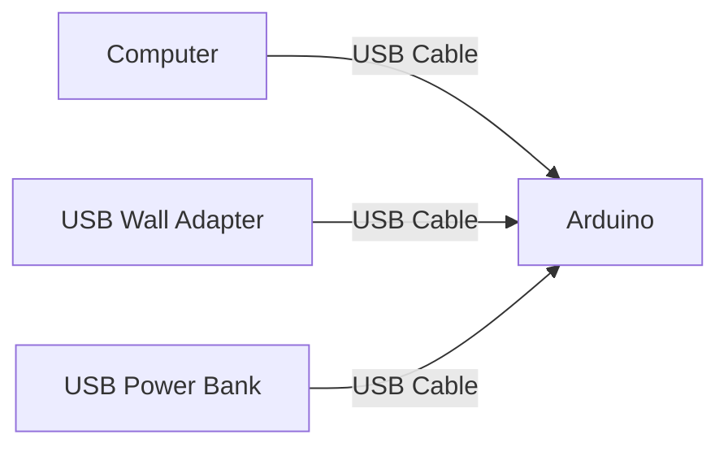
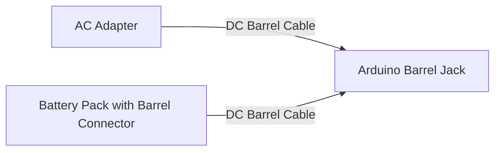
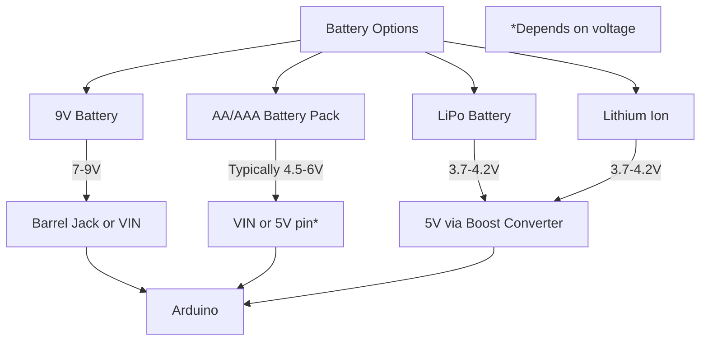

# Arduino Power Sources

## Introduction

Power is the lifeblood of any electronic project. Understanding how to properly power your Arduino is crucial for ensuring that your projects operate reliably and safely. In this guide, we'll explore the various power sources available for Arduino boards, their characteristics, advantages, and limitations.

Arduino boards are versatile in terms of power requirements, which is one of the reasons they're so popular for prototyping and hobbyist projects. However, using incorrect power sources can lead to erratic behavior, damage to components, or even complete failure of your Arduino board.

## Power Requirements for Arduino

Before we dive into the different power sources, let's understand what Arduino boards need in terms of power:

### Voltage Requirements

Most Arduino boards operate with a recommended input voltage range. For example:

- **Arduino Uno**: 7-12V via external power, 5V via USB
- **Arduino Nano**: 7-12V via external power, 5V via USB
- **Arduino Mega**: 7-12V via external power, 5V via USB
- **Arduino Due**: 7-12V via external power, 5V via USB
- **Arduino Pro Mini**: 5-12V (depending on the version)

The Arduino has built-in voltage regulators that convert the input voltage to the 5V or 3.3V (depending on the board) required by the microcontroller.

### Current Requirements

The amount of current an Arduino project needs depends on:
- The Arduino board itself (typically 50-100mA)
- Components connected to it (LEDs, sensors, motors, etc.)
- Peripherals powered through the Arduino

A simple project with a few LEDs might need only 100-200mA, while projects with motors or many peripherals could require several amps.

## Common Arduino Power Sources

Let's explore the various ways to power your Arduino board:

### 1. USB Power



**Characteristics:**
- **Voltage**: Provides a regulated 5V
- **Current**: Limited to about 500mA (USB 2.0) or 900mA (USB 3.0)
- **Connection**: Via the USB port on the Arduino

**Code Example:** No special code needed for USB power - it's the default power source when connected.

**Advantages:**
- Most convenient for development
- Provides stable, regulated voltage
- Allows simultaneous programming and powering
- Protection against short circuits

**Limitations:**
- Limited current capability
- Requires a USB source (computer or adapter)
- Not ideal for portable projects that need to be disconnected from computers

**Best for:**
- Development and testing
- Projects with low power requirements
- Desktop applications

### 2. DC Barrel Jack



**Characteristics:**
- **Voltage**: Typically accepts 7-12V (check your specific board)
- **Current**: Depends on the adapter, but can supply more current than USB
- **Connection**: Via the barrel jack (2.1mm center-positive)

**Example Circuit:**

```
AC Wall Outlet → AC Adapter (9V, 1A output) → Arduino Barrel Jack
```

**Advantages:**
- Can supply more current than USB
- Works well for projects that need more power
- Good for permanent installations
- Can be used with a wide range of adapters

**Limitations:**
- Less portable than battery options
- Needs to be within reach of a power outlet
- Voltages outside the recommended range can damage the board

**Best for:**
- Stationary projects
- Projects requiring more power than USB can provide
- Long-term installations

### 3. VIN Pin

**Characteristics:**
- **Voltage**: Same range as barrel jack (7-12V recommended)
- **Current**: Similar to barrel jack capacity
- **Connection**: Wire connected to the VIN pin and GND

**Example Circuit:**

```
9V Battery → Switch → Arduino VIN pin (+ to VIN, - to GND)
```

**Code Example:** No special code needed, but you can monitor the input voltage:

```cpp
void setup() {
  Serial.begin(9600);
}

void loop() {
  // Read the input voltage
  float vin = readVoltage();
  Serial.print("Input voltage: ");
  Serial.print(vin);
  Serial.println("V");
  delay(1000);
}

// Function to read input voltage
float readVoltage() {
  // Using internal reference
  long result;
  // Read 1.1V reference against AVcc
  ADMUX = _BV(REFS0) | _BV(MUX3) | _BV(MUX2) | _BV(MUX1);
  delay(2); // Wait for Vref to settle
  ADCSRA |= _BV(ADSC); // Convert
  while (bit_is_set(ADCSRA, ADSC));
  result = ADCL;
  result |= ADCH << 8;
  result = 1125300L / result; // Calculate Vcc (in mV)
  return result / 1000.0; // Convert to volts
}
```

**Advantages:**
- Flexible connection option
- Works well with custom power solutions
- Good for breadboard projects

**Limitations:**
- Connections can become loose
- No built-in protection like the barrel jack
- Requires careful wiring

**Best for:**
- Custom power arrangements
- Breadboard prototypes
- When barrel jack is not accessible

### 4. 5V and 3.3V Pins

**Characteristics:**
- **Voltage**: Fixed at 5V or 3.3V (depending on which pin)
- **Current**: Limited by the on-board regulator
- **Connection**: Directly to the 5V or 3.3V pin (bypasses the regulator)

**Important Note:** Using these pins bypasses the voltage regulator, so you must provide exactly 5V or 3.3V. Do not connect higher voltages to these pins!

**Example Application:**

```cpp
// This example assumes you're powering the Arduino through the 5V pin
// and monitoring battery voltage on analog pin A0
// with a voltage divider (10k and 1k resistors)

const float R1 = 10000.0; // 10k resistor
const float R2 = 1000.0;  // 1k resistor

void setup() {
  Serial.begin(9600);
}

void loop() {
  int sensorValue = analogRead(A0);
  float voltage = sensorValue * (5.0 / 1023.0);
  float batteryVoltage = voltage * ((R1 + R2) / R2);
  
  Serial.print("Battery Voltage: ");
  Serial.print(batteryVoltage);
  Serial.println("V");
  
  delay(1000);
}
```

**Advantages:**
- Direct connection to the logic-level power
- Useful when you already have a regulated 5V or 3.3V source
- Bypasses the regulator, reducing power loss

**Limitations:**
- Must provide EXACTLY the right voltage
- No protection against voltage spikes
- Can damage the board if voltage is incorrect

**Best for:**
- Advanced users with regulated power supplies
- Projects where power efficiency is critical
- Systems with existing 5V or 3.3V rails

### 5. Battery Power



**Battery Types for Arduino:**

1. **9V Battery**
   - Quick and simple option
   - Short lifespan for power-hungry projects
   - Connect to barrel jack or VIN pin

2. **AA/AAA Battery Pack**
   - 4-6 batteries (6-9V) for barrel jack
   - 3 batteries (4.5V) can connect to 5V pin if voltage drop is acceptable
   - Good balance of capacity and size

3. **LiPo Batteries**
   - 3.7V nominal voltage - needs a boost converter for 5V
   - High capacity in a small package
   - Requires careful charging and handling

4. **Lithium Ion Batteries**
   - Similar to LiPo but in cylindrical form
   - 18650 cells are popular
   - Requires a protection circuit

**Example Battery Monitor Circuit:**

```cpp
// Battery monitoring for a 9V battery connected to VIN
// with voltage divider on A0

#define BATTERY_PIN A0
#define R1 10000.0 // 10k resistor
#define R2 2200.0  // 2.2k resistor

void setup() {
  Serial.begin(9600);
  pinMode(BATTERY_PIN, INPUT);
}

void loop() {
  float voltage = readBatteryVoltage();
  Serial.print("Battery Voltage: ");
  Serial.print(voltage);
  Serial.println("V");
  
  // Check battery level and alert if low
  if (voltage < 7.5) {
    Serial.println("Warning: Low battery!");
  }
  
  delay(5000); // Check every 5 seconds
}

float readBatteryVoltage() {
  int rawValue = analogRead(BATTERY_PIN);
  float voltage = rawValue * (5.0 / 1023.0);
  // Calculate actual battery voltage using voltage divider formula
  float batteryVoltage = voltage * ((R1 + R2) / R2);
  return batteryVoltage;
}
```

**Advantages:**
- Portable and wireless
- Various options for different needs
- Good for mobile robots, wearables, remote sensors

**Limitations:**
- Limited lifespan
- Need monitoring and replacement/recharging
- Some types require additional circuits

**Best for:**
- Portable projects
- Remote installations
- Wearable technology
- Robotics

### 6. Solar Power

**Characteristics:**
- **Voltage**: Variable based on sunlight (typically need a regulator)
- **Current**: Dependent on panel size and sunlight conditions
- **Connection**: Usually connected via a charging circuit to batteries

**Example Solar-Powered Arduino Circuit:**

```cpp
// Solar-powered Arduino with battery monitoring
// Assumes a solar panel charging a battery through a charge controller
// and a voltage divider on A0 monitoring battery voltage

#define BATTERY_PIN A0
#define VOLTAGE_DIVIDER_RATIO 3.0 // Based on your voltage divider
#define LOW_BATTERY_THRESHOLD 3.5  // Volt threshold for low battery

const int sleepTime = 60; // Time to sleep between readings in seconds

void setup() {
  Serial.begin(9600);
  pinMode(LED_BUILTIN, OUTPUT);
}

void loop() {
  float batteryVoltage = readBatteryVoltage();
  
  Serial.print("Battery Voltage: ");
  Serial.print(batteryVoltage);
  Serial.println("V");
  
  // Take sensor readings or perform other tasks here
  
  // Check if battery is low
  if (batteryVoltage < LOW_BATTERY_THRESHOLD) {
    // Enter low-power mode or signal low battery
    blinkLED(5); // Blink 5 times to indicate low battery
    // Consider entering sleep mode here
  }
  
  // Sleep to conserve power
  delay(sleepTime * 1000);
}

float readBatteryVoltage() {
  int rawValue = analogRead(BATTERY_PIN);
  float voltage = rawValue * (5.0 / 1023.0);
  float batteryVoltage = voltage * VOLTAGE_DIVIDER_RATIO;
  return batteryVoltage;
}

void blinkLED(int times) {
  for (int i = 0; i < times; i++) {
    digitalWrite(LED_BUILTIN, HIGH);
    delay(200);
    digitalWrite(LED_BUILTIN, LOW);
    delay(200);
  }
}
```

**Advantages:**
- Renewable energy source
- Good for outdoor remote installations
- Can be self-sustaining

**Limitations:**
- Dependent on weather and sunlight
- Requires batteries for energy storage
- More complex setup

**Best for:**
- Outdoor environmental monitoring
- Remote sensing stations
- Sustainable electronics projects

## Power Management Considerations

### 1. Voltage Regulators

Arduino boards have built-in voltage regulators that convert the input voltage to the 5V or 3.3V needed by the microcontroller.

**Important considerations:**
- Regulators generate heat when there's a large voltage drop
- Higher input voltage = more heat = wasted energy
- Aim for input voltage in the recommended range (typically 7-12V)

### 2. Power Efficiency

```cpp
// Simple power-saving sketch using sleep mode
#include <avr/sleep.h>
#include <avr/power.h>

const int wakePin = 2; // Use pin 2 for interrupt

void setup() {
  Serial.begin(9600);
  Serial.println("Power Saving Demo");
  
  pinMode(LED_BUILTIN, OUTPUT);
  pinMode(wakePin, INPUT_PULLUP);
  
  // Flash LED to show we're about to sleep
  for (int i = 0; i < 3; i++) {
    digitalWrite(LED_BUILTIN, HIGH);
    delay(100);
    digitalWrite(LED_BUILTIN, LOW);
    delay(100);
  }
  
  // Configure interrupt to wake Arduino
  attachInterrupt(digitalPinToInterrupt(wakePin), wakeUp, LOW);
  
  Serial.println("Going to sleep now");
  delay(100); // Give time for serial to complete
  
  // Enter sleep mode
  enterSleep();
}

void loop() {
  // Code here runs after waking up
  Serial.println("Awake now!");
  
  // Do your work here
  digitalWrite(LED_BUILTIN, HIGH);
  delay(1000);
  digitalWrite(LED_BUILTIN, LOW);
  
  Serial.println("Going back to sleep");
  delay(100); // Give time for serial to complete
  
  // Back to sleep
  enterSleep();
}

void enterSleep() {
  set_sleep_mode(SLEEP_MODE_PWR_DOWN); // Deepest sleep mode
  sleep_enable();
  
  // Disable unused peripherals to save power
  power_adc_disable();
  power_spi_disable();
  power_timer0_disable();
  power_timer1_disable();
  power_timer2_disable();
  power_twi_disable();
  
  sleep_mode(); // Enter sleep
  
  // After wake-up, program continues from here
  sleep_disable();
  
  // Re-enable peripherals
  power_all_enable();
}

void wakeUp() {
  // This function will be called when interrupt is triggered
  // It's empty because it only needs to trigger wake-up
}
```

**Tips for power efficiency:**
- Use sleep modes when possible
- Turn off unused components (LEDs, sensors)
- Select appropriate power source for your application
- Consider using more efficient voltage regulators for battery-powered projects

### 3. Protecting Your Arduino

**Protection Circuits:**

1. **Polarity Protection**
   - Prevents damage from reversed power connections
   - Simple diode in series with power input
   - Schottky diodes have lower voltage drop

2. **Overvoltage Protection**
   - Zener diode or voltage regulator to clamp excessive voltage
   - Crowbar circuit for more serious protection

3. **Current Limiting**
   - Fuse or PTC thermistor to prevent overcurrent
   - Protects against short circuits

## Real-World Applications

### 1. Battery-Powered Environmental Monitor

This project uses an Arduino Nano, powered by 4 AA batteries, to monitor temperature, humidity, and light levels in a garden:

```cpp
#include <DHT.h>
#include <LowPower.h>

#define DHTPIN 2      // DHT sensor pin
#define DHTTYPE DHT22 // DHT sensor type
#define LIGHT_PIN A0  // Light sensor pin
#define BATTERY_PIN A1 // Battery monitoring pin

DHT dht(DHTPIN, DHTTYPE);

void setup() {
  Serial.begin(9600);
  dht.begin();
  
  // Use internal reference for more accurate battery reading
  analogReference(INTERNAL);
}

void loop() {
  // Read sensors
  float humidity = dht.readHumidity();
  float temperature = dht.readTemperature();
  int lightLevel = analogRead(LIGHT_PIN);
  float batteryVoltage = readBattery();
  
  // Print readings
  Serial.print("Temperature: ");
  Serial.print(temperature);
  Serial.println(" °C");
  
  Serial.print("Humidity: ");
  Serial.print(humidity);
  Serial.println(" %");
  
  Serial.print("Light level: ");
  Serial.println(lightLevel);
  
  Serial.print("Battery: ");
  Serial.print(batteryVoltage);
  Serial.println(" V");
  
  Serial.println("Going to sleep for 15 minutes");
  Serial.flush(); // Make sure all Serial data is sent
  
  // Sleep for power saving (15 minutes = 900 seconds = 112.5 sleep cycles of 8s)
  for (int i = 0; i < 112; i++) {
    LowPower.powerDown(SLEEP_8S, ADC_OFF, BOD_OFF);
  }
}

float readBattery() {
  // Read analog value
  int rawValue = analogRead(BATTERY_PIN);
  
  // Convert to voltage (1.1V reference with voltage divider)
  // Assuming a voltage divider with R1=10k, R2=2.2k
  float voltage = rawValue * (1.1 / 1023.0) * ((10000.0 + 2200.0) / 2200.0);
  
  return voltage;
}
```

**Key power features:**
- Uses sleep mode to extend battery life
- Monitors battery voltage to warn of low power
- Infrequent readings to save power

### 2. Solar-Powered Weather Station

This example shows how to create a solar-powered Arduino weather station:

```cpp
#include <SPI.h>
#include <RH_RF95.h> // Radio module library
#include <DHT.h>
#include <LowPower.h>

#define DHTPIN 2
#define DHTTYPE DHT22
#define BATTERY_PIN A0
#define SOLAR_PIN A1
#define LOW_BATTERY 3.3 // Low battery threshold
#define GOOD_BATTERY 3.8 // Good charge threshold

RH_RF95 rf95;  // Radio object

void setup() {
  Serial.begin(9600);
  dht.begin();
  
  // Initialize radio
  if (!rf95.init()) {
    Serial.println("Radio init failed");
    while (1);
  }
  
  // Set frequency
  rf95.setFrequency(915.0);
  
  // Check power status
  float battery = readBatteryVoltage();
  Serial.print("Battery voltage: ");
  Serial.print(battery);
  Serial.println("V");
  
  if (battery < LOW_BATTERY) {
    // Battery critically low, sleep longer
    Serial.println("Battery critically low!");
  }
}

void loop() {
  float battery = readBatteryVoltage();
  float solar = readSolarVoltage();
  
  // Only collect and transmit if we have enough power
  if (battery > LOW_BATTERY) {
    float humidity = dht.readHumidity();
    float temperature = dht.readTemperature();
    
    // Create data packet
    char data[50];
    sprintf(data, "T:%.1f,H:%.1f,B:%.2f,S:%.2f", 
            temperature, humidity, battery, solar);
    
    // Send data
    rf95.send((uint8_t *)data, strlen(data));
    rf95.waitPacketSent();
    
    Serial.print("Sent: ");
    Serial.println(data);
  }
  
  // Adjust sleep time based on battery level
  if (battery < LOW_BATTERY) {
    Serial.println("Low power - sleeping for 30 minutes");
    for (int i = 0; i < 225; i++) { // 30 minutes
      LowPower.powerDown(SLEEP_8S, ADC_OFF, BOD_OFF);
    }
  } else if (battery < GOOD_BATTERY) {
    Serial.println("Medium power - sleeping for 15 minutes");
    for (int i = 0; i < 112; i++) { // 15 minutes
      LowPower.powerDown(SLEEP_8S, ADC_OFF, BOD_OFF);
    }
  } else {
    Serial.println("Good power - sleeping for 5 minutes");
    for (int i = 0; i < 37; i++) { // 5 minutes
      LowPower.powerDown(SLEEP_8S, ADC_OFF, BOD_OFF);
    }
  }
}

float readBatteryVoltage() {
  int rawValue = analogRead(BATTERY_PIN);
  // Assuming voltage divider with 10k and 2.2k resistors
  return rawValue * (5.0 / 1023.0) * ((10000.0 + 2200.0) / 2200.0);
}

float readSolarVoltage() {
  int rawValue = analogRead(SOLAR_PIN);
  // Assuming voltage divider with 10k and 2.2k resistors
  return rawValue * (5.0 / 1023.0) * ((10000.0 + 2200.0) / 2200.0);
}
```

**Key power features:**
- Solar panel charges a LiPo battery
- Battery level monitoring
- Adaptive power management (changes behavior based on available power)
- Uses sleep mode for efficiency

## Common Power Problems and Solutions

### Problem 1: Arduino Resets Randomly

**Possible causes:**
- Insufficient power supply current
- Voltage drops when motors or other high-current devices activate
- Poor connections

**Solutions:**
- Use a power supply with higher current rating
- Add capacitors across power connections (100μF and 0.1μF in parallel)
- Add separate power supply for motors or other high-current devices
- Check all connections

### Problem 2: Arduino Doesn't Turn On

**Possible causes:**
- Power supply not connected
- Wrong polarity
- Voltage regulator damage
- Incorrect voltage

**Solutions:**
- Check connections
- Verify power supply voltage and polarity
- Try USB power to test the board
- Check for physical damage to the voltage regulator

### Problem 3: Short Battery Life

**Possible causes:**
- Sleep modes not used
- Too many active components
- Inefficient power regulation
- Continuous polling instead of interrupts

**Solutions:**
- Implement sleep modes
- Use interrupts instead of polling
- Consider a more efficient voltage regulator
- Turn off unused peripherals
- Reduce clock speed if possible

## Choosing the Right Power Source

When selecting a power source for your Arduino project, consider:

1. **Power Requirements**
   - How much voltage and current does your project need?
   - Will it vary over time?

2. **Mobility**
   - Does the project need to be portable?
   - How long does it need to operate without recharging?

3. **Environment**
   - Indoor or outdoor?
   - Temperature ranges?
   - Access to power outlets?

4. **Project Lifespan**
   - Temporary prototype or permanent installation?
   - Maintenance accessibility?

5. **Budget**
   - Initial cost vs. operating cost
   - Disposable vs. rechargeable options

## Summary

The right power source is crucial for the success of your Arduino project. Here's a quick reference guide:

- **USB Power**: Ideal for development, testing, and low-power projects
- **Barrel Jack**: Good for stationary projects with moderate power needs
- **VIN Pin**: Flexible option for custom power arrangements
- **5V/3.3V Pins**: For advanced users with regulated power supplies
- **Batteries**: Great for portable projects, with many options available
- **Solar Power**: Excellent for outdoor, self-sustaining installations

Remember to:
- Match your power source to your project's needs
- Consider voltage regulators and their limitations
- Implement power-saving techniques for battery-powered projects
- Use protection circuits when appropriate
- Monitor power levels in critical applications

## Additional Resources

Here are some resources to further your understanding of Arduino power management:

1. Books:
   - "Making Things Talk" by Tom Igoe
   - "Arduino Cookbook" by Michael Margolis

2. Websites:
   - Arduino Power Documentation
   - Adafruit's Battery Guide
   - SparkFun's Power Management Tutorials

3. Components to explore:
   - LiPo charging modules
   - Buck/boost converters
   - Solar charging controllers
   - Battery management systems

## Exercises

1. **Basic**: Set up an Arduino with USB power and measure the current draw using different numbers of LEDs.

2. **Intermediate**: Create a battery-powered Arduino project that monitors its own battery level and warns when power is low.

3. **Advanced**: Design a solar-powered Arduino system that adapts its behavior based on available power, switching between active and low-power modes.

4. **Challenge**: Create a power management circuit for an Arduino that can automatically switch between multiple power sources (USB, battery, solar) based on availability.