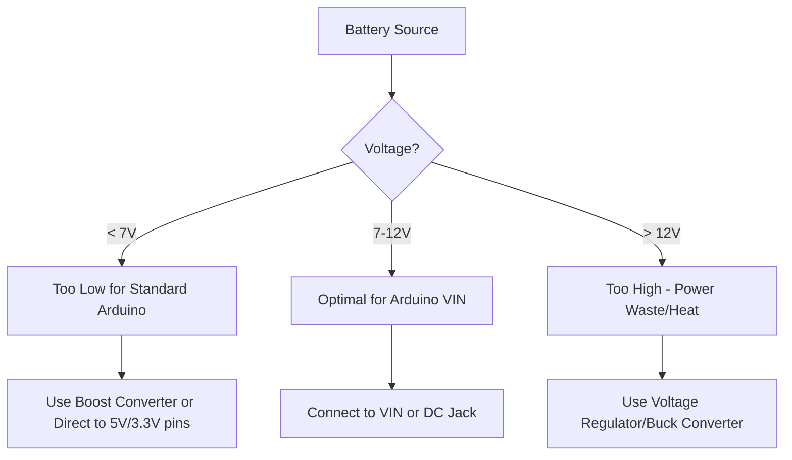

# Arduino Battery Operation

## Introduction

Powering Arduino projects with batteries opens up a world of portable and wireless applications, from remote sensors to wearable technology. This guide will help you understand how to effectively power your Arduino with batteries, manage power consumption, and optimize your projects for longer battery life.

Operating your Arduino on battery power requires careful consideration of power requirements, battery types, voltage regulation, and power-saving techniques. By the end of this guide, you'll be equipped with the knowledge to create efficient, portable Arduino projects.

## Battery Basics for Arduino

### Types of Batteries

Different types of batteries offer various advantages and limitations when used with Arduino:

| Battery Type | Voltage | Rechargeable | Capacity Range | Best For |
|--------------|---------|--------------|----------------|----------|
| Alkaline AA/AAA | 1.5V each | No | 1000-3000 mAh | Quick prototypes, low cost |
| LiPo | 3.7V | Yes | 100-10000 mAh | Compact projects, wearables |
| Li-ion 18650 | 3.7V | Yes | 1800-3500 mAh | Longer runtime projects |
| 9V | 9V | Some | 400-600 mAh | Testing, temporary setups |
| Coin Cell (CR2032) | 3V | No | 225 mAh | Ultra-small, low-power projects |

### Voltage Requirements

Arduino boards operate within specific voltage ranges:

- Arduino Uno: 7-12V recommended (absolute limits: 6-20V) for VIN pin
- Arduino Nano: 7-12V recommended for VIN pin
- Arduino Pro Mini: 3.3V or 5V versions available
- Arduino MKR series: 3.7V LiPo battery directly supported



## Powering Arduino with Batteries

### Direct Connection Methods

#### Basic Battery Pack Connection

For a simple AA battery pack (4-6 AA batteries):

```cpp
// No code needed for power connection
// Physical Connection:
// - Positive from battery pack to VIN or DC jack
// - Negative from battery pack to GND
```

#### Using USB Power Bank

Modern USB power banks can power Arduino through the USB port:

```cpp
// No code needed
// Physical Connection:
// - USB cable from power bank to Arduino USB port
```

### Voltage Regulation

When using batteries that provide voltage outside the Arduino's optimal range, regulation is necessary:

#### Boost Converter for Low Voltage Batteries

When using batteries that supply less than 7V:

```cpp
// No code changes needed
// Hardware setup:
// - Connect battery to boost converter input
// - Connect boost converter output to Arduino VIN
// - Adjust boost converter to output 7-9V
```

#### Buck Converter for Higher Voltage Sources

For higher voltage battery packs:

```cpp
// No code changes needed
// Hardware setup:
// - Connect battery to buck converter input
// - Connect buck converter output to Arduino VIN
// - Adjust buck converter to output 7-9V
```

## Measuring Battery Level

### Simple Voltage Divider Method

```cpp
const int batteryPin = A0;
const float maxVoltage = 5.0; // Arduino reference voltage
const float batteryMax = 4.2; // For a LiPo battery
const float resistorRatio = 0.5; // Voltage divider ratio (R2/(R1+R2))

void setup() {
  Serial.begin(9600);
  pinMode(batteryPin, INPUT);
}

void loop() {
  int rawValue = analogRead(batteryPin);
  float voltage = (rawValue / 1023.0) * maxVoltage / resistorRatio;
  
  float batteryPercentage = ((voltage - 3.0) / (batteryMax - 3.0)) * 100.0;
  batteryPercentage = constrain(batteryPercentage, 0, 100);
  
  Serial.print("Raw value: ");
  Serial.print(rawValue);
  Serial.print(" | Voltage: ");
  Serial.print(voltage, 2);
  Serial.print("V | Battery: ");
  Serial.print(batteryPercentage, 1);
  Serial.println("%");
  
  delay(5000);
}
```

**Output:**
```
Raw value: 768 | Voltage: 3.75V | Battery: 75.0%
Raw value: 768 | Voltage: 3.75V | Battery: 75.0%
Raw value: 767 | Voltage: 3.74V | Battery: 74.2%
```

> Note: For accurate voltage readings, you'll need a voltage divider circuit if the battery voltage exceeds the Arduino's ADC reference voltage.

## Power-Saving Techniques

### Sleep Modes

Arduino microcontrollers support various sleep modes that can dramatically reduce power consumption:

```cpp
#include <avr/sleep.h>
#include <avr/power.h>

void setup() {
  Serial.begin(9600);
  Serial.println("Setup complete, going to sleep in 5 seconds");
  delay(5000);
}

void loop() {
  Serial.println("Going to sleep now");
  delay(100); // Time for serial to complete
  
  // Disable ADC
  ADCSRA = 0;
  
  // Power reduction register settings
  power_adc_disable();
  power_spi_disable();
  power_twi_disable();
  
  // Set sleep mode
  set_sleep_mode(SLEEP_MODE_PWR_DOWN);
  sleep_enable();
  
  // Enter sleep mode
  sleep_mode();
  
  // Code continues here after wake-up
  sleep_disable();
  
  // Re-enable needed peripherals
  power_all_enable();
  
  Serial.println("Woke up!");
  delay(5000); // Stay awake for 5 seconds
}
```

### Disabling Unnecessary Components

```cpp
void setup() {
  // Turn off built-in LED
  pinMode(LED_BUILTIN, OUTPUT);
  digitalWrite(LED_BUILTIN, LOW);
  
  // Disable unused peripherals
  power_adc_disable();     // Analog to Digital Converter
  power_spi_disable();     // SPI interface
  power_twi_disable();     // Two Wire Interface (I2C)
  power_timer1_disable();  // Timer 1
  power_timer2_disable();  // Timer 2
  
  // Only enable what's needed
  power_timer0_enable();   // Keep Timer 0 for millis()/delay()
  
  // Your setup code continues...
}
```

### Optimized Code Patterns

Inefficient code can waste battery power. Here's an example of power-efficient sensor reading:

```cpp
// Inefficient approach - constantly reading sensor
void loop() {
  int sensorValue = analogRead(A0);
  // Process value
  delay(10);
}

// More efficient approach
void loop() {
  static unsigned long lastReadTime = 0;
  unsigned long currentTime = millis();
  
  if (currentTime - lastReadTime >= 5000) {
    // Read sensor only every 5 seconds
    lastReadTime = currentTime;
    
    // Enable ADC
    power_adc_enable();
    delay(1); // Brief stabilization time
    
    int sensorValue = analogRead(A0);
    
    // Disable ADC again
    power_adc_disable();
    
    // Process value
    processAndTransmitData(sensorValue);
  }
  
  // Sleep or do minimal processing between readings
  sleep_mode();
}
```

## Real-World Examples

### Weather Station

This example creates a battery-powered weather station that wakes up periodically to take measurements:

```cpp
#include <avr/sleep.h>
#include <avr/wdt.h>
#include <DHT.h>

#define DHTPIN 2
#define DHTTYPE DHT22
DHT dht(DHTPIN, DHTTYPE);

// Pin for battery voltage monitoring
#define BATTERY_PIN A0

volatile bool watchdogActivated = false;

void setup() {
  Serial.begin(9600);
  dht.begin();
  
  // Setup watchdog as interrupt
  setupWatchdog();
  
  Serial.println("Weather Station Starting");
}

void loop() {
  if (watchdogActivated) {
    watchdogActivated = false;
    
    // Power up sensors
    dht.begin();
    delay(2000); // Allow DHT sensor to stabilize
    
    // Read sensors
    float temperature = dht.readTemperature();
    float humidity = dht.readHumidity();
    
    // Read battery voltage
    int batteryRaw = analogRead(BATTERY_PIN);
    float batteryVoltage = batteryRaw * (5.0 / 1023.0) * 2; // Assuming voltage divider
    
    // Print readings
    Serial.print("Temp: ");
    Serial.print(temperature);
    Serial.print("°C, Humidity: ");
    Serial.print(humidity);
    Serial.print("%, Battery: ");
    Serial.print(batteryVoltage);
    Serial.println("V");
    
    // In a real application, you might transmit this data or log it
  }
  
  // Go to sleep until watchdog wakes us up
  goToSleep();
}

void setupWatchdog() {
  // Clear the reset flag
  MCUSR &= ~(1 << WDRF);
  
  // Set WDCE and WDE
  WDTCSR |= (1 << WDCE) | (1 << WDE);
  
  // Set watchdog timeout to 8s
  WDTCSR = (1 << WDP0) | (1 << WDP3);
  
  // Enable interrupt mode
  WDTCSR |= (1 << WDIE);
}

void goToSleep() {
  // Turn off components
  power_adc_disable();
  power_spi_disable();
  power_timer1_disable();
  power_timer2_disable();
  power_twi_disable();
  
  // Keep timer0 for millis()
  
  // Enter power-down mode
  set_sleep_mode(SLEEP_MODE_PWR_DOWN);
  sleep_enable();
  sleep_mode();
  
  // Code continues here after wake-up
  sleep_disable();
  
  // Re-enable components
  power_all_enable();
}

// Watchdog Interrupt Service Routine
ISR(WDT_vect) {
  watchdogActivated = true;
}
```

### Motion-Activated Camera Trigger

This example creates a battery-efficient motion detector that activates a camera or other device:

```cpp
#include <avr/sleep.h>
#include <avr/power.h>

#define PIR_PIN 2
#define CAMERA_TRIGGER_PIN 3

volatile bool motionDetected = false;

void setup() {
  Serial.begin(9600);
  
  pinMode(PIR_PIN, INPUT);
  pinMode(CAMERA_TRIGGER_PIN, OUTPUT);
  digitalWrite(CAMERA_TRIGGER_PIN, LOW);
  
  // Attach interrupt to PIR sensor
  attachInterrupt(digitalPinToInterrupt(PIR_PIN), motionInterrupt, RISING);
  
  Serial.println("Motion detector initialized");
}

void loop() {
  if (motionDetected) {
    Serial.println("Motion detected!");
    
    // Trigger camera
    digitalWrite(CAMERA_TRIGGER_PIN, HIGH);
    delay(100);
    digitalWrite(CAMERA_TRIGGER_PIN, LOW);
    
    // Wait to avoid multiple triggers
    delay(5000);
    
    motionDetected = false;
    Serial.println("Ready for next motion event");
  }
  
  // If no motion, go to sleep
  goToSleep();
}

void goToSleep() {
  Serial.println("Going to sleep...");
  delay(100); // Allow serial to complete
  
  // Disable unused components
  power_adc_disable();
  power_spi_disable();
  power_timer1_disable();
  power_timer2_disable();
  power_twi_disable();
  
  // Enter sleep mode
  set_sleep_mode(SLEEP_MODE_PWR_DOWN);
  sleep_enable();
  sleep_mode();
  
  // Code resumes here after wake-up
  sleep_disable();
  power_all_enable();
  
  Serial.println("Woke up!");
}

void motionInterrupt() {
  motionDetected = true;
}
```

## Battery Selection Guidelines

When selecting batteries for your Arduino project, consider:

1. **Capacity Requirements**: Calculate your project's power needs
   ```
   Project runtime = Battery capacity (mAh) / Average current draw (mA)
   ```

2. **Size and Weight Constraints**: Consider physical limitations

3. **Voltage Requirements**: Match to your Arduino model and circuit

4. **Rechargeable vs. Disposable**: Environmental and cost considerations

5. **Temperature Range**: Batteries perform differently in various environments

### Example Battery Selection Calculation

For an Arduino Uno with sensors that:
- Sleeps at 15mA
- Activates every 10 minutes for 5 seconds at 50mA
- Needs to run for 30 days

```
Average current = (15mA × 595 seconds + 50mA × 5 seconds) / 600 seconds = 15.3mA
Required capacity = 15.3mA × 24h × 30 days = 11,016mAh
```

A good choice might be 4 AA rechargeable batteries (2000-2500mAh each) in series, providing 4.8V-6V, which could be boosted to power the Arduino.

## Best Practices for Battery-Powered Arduino Projects

1. **Minimize Active Time**: Keep your Arduino awake only when necessary

2. **Use Sleep Modes**: Implement the deepest sleep mode possible between operations

3. **Optimize Sensor Reading**: Only power sensors when reading them

4. **Disable Unused Peripherals**: Turn off unused components like ADC, TWI, SPI

5. **Use Efficient Voltage Regulation**: Linear regulators waste power as heat

6. **Remove Power LEDs**: Desolder or disable power indicator LEDs for production projects

7. **Choose Low-Power Components**: Select sensors and peripherals designed for battery operation

8. **Consider Alternative Arduino Boards**: Arduino Pro Mini, Nano, or third-party variants can use significantly less power

## Summary

Battery operation opens up Arduino to a world of portable applications, but requires careful consideration of power requirements, battery selection, and power-saving techniques. By implementing sleep modes, efficient code patterns, and intelligent power management, you can extend battery life from hours to weeks or even months.

Remember that each project has unique requirements - a weather station reporting once per hour has very different needs from a responsive wearable device. Always measure your actual power consumption and adjust your approach accordingly.

## Additional Resources and Exercises

### Further Learning Resources

- Arduino Power Management official documentation
- [Nick Gammon's Power Saving Techniques](http://www.gammon.com.au/power)
- [Low-Power Library](https://github.com/rocketscream/Low-Power)

### Exercises

1. **Battery Life Calculator**: Create a simple program that estimates battery life based on current measurements in different states.

2. **Power Optimization Challenge**: Take an existing Arduino project and modify it to extend battery life by at least 50%.

3. **Sleep Mode Exploration**: Experiment with different sleep modes and measure their impact on power consumption.

4. **Battery Monitor**: Build a simple battery monitor that warns when voltage drops below a threshold.

5. **Solar-Powered Arduino**: Extend your knowledge by creating a solar-rechargeable battery system for an Arduino.