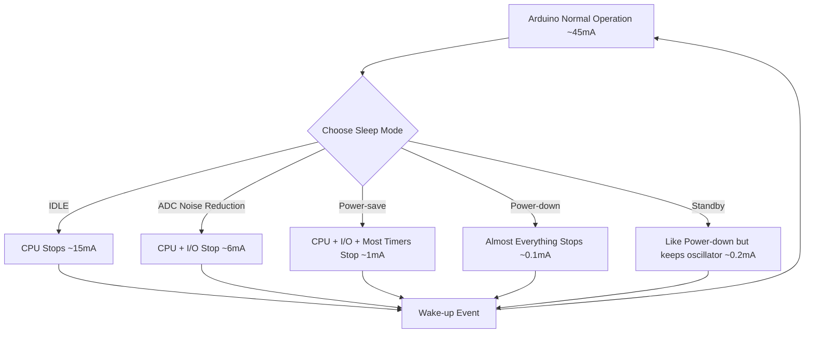

# Arduino Sleep Modes

## Introduction

Power efficiency is crucial for battery-powered Arduino projects. Without proper power management, your Arduino might drain batteries in hours instead of weeks or months. Sleep modes are one of the most effective ways to reduce power consumption by putting the microcontroller into a low-power state when it's not actively performing tasks.

In this guide, we'll explore the different sleep modes available on Arduino boards, how they work, and how to implement them in your projects. By the end, you'll understand how to significantly extend your project's battery life.

## Understanding Power Consumption

Before diving into sleep modes, let's understand why an Arduino consumes power:

1. **CPU** - The processor consumes power with every clock cycle
2. **Peripherals** - ADC, timers, serial interfaces, and other components draw power
3. **I/O pins** - Connected components and even unused pins can draw current
4. **Voltage regulators** - These create some overhead power consumption

A standard Arduino Uno running at 16MHz typically consumes around 40-50mA. This might not sound like much, but it adds up quickly when running on batteries.

## Available Sleep Modes

Arduino boards based on AVR microcontrollers (like the Uno, Nano, and Mega) offer several sleep modes with different power-saving levels and wake-up capabilities:

| Sleep Mode | Power Savings | Features Disabled | Wake-up Sources |
|------------|---------------|-------------------|-----------------|
| IDLE | Low | CPU | Interrupts, timers |
| ADC Noise Reduction | Medium | CPU, I/O | ADC complete, external interrupt, watchdog |
| Power-save | High | CPU, I/O, timers (except Timer2) | Timer2, external interrupt, watchdog |
| Power-down | Very High | Almost everything | External interrupt, watchdog |
| Standby | Very High (similar to power-down) | Almost everything | External interrupt, watchdog |



## The avr/sleep.h Library

To implement sleep modes, we'll use the `avr/sleep.h` library, which is part of the Arduino core. It provides functions to set and enter different sleep modes.

Here are the key functions:

- `sleep_enable()` - Enables sleep mode
- `sleep_disable()` - Disables sleep mode
- `set_sleep_mode(mode)` - Sets the sleep mode to use
- `sleep_mode()` - Enters sleep mode (enables sleep, goes to sleep, disables sleep upon waking)

The available sleep mode parameters are:
- `SLEEP_MODE_IDLE`
- `SLEEP_MODE_ADC`
- `SLEEP_MODE_PWR_SAVE`
- `SLEEP_MODE_PWR_DOWN`
- `SLEEP_MODE_STANDBY`

## Basic Sleep Mode Example

Let's start with a simple example that puts the Arduino into power-down mode and wakes it up with an external interrupt:

```cpp
#include <avr/sleep.h>
#include <avr/interrupt.h>

const int ledPin = 13;
const int interruptPin = 2;  // Use pin 2 for interrupt

void setup() {
  pinMode(ledPin, OUTPUT);
  pinMode(interruptPin, INPUT_PULLUP);
  
  // Flash LED to show the program has started
  for (int i = 0; i < 5; i++) {
    digitalWrite(ledPin, HIGH);
    delay(100);
    digitalWrite(ledPin, LOW);
    delay(100);
  }
  
  // Configure the external interrupt
  attachInterrupt(digitalPinToInterrupt(interruptPin), wakeUp, LOW);
}

void loop() {
  // Show we're awake by lighting the LED
  digitalWrite(ledPin, HIGH);
  delay(1000);
  digitalWrite(ledPin, LOW);
  
  // Prepare for sleep
  Serial.println("Going to sleep now");
  delay(100);  // Give the serial monitor time to print
  
  // Enter power-down mode
  goToSleep();
  
  // Code continues here after waking up
  Serial.println("Woke up!");
}

void goToSleep() {
  // Set sleep mode
  set_sleep_mode(SLEEP_MODE_PWR_DOWN);
  
  // Enable sleep mode
  sleep_enable();
  
  // Enter sleep mode
  sleep_mode();
  
  // The program continues from here after waking up
  sleep_disable();  // Disable sleep mode after waking up
}

// This function will be called when the interrupt is triggered
void wakeUp() {
  // This function needs to exist, but it doesn't need to do anything
  // The interrupt itself triggers the wake-up
}
```

In this example:
1. We set up an external interrupt on pin 2 to wake up the Arduino
2. The LED blinks to show we're awake
3. The Arduino then goes to sleep in power-down mode
4. When the button connected to pin 2 is pressed, the interrupt triggers and wakes up the Arduino

## Watchdog Timer Wake-up

The Watchdog Timer (WDT) is a built-in timer that can reset the Arduino if it becomes unresponsive. It can also be used to wake the Arduino from sleep after a predetermined time. This is perfect for periodic wake-ups to take sensor readings or perform other tasks.

```cpp
#include <avr/sleep.h>
#include <avr/power.h>
#include <avr/wdt.h>

const int ledPin = 13;
volatile bool wdtTriggered = false;

// Watchdog Timer interrupt service routine
ISR(WDT_vect) {
  wdtTriggered = true;  // Set flag
}

void setup() {
  pinMode(ledPin, OUTPUT);
  Serial.begin(9600);
  
  Serial.println("Watchdog Timer Sleep Demo");
  delay(100);
}

void loop() {
  // Show we're awake
  digitalWrite(ledPin, HIGH);
  delay(1000);
  digitalWrite(ledPin, LOW);
  
  Serial.println("Going to sleep for 8 seconds...");
  delay(100);  // Give serial time to send
  
  // Set up the watchdog timer
  setupWatchdogTimer();
  
  // Go to sleep
  enterSleep();
  
  if (wdtTriggered) {
    Serial.println("Woke up from watchdog timer!");
    wdtTriggered = false;
  }
}

void setupWatchdogTimer() {
  // Clear the reset flag
  MCUSR &= ~(1<<WDRF);
  
  // Enable configuration changes
  WDTCSR |= (1<<WDCE) | (1<<WDE);
  
  // Set new watchdog timeout prescaler value - 8 seconds
  WDTCSR = (1<<WDP3) | (1<<WDP0); // 8 seconds
  
  // Enable the WD interrupt
  WDTCSR |= _BV(WDIE);
}

void enterSleep() {
  // Set sleep mode
  set_sleep_mode(SLEEP_MODE_PWR_DOWN);
  sleep_enable();
  
  // Disable ADC
  ADCSRA &= ~(1<<ADEN);
  
  // Power down various modules
  power_all_disable();
  
  // Enter sleep mode
  sleep_mode();
  
  // Program continues from here after waking up
  sleep_disable();
  
  // Re-enable ADC
  ADCSRA |= (1<<ADEN);
  
  // Re-enable modules
  power_all_enable();
}
```

In this example:
1. We configure the watchdog timer to interrupt (not reset) after 8 seconds
2. The Arduino enters power-down sleep mode
3. When the watchdog timer expires, it triggers an interrupt that wakes up the Arduino
4. The cycle repeats, creating a pulsed operation pattern

## Practical Application: Remote Temperature Sensor

Here's a practical example of how to use sleep modes in a battery-powered temperature sensor that wakes up periodically, takes a reading, and goes back to sleep:

```cpp
#include <avr/sleep.h>
#include <avr/power.h>
#include <avr/wdt.h>
#include <DHT.h>

#define DHTPIN 4      // DHT sensor pin
#define DHTTYPE DHT22 // DHT22 sensor type
DHT dht(DHTPIN, DHTTYPE);

const int ledPin = 13;
volatile bool wdtTriggered = false;
unsigned long measurementCount = 0;

// Watchdog Timer ISR
ISR(WDT_vect) {
  wdtTriggered = true;
}

void setup() {
  pinMode(ledPin, OUTPUT);
  Serial.begin(9600);
  dht.begin();
  
  Serial.println("Remote Temperature Sensor Starting");
  delay(100);
}

void loop() {
  if (wdtTriggered || measurementCount == 0) {
    // Blink LED to show activity
    digitalWrite(ledPin, HIGH);
    
    // Take reading
    float temp = dht.readTemperature();
    float humidity = dht.readHumidity();
    
    // Print reading if valid
    if (!isnan(temp) && !isnan(humidity)) {
      Serial.print("Reading #");
      Serial.print(measurementCount);
      Serial.print(" - Temperature: ");
      Serial.print(temp);
      Serial.print("°C, Humidity: ");
      Serial.print(humidity);
      Serial.println("%");
    } else {
      Serial.println("Failed to read from DHT sensor!");
    }
    
    digitalWrite(ledPin, LOW);
    measurementCount++;
    wdtTriggered = false;
    
    // In a real application, you might send data wirelessly here
    delay(100);  // Brief delay for serial transmission
  }
  
  // Configure watchdog timer - 8 seconds
  setupWatchdogTimer();
  
  // Go to sleep until next reading
  Serial.println("Sleeping...");
  delay(100);  // Give serial time to complete
  enterSleep();
}

void setupWatchdogTimer() {
  // Clear reset flag
  MCUSR &= ~(1<<WDRF);
  
  // Enable configuration changes
  WDTCSR |= (1<<WDCE) | (1<<WDE);
  
  // Set new watchdog timeout value - 8 seconds
  WDTCSR = (1<<WDP3) | (1<<WDP0);
  
  // Enable WD interrupt
  WDTCSR |= _BV(WDIE);
}

void enterSleep() {
  // Disable ADC
  ADCSRA &= ~(1<<ADEN);
  
  // Power down modules
  power_all_disable();
  
  // Set sleep mode
  set_sleep_mode(SLEEP_MODE_PWR_DOWN);
  sleep_enable();
  
  // Enter sleep
  sleep_mode();
  
  // Execution resumes here on wake
  sleep_disable();
  
  // Re-enable modules
  power_all_enable();
  
  // Re-enable ADC
  ADCSRA |= (1<<ADEN);
}
```

This example:
1. Wakes up every 8 seconds (controlled by the watchdog timer)
2. Takes temperature and humidity readings
3. Reports the data over serial (in a real application, this might be wireless transmission)
4. Goes back to sleep to conserve power

With this approach, you can create a sensor that runs for months on a small battery instead of days.

## Power Optimization Tips

Beyond sleep modes, here are additional tips to reduce power consumption:

1. **Disable unused peripherals**: Use the `power_xxx_disable()` functions from `<avr/power.h>` to disable specific modules
2. **Reduce clock speed**: A slower clock means less power consumption
3. **Use appropriate voltage**: Lower voltage typically means lower power consumption
4. **Optimize I/O pins**: Set unused pins as inputs with pull-ups enabled
5. **Use external low-power sensors**: Some sensors have their own sleep modes
6. **Consider hardware modifications**: Removing power LEDs or voltage regulators can further reduce consumption

## Measuring Power Consumption

To verify your power optimization:

1. Use a multimeter in series with the power supply
2. Consider specialized tools like a USB power meter
3. Look for dedicated power analyzers for more detailed measurements

For example, implementing the power-down sleep mode with the watchdog timer can reduce power consumption from ~45mA to less than 0.1mA during sleep periods - that's a 450x reduction!

## Different Arduino Boards

Different Arduino boards have different power characteristics:

- **Arduino Uno/Nano**: The standard boards we've mostly discussed
- **Arduino Pro Mini**: Comes in 3.3V/8MHz version that uses less power
- **Arduino Zero**: Uses different sleep modes (SAMD21 processor)
- **ESP8266/ESP32**: Have their own deep sleep implementations

If power efficiency is crucial, consider boards specifically designed for low power like the Arduino Pro Mini 3.3V or third-party alternatives like Adafruit Feather or Sparkfun Pro boards.

## Summary

Sleep modes are a powerful tool in your Arduino power management toolkit:

- They can reduce power consumption by 10-450 times
- Different sleep modes offer different balances of power saving vs. functionality
- Waking up can be triggered by external interrupts, the watchdog timer, or other events
- For battery-powered projects, proper sleep implementation is essential

By implementing the techniques covered in this guide, you can extend your Arduino project's battery life from days to months or even years, opening up new possibilities for remote sensing, wearables, and other applications.

## Exercises

1. **Measure and Compare**: Implement a simple LED blink sketch with and without sleep modes. Measure the power consumption in both cases.

2. **Sleep Modes Comparison**: Create a sketch that cycles through different sleep modes. Observe the power consumption and responsiveness of each mode.

3. **Real-world Application**: Design a battery-powered weather station that wakes up every hour, takes readings, and transmits them wirelessly.

4. **Advanced Challenge**: Implement a motion-activated camera trigger that stays in deep sleep until motion is detected, then wakes up quickly to trigger a camera.

## Additional Resources

- [AVR Sleep Documentation](https://www.nongnu.org/avr-libc/user-manual/group__avr__sleep.html)
- [Arduino Low Power Library](https://github.com/rocketscream/Low-Power)
- [Nick Gammon's Power Saving Techniques](http://www.gammon.com.au/power)
- [Adafruit's Guide to Arduino Sleep Modes](https://learn.adafruit.com/low-power-wireless-datalogging/overview)