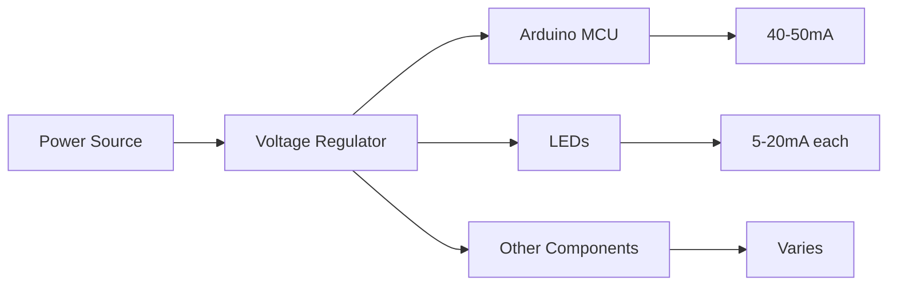
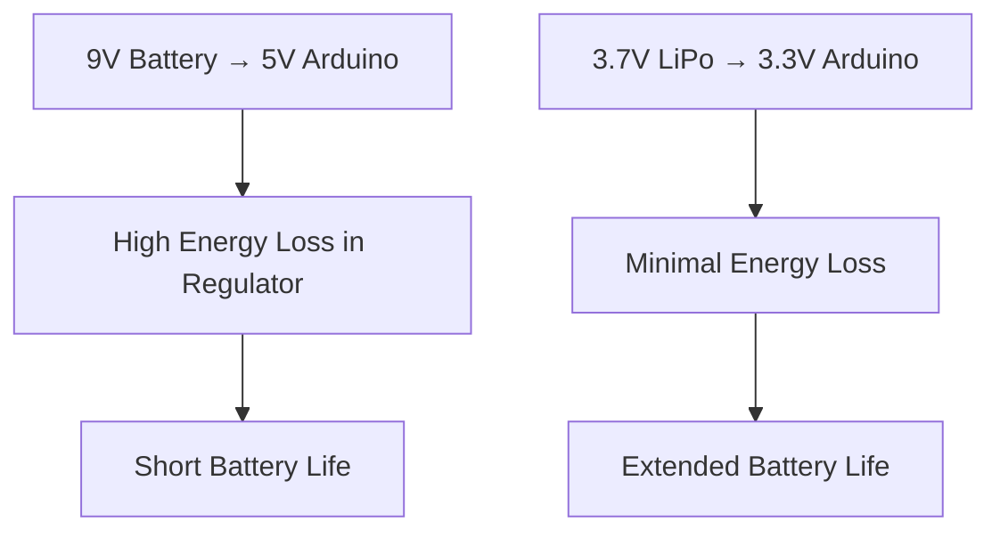
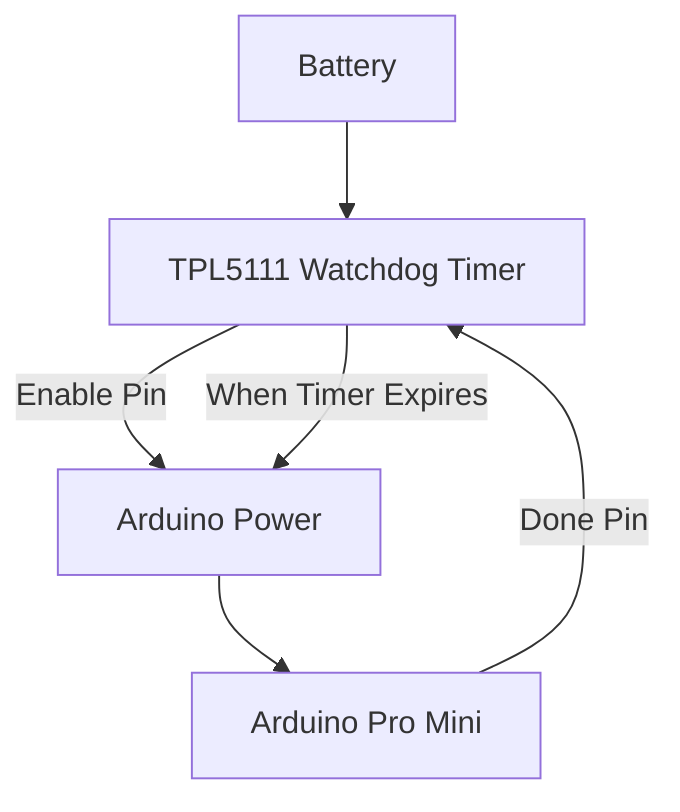

# Arduino Power Optimization

## Introduction

Power optimization is a critical aspect of Arduino-based projects, especially for battery-powered applications. By implementing power-saving techniques, you can significantly extend the battery life of your Arduino projects from hours to months or even years.

This guide will walk you through various methods to reduce power consumption in Arduino projects, from basic approaches like component selection to advanced techniques such as sleep modes and hardware modifications.

## Why Power Optimization Matters

Before diving into techniques, let's understand why power optimization is important:

- **Extended Battery Life**: Critical for remote or battery-powered applications
- **Environmental Impact**: Reduced energy consumption means more sustainable projects
- **Heat Reduction**: Lower power consumption produces less heat
- **Reliability**: More efficient power usage can improve overall system stability
- **Portability**: Power-efficient designs can use smaller batteries, making projects more portable

## Basic Power Consumption in Arduino

A standard Arduino Uno with no additional components typically consumes around 40-50mA when active. This might not seem like much, but it can drain a 9V battery (with approximately 500mAh capacity) in about 10 hours.



## Power Optimization Techniques

### 1. Hardware Selection

#### Using Low-Power Arduino Variants

Arduino offers several low-power variants that consume significantly less power than the standard Arduino Uno:

| Board                 | Active Mode | Power Down Mode |
|-----------------------|-------------|-----------------|
| Arduino Uno           | 40-50mA     | 10mA            |
| Arduino Pro Mini 3.3V | 4mA         | 0.9μA           |
| Arduino Nano          | 15mA        | 4.5mA           |
| Arduino Pro           | 3.7mA       | 0.8μA           |

#### Example: Switching from Arduino Uno to Pro Mini

```cpp
// Both code examples perform the same function,
// but the hardware choice makes a big difference in power consumption

// Arduino Uno @ 5V/16MHz: ~45mA consumption
void setup() {
  pinMode(13, OUTPUT);
}

void loop() {
  digitalWrite(13, HIGH);
  delay(1000);
  digitalWrite(13, LOW);
  delay(1000);
}

// Arduino Pro Mini @ 3.3V/8MHz: ~4mA consumption
// Same code, much lower power consumption!
void setup() {
  pinMode(13, OUTPUT);
}

void loop() {
  digitalWrite(13, HIGH);
  delay(1000);
  digitalWrite(13, LOW);
  delay(1000);
}
```

### 2. Power Supply Optimization

The voltage regulator on many Arduino boards wastes significant power, especially when connected to batteries with higher voltages.

#### Best Practices:

- Use a power source close to the required voltage (e.g., 3.7V LiPo for 3.3V Arduino)
- Remove or bypass the onboard voltage regulator for battery-powered projects
- Consider using a more efficient step-down converter for higher voltage sources

#### Example: Battery Selection Impact



### 3. Reducing Current Consumption

#### Disable Unused Peripherals

```cpp
// Disable the ADC when not in use
void disableADC() {
  ADCSRA = 0;  // Turn off ADC
}

// Disable the Brown-Out Detection
void disableBOD() {
  // Set the Brown-Out Detection
  MCUCR = _BV(BODS) | _BV(BODSE);  // Turn BOD off
  MCUCR = _BV(BODS);               // BOD is now disabled
}
```

#### Turn Off Unused Pins

Setting unused pins as OUTPUT and writing them LOW can prevent them from floating and consuming extra power.

```cpp
void configureUnusedPins() {
  // Set all pins as OUTPUT and LOW for power saving
  for (byte i = 0; i <= 19; i++) {
    pinMode(i, OUTPUT);
    digitalWrite(i, LOW);
  }
  
  // Exception for pins you are actually using
  pinMode(2, INPUT);  // Example: Pin 2 used as an input
}
```

#### Disable the Built-in LED

The built-in LED on pin 13 can consume an additional 5-20mA.

```cpp
void setup() {
  // Turn off the built-in LED to save power
  pinMode(LED_BUILTIN, OUTPUT);
  digitalWrite(LED_BUILTIN, LOW);
  
  // Rest of your setup code
}
```

### 4. Sleep Modes

Arduino microcontrollers offer various sleep modes that can dramatically reduce power consumption. The AVR-based Arduinos (like Uno, Nano, and Pro Mini) provide several sleep modes:

1. **Idle Mode**: CPU stops, peripherals keep running
2. **ADC Noise Reduction Mode**: CPU and most modules stop during ADC conversion
3. **Power-down Mode**: Only external interrupts remain active
4. **Power-save Mode**: Like power-down, but the timer continues to run
5. **Standby Mode**: Like power-down, but the oscillator continues to run
6. **Extended Standby Mode**: Like power-save, but the oscillator continues to run

#### Using Sleep Modes with the LowPower Library

First, install the "LowPower" library by RocketScream from the Arduino Library Manager.

```cpp
#include <LowPower.h>

void setup() {
  pinMode(LED_BUILTIN, OUTPUT);
}

void loop() {
  // Blink the LED
  digitalWrite(LED_BUILTIN, HIGH);
  delay(100);
  digitalWrite(LED_BUILTIN, LOW);
  
  // Enter power-down state for 8 seconds with ADC and BOD disabled
  LowPower.powerDown(SLEEP_8S, ADC_OFF, BOD_OFF);
  
  // Code resumes here after sleep
}
```

#### Sleep Mode Power Comparison

| Sleep Mode          | Arduino Uno Current |
|---------------------|---------------------|
| No Sleep (Active)   | 40-50mA             |
| Idle                | 15mA                |
| ADC Noise Reduction | 6.5mA               |
| Power-down          | 0.1mA               |
| Power-save          | 0.1mA               |
| Standby             | 0.8mA               |

### 5. Advanced Sleep with External Wake-up

For maximum power saving, use external interrupts to wake the Arduino from power-down mode only when needed.

```cpp
#include <LowPower.h>

const int interruptPin = 2;  // Use pin 2 for interrupt (INT0)

void setup() {
  pinMode(LED_BUILTIN, OUTPUT);
  pinMode(interruptPin, INPUT_PULLUP);
  
  // Flash LED to indicate the program has started
  for (int i = 0; i < 3; i++) {
    digitalWrite(LED_BUILTIN, HIGH);
    delay(100);
    digitalWrite(LED_BUILTIN, LOW);
    delay(100);
  }
}

void loop() {
  // Indicate we're about to sleep
  digitalWrite(LED_BUILTIN, HIGH);
  delay(100);
  digitalWrite(LED_BUILTIN, LOW);
  
  // Enter power-down state with ADC and BOD disabled
  // Wake up when interrupt is triggered on pin 2
  LowPower.powerDown(SLEEP_FOREVER, ADC_OFF, BOD_OFF);
  
  // Code resumes here after wake-up
  
  // Do something when awakened
  for (int i = 0; i < 5; i++) {
    digitalWrite(LED_BUILTIN, HIGH);
    delay(50);
    digitalWrite(LED_BUILTIN, LOW);
    delay(50);
  }
}
```

### 6. Practical Example: Weather Station

Let's put it all together with a practical example of a low-power weather station that wakes up periodically to take measurements and then goes back to sleep.

```cpp
#include <LowPower.h>
#include <DHT.h>

#define DHTPIN 3        // PIN for DHT sensor
#define DHTTYPE DHT22   // DHT 22 (AM2302)

DHT dht(DHTPIN, DHTTYPE);

void setup() {
  // Initialize serial communication at 9600 bits per second
  Serial.begin(9600);
  
  // Initialize DHT sensor
  dht.begin();
  
  // Print startup message
  Serial.println("Low-Power Weather Station Starting");
}

void loop() {
  // Wake up and take readings
  takeReadings();
  
  // Go to sleep for 8 seconds, 8 times = about 1 minute
  for (int i = 0; i < 8; i++) {
    // Enter power-down state for 8 seconds with ADC and BOD disabled
    LowPower.powerDown(SLEEP_8S, ADC_OFF, BOD_OFF);
  }
}

void takeReadings() {
  // Reading temperature and humidity takes about 250ms
  float humidity = dht.readHumidity();
  float temperature = dht.readTemperature();
  
  // Check if readings failed
  if (isnan(humidity) || isnan(temperature)) {
    Serial.println("Failed to read from DHT sensor!");
    return;
  }
  
  // Print temperature and humidity
  Serial.print("Humidity: ");
  Serial.print(humidity);
  Serial.print("%, Temperature: ");
  Serial.print(temperature);
  Serial.println("°C");
}
```

#### Power Consumption Comparison

Let's compare the power consumption of this weather station in different implementations:

| Implementation              | Average Current | Battery Life (2000mAh)    |
|-----------------------------|-----------------|---------------------------|
| No Sleep                    | 45mA            | ~44 hours                 |
| With Sleep (1 min interval) | ~0.2mA          | ~10,000 hours (~417 days) |

### 7. Hardware Modifications for Extreme Power Saving

For projects requiring extremely long battery life, consider these hardware modifications:

#### Removing Power LED and Voltage Regulator

1. Carefully desolder the power LED (and its current-limiting resistor) from the Arduino board
2. For direct battery power, remove or bypass the voltage regulator 

<div className="admonition admonition-warning">
  <div className="admonition-heading">
    <h5>Warning</h5>
  </div>
  <div className="admonition-content">
    <p>Hardware modifications may void your warranty and can damage your Arduino if done incorrectly. Only attempt these modifications if you have experience with electronics.</p>
  </div>
</div>

#### Using External Watchdog Timers

For applications requiring extremely long sleep periods, an external watchdog timer like the TPL5111 can reduce power consumption to the nano-amp range.



## Best Practices Summary

1. **Choose the Right Hardware**: Use low-power Arduino variants when possible
2. **Optimize Power Supply**: Use appropriate voltage sources and consider removing voltage regulators
3. **Reduce Active Current**: Disable unused peripherals and turn off unnecessary features
4. **Use Sleep Modes**: Implement the appropriate sleep mode for your application
5. **Wake Only When Needed**: Use interrupts to wake the Arduino only when action is required
6. **Measure Actual Consumption**: Use a multimeter to measure and validate your optimizations
7. **Consider Hardware Modifications**: For extreme battery life, consider hardware modifications

## Troubleshooting Common Issues

| Issue                                | Possible Solution                                  |
|--------------------------------------|----------------------------------------------------|
| Sleep mode isn't reducing power      | Check if all peripherals are properly disabled     |
| Arduino won't wake from sleep        | Ensure interrupt pins are properly configured      |
| Project still drains battery quickly | Look for current leaks through external components |
| Arduino resets after waking          | Add a delay after waking to stabilize              |

## Advanced Exercise: Battery Life Calculator

Try creating a power consumption calculator for your project:

1. Measure the current in active mode
2. Measure the current in sleep mode
3. Calculate how long the device spends in each mode
4. Use this formula to calculate average current consumption:
   `Average Current = (Active Current × Active Time + Sleep Current × Sleep Time) / Total Time`
5. Calculate expected battery life:
   `Battery Life (hours) = Battery Capacity (mAh) / Average Current (mA)`

## Summary

Power optimization is an essential skill for creating battery-powered Arduino projects. By implementing the techniques covered in this guide—from proper hardware selection and sleep modes to advanced hardware modifications—you can extend your project's battery life from hours to months or even years.

Remember that every project has different requirements, so choose the optimization techniques that best suit your specific needs while maintaining the functionality required by your application.

## Additional Resources

- [Arduino Power Documentation](https://www.arduino.cc/reference/en/libraries/low-power/)
- [AVR Sleep Modes Reference](https://microchip.com/wwwproducts/en/ATmega328P)
- [LowPower Library Documentation](https://github.com/rocketscream/Low-Power)

## Next Steps

- Experiment with different sleep modes and measure the actual power consumption
- Try implementing a low-power Arduino project like a temperature logger or motion sensor
- Explore more advanced power management ICs like the TPL5111 for ultra-low-power applications