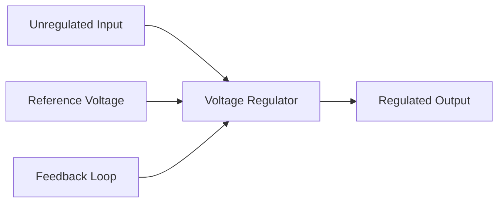
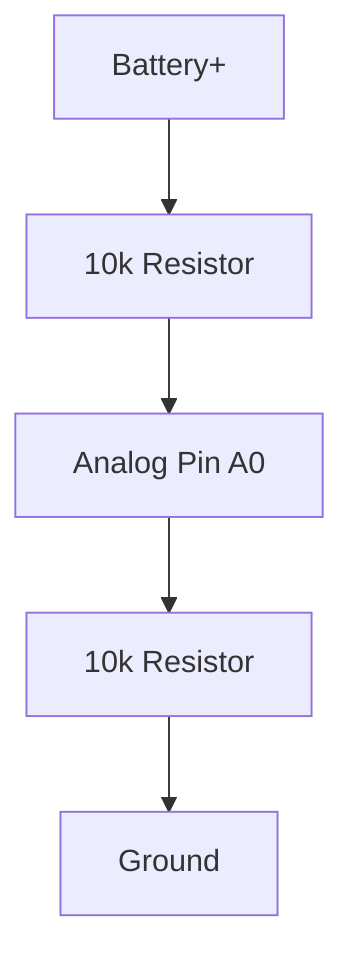

# Arduino Voltage Regulation

## Introduction

Voltage regulation is a critical aspect of Arduino power management that ensures your microcontroller and connected components receive a stable, consistent voltage. Without proper voltage regulation, your Arduino projects may experience unreliable operation, erratic behavior, or even permanent damage to components.

In this guide, we'll explore how voltage regulation works in Arduino systems, the built-in regulators on Arduino boards, when and how to use external voltage regulators, and best practices for ensuring stable power in your projects.

## Understanding Voltage Regulation

Voltage regulation is the process of maintaining a constant output voltage regardless of changes in input voltage or load conditions. For Arduino projects, this is essential because:

1. Microcontrollers require stable voltage to operate properly
2. Voltage fluctuations can cause erratic behavior or data corruption
3. Excessive voltage can permanently damage components

### How Voltage Regulators Work

At their core, voltage regulators monitor the output voltage and adjust current flow to maintain the desired voltage level. There are two main types of voltage regulators used with Arduino:

1. **Linear Regulators** - Simple, inexpensive regulators that dissipate excess voltage as heat
2. **Switching Regulators** - More efficient regulators that rapidly switch the input on and off

Let's visualize the basic concept with a diagram:



## Arduino's Built-in Voltage Regulation

Most Arduino boards come with built-in voltage regulators that provide a stable 5V or 3.3V supply from a wider input range.

### Arduino Uno Voltage Regulation

The Arduino Uno uses an NCP1117ST50T3G linear voltage regulator with these specifications:
- Input voltage range: 7V-12V (recommended)
- Maximum input: 20V (absolute maximum)
- Output: 5V regulated
- Maximum current: ~800mA

### Voltage Regulator Limitations

While built-in regulators are convenient, they have limitations:
- **Heat generation** - Linear regulators get hot when there's a large difference between input and output voltage
- **Current limitations** - Built-in regulators typically support up to 800mA-1A
- **Dropout voltage** - Requires input voltage ~2V higher than desired output

## Monitoring Arduino Voltage

Arduino allows you to monitor power supply voltage, which can be helpful for battery-powered projects.

```cpp
void setup() {
  Serial.begin(9600);
}

void loop() {
  // Read the internal 1.1V reference against AVcc
  long result;
  // Set the reference to Vcc and the measurement to the internal 1.1V reference
  ADMUX = _BV(REFS0) | _BV(MUX3) | _BV(MUX2) | _BV(MUX1);
  
  delay(2); // Wait for Vref to settle
  ADCSRA |= _BV(ADSC); // Start conversion
  while (bit_is_set(ADCSRA, ADSC)); // Measuring
  
  result = ADCL;
  result |= ADCH << 8;
  result = 1125300L / result; // Calculate Vcc (in mV); 1125300 = 1.1*1023*1000
  
  Serial.print("Supply Voltage: ");
  Serial.print(result/1000.0); // Convert to volts
  Serial.println("V");
  
  delay(1000);
}
```

**Output Example:**
```
Supply Voltage: 5.09V
Supply Voltage: 5.10V
Supply Voltage: 5.08V
```

## External Voltage Regulation

When your project requires more current, a wider input voltage range, or greater efficiency, external voltage regulators are necessary.

### Linear Regulators

The popular LM7805 is a common choice for simple Arduino projects:

```cpp
/*
 * External LM7805 Linear Regulator Connection
 * 
 * Components:
 * - LM7805 voltage regulator
 * - 0.33μF capacitor (input)
 * - 0.1μF capacitor (output)
 * 
 * Connections:
 * - Input voltage to regulator pin 1
 * - Ground to regulator pin 2
 * - Regulated 5V output from pin 3 to Arduino 5V pin
 */
```

### Buck Converters (Step-Down Regulators)

For more efficient voltage regulation, especially with batteries or higher voltage sources, buck converters are recommended:

```cpp
/*
 * LM2596 Buck Converter Connection Example
 * 
 * Components:
 * - LM2596 buck converter module
 * - Input capacitor (included on module)
 * - Output capacitor (included on module)
 * - Inductor (included on module)
 * 
 * Connections:
 * - Connect input voltage to IN+ and IN-
 * - Connect OUT+ to Arduino VIN or 5V pin (depending on output voltage)
 * - Connect OUT- to Arduino GND
 */
```

## Practical Project: Battery-Powered Arduino with Voltage Monitoring

This example shows how to create a battery-powered Arduino project with voltage monitoring to detect low battery conditions:

```cpp
#define BATTERY_PIN A0
#define VOLTAGE_DIVIDER_RATIO 2.0 // For a voltage divider with equal resistors (e.g., 10k/10k)
#define LOW_BATTERY_THRESHOLD 3.2 // Volts

void setup() {
  Serial.begin(9600);
  pinMode(LED_BUILTIN, OUTPUT);
}

void loop() {
  // Read battery voltage through voltage divider
  int rawValue = analogRead(BATTERY_PIN);
  float voltage = rawValue * (5.0 / 1023.0) * VOLTAGE_DIVIDER_RATIO;
  
  Serial.print("Battery Voltage: ");
  Serial.print(voltage);
  Serial.println("V");
  
  // Check if battery is low
  if (voltage < LOW_BATTERY_THRESHOLD) {
    // Low battery alert
    Serial.println("WARNING: Low battery!");
    // Blink LED to indicate low battery
    digitalWrite(LED_BUILTIN, HIGH);
    delay(100);
    digitalWrite(LED_BUILTIN, LOW);
    delay(100);
    digitalWrite(LED_BUILTIN, HIGH);
    delay(100);
    digitalWrite(LED_BUILTIN, LOW);
  }
  
  delay(5000); // Check every 5 seconds
}
```

### Connecting a Voltage Divider

For the code above, you'll need a voltage divider circuit:



## Voltage Regulation Best Practices

To ensure reliable operation in your Arduino projects:

1. **Calculate power requirements** - Determine the total current needed by all components
2. **Choose the right regulator** - Linear for simple projects, switching for efficiency
3. **Add capacitors** - Use input and output capacitors to filter noise and stabilize voltage
4. **Provide adequate cooling** - Add heatsinks to regulators in high-power applications
5. **Monitor voltage** - Implement voltage monitoring for battery-powered projects
6. **Consider dropout voltage** - Ensure your input voltage is at least 2V higher than required output for linear regulators

## Troubleshooting Voltage Regulation Issues

Common voltage regulation problems and their solutions:

### Arduino Resets Unexpectedly
- **Cause**: Voltage drops below 4.5V
- **Solution**: Use a more robust power supply or reduce load

### Regulator Gets Too Hot
- **Cause**: Large voltage differential or excessive current draw
- **Solution**: Use a heatsink, reduce input voltage, or switch to a buck converter

### Unstable Analog Readings
- **Cause**: Noisy power supply
- **Solution**: Add more filtering capacitors (10-100μF) to the power rails

## Summary

Proper voltage regulation is essential for reliable Arduino projects. In this guide, we've covered:

- The importance of stable voltage for microcontroller operation
- Arduino's built-in voltage regulation capabilities and limitations
- How to use external linear regulators and buck converters
- Techniques for monitoring voltage in your projects
- Best practices for ensuring reliable power

By understanding and implementing proper voltage regulation, you can create Arduino projects that operate reliably in various power conditions, from wall adapters to batteries.

## Additional Exercises

1. Build a battery-powered Arduino project that monitors its own battery level and alerts when it's low.
2. Compare the efficiency of a linear regulator versus a buck converter by measuring heat generation and battery life.
3. Create a power supply that can be switched between 5V and 3.3V for different Arduino models.
4. Design a solar-powered Arduino system with proper voltage regulation for day and night operation.