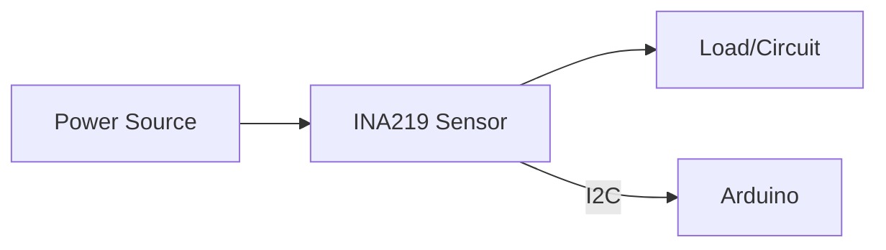
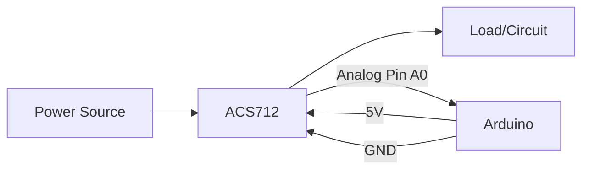

# Arduino Current Measurement

## Introduction

Current measurement is a fundamental skill for Arduino projects, especially when dealing with battery-powered devices or systems where power consumption matters. Understanding how much current your project draws helps you optimize power usage, extend battery life, and ensure components operate within safe limits.

In this tutorial, we'll explore various techniques to measure current using Arduino, from basic resistor-based methods to specialized current sensor modules. By the end, you'll be able to monitor and manage the power consumption of your Arduino projects effectively.

## Why Measure Current?

Before diving into measurement techniques, let's understand why current measurement is important:

- **Battery life estimation**: Know how long your battery will last
- **Power optimization**: Identify power-hungry components
- **Troubleshooting**: Detect abnormal current draws that might indicate problems
- **Safety**: Ensure your system stays within safe operational limits
- **Performance analysis**: Understand power consumption under different conditions

## Basic Concepts

### Current vs. Voltage

While voltage (measured in volts) represents electrical potential difference, current (measured in amperes or amps) represents the flow of electric charge. For Arduino projects:

- Most digital logic operates at 5V or 3.3V
- Current consumption varies significantly based on what components are active
- A typical Arduino Uno draws ~50mA when idle, but can draw much more when driving motors, LEDs, or other components

### Ohm's Law Refresher

Ohm's Law states that current (I) equals voltage (V) divided by resistance (R):

```
I = V/R
```

This fundamental principle is the basis for many current measurement techniques.

## Method 1: Shunt Resistor Measurement

The simplest way to measure current is using a shunt resistor and the Arduino's analog input.

### How It Works

1. Insert a small "shunt" resistor in series with your circuit
2. Measure the voltage drop across this resistor
3. Use Ohm's Law to calculate the current

### Circuit Setup


### Code Example

```cpp
const float SHUNT_RESISTOR = 1.0; // 1 ohm shunt resistor
const int ANALOG_PIN = A0;
const float VCC = 5.0; // Arduino 5V
const float ADC_RESOLUTION = 1024.0; // 10-bit ADC

void setup() {
  Serial.begin(9600);
  Serial.println("Arduino Current Measurement");
  Serial.println("Using Shunt Resistor Method");
  Serial.println("-----------------------------");
}

void loop() {
  // Read analog value
  int sensorValue = analogRead(ANALOG_PIN);
  
  // Convert to voltage
  float voltage = sensorValue * (VCC / ADC_RESOLUTION);
  
  // Calculate current using Ohm's Law (I = V/R)
  float current_mA = (voltage / SHUNT_RESISTOR) * 1000; // Convert to milliamps
  
  // Print results
  Serial.print("Voltage across shunt: ");
  Serial.print(voltage, 4);
  Serial.println(" V");
  
  Serial.print("Current: ");
  Serial.print(current_mA, 2);
  Serial.println(" mA");
  
  delay(1000); // Update once per second
}
```

### Limitations

- Low precision due to Arduino's 10-bit ADC
- Small shunt resistors give less accurate readings but interfere less with the circuit
- Larger shunt resistors are more accurate but cause voltage drop that can affect circuit operation
- Direct measurement works only for low currents (typically `<500mA`)

## Method 2: Using the INA219 Current Sensor

The INA219 is a specialized IC for high-precision current and power measurement, communicating via I²C.

### Benefits

- High precision (12-bit ADC built-in)
- Measures both current and voltage simultaneously
- Minimal impact on your circuit
- Measures up to ±3.2A with the standard configuration

### Hardware Setup

You'll need:
- Arduino board
- INA219 breakout board (available from Adafruit, SparkFun, and others)
- Jumper wires

Connect:
- VCC to Arduino 5V or 3.3V
- GND to Arduino GND
- SDA to Arduino SDA (A4 on most boards)
- SCL to Arduino SCL (A5 on most boards)

### Circuit Diagram



### Code Example

First, install the Adafruit INA219 library from the Library Manager in the Arduino IDE.

```cpp
#include <Wire.h>
#include <Adafruit_INA219.h>

Adafruit_INA219 ina219;

void setup() {
  Serial.begin(9600);
  
  // Initialize the INA219
  if (!ina219.begin()) {
    Serial.println("Failed to find INA219 chip");
    while (1) { delay(10); }
  }
  
  Serial.println("Arduino Current Measurement");
  Serial.println("Using INA219 Sensor");
  Serial.println("-----------------------------");
}

void loop() {
  float shuntVoltage = ina219.getShuntVoltage_mV();
  float busVoltage = ina219.getBusVoltage_V();
  float current_mA = ina219.getCurrent_mA();
  float power_mW = ina219.getPower_mW();
  
  // Calculate load voltage
  float loadVoltage = busVoltage + (shuntVoltage / 1000);
  
  // Print results
  Serial.print("Bus Voltage:   "); Serial.print(busVoltage); Serial.println(" V");
  Serial.print("Shunt Voltage: "); Serial.print(shuntVoltage); Serial.println(" mV");
  Serial.print("Load Voltage:  "); Serial.print(loadVoltage); Serial.println(" V");
  Serial.print("Current:       "); Serial.print(current_mA); Serial.println(" mA");
  Serial.print("Power:         "); Serial.print(power_mW); Serial.println(" mW");
  Serial.println("");
  
  delay(2000);
}
```

### Example Output

```
Arduino Current Measurement
Using INA219 Sensor
-----------------------------
Bus Voltage:   5.12 V
Shunt Voltage: 0.42 mV
Load Voltage:  5.12 V
Current:       84.23 mA
Power:         431.66 mW
```

## Method 3: Hall Effect Current Sensor (ACS712)

For higher current applications or when galvanic isolation is needed, the ACS712 Hall effect sensor is an excellent choice.

### How It Works

The ACS712 uses the Hall effect to measure current without direct electrical connection, making it safe for high-current applications.

### Features

- Available in various current ranges (±5A, ±20A, ±30A)
- Provides isolation between the circuit being measured and the Arduino
- Linear analog output
- Works with both AC and DC current

### Connection Diagram



### Code Example

```cpp
const int CURRENT_SENSOR_PIN = A0;
const float SENSITIVITY = 100.0; // mV per amp (for ACS712-20A model)
const float VCC = 5.0;
const float OFFSET_VOLTAGE = VCC / 2; // Center point when no current flows

void setup() {
  Serial.begin(9600);
  Serial.println("Arduino Current Measurement");
  Serial.println("Using ACS712 Hall Effect Sensor");
  Serial.println("-----------------------------");
}

void loop() {
  // Take multiple samples for stability
  float sensorValue = 0;
  for (int i = 0; i < 10; i++) {
    sensorValue += analogRead(CURRENT_SENSOR_PIN);
    delay(2);
  }
  sensorValue /= 10.0;
  
  // Convert to voltage
  float voltage = sensorValue * (VCC / 1023.0);
  
  // Convert to current based on sensitivity
  float current = (voltage - OFFSET_VOLTAGE) * 1000 / SENSITIVITY;
  
  // Print results
  Serial.print("Sensor Value: "); Serial.println(sensorValue);
  Serial.print("Voltage: "); Serial.print(voltage, 3); Serial.println(" V");
  Serial.print("Current: "); Serial.print(current, 3); Serial.println(" A");
  Serial.println("");
  
  delay(1000);
}
```

### Calibration

For accurate measurements, the ACS712 should be calibrated:

```cpp
// Add this function to your sketch
float calibrateACS712() {
  float sum = 0;
  // Take 100 samples when no current is flowing
  for (int i = 0; i < 100; i++) {
    sum += analogRead(CURRENT_SENSOR_PIN);
    delay(10);
  }
  float zeroCurrentValue = sum / 100.0;
  float zeroCurrentVoltage = zeroCurrentValue * (VCC / 1023.0);
  
  Serial.print("Zero Current Calibration: ");
  Serial.print(zeroCurrentVoltage, 3);
  Serial.println(" V");
  
  return zeroCurrentVoltage;
}
```

## Practical Project: Battery Life Tester

Let's apply our knowledge to create a simple battery life tester using the INA219 sensor.

### Components Needed

- Arduino Uno or Nano
- INA219 current sensor
- Battery holder
- Resistor (to create a load, value depends on your battery)
- OLED display (optional)

### Project Description

This project continuously measures the current drawn from a battery and calculates the expected battery life based on its rated capacity.

### Code Example

```cpp
#include <Wire.h>
#include <Adafruit_INA219.h>

Adafruit_INA219 ina219;

// Battery settings
const float BATTERY_CAPACITY_MAH = 2000.0; // 2000mAh battery
unsigned long startTime;
float totalCharge = 0.0; // in mAh

void setup() {
  Serial.begin(9600);
  
  // Initialize the INA219
  if (!ina219.begin()) {
    Serial.println("Failed to find INA219 chip");
    while (1) { delay(10); }
  }
  
  Serial.println("Battery Life Tester");
  Serial.println("------------------");
  Serial.print("Battery Capacity: ");
  Serial.print(BATTERY_CAPACITY_MAH);
  Serial.println(" mAh");
  
  startTime = millis();
}

void loop() {
  float current_mA = ina219.getCurrent_mA();
  float voltage = ina219.getBusVoltage_V();
  
  // Calculate time elapsed in hours
  unsigned long currentTime = millis();
  float timeElapsed = (currentTime - startTime) / 3600000.0; // Convert ms to hours
  
  // Calculate charge used since last reading
  static unsigned long lastTime = startTime;
  float timeDelta = (currentTime - lastTime) / 3600000.0; // Hours
  totalCharge += current_mA * timeDelta;
  lastTime = currentTime;
  
  // Calculate remaining capacity
  float remainingCapacity = BATTERY_CAPACITY_MAH - totalCharge;
  float remainingPercentage = (remainingCapacity / BATTERY_CAPACITY_MAH) * 100.0;
  
  // Estimate remaining time
  float remainingHours = 0;
  if (current_mA > 0) {
    remainingHours = remainingCapacity / current_mA;
  }
  
  // Print results
  Serial.print("Voltage: "); Serial.print(voltage, 2); Serial.println(" V");
  Serial.print("Current: "); Serial.print(current_mA, 2); Serial.println(" mA");
  Serial.print("Time Elapsed: "); Serial.print(timeElapsed, 2); Serial.println(" hours");
  Serial.print("Charge Used: "); Serial.print(totalCharge, 2); Serial.println(" mAh");
  Serial.print("Remaining Capacity: "); Serial.print(remainingPercentage, 1); Serial.println("%");
  Serial.print("Estimated Remaining Time: "); Serial.print(remainingHours, 2); Serial.println(" hours");
  Serial.println("");
  
  delay(10000); // Update every 10 seconds
}
```

## Advanced Techniques

### Measuring Sleep Current

For battery-powered projects, measuring sleep current (often in the µA range) is critical. Standard methods often lack the sensitivity needed.

#### Using OpAmp Current Amplifier

For very low currents, you can build a current amplifier using an operational amplifier:


### Measuring AC Current

The ACS712 can measure AC current, but we need to modify our code to handle alternating signals:

```cpp
// For AC current measurement
float measureAcCurrent() {
  // Track min and max values
  int maxValue = 0;
  int minValue = 1023;
  
  // Sample for 100ms (about 5-6 cycles at 50-60Hz)
  unsigned long startTime = millis();
  while (millis() - startTime < 100) {
    int rawValue = analogRead(CURRENT_SENSOR_PIN);
    if (rawValue > maxValue) maxValue = rawValue;
    if (rawValue < minValue) minValue = rawValue;
  }
  
  // Calculate peak-to-peak amplitude
  int peakToPeak = maxValue - minValue;
  
  // Convert to RMS (for sinusoidal waves)
  float voltageRMS = (peakToPeak * 5.0 / 1023.0) / 2.0 * 0.707;
  
  // Convert to current based on sensitivity
  float currentRMS = voltageRMS * 1000 / SENSITIVITY;
  
  return currentRMS;
}
```

## Troubleshooting Common Issues

### Noisy Readings

If your current measurements fluctuate:
- Add a capacitor (0.1μF or 1μF) across the sensor output
- Take multiple readings and average them
- Use a lower value shunt resistor (but not too low)

### Incorrect Readings

- Double-check your wiring
- Ensure your sensor is connected correctly in the circuit
- Verify the sensitivity/calibration of your sensor
- For Hall effect sensors, make sure there are no magnetic fields nearby

### Temperature Effects

Temperature can affect the accuracy of measurements:
- Allow your sensor to warm up before critical measurements
- Consider temperature compensation in sensitive applications

## Summary

In this tutorial, we've covered:

1. The importance of current measurement in Arduino projects
2. Basic principles of current measurement
3. Three methods to measure current:
   - Using a shunt resistor
   - Using the INA219 precision sensor
   - Using the ACS712 Hall effect sensor
4. A practical battery life tester project
5. Advanced techniques for specialized measurements

With these skills, you can now effectively monitor and manage power consumption in your Arduino projects, leading to more efficient designs and longer battery life.

## Practice Exercises

1. Build a data logger that records the current consumption of an Arduino project over time
2. Create a power profile analyzer that measures current during different operational modes
3. Design a battery discharge tester that logs voltage and current until the battery is depleted
4. Implement an over-current protection system that uses a sensor to detect excessive current draw

## Additional Resources

- Arduino Power Management: Techniques to reduce power consumption in your projects
- Battery Technologies: Understanding different battery types and their characteristics
- Sensor Calibration: Methods to improve the accuracy of your measurements