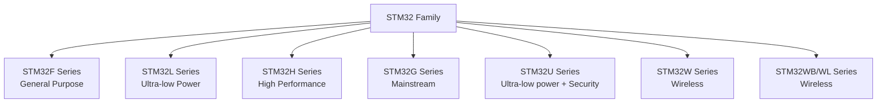

# STM32 Introduction

## What are STM32 Microcontrollers?

STM32 is a family of 32-bit microcontrollers developed by STMicroelectronics based on the ARM Cortex-M processor architecture. Since their introduction in 2007, STM32 microcontrollers have become extremely popular in the embedded systems world due to their powerful features, flexibility, and competitive pricing.

These microcontrollers are used in countless applications, from simple hobbyist projects to complex industrial systems, medical devices, consumer electronics, and even space applications!

## Why Choose STM32?

As a beginner entering the world of embedded systems, you might wonder why you should learn about STM32 microcontrollers when there are simpler options like Arduino. Here are some compelling reasons:

- **Performance**: STM32 microcontrollers offer significantly better performance than 8-bit microcontrollers like those used in Arduino boards.
- **Cost-effectiveness**: Many STM32 variants provide excellent features at competitive prices.
- **Variety**: The STM32 family offers hundreds of different microcontrollers with various capabilities, allowing you to choose the perfect one for your specific application.
- **Rich peripheral set**: STM32 microcontrollers come with a wide range of built-in peripherals like ADCs, DACs, timers, communication interfaces, and more.
- **Industry relevance**: Learning STM32 gives you skills that are highly valued in the embedded industry.
- **Scalability**: As your projects grow in complexity, STM32 can grow with you without requiring a platform switch.

## STM32 Family Overview

The STM32 family is divided into several series, each targeting different application needs:



Let's briefly look at the most common series:

- **STM32F Series**: The original and most diverse STM32 series, covering a wide range of performance levels and feature sets.
- **STM32L Series**: Focused on ultra-low power consumption for battery-powered applications.
- **STM32H Series**: High-performance microcontrollers for demanding applications.
- **STM32G Series**: Balances performance and power efficiency for mainstream applications.

Each series contains various subfamilies, like STM32F1, STM32F4, etc., with specific performance characteristics.

## STM32 Architecture Basics

STM32 microcontrollers are based on the ARM Cortex-M cores:

- Cortex-M0/M0+: Entry-level, ultra-low power cores
- Cortex-M3: Good balance of performance and efficiency
- Cortex-M4: Adds DSP and optional floating-point capabilities
- Cortex-M7: High-performance core with advanced features

A typical STM32 microcontroller consists of:

1. **Core**: The ARM Cortex-M processor that executes instructions
2. **Memory**: Flash memory for program storage and RAM for data
3. **Clock system**: Provides timing signals for the microcontroller
4. **Peripherals**: Hardware modules that perform specific functions
5. **Input/Output ports**: Connect the microcontroller to the outside world

## Getting Started with STM32

### Required Hardware

To begin developing with STM32 microcontrollers, you'll need:

1. **Development board**: An STM32 development board like the Nucleo, Discovery, or Evaluation boards provides an easy way to start with STM32. For beginners, the Nucleo boards are highly recommended due to their affordability and built-in debugger.

2. **USB cable**: Used to connect the development board to your computer for programming and debugging.

3. **Jumper wires and components**: For building circuits that interface with your STM32 board.

### Development Environment Setup

Setting up a development environment for STM32 involves several steps:

1. **Choose an IDE**: Popular options include:
   - STM32CubeIDE (free, integrated solution from ST)
   - Keil MDK-ARM
   - IAR Embedded Workbench
   - Platform.io (extension for Visual Studio Code)

2. **Install STM32 libraries**:
   - STM32CubeMX: A graphical tool for configuring STM32 microcontrollers
   - HAL (Hardware Abstraction Layer) libraries: Simplify peripheral access

3. **Install a programmer/debugger**: Most development boards include an ST-Link debugger, which requires drivers.

For beginners, we recommend starting with STM32CubeIDE, which combines an IDE, debugger, and STM32CubeMX in one package.

## Your First STM32 Program: Blinking an LED

Let's create a simple program to blink an LED on an STM32 board. This example assumes you're using an STM32F4 Nucleo board, but the concepts apply to other boards with minor adjustments.

### Code Example

```c
/* Includes ------------------------------------------------------------------*/
#include "main.h"

/* Private function prototypes -----------------------------------------------*/
void SystemClock_Config(void);
static void MX_GPIO_Init(void);

int main(void)
{
  /* Reset of all peripherals, initializes the Flash interface and the Systick */
  HAL_Init();

  /* Configure the system clock */
  SystemClock_Config();

  /* Initialize all configured peripherals */
  MX_GPIO_Init();

  /* Infinite loop */
  while (1)
  {
    /* Toggle LED */
    HAL_GPIO_TogglePin(GPIOA, GPIO_PIN_5);
    
    /* Delay 500ms */
    HAL_Delay(500);
  }
}

/**
  * @brief System Clock Configuration
  * @retval None
  */
void SystemClock_Config(void)
{
  /* System clock configuration code - generated by STM32CubeMX */
  /* Omitted for brevity */
}

/**
  * @brief GPIO Initialization Function
  * @param None
  * @retval None
  */
static void MX_GPIO_Init(void)
{
  GPIO_InitTypeDef GPIO_InitStruct = {0};

  /* GPIO Ports Clock Enable */
  __HAL_RCC_GPIOA_CLK_ENABLE();

  /* Configure GPIO pin Output Level */
  HAL_GPIO_WritePin(GPIOA, GPIO_PIN_5, GPIO_PIN_RESET);

  /* Configure GPIO pin : PA5 (LED) */
  GPIO_InitStruct.Pin = GPIO_PIN_5;
  GPIO_InitStruct.Mode = GPIO_MODE_OUTPUT_PP;
  GPIO_InitStruct.Pull = GPIO_NOPULL;
  GPIO_InitStruct.Speed = GPIO_SPEED_FREQ_LOW;
  HAL_GPIO_Init(GPIOA, &GPIO_InitStruct);
}
```

### Code Explanation

1. **Includes and Prototypes**: The code begins with necessary header includes and function prototypes.

2. **Main Function**:
   - `HAL_Init()`: Initializes the Hardware Abstraction Layer.
   - `SystemClock_Config()`: Sets up the system clock.
   - `MX_GPIO_Init()`: Configures the GPIO pin connected to the LED.
   - Infinite loop: Toggles the LED and adds a delay to create the blinking effect.

3. **GPIO Initialization**:
   - Enables the clock for GPIOA.
   - Configures pin PA5 (connected to the onboard LED) as output.

### Step-by-Step Program Flow

1. The microcontroller initializes, setting up internal systems.
2. The GPIO pin connected to the LED is configured as an output.
3. In the infinite loop, the program:
   - Toggles the state of the LED (if it's on, it turns off; if it's off, it turns on)
   - Waits for 500 milliseconds (0.5 seconds)
   - Repeats, creating the blinking effect

## Key STM32 Concepts

### GPIO (General Purpose Input/Output)

GPIO pins are digital pins that can be configured as either inputs or outputs. They connect the microcontroller to the outside world.

```c
// Configure a pin as output
GPIO_InitStruct.Pin = GPIO_PIN_5;
GPIO_InitStruct.Mode = GPIO_MODE_OUTPUT_PP;  // Push-pull output
GPIO_InitStruct.Pull = GPIO_NOPULL;          // No pull-up/pull-down
GPIO_InitStruct.Speed = GPIO_SPEED_FREQ_LOW; // Low speed is sufficient for an LED
HAL_GPIO_Init(GPIOA, &GPIO_InitStruct);

// Set pin high (turn on LED)
HAL_GPIO_WritePin(GPIOA, GPIO_PIN_5, GPIO_PIN_SET);

// Set pin low (turn off LED)
HAL_GPIO_WritePin(GPIOA, GPIO_PIN_5, GPIO_PIN_RESET);

// Toggle pin state
HAL_GPIO_TogglePin(GPIOA, GPIO_PIN_5);
```

### Clock System

STM32 microcontrollers have a complex clock system that allows for flexibility and power optimization. The main clock sources are:

- Internal oscillators (HSI, LSI)
- External oscillators (HSE, LSE)
- Phase-Locked Loops (PLLs) for frequency multiplication

Understanding the clock system is crucial for proper STM32 programming.

### Interrupts

Interrupts allow the microcontroller to respond to events immediately rather than polling for changes. STM32 has a sophisticated interrupt system with priorities.

```c
// Configure button as interrupt source
GPIO_InitStruct.Pin = GPIO_PIN_13;
GPIO_InitStruct.Mode = GPIO_MODE_IT_FALLING;  // Interrupt on falling edge
GPIO_InitStruct.Pull = GPIO_NOPULL;
HAL_GPIO_Init(GPIOC, &GPIO_InitStruct);

// Enable and set priority for the interrupt
HAL_NVIC_SetPriority(EXTI15_10_IRQn, 0, 0);
HAL_NVIC_EnableIRQ(EXTI15_10_IRQn);

// Interrupt handler function
void EXTI15_10_IRQHandler(void)
{
  HAL_GPIO_EXTI_IRQHandler(GPIO_PIN_13);
}

// Callback that gets called when interrupt occurs
void HAL_GPIO_EXTI_Callback(uint16_t GPIO_Pin)
{
  if(GPIO_Pin == GPIO_PIN_13)
  {
    // Do something when button is pressed
    HAL_GPIO_TogglePin(GPIOA, GPIO_PIN_5);
  }
}
```

## Development Approaches

There are three main approaches to STM32 programming:

### 1. HAL (Hardware Abstraction Layer)

HAL provides a high-level, portable API that simplifies microcontroller programming. It's beginner-friendly but can be less efficient.

```c
// HAL example: Reading an ADC value
HAL_ADC_Start(&hadc1);
HAL_ADC_PollForConversion(&hadc1, 100);
uint16_t adcValue = HAL_ADC_GetValue(&hadc1);
```

### 2. LL (Low-Layer)

The LL library offers better performance than HAL but requires more understanding of the hardware.

```c
// LL example: Setting up a GPIO pin
LL_GPIO_SetPinMode(GPIOA, LL_GPIO_PIN_5, LL_GPIO_MODE_OUTPUT);
LL_GPIO_SetOutputPin(GPIOA, LL_GPIO_PIN_5);
```

### 3. Register-Level Programming

Direct register manipulation offers the best performance and smallest code size but requires deep knowledge of the hardware.

```c
// Register-level example: Toggling an LED
GPIOA->ODR ^= (1 << 5);
```

As a beginner, start with HAL and gradually explore LL and register-level programming as you become more comfortable.

## Real-World Applications

STM32 microcontrollers are used in various real-world applications:

### Digital Signal Processing

STM32F4 and higher series include DSP instructions, making them suitable for audio processing, sensor data filtering, and more.

```c
// Simple FIR filter implementation
float applyFilter(float input, float *coeffs, float *buffer, int order)
{
  float output = 0.0f;
  
  // Shift the buffer
  for(int i = order - 1; i > 0; i--)
    buffer[i] = buffer[i-1];
  
  buffer[0] = input;
  
  // Apply the filter
  for(int i = 0; i < order; i++)
    output += coeffs[i] * buffer[i];
    
  return output;
}
```

### Motor Control

STM32 timers and ADCs are well-suited for motor control applications:

```c
// Simple PWM generation for motor control
void setupPWM(void)
{
  // Timer configuration code (simplified)
  htim1.Instance = TIM1;
  htim1.Init.Prescaler = 0;
  htim1.Init.Period = 1000;  // PWM period
  
  // PWM mode configuration
  TIM_OC_InitTypeDef sConfigOC = {0};
  sConfigOC.OCMode = TIM_OCMODE_PWM1;
  sConfigOC.Pulse = 500;  // 50% duty cycle
  HAL_TIM_PWM_ConfigChannel(&htim1, &sConfigOC, TIM_CHANNEL_1);
  
  // Start PWM
  HAL_TIM_PWM_Start(&htim1, TIM_CHANNEL_1);
}

// Change motor speed by adjusting PWM duty cycle
void setMotorSpeed(uint16_t speed)  // 0-1000
{
  __HAL_TIM_SET_COMPARE(&htim1, TIM_CHANNEL_1, speed);
}
```

### IoT Devices

Many STM32 variants include connectivity options for IoT applications:

```c
// Example pseudocode for sending sensor data over UART
void sendSensorData(float temperature, float humidity)
{
  char buffer[50];
  sprintf(buffer, "{\"temp\":%.1f,\"humidity\":%.1f}\r
", temperature, humidity);
  HAL_UART_Transmit(&huart2, (uint8_t*)buffer, strlen(buffer), 100);
}
```

## Debugging Techniques

Effective debugging is crucial for embedded development. STM32 offers several debugging capabilities:

1. **Serial Wire Debug (SWD)**: Allows for hardware breakpoints, variable inspection, and stepping through code.

2. **Serial output**: Use UART to send debug messages to your computer.
   ```c
   printf("Debug: sensor value = %d\r
", sensorValue);
   ```

3. **LED signaling**: Use LED patterns to indicate program state or error conditions.

4. **Logic analyzers**: Monitor digital signals to troubleshoot communication protocols.

## Summary

In this introduction to STM32 microcontrollers, we've covered:

- What STM32 microcontrollers are and why they're popular
- The STM32 family structure and different series
- Basic architecture of STM32 microcontrollers
- How to set up a development environment
- Creating your first STM32 program
- Key concepts like GPIO, clocks, and interrupts
- Different programming approaches (HAL, LL, register-level)
- Real-world applications of STM32
- Debugging techniques

STM32 microcontrollers offer a powerful platform for embedded development, with options suitable for everything from simple hobby projects to complex professional applications. While there's a steeper learning curve compared to platforms like Arduino, the capabilities and flexibility you gain are well worth the effort.

## Exercises

1. Modify the LED blinking program to use a button to change the blinking speed.
2. Create a program that reads an analog value from a potentiometer and displays the result by varying the blink rate of an LED.
3. Implement a simple state machine that cycles through different LED patterns when a button is pressed.
4. Use a timer interrupt instead of HAL_Delay() to create a more precise blinking pattern.
5. Connect an external sensor (e.g., temperature, light) to your STM32 board and read its values.

## Additional Resources

- [STMicroelectronics Website](https://www.st.com)
- STM32CubeIDE User Manual
- STM32 Reference Manuals for your specific microcontroller
- "Mastering STM32" by Carmine Noviello
- STM32 Community Forums and Stack Overflow