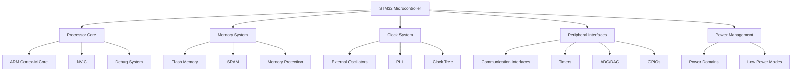
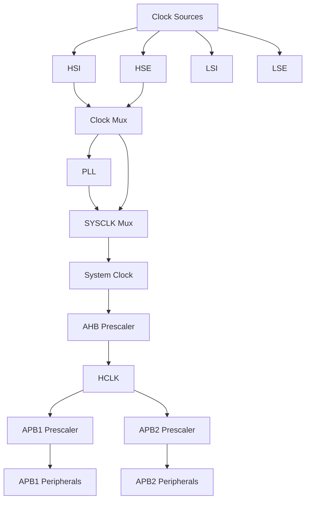
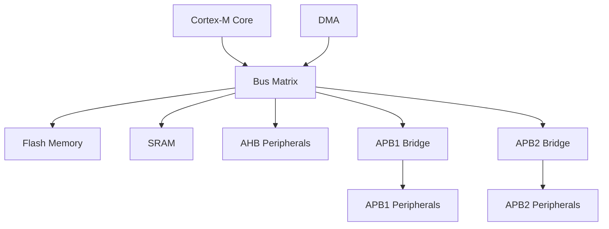

# STM32 Architecture

## Introduction

STM32 microcontrollers are powerful, versatile devices that form the backbone of many modern embedded systems. Developed by STMicroelectronics, these microcontrollers are based on the ARM Cortex-M processor cores, offering an excellent balance of performance, power efficiency, and integration. Whether you're building a smart home device, industrial controller, or wearable technology, understanding STM32 architecture is essential for effective embedded programming.

This guide breaks down the fundamental architecture of STM32 microcontrollers, explaining how the various components work together to create a complete system-on-chip solution. By the end, you'll have a solid understanding of the STM32's internal structure and be ready to start programming these versatile devices.

## Core Architecture Overview

At the heart of every STM32 microcontroller lies an ARM Cortex-M processor core. The STM32 family spans several series, each using different Cortex-M variants:

- STM32F0: Cortex-M0
- STM32F1, F2, F4: Cortex-M3/M4
- STM32F7: Cortex-M7
- STM32L0, L1: Low-power Cortex-M0+/M3
- STM32H7: High-performance Cortex-M7
- STM32G0, G4: Newer Cortex-M0+/M4 variants
- STM32WB: Wireless Cortex-M4
- STM32U5: Ultra-low-power Cortex-M33



### The ARM Cortex-M Core

The ARM Cortex-M core implements the ARM architecture, providing the instruction set and execution pipeline. Key features include:

- RISC (Reduced Instruction Set Computing) architecture
- Harvard architecture (separate instruction and data buses)
- 32-bit processing capability
- Pipeline stages for efficient instruction execution
- Thumb/Thumb-2 instruction sets for code density
- Hardware multiply and (in some versions) divide operations

### Nested Vectored Interrupt Controller (NVIC)

The NVIC manages interrupts with minimal latency and maximum configurability:

- Priority-based interrupt handling
- Nested interrupt support
- Vector table for fast interrupt response
- Configurable priority levels
- Non-maskable interrupt (NMI) support
- Dedicated SysTick timer for operating system timing

### Debug System

STM32 devices include comprehensive debugging capabilities:

- Serial Wire Debug (SWD) interface
- JTAG interface on many devices
- Flash breakpoints
- Data watchpoints
- ETM (Embedded Trace Macrocell) on higher-end devices

## Memory Architecture

STM32 microcontrollers feature a well-organized memory architecture designed for efficiency and flexibility.

### Memory Types

- **Flash Memory**: Non-volatile program memory (32KB to 2MB depending on the device)
- **SRAM**: Fast volatile memory for variables and stack (4KB to 1MB)
- **Option Bytes**: Configuration settings stored in special flash memory
- **OTP Memory**: One-time programmable memory for permanent data storage

### Memory Map

The STM32 uses a unified 32-bit address space with memory-mapped peripherals:

```
0x0000 0000 - 0x07FF FFFF: Code (Flash, SRAM, System memory)
0x0800 0000 - 0x0FFF FFFF: Flash memory
0x1000 0000 - 0x1FFF FFFF: SRAM, CCM (Core Coupled Memory)
0x2000 0000 - 0x3FFF FFFF: SRAM
0x4000 0000 - 0x4FFF FFFF: Peripheral registers
0x5000 0000 - 0x5FFF FFFF: External RAM
0x6000 0000 - 0x9FFF FFFF: External devices
0xA000 0000 - 0xDFFF FFFF: Reserved
0xE000 0000 - 0xE00F FFFF: Cortex-M system peripherals
```

### Memory Protection

Many STM32 devices include memory protection features:

- MPU (Memory Protection Unit): Defines access permissions for memory regions
- Flash read/write protection: Prevents unauthorized access to flash memory
- Secure boot capabilities in newer devices

## Clock System

The clock system is a critical component of the STM32 architecture, providing timing signals for all operations.

### Clock Sources

- **HSI**: High-Speed Internal RC oscillator (typically 8/16 MHz)
- **HSE**: High-Speed External crystal or clock (4-26 MHz)
- **LSI**: Low-Speed Internal RC oscillator (32-40 kHz)
- **LSE**: Low-Speed External crystal (32.768 kHz)
- **PLL**: Phase-Locked Loop for frequency multiplication

### Clock Tree

The clock system distributes clock signals to various parts of the microcontroller:



### Clock Configuration Example

Here's a simple example of configuring the system clock using the HAL library:

```c
void SystemClock_Config(void)
{
  RCC_OscInitTypeDef RCC_OscInitStruct = {0};
  RCC_ClkInitTypeDef RCC_ClkInitStruct = {0};

  // Configure the main internal regulator output voltage
  __HAL_RCC_PWR_CLK_ENABLE();
  __HAL_PWR_VOLTAGESCALING_CONFIG(PWR_REGULATOR_VOLTAGE_SCALE1);

  // Initialize HSE Oscillator and activate PLL with HSE as source
  RCC_OscInitStruct.OscillatorType = RCC_OSCILLATORTYPE_HSE;
  RCC_OscInitStruct.HSEState = RCC_HSE_ON;
  RCC_OscInitStruct.PLL.PLLState = RCC_PLL_ON;
  RCC_OscInitStruct.PLL.PLLSource = RCC_PLLSOURCE_HSE;
  RCC_OscInitStruct.PLL.PLLM = 8;
  RCC_OscInitStruct.PLL.PLLN = 336;
  RCC_OscInitStruct.PLL.PLLP = RCC_PLLP_DIV2;
  RCC_OscInitStruct.PLL.PLLQ = 7;
  HAL_RCC_OscConfig(&RCC_OscInitStruct);

  // Initialize CPU, AHB and APB buses clocks
  RCC_ClkInitStruct.ClockType = RCC_CLOCKTYPE_HCLK|RCC_CLOCKTYPE_SYSCLK
                              |RCC_CLOCKTYPE_PCLK1|RCC_CLOCKTYPE_PCLK2;
  RCC_ClkInitStruct.SYSCLKSource = RCC_SYSCLKSOURCE_PLLCLK;
  RCC_ClkInitStruct.AHBCLKDivider = RCC_SYSCLK_DIV1;
  RCC_ClkInitStruct.APB1CLKDivider = RCC_HCLK_DIV4;
  RCC_ClkInitStruct.APB2CLKDivider = RCC_HCLK_DIV2;
  HAL_RCC_ClockConfig(&RCC_ClkInitStruct, FLASH_LATENCY_5);
}
```

## Bus Architecture

STM32 microcontrollers use a multi-bus architecture to efficiently connect the processor core with peripherals and memory.

### Main Buses

- **AHB (Advanced High-performance Bus)**: High-speed bus for core, memory and DMA
- **APB (Advanced Peripheral Bus)**: Lower-speed bus for peripherals
  - APB1: Lower-speed peripherals
  - APB2: Higher-speed peripherals

### Bus Matrix

Higher-end STM32 devices utilize a bus matrix that allows multiple masters (CPU, DMA) to access multiple slaves (memory, peripherals) simultaneously:



## Peripheral System

The STM32's extensive peripheral set enables interaction with the outside world.

### Communication Interfaces

- **UART/USART**: Serial communication
- **SPI**: Serial Peripheral Interface
- **I2C**: Inter-Integrated Circuit
- **CAN**: Controller Area Network
- **USB**: Universal Serial Bus
- **Ethernet**: Network communication (on select models)

### Analog Peripherals

- **ADC**: Analog-to-Digital Converter
- **DAC**: Digital-to-Analog Converter
- **Comparators**: Compare voltage levels
- **Temperature sensor**: Internal temperature measurement

### Timers

- **General-purpose timers**: For timing, PWM generation, and input capture
- **Advanced timers**: Advanced PWM features for motor control
- **Basic timers**: Simple counting and timebase generation
- **Watchdog timers**: System reliability monitoring

### GPIO System

The General Purpose Input/Output system provides flexible pin configuration:

- Digital input/output capability
- Alternative function mapping
- Push-pull or open-drain output configuration
- Pull-up/pull-down resistors
- High current drive capability

### GPIO Configuration Example

```c
void GPIO_Config(void)
{
  GPIO_InitTypeDef GPIO_InitStruct = {0};
  
  // Enable the GPIO clock
  __HAL_RCC_GPIOA_CLK_ENABLE();
  
  // Configure PA5 as output (LED on many STM32 boards)
  GPIO_InitStruct.Pin = GPIO_PIN_5;
  GPIO_InitStruct.Mode = GPIO_MODE_OUTPUT_PP;    // Push-pull output
  GPIO_InitStruct.Pull = GPIO_NOPULL;            // No pull-up/down
  GPIO_InitStruct.Speed = GPIO_SPEED_FREQ_LOW;   // Low speed
  
  HAL_GPIO_Init(GPIOA, &GPIO_InitStruct);
}

// Example of using the configured GPIO
void toggleLED(void)
{
  HAL_GPIO_TogglePin(GPIOA, GPIO_PIN_5);  // Toggle the LED state
}
```

## Power Management

STM32 microcontrollers feature sophisticated power management capabilities:

### Power Domains

- Core domain
- I/O domains (can be separated for different voltage levels)
- Backup domain (remains powered during sleep modes)

### Power Modes

- **Run Mode**: Full operation
- **Sleep Mode**: CPU stopped, peripherals running
- **Stop Mode**: Clock sources stopped, RAM retained, fast wakeup
- **Standby Mode**: Lowest power consumption, limited retention

### Low-Power Features

- Voltage scaling
- Clock gating
- Independent peripheral clocks
- Wake-up events from multiple sources

## DMA (Direct Memory Access)

The DMA controller allows data transfer without CPU intervention:

- Multiple independent channels
- Configurable priority levels
- Memory-to-memory, memory-to-peripheral, and peripheral-to-memory transfers
- Circular buffer support
- Stream controllers on advanced models

### DMA Example: ADC with DMA

```c
#define ADC_BUFFER_SIZE 10

uint16_t adc_buffer[ADC_BUFFER_SIZE];

void ADC_DMA_Config(void)
{
  ADC_HandleTypeDef hadc1;
  DMA_HandleTypeDef hdma_adc1;
  
  // Configure DMA
  __HAL_RCC_DMA2_CLK_ENABLE();
  
  hdma_adc1.Instance = DMA2_Stream0;
  hdma_adc1.Init.Channel = DMA_CHANNEL_0;
  hdma_adc1.Init.Direction = DMA_PERIPH_TO_MEMORY;
  hdma_adc1.Init.PeriphInc = DMA_PINC_DISABLE;
  hdma_adc1.Init.MemInc = DMA_MINC_ENABLE;
  hdma_adc1.Init.PeriphDataAlignment = DMA_PDATAALIGN_HALFWORD;
  hdma_adc1.Init.MemDataAlignment = DMA_MDATAALIGN_HALFWORD;
  hdma_adc1.Init.Mode = DMA_CIRCULAR;
  hdma_adc1.Init.Priority = DMA_PRIORITY_HIGH;
  hdma_adc1.Init.FIFOMode = DMA_FIFOMODE_DISABLE;
  HAL_DMA_Init(&hdma_adc1);
  
  // Link DMA to ADC
  __HAL_LINKDMA(&hadc1, DMA_Handle, hdma_adc1);
  
  // Configure ADC
  __HAL_RCC_ADC1_CLK_ENABLE();
  
  hadc1.Instance = ADC1;
  hadc1.Init.Resolution = ADC_RESOLUTION_12B;
  hadc1.Init.ScanConvMode = ENABLE;
  hadc1.Init.ContinuousConvMode = ENABLE;
  hadc1.Init.ExternalTrigConv = ADC_SOFTWARE_START;
  hadc1.Init.DataAlign = ADC_DATAALIGN_RIGHT;
  hadc1.Init.NbrOfConversion = 1;
  HAL_ADC_Init(&hadc1);
  
  // Configure ADC channel
  ADC_ChannelConfTypeDef sConfig = {0};
  sConfig.Channel = ADC_CHANNEL_0;
  sConfig.Rank = 1;
  sConfig.SamplingTime = ADC_SAMPLETIME_56CYCLES;
  HAL_ADC_ConfigChannel(&hadc1, &sConfig);
  
  // Start ADC with DMA
  HAL_ADC_Start_DMA(&hadc1, (uint32_t*)adc_buffer, ADC_BUFFER_SIZE);
}
```

## Real-World Applications

Understanding STM32 architecture enables you to build sophisticated embedded systems. Here are some practical applications:

### Smart Home Thermostat

- **Processor**: Runs control algorithms and user interface
- **ADC**: Reads temperature sensors
- **GPIO**: Controls relays for HVAC equipment
- **I2C**: Communicates with humidity sensors
- **UART**: Connects to WiFi module
- **RTC**: Maintains accurate time for scheduling
- **Low-power modes**: Extends battery life

### Industrial Motor Controller

- **Advanced timers**: Generate precise PWM for motor control
- **ADC**: Monitor current feedback for safety
- **CAN bus**: Connect to industrial network
- **Flash memory**: Store configuration parameters
- **DMA**: Handle high-speed data acquisition
- **Multiple Clock domains**: Ensure precise timing

### Wearable Health Monitor

- **Low-power Cortex-M**: Maximizes battery life
- **ADC**: Reads biometric sensors
- **SPI**: Interfaces with external memory for data logging
- **Bluetooth peripheral**: Communicates with smartphone
- **RTC**: Timestamps health events
- **Backup domain**: Maintains critical data during battery change

## Summary

STM32 microcontrollers feature a sophisticated architecture built around ARM Cortex-M cores. This architecture includes:

- A powerful processor core with NVIC and debug capabilities
- Hierarchical memory organization with flash and SRAM
- Flexible clock system with multiple sources and distribution paths
- Multi-layer bus matrix for efficient data transfer
- Extensive peripheral set for real-world interfacing
- Advanced power management for efficiency
- DMA controllers for CPU-independent data movement

Understanding this architecture provides the foundation for developing effective embedded systems using STM32 microcontrollers. As you progress, you'll learn how to leverage these architectural features to create efficient, reliable, and powerful applications.

## Further Learning

To continue your STM32 journey, consider exploring:

- **STM32CubeIDE**: STMicroelectronics' integrated development environment
- **HAL Libraries**: Hardware Abstraction Layer for portable code
- **RTOS Integration**: Running real-time operating systems on STM32
- **Low-power optimization**: Techniques to maximize battery life
- **Debugging**: Advanced techniques using SWD/JTAG

### Practice Exercises

1. Configure an STM32 to run from its internal oscillator at the maximum frequency.
2. Set up a timer to generate a precise 1 kHz PWM signal.
3. Create a project that uses DMA to transfer data from an ADC to memory without CPU intervention.
4. Implement a power management scheme that transitions between run, sleep, and stop modes based on activity.
5. Configure the memory protection unit (MPU) to protect critical sections of your application.