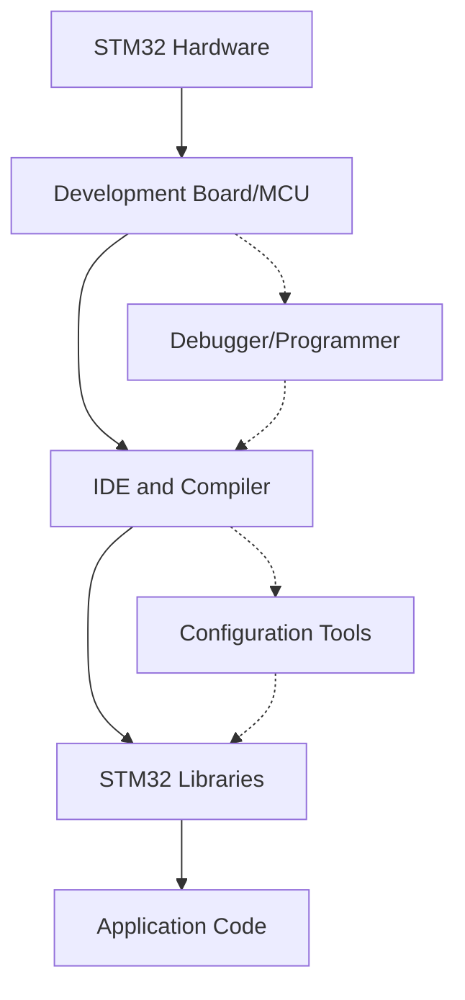

# STM32 Development Tools

## Introduction

Welcome to the world of STM32 microcontrollers! If you're just getting started with STM32 development, one of the first challenges you'll face is understanding the variety of development tools available. STM32 microcontrollers, produced by STMicroelectronics, have become increasingly popular due to their powerful features, affordability, and extensive ecosystem of development tools.

In this guide, we'll explore the essential development tools you'll need to start programming STM32 microcontrollers. We'll cover everything from Integrated Development Environments (IDEs) to debugging tools, configuration utilities, and firmware libraries. By the end of this guide, you'll have a clear understanding of the STM32 development ecosystem and be ready to start your first project.

## STM32 Development Ecosystem Overview

Before diving into specific tools, let's understand how different components of the STM32 development ecosystem work together:



As shown in the diagram, STM32 development involves hardware components, software development tools, and various utilities that help configure and program the microcontroller.

## Essential STM32 Development Tools

### 1. Integrated Development Environments (IDEs)

IDEs provide a complete environment for writing, compiling, and debugging your STM32 code. Here are the most popular options:

#### STM32CubeIDE

STM32CubeIDE is STMicroelectronics' official IDE for STM32 development. It combines STM32CubeMX and the Eclipse IDE with GCC compiler, providing a complete development platform.

**Key Features:**
- Integrated code generation from STM32CubeMX
- Advanced debugging capabilities
- Project management tools
- Code completion and syntax highlighting
- Free to use

**Getting Started with STM32CubeIDE:**

1. Download and install STM32CubeIDE from the STMicroelectronics website
2. Create a new project by selecting your specific STM32 microcontroller
3. Configure pins and peripherals using the integrated graphical interface
4. Generate initialization code automatically
5. Write your application code
6. Compile and flash to your STM32 device

#### Keil MDK (Microcontroller Development Kit)

Keil MDK is a commercial IDE that offers comprehensive support for STM32 microcontrollers, with excellent debugging capabilities and optimization tools.

**Key Features:**
- Powerful debugging capabilities
- Code optimization tools
- Extensive documentation
- Professional support
- Note: Requires a license for full features (limited free version available)

#### IAR Embedded Workbench

IAR Embedded Workbench is another commercial option that provides strong optimization and debugging capabilities for STM32 development.

**Key Features:**
- Advanced code optimization
- Comprehensive debugging
- Strong community support
- Professional-grade tools
- Note: Requires a license (evaluation version available)

### 2. STM32CubeMX - Configuration and Code Generation Tool

STM32CubeMX is a graphical tool that allows you to configure STM32 microcontrollers and generate initialization code. While it's integrated into STM32CubeIDE, it can also be used as a standalone tool with other IDEs.

**Key Features:**
- Graphical pin configuration
- Clock configuration
- Peripheral setup
- Middleware configuration
- Code generation for various IDEs

**Example: Configuring GPIO Pins with STM32CubeMX**

1. Launch STM32CubeIDE or standalone STM32CubeMX
2. Create a new project and select your STM32 microcontroller
3. Navigate to the Pinout view
4. Configure a GPIO pin (e.g., PA5) as GPIO_Output for an LED
5. Go to Clock Configuration to set up system clocks
6. Generate code by clicking the "Generate Code" button

The tool will create initialization code like this:

```c
/* Configure GPIO pin Output Level */
HAL_GPIO_WritePin(GPIOA, GPIO_PIN_5, GPIO_PIN_RESET);

/* Configure GPIO pin : PA5 */
GPIO_InitStruct.Pin = GPIO_PIN_5;
GPIO_InitStruct.Mode = GPIO_MODE_OUTPUT_PP;
GPIO_InitStruct.Pull = GPIO_NOPULL;
GPIO_InitStruct.Speed = GPIO_SPEED_FREQ_LOW;
HAL_GPIO_Init(GPIOA, &GPIO_InitStruct);
```

### 3. ST-Link Utility

ST-Link Utility is a software tool that allows you to program and debug STM32 microcontrollers using ST-Link hardware debuggers.

**Key Features:**
- Flash programming
- Memory viewing and editing
- Production programming
- Command-line interface for automation

### 4. STM32CubeProgrammer

STM32CubeProgrammer is the successor to ST-Link Utility, offering enhanced features for programming STM32 devices.

**Key Features:**
- Support for multiple interfaces (JTAG, SWD, UART, USB, etc.)
- Command-line interface
- Programming automation
- Memory operations
- Secure firmware update capabilities

**Example: Using STM32CubeProgrammer to Flash a Binary File**

Connect your ST-Link programmer to the STM32 board and use STM32CubeProgrammer with these steps:

1. Launch STM32CubeProgrammer
2. Connect to your device via ST-Link
3. Erase the memory if needed
4. Browse for your compiled binary (.bin or .hex file)
5. Program the device with a command like:

```bash
STM32_Programmer_CLI -c port=SWD -w firmware.bin 0x08000000
```

### 5. Debugging Tools

#### ST-Link Debuggers

ST-Link is a family of in-circuit debugger/programmers for STM32 microcontrollers. Most STM32 development boards include an integrated ST-Link debugger.

**Key Features:**
- JTAG and SWD debugging interfaces
- Flash programming
- Variable inspection
- Breakpoints and watchpoints
- Stepping through code

#### J-Link Debuggers

J-Link debuggers from SEGGER provide advanced debugging capabilities for STM32 and are often used in professional development environments.

**Key Features:**
- High-speed debugging
- Advanced trace capabilities
- Supports multiple debug interfaces
- Compatible with most IDEs
- Robust and reliable operation

### 6. Firmware Libraries

#### STM32Cube Libraries

STM32Cube includes a comprehensive set of libraries to simplify development:

- **Hardware Abstraction Layer (HAL)**: High-level API for peripherals
- **Low-Layer (LL) API**: Lightweight alternative to HAL with direct register access
- **Middleware components**: USB, TCP/IP, file systems, and more

**Example: Blinking an LED Using HAL Library**

```c
#include "main.h"

int main(void)
{
  /* Reset of all peripherals, initializes the Flash interface and the Systick */
  HAL_Init();

  /* Configure the system clock */
  SystemClock_Config();

  /* Initialize GPIO for LED */
  GPIO_InitTypeDef GPIO_InitStruct = {0};
  __HAL_RCC_GPIOA_CLK_ENABLE();
  GPIO_InitStruct.Pin = GPIO_PIN_5;
  GPIO_InitStruct.Mode = GPIO_MODE_OUTPUT_PP;
  GPIO_InitStruct.Pull = GPIO_NOPULL;
  GPIO_InitStruct.Speed = GPIO_SPEED_FREQ_LOW;
  HAL_GPIO_Init(GPIOA, &GPIO_InitStruct);

  /* Infinite loop */
  while (1)
  {
    HAL_GPIO_TogglePin(GPIOA, GPIO_PIN_5);  // Toggle LED
    HAL_Delay(500);                         // Delay 500ms
  }
}
```

#### STM32 Standard Peripheral Library (Legacy)

This is an older library that's being phased out in favor of the STM32Cube HAL, but you might encounter it in existing projects.

**Example: Blinking an LED Using Standard Peripheral Library**

```c
#include "stm32f4xx.h"
#include "stm32f4xx_gpio.h"
#include "stm32f4xx_rcc.h"

int main(void)
{
  /* Enable clock for GPIOA */
  RCC_AHB1PeriphClockCmd(RCC_AHB1Periph_GPIOA, ENABLE);

  /* Configure PA5 as output */
  GPIO_InitTypeDef GPIO_InitStructure;
  GPIO_InitStructure.GPIO_Pin = GPIO_Pin_5;
  GPIO_InitStructure.GPIO_Mode = GPIO_Mode_OUT;
  GPIO_InitStructure.GPIO_Speed = GPIO_Speed_50MHz;
  GPIO_InitStructure.GPIO_OType = GPIO_OType_PP;
  GPIO_InitStructure.GPIO_PuPd = GPIO_PuPd_NOPULL;
  GPIO_Init(GPIOA, &GPIO_InitStructure);

  while (1)
  {
    GPIO_ToggleBits(GPIOA, GPIO_Pin_5);  // Toggle LED
    
    /* Delay */
    for(volatile uint32_t i = 0; i < 1000000; i++);
  }
}
```

### 7. Development Boards

While not software tools, development boards are crucial components of your STM32 toolkit.

#### Nucleo Boards

STM32 Nucleo boards provide an affordable and flexible way to prototype and develop STM32 applications. They include an integrated ST-Link debugger and Arduino-compatible headers.

**Key Features:**
- Integrated ST-Link debugger
- Arduino-compatible pin headers
- On-board LEDs and buttons
- Morpho headers for access to all MCU pins
- Affordable price point

#### Discovery Kits

STM32 Discovery kits include additional peripherals such as sensors, displays, or audio components, making them ideal for exploring specific applications.

**Key Features:**
- Integrated ST-Link debugger
- Application-specific peripherals
- Example projects
- Comprehensive documentation

## Real-World Example: Building an STM32 Weather Station

Let's walk through a practical example of using these tools together to create a simple weather station with an STM32 microcontroller, a temperature/humidity sensor, and an LCD display.

### Project Setup

1. **Hardware Components**:
   - STM32 Nucleo board (e.g., NUCLEO-F401RE)
   - DHT22 temperature/humidity sensor
   - 16x2 LCD display with I2C interface

2. **Software Requirements**:
   - STM32CubeIDE
   - HAL libraries
   - DHT22 and LCD libraries (can be custom or third-party)

### Development Process

1. **Configure the Project in STM32CubeMX**:
   - Set up GPIO pins for the DHT22 sensor
   - Configure I2C for the LCD display
   - Set up a timer for periodic measurements
   - Generate initialization code

2. **Write the Application Code**:

```c
/* Include necessary headers */
#include "main.h"
#include "dht22.h"
#include "lcd_i2c.h"

/* Define pins and handles */
extern I2C_HandleTypeDef hi2c1;  // For LCD
#define DHT22_PIN GPIO_PIN_10
#define DHT22_PORT GPIOA

/* Global variables */
float temperature = 0;
float humidity = 0;
char display_buffer[16];

int main(void)
{
  /* MCU Configuration */
  HAL_Init();
  SystemClock_Config();
  
  /* Initialize peripherals */
  MX_GPIO_Init();
  MX_I2C1_Init();
  
  /* Initialize LCD */
  LCD_Init(&hi2c1, 0x27, 16, 2);
  LCD_Clear();
  LCD_SetCursor(0, 0);
  LCD_Print("Weather Station");
  HAL_Delay(2000);
  
  /* Main loop */
  while (1)
  {
    /* Read sensor data */
    if (DHT22_Read(DHT22_PORT, DHT22_PIN, &temperature, &humidity) == DHT22_OK)
    {
      /* Update LCD with temperature */
      LCD_Clear();
      LCD_SetCursor(0, 0);
      sprintf(display_buffer, "Temp: %.1f C", temperature);
      LCD_Print(display_buffer);
      
      /* Update LCD with humidity */
      LCD_SetCursor(0, 1);
      sprintf(display_buffer, "Humidity: %.1f%%", humidity);
      LCD_Print(display_buffer);
    }
    else
    {
      /* Display error message */
      LCD_Clear();
      LCD_SetCursor(0, 0);
      LCD_Print("Sensor Error!");
    }
    
    /* Wait before next reading */
    HAL_Delay(5000);
  }
}
```

3. **Compile and Debug**:
   - Use STM32CubeIDE to compile the code
   - Connect your ST-Link debugger
   - Flash the program to your STM32 board
   - Debug if necessary, checking sensor readings and LCD output

4. **Optimize and Refine**:
   - Improve power consumption using low-power modes
   - Add error handling and recovery
   - Implement calibration features
   - Add data logging capabilities

## Summary

STM32 development tools form a comprehensive ecosystem that enables you to create sophisticated embedded applications. Here's a quick recap of the essential tools we've covered:

1. **IDEs** like STM32CubeIDE, Keil MDK, and IAR Embedded Workbench provide complete environments for code development
2. **STM32CubeMX** simplifies microcontroller configuration and code generation
3. **Programming tools** like ST-Link Utility and STM32CubeProgrammer allow you to flash your code to STM32 devices
4. **Debugging tools** help you find and fix issues in your code
5. **Firmware libraries** like STM32Cube HAL provide abstraction layers to simplify development
6. **Development boards** such as Nucleo and Discovery kits provide hardware platforms for prototyping

With these tools at your disposal, you're well-equipped to start your STM32 development journey. Whether you're building simple LED blinking projects or complex IoT devices, the STM32 ecosystem offers the flexibility and power you need to bring your ideas to life.

## Additional Resources

Here are some resources to further your STM32 development knowledge:

- **Official Documentation**: STMicroelectronics provides comprehensive documentation for all their development tools and microcontrollers
- **ST Community**: Join the ST Community forums to connect with other developers and get help with your projects
- **GitHub Examples**: Many open-source STM32 projects are available on GitHub for reference and learning
- **Online Courses**: Look for specialized embedded systems courses focusing on STM32 development

## Exercises for Practice

1. **Hello World LED**: Create a project that blinks an LED at different rates based on a button press
2. **UART Communication**: Set up a project that sends and receives messages via UART
3. **Sensor Reading**: Interface with an analog sensor (e.g., potentiometer or light sensor) and read values
4. **PWM Control**: Create a project that controls LED brightness using PWM
5. **External Interrupt**: Implement a project that responds to external events using interrupts

By working through these exercises, you'll gain hands-on experience with the STM32 development tools and become comfortable with the development workflow.