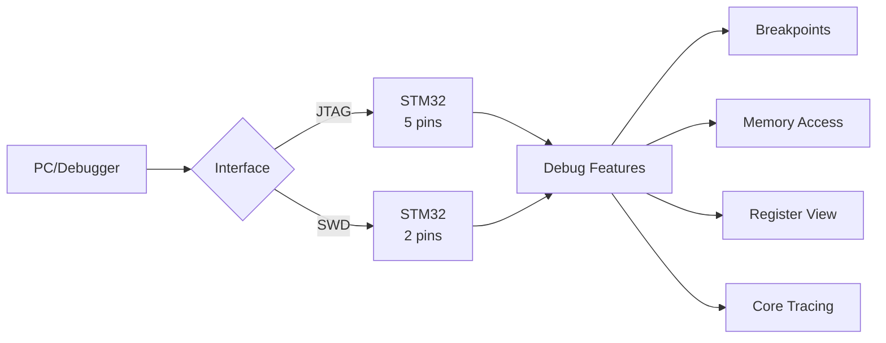
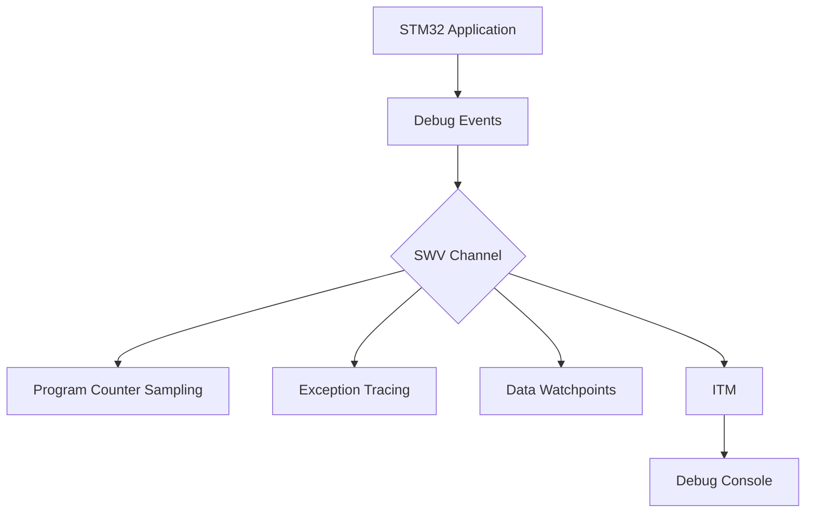
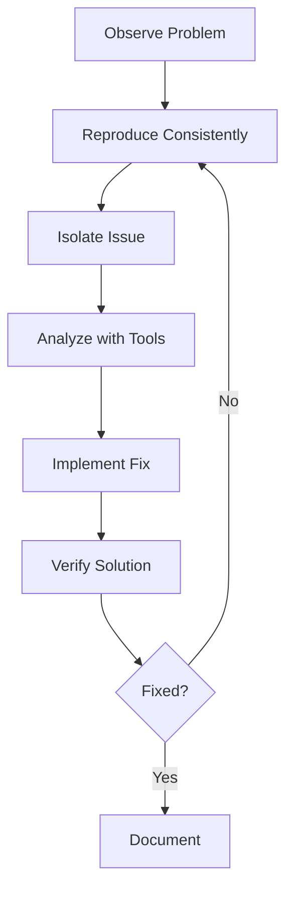

# STM32 Debugging Techniques

## Introduction

Debugging is an essential skill for any embedded systems developer. When working with STM32 microcontrollers, having a solid understanding of debugging techniques can save you countless hours of frustration and help you build more reliable applications. Unlike debugging in desktop environments, embedded systems debugging presents unique challenges due to limited resources, real-time constraints, and hardware-software interactions.

In this guide, we'll explore various debugging techniques specifically tailored for STM32 microcontrollers. From basic LED debugging to sophisticated trace capabilities, you'll learn how to identify and resolve issues in your STM32 projects effectively.

## Prerequisites

Before diving into debugging techniques, make sure you have:

- Basic understanding of C programming
- STM32 development board (any F0, F1, F4, etc.)
- ST-Link debugger (built into most development boards)
- IDE with debugging capabilities (STM32CubeIDE, Keil MDK, IAR EWARM, etc.)

## Understanding Debug Interfaces

STM32 microcontrollers support several debugging interfaces:

### JTAG (Joint Test Action Group)

JTAG is a standard hardware interface that provides access to the debug features of the microcontroller.

- Uses 5 pins: TCK, TMS, TDI, TDO, and TRST
- Full-featured debugging capabilities
- Supports multi-processor debugging

### SWD (Serial Wire Debug)

SWD is a 2-pin alternative to JTAG that maintains most of its functionality.

- Uses only 2 pins: SWDIO and SWCLK
- Frees up pins for other uses
- Widely used in space-constrained applications



## Basic Debugging Techniques

### 1. LED Debugging

The simplest form of debugging involves using LEDs to indicate program state.

```c
// Example of LED debugging
void checkSensorValue(uint16_t sensorValue) {
    if (sensorValue > THRESHOLD) {
        HAL_GPIO_WritePin(LED_GREEN_GPIO_Port, LED_GREEN_Pin, GPIO_PIN_SET); // Threshold exceeded
    } else {
        HAL_GPIO_WritePin(LED_RED_GPIO_Port, LED_RED_Pin, GPIO_PIN_SET); // Below threshold
    }
}
```

**Pros:**
- No special tools required
- Works even when communication interfaces fail
- Simple to implement

**Cons:**
- Limited information can be conveyed
- Takes up GPIO pins
- Can impact timing in time-critical applications

### 2. UART/Serial Debugging

Using UART to send debug information to a computer terminal is a powerful technique.

```c
// Example of UART debugging
void debugTask(void) {
    static uint32_t lastTime = 0;
    uint32_t currentTime = HAL_GetTick();
    
    // Print debug info every second
    if (currentTime - lastTime >= 1000) {
        printf("System uptime: %lu ms\r
", currentTime);
        printf("Temperature: %.2f C\r
", readTemperature());
        printf("Memory usage: %lu bytes\r
", getHeapUsage());
        
        lastTime = currentTime;
    }
}
```

**Setting up UART printf:**

```c
// Redirect printf to UART
int _write(int file, char *ptr, int len) {
    HAL_UART_Transmit(&huart2, (uint8_t*)ptr, len, HAL_MAX_DELAY);
    return len;
}
```

**Pros:**
- Rich information can be displayed
- Minimal hardware requirements
- Can be viewed in real-time

**Cons:**
- Affects timing of the application
- Requires UART peripheral and pins
- Limited use during hard faults or boot issues

## Intermediate Debugging Techniques

### 1. Using Breakpoints

Breakpoints allow you to pause program execution at specific points to examine the system state.

Types of breakpoints in STM32:

1. **Hardware Breakpoints** - Limited in number (typically 6-8) but don't affect program execution until triggered
2. **Software Breakpoints** - Unlimited but modify the code in flash memory

```c
void processData(uint8_t* data, uint16_t length) {
    uint32_t checksum = 0;
    
    // Calculate checksum - you might set a breakpoint here
    for(uint16_t i = 0; i < length; i++) {
        checksum += data[i];
    }
    
    // Another potential breakpoint location
    if(checksum != expectedChecksum) {
        handleChecksumError();
    }
}
```

**Tips for effective breakpoint usage:**
- Set conditional breakpoints for specific conditions
- Use watchpoints to break when a variable changes
- Remember that breakpoints disrupt real-time behavior

### 2. Memory and Register Inspection

STM32 debugging tools allow you to inspect:

- Memory contents (RAM, Flash, etc.)
- CPU registers (general purpose and special registers)
- Peripheral registers

This can be particularly useful for:
- Checking if a peripheral is properly configured
- Verifying data integrity
- Examining stack contents during exceptions

```c
// Example of code that you might want to inspect memory for
void initializeDMA(void) {
    // Configure DMA for ADC readings
    hdma_adc.Instance = DMA1_Channel1;
    hdma_adc.Init.Direction = DMA_PERIPH_TO_MEMORY;
    hdma_adc.Init.PeriphInc = DMA_PINC_DISABLE;
    hdma_adc.Init.MemInc = DMA_MINC_ENABLE;
    hdma_adc.Init.PeriphDataAlignment = DMA_PDATAALIGN_HALFWORD;
    hdma_adc.Init.MemDataAlignment = DMA_MDATAALIGN_HALFWORD;
    hdma_adc.Init.Mode = DMA_CIRCULAR;
    hdma_adc.Init.Priority = DMA_PRIORITY_HIGH;
    
    if (HAL_DMA_Init(&hdma_adc) != HAL_OK) {
        Error_Handler();
    }
}
```

## Advanced Debugging Techniques

### 1. Semihosting

Semihosting allows your STM32 application to use I/O facilities on the host computer through the debug interface.

```c
// Enable semihosting in your project
extern void initialise_monitor_handles(void);

int main(void) {
    // Initialize semihosting
    initialise_monitor_handles();
    
    printf("Hello from STM32 via semihosting!
");
    
    // Your application code
    while (1) {
        // ...
    }
}
```

**Note:** Semihosting significantly slows down execution, so it's best used for non-time-critical debugging.

### 2. Real-Time Trace

Some STM32 microcontrollers (particularly higher-end models) support real-time tracing through:

- **ETM (Embedded Trace Macrocell)** - Provides instruction trace
- **MTB (Micro Trace Buffer)** - Uses internal RAM for trace storage
- **ITM (Instrumentation Trace Macrocell)** - Allows printf-style debugging with minimal intrusion

```c
// Example of ITM trace usage
void ITM_PrintChar(uint8_t ch) {
    // Check if ITM and corresponding stimulus port are enabled
    if ((ITM->TCR & ITM_TCR_ITMENA_Msk) && (ITM->TER & (1UL << 0))) {
        // Wait until the port is available
        while (ITM->PORT[0].u32 == 0);
        // Send character
        ITM->PORT[0].u8 = ch;
    }
}

void ITM_Print(const char* str) {
    while (*str) {
        ITM_PrintChar(*str++);
    }
}
```

### 3. SWV (Serial Wire Viewer)

SWV allows real-time access to:
- Program counter sampling
- Data tracing
- Event and exception tracing
- ITM printf-style debugging



## Debugging Common Issues

### 1. Hard Fault Handling

Hard faults are common in STM32 development. Here's how to debug them:

```c
// Hard fault handler with debug capabilities
void HardFault_Handler(void) {
    // Get fault status registers
    volatile uint32_t stacked_r0;
    volatile uint32_t stacked_r1;
    volatile uint32_t stacked_r2;
    volatile uint32_t stacked_r3;
    volatile uint32_t stacked_r12;
    volatile uint32_t stacked_lr;
    volatile uint32_t stacked_pc;
    volatile uint32_t stacked_psr;
    volatile uint32_t _CFSR;
    volatile uint32_t _HFSR;
    volatile uint32_t _DFSR;
    volatile uint32_t _AFSR;
    volatile uint32_t _BFAR;
    volatile uint32_t _MMAR;
    
    _CFSR = SCB->CFSR;   // Configurable Fault Status Register
    _HFSR = SCB->HFSR;   // HardFault Status Register
    _DFSR = SCB->DFSR;   // Debug Fault Status Register
    _AFSR = SCB->AFSR;   // Auxiliary Fault Status Register
    _BFAR = SCB->BFAR;   // BusFault Address Register
    _MMAR = SCB->MMFAR;  // MemManage Fault Address Register
    
    // Read registers from stack
    asm volatile(
        "TST LR, #4
"         // Test bit 2 of EXC_RETURN
        "ITE EQ
"             // If-Then-Else (EQ condition)
        "MRSEQ R0, MSP
"      // If EQ (bit 2 is 0), MSP was used
        "MRSNE R0, PSP
"      // If NE (bit 2 is 1), PSP was used
        "MOV %0, R0
"         // Store stack pointer in R0
        : "=r" (stacked_r0)    // Output operand
        :                      // No input operands
        : "r0"                 // Clobbered registers
    );
    
    stacked_r0 = ((uint32_t *)stacked_r0)[0];
    stacked_r1 = ((uint32_t *)stacked_r0)[1];
    stacked_r2 = ((uint32_t *)stacked_r0)[2];
    stacked_r3 = ((uint32_t *)stacked_r0)[3];
    stacked_r12 = ((uint32_t *)stacked_r0)[4];
    stacked_lr = ((uint32_t *)stacked_r0)[5];
    stacked_pc = ((uint32_t *)stacked_r0)[6];
    stacked_psr = ((uint32_t *)stacked_r0)[7];
    
    // You can set a breakpoint here to examine the fault
    // In a debugger, examine these variables to determine
    // the cause of the fault
    
    for(;;); // Halt system
}
```

**Common causes of hard faults:**
- Null pointer dereferencing
- Stack overflow
- Unaligned memory access
- Invalid instruction execution

### 2. Memory Usage Analysis

STM32CubeIDE and other tools provide memory usage analysis to help you avoid issues:

- Stack usage reporting
- Heap allocation tracking
- Flash and RAM utilization

```c
// Example of checking stack usage dynamically
#define STACK_CHECK_PATTERN 0xDEADBEEF

void initStackCheck(uint32_t* stackStart, uint32_t stackSize) {
    for (uint32_t i = 0; i < stackSize/4; i++) {
        stackStart[i] = STACK_CHECK_PATTERN;
    }
}

uint32_t getStackUsage(uint32_t* stackStart, uint32_t stackSize) {
    uint32_t i;
    for (i = 0; i < stackSize/4; i++) {
        if (stackStart[i] != STACK_CHECK_PATTERN) {
            break;
        }
    }
    return (stackSize - (i * 4));
}
```

## Debug Workflow Best Practices

Follow these steps for efficient debugging:

1. **Define the problem** - Describe exactly what isn't working
2. **Reproduce consistently** - Find a reliable way to trigger the issue
3. **Isolate the issue** - Narrow down where the problem occurs
4. **Analyze with tools** - Use appropriate debug techniques based on the issue
5. **Verify the fix** - Ensure your solution works in all scenarios



## Debugging Exercise

**Exercise:** Find the bug in the following code snippet:

```c
// This function should calculate the average of an array of sensor readings
// but it contains a bug
float calculateAverage(uint16_t* readings, uint8_t size) {
    uint32_t sum = 0;
    
    for(uint8_t i = 0; i <= size; i++) {
        sum += readings[i];
    }
    
    return (float)sum / size;
}
```

<details>
<summary>Solution</summary>

The bug is in the loop condition. It should be `i < size` instead of `i <= size`. 
The current implementation reads one element beyond the array bounds, which could 
cause a memory access violation or incorrect results.

Corrected code:
```c
float calculateAverage(uint16_t* readings, uint8_t size) {
    uint32_t sum = 0;
    
    for(uint8_t i = 0; i < size; i++) {
        sum += readings[i];
    }
    
    return (float)sum / size;
}
```
</details>

## Summary

Effective debugging is crucial for STM32 development. In this guide, we've covered:

- Basic techniques like LED and UART debugging
- Using breakpoints and memory inspection
- Advanced methods including semihosting and trace
- Hard fault debugging and memory analysis
- A systematic approach to troubleshooting

By mastering these techniques, you'll be able to diagnose and fix issues in your STM32 projects efficiently, saving development time and building more robust applications.

## Additional Resources

- [ST-Link Utility Documentation](https://www.st.com/en/development-tools/st-link-v2.html)
- STM32CubeIDE Debugging Guide
- ARM CoreSight Debug Architecture Overview
- [Cortex-M3/M4 Fault Exceptions](https://developer.arm.com/documentation/dui0552/a/cortex-m3-peripherals/system-control-block/configurable-fault-status-register)

## Next Steps

- Learn about unit testing for STM32 applications
- Explore continuous integration for embedded projects
- Study advanced trace techniques with external debug probes