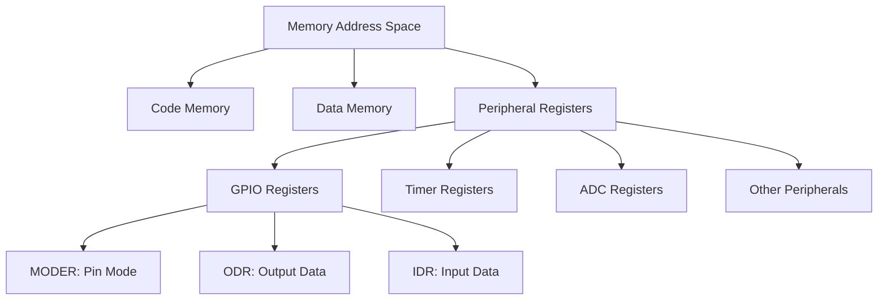

# STM32 Programming Model

## Introduction

The STM32 family of microcontrollers, based on the ARM Cortex-M processor core, has become a cornerstone in embedded systems development. Understanding its programming model is essential for effective firmware development. This guide will walk you through the fundamental concepts of how STM32 devices are programmed, from register-level operations to higher-level abstractions.

## Core Concepts

### Memory-Mapped Peripherals

At the heart of the STM32 programming model is the concept of **memory-mapped peripherals**. Unlike traditional computer systems where hardware is accessed through dedicated I/O instructions, in STM32:

- All peripherals (GPIO, timers, ADCs, etc.) are accessed through memory addresses
- Reading/writing to specific memory locations directly controls hardware
- Each peripheral has a set of registers mapped to specific memory addresses

This approach provides a unified programming interface where both memory and peripherals are accessed using the same instructions.

### Register Access Model

STM32 peripherals are controlled through registers - special memory locations where each bit or group of bits has a specific meaning and function.

For example, to configure and use a GPIO pin, you would:

1. Set bits in configuration registers to define the pin's mode
2. Set bits in output registers to drive the pin high or low
3. Read from input registers to get the pin's current state

Let's visualize the memory map concept:



## Programming Layers

The STM32 can be programmed at different abstraction levels:

### 1. Direct Register Access

The most basic approach involves manipulating register bits directly. This provides maximum control and efficiency but requires deep hardware knowledge.

```c
// Enable GPIOA clock in RCC peripheral
RCC->AHB1ENR |= RCC_AHB1ENR_GPIOAEN;

// Configure PA5 as output
GPIOA->MODER &= ~(0x3 << (5 * 2)); // Clear bits
GPIOA->MODER |= (0x1 << (5 * 2));  // Set as output

// Set PA5 high
GPIOA->ODR |= (1 << 5);

// Clear PA5 (set low)
GPIOA->ODR &= ~(1 << 5);
```

### 2. Standard Peripheral Library (SPL)

STMicroelectronics' first higher-level abstraction provides function-based access to peripherals. While now considered legacy, it's important to understand as many existing projects use it.

```c
// Initialize GPIO structures
GPIO_InitTypeDef GPIO_InitStruct;

// Enable clock for GPIOA
RCC_AHB1PeriphClockCmd(RCC_AHB1Periph_GPIOA, ENABLE);

// Configure PA5 as output
GPIO_InitStruct.GPIO_Pin = GPIO_Pin_5;
GPIO_InitStruct.GPIO_Mode = GPIO_Mode_OUT;
GPIO_InitStruct.GPIO_Speed = GPIO_Speed_50MHz;
GPIO_InitStruct.GPIO_OType = GPIO_OType_PP;
GPIO_InitStruct.GPIO_PuPd = GPIO_PuPd_NOPULL;
GPIO_Init(GPIOA, &GPIO_InitStruct);

// Set PA5 high
GPIO_SetBits(GPIOA, GPIO_Pin_5);

// Set PA5 low
GPIO_ResetBits(GPIOA, GPIO_Pin_5);
```

### 3. Hardware Abstraction Layer (HAL)

The modern recommended approach from ST, providing a more portable and consistent API across all STM32 families.

```c
// Initialize GPIO structures
GPIO_InitTypeDef GPIO_InitStruct = {0};

// Enable clock for GPIOA
__HAL_RCC_GPIOA_CLK_ENABLE();

// Configure PA5 as output
GPIO_InitStruct.Pin = GPIO_PIN_5;
GPIO_InitStruct.Mode = GPIO_MODE_OUTPUT_PP;
GPIO_InitStruct.Pull = GPIO_NOPULL;
GPIO_InitStruct.Speed = GPIO_SPEED_FREQ_MEDIUM;
HAL_GPIO_Init(GPIOA, &GPIO_InitStruct);

// Set PA5 high
HAL_GPIO_WritePin(GPIOA, GPIO_PIN_5, GPIO_PIN_SET);

// Set PA5 low
HAL_GPIO_WritePin(GPIOA, GPIO_PIN_5, GPIO_PIN_RESET);
```

### 4. Low-Layer (LL) APIs

A compromise between direct register access and HAL, offering better performance than HAL but more convenience than register manipulation.

```c
// Enable clock for GPIOA
LL_AHB1_GRP1_EnableClock(LL_AHB1_GRP1_PERIPH_GPIOA);

// Configure PA5 as output
LL_GPIO_SetPinMode(GPIOA, LL_GPIO_PIN_5, LL_GPIO_MODE_OUTPUT);
LL_GPIO_SetPinOutputType(GPIOA, LL_GPIO_PIN_5, LL_GPIO_OUTPUT_PUSHPULL);
LL_GPIO_SetPinSpeed(GPIOA, LL_GPIO_PIN_5, LL_GPIO_SPEED_FREQ_MEDIUM);
LL_GPIO_SetPinPull(GPIOA, LL_GPIO_PIN_5, LL_GPIO_PULL_NO);

// Set PA5 high
LL_GPIO_SetOutputPin(GPIOA, LL_GPIO_PIN_5);

// Set PA5 low
LL_GPIO_ResetOutputPin(GPIOA, LL_GPIO_PIN_5);
```

## Interrupt Model

STM32 microcontrollers feature a sophisticated interrupt system through the Nested Vectored Interrupt Controller (NVIC), part of the ARM Cortex-M core.

Key aspects of the STM32 interrupt model include:

1. **Vector Table**: Contains the addresses of interrupt handlers (functions)
2. **Priority Levels**: Each interrupt can be assigned a priority (importance)
3. **Nesting**: Higher priority interrupts can interrupt lower priority ones
4. **Fast Processing**: Interrupts are designed for quick response

Basic interrupt configuration examples:

```c
// Using HAL to configure EXTI interrupt for PA0
GPIO_InitTypeDef GPIO_InitStruct = {0};
GPIO_InitStruct.Pin = GPIO_PIN_0;
GPIO_InitStruct.Mode = GPIO_MODE_IT_RISING;  // Interrupt on rising edge
GPIO_InitStruct.Pull = GPIO_PULLDOWN;
HAL_GPIO_Init(GPIOA, &GPIO_InitStruct);

// Enable the interrupt in NVIC
HAL_NVIC_SetPriority(EXTI0_IRQn, 5, 0);
HAL_NVIC_EnableIRQ(EXTI0_IRQn);

// Interrupt handler function
void EXTI0_IRQHandler(void) {
  // Check if EXTI line interrupt was detected
  if(HAL_GPIO_EXTI_GetITStatus(GPIO_PIN_0) != RESET) {
    // Your code here
    
    // Clear the interrupt flag
    HAL_GPIO_EXTI_IRQHandler(GPIO_PIN_0);
  }
}
```

## DMA (Direct Memory Access)

The STM32 DMA controller allows data transfers between peripherals and memory without CPU intervention. This is crucial for high-performance applications.

Key benefits:
- Reduces CPU overhead
- Enables parallel operations
- Accelerates data transfers

```c
// Simple HAL example to setup DMA for ADC
static DMA_HandleTypeDef hdma_adc;
static ADC_HandleTypeDef hadc;
uint16_t adc_values[10]; // Buffer to store ADC values

// Configure DMA
hdma_adc.Instance = DMA2_Stream0;
hdma_adc.Init.Channel = DMA_CHANNEL_0;
hdma_adc.Init.Direction = DMA_PERIPH_TO_MEMORY;
hdma_adc.Init.PeriphInc = DMA_PINC_DISABLE;
hdma_adc.Init.MemInc = DMA_MINC_ENABLE;
hdma_adc.Init.PeriphDataAlignment = DMA_PDATAALIGN_HALFWORD;
hdma_adc.Init.MemDataAlignment = DMA_MDATAALIGN_HALFWORD;
hdma_adc.Init.Mode = DMA_CIRCULAR;
hdma_adc.Init.Priority = DMA_PRIORITY_HIGH;
HAL_DMA_Init(&hdma_adc);

// Link DMA to ADC
__HAL_LINKDMA(&hadc, DMA_Handle, hdma_adc);

// Configure ADC to use DMA
hadc.Instance = ADC1;
// ... (other ADC configuration)
hadc.Init.DMAContinuousRequests = ENABLE;
HAL_ADC_Init(&hadc);

// Start ADC with DMA
HAL_ADC_Start_DMA(&hadc, (uint32_t*)adc_values, 10);
```

## Real-World Application Example

Let's tie everything together with a practical example: a simple LED blinking program using different timer-based methods.

### Using Polling (Delay-Based)

```c
int main(void) {
  // Initialize system
  HAL_Init();
  
  // Configure clock
  SystemClock_Config();

  // Enable GPIO clock
  __HAL_RCC_GPIOA_CLK_ENABLE();
  
  // Configure LED pin
  GPIO_InitTypeDef GPIO_InitStruct = {0};
  GPIO_InitStruct.Pin = GPIO_PIN_5;  // LED on PA5 (on many STM32 boards)
  GPIO_InitStruct.Mode = GPIO_MODE_OUTPUT_PP;
  GPIO_InitStruct.Pull = GPIO_NOPULL;
  GPIO_InitStruct.Speed = GPIO_SPEED_FREQ_LOW;
  HAL_GPIO_Init(GPIOA, &GPIO_InitStruct);
  
  while (1) {
    // Toggle LED
    HAL_GPIO_TogglePin(GPIOA, GPIO_PIN_5);
    
    // Wait
    HAL_Delay(500);  // 500ms delay
  }
}
```

### Using Timer Interrupts

```c
TIM_HandleTypeDef htim2;

void SystemClock_Config(void);
static void MX_TIM2_Init(void);

int main(void) {
  // Initialize system
  HAL_Init();
  
  // Configure clock
  SystemClock_Config();
  
  // Enable GPIO clock
  __HAL_RCC_GPIOA_CLK_ENABLE();
  
  // Configure LED pin
  GPIO_InitTypeDef GPIO_InitStruct = {0};
  GPIO_InitStruct.Pin = GPIO_PIN_5;
  GPIO_InitStruct.Mode = GPIO_MODE_OUTPUT_PP;
  GPIO_InitStruct.Pull = GPIO_NOPULL;
  GPIO_InitStruct.Speed = GPIO_SPEED_FREQ_LOW;
  HAL_GPIO_Init(GPIOA, &GPIO_InitStruct);
  
  // Initialize timer
  MX_TIM2_Init();
  
  // Start timer with interrupts
  HAL_TIM_Base_Start_IT(&htim2);
  
  while (1) {
    // Main loop - CPU can do other work here
  }
}

// Timer initialization function
static void MX_TIM2_Init(void) {
  TIM_ClockConfigTypeDef sClockSourceConfig = {0};
  
  // Configure timer base
  htim2.Instance = TIM2;
  htim2.Init.Prescaler = 8399;  // For a 84MHz clock, gives 10kHz timer clock
  htim2.Init.CounterMode = TIM_COUNTERMODE_UP;
  htim2.Init.Period = 4999;     // 5000 counts at 10kHz = 500ms period
  HAL_TIM_Base_Init(&htim2);
  
  // Configure clock source
  sClockSourceConfig.ClockSource = TIM_CLOCKSOURCE_INTERNAL;
  HAL_TIM_ConfigClockSource(&htim2, &sClockSourceConfig);
  
  // Enable timer interrupt
  HAL_NVIC_SetPriority(TIM2_IRQn, 0, 0);
  HAL_NVIC_EnableIRQ(TIM2_IRQn);
}

// Timer interrupt handler
void TIM2_IRQHandler(void) {
  HAL_TIM_IRQHandler(&htim2);
}

// Timer interrupt callback
void HAL_TIM_PeriodElapsedCallback(TIM_HandleTypeDef *htim) {
  if (htim->Instance == TIM2) {
    HAL_GPIO_TogglePin(GPIOA, GPIO_PIN_5);
  }
}
```

## Programming Workflow

The typical STM32 development workflow involves:


1. **Project Setup**: Using an IDE like STM32CubeIDE, Keil, or IDEs with platform.io
2. **Peripheral Configuration**: Often using graphical tools like STM32CubeMX
3. **Writing Code**: Implementing the application logic
4. **Building**: Compiling and linking the program
5. **Flashing**: Programming the microcontroller
6. **Debugging**: Testing and troubleshooting

## Summary

The STM32 programming model is built around:

- Memory-mapped peripherals for hardware access
- Multiple abstraction layers (Register, LL, SPL, HAL)
- Interrupt-driven architecture for responsive applications
- DMA capabilities for efficient data movement

Understanding these fundamental concepts will provide you with a solid foundation for developing applications on STM32 microcontrollers. The model combines flexibility, efficiency, and ease of use, making it suitable for a wide range of embedded applications from simple to complex.

## Additional Resources

- Practice implementing a UART communication protocol
- Try combining timers, interrupts, and DMA for a data acquisition project
- Experiment with different GPIO modes (input, output, analog)
- Design a simple state machine using timer interrupts

As you become more comfortable with these concepts, you'll be able to leverage the full power of the STM32 microcontroller family for your embedded projects.