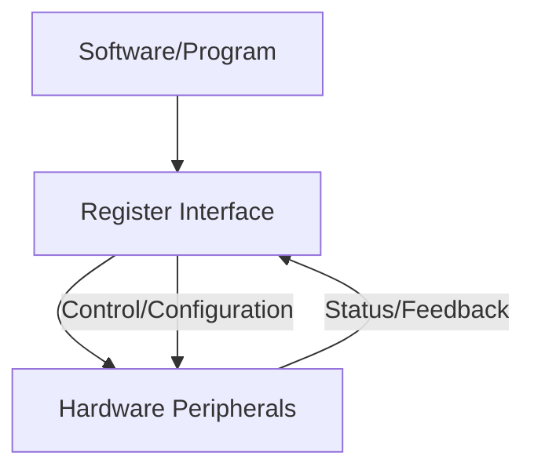

# STM32 Registers Overview

## Introduction

When programming STM32 microcontrollers at a low level, you'll need to understand how to work with registers. Registers are special memory locations within the microcontroller that control its behavior and functionality. Unlike regular memory used for storing program data, registers directly interface with the hardware components of the microcontroller.

This guide will walk you through the fundamentals of STM32 registers, how to access and modify them, and provide practical examples to help you master register-level programming.

## What Are Registers?

Registers are specialized memory locations that serve as the primary interface between software and hardware. Each register has a specific purpose and controls particular aspects of the microcontroller's functionality.

In STM32 microcontrollers, registers are typically 32 bits wide (hence the "32" in STM32) and are organized into functional groups associated with different peripherals like GPIO, UART, SPI, timers, and so on.



## Types of Registers in STM32

STM32 microcontrollers feature several types of registers:

1. **Control Registers** - Configure and control peripheral behavior
2. **Status Registers** - Provide information about peripheral states
3. **Data Registers** - Store actual data being processed
4. **Configuration Registers** - Set up peripheral operating modes

Let's look at each type in more detail.

### Control Registers

Control registers allow you to enable, disable, or trigger operations in the microcontroller. For example, the `CR` (Control Register) of a peripheral might contain bits to enable the peripheral, start a conversion, or reset the peripheral.

### Status Registers

Status registers provide feedback about the current state of the peripheral. For example, the `SR` (Status Register) might indicate if a conversion is complete, if an error occurred, or if a buffer is empty or full.

### Data Registers

Data registers hold the actual information being processed. For example, the `DR` (Data Register) of a UART peripheral contains the data to be transmitted or the data that has been received.

### Configuration Registers

Configuration registers set up the operating parameters of a peripheral. For instance, the `CR1` and `CR2` (Configuration Registers) of a UART might set the baud rate, data size, and parity mode.

## Register Memory Map

STM32 microcontrollers organize registers within a memory map. Each peripheral has a base address, and each register within that peripheral has an offset from that base address.

For example, the GPIOA peripheral might start at address `0x40020000`, and its various registers would be at specific offsets from this base address:

| Register | Offset | Address      | Purpose                      |
|----------|--------|--------------|------------------------------|
| MODER    | 0x00   | 0x40020000   | GPIO port mode register      |
| OTYPER   | 0x04   | 0x40020004   | GPIO port output type        |
| OSPEEDR  | 0x08   | 0x40020008   | GPIO port output speed       |
| PUPDR    | 0x0C   | 0x4002000C   | GPIO pull-up/pull-down       |
| IDR      | 0x10   | 0x40020010   | GPIO port input data         |
| ODR      | 0x14   | 0x40020014   | GPIO port output data        |

## Accessing Registers

There are two main ways to access registers in STM32 microcontrollers:

1. Direct register access using memory addresses
2. Using the STM32 Hardware Abstraction Layer (HAL) or Standard Peripheral Library (SPL)

Let's explore both methods.

### Direct Register Access

In direct register access, you interact with the registers by directly reading from or writing to their memory addresses. This method provides maximum control and efficiency but requires a deeper understanding of the hardware.

Here's how you can define register addresses in C:

```c
// Define the base address for GPIOA
#define GPIOA_BASE      0x40020000

// Define register offsets
#define GPIO_MODER      0x00
#define GPIO_OTYPER     0x04
#define GPIO_ODR        0x14
#define GPIO_IDR        0x10

// Create pointers to the registers
volatile uint32_t* GPIOA_MODER = (volatile uint32_t*)(GPIOA_BASE + GPIO_MODER);
volatile uint32_t* GPIOA_ODR = (volatile uint32_t*)(GPIOA_BASE + GPIO_ODR);
```

Then, you can read from or write to these registers:

```c
// Set Pin 5 as output (bits 10-11 = 01)
*GPIOA_MODER &= ~(0x3 << (5 * 2));    // Clear bits
*GPIOA_MODER |= (0x1 << (5 * 2));     // Set to output mode

// Toggle Pin 5
*GPIOA_ODR ^= (1 << 5);               // XOR with bit 5
```

### Using STM32 Libraries

STM32's libraries (HAL or SPL) provide a more abstracted way to interact with registers. These libraries handle the register operations behind friendly function calls, making your code more readable and portable.

Here's the same operation using the HAL library:

```c
// Initialize GPIO
GPIO_InitTypeDef GPIO_InitStruct = {0};
GPIO_InitStruct.Pin = GPIO_PIN_5;
GPIO_InitStruct.Mode = GPIO_MODE_OUTPUT_PP;
GPIO_InitStruct.Pull = GPIO_NOPULL;
GPIO_InitStruct.Speed = GPIO_SPEED_FREQ_LOW;
HAL_GPIO_Init(GPIOA, &GPIO_InitStruct);

// Toggle Pin 5
HAL_GPIO_TogglePin(GPIOA, GPIO_PIN_5);
```

## Bit Operations on Registers

Working with registers often involves manipulating individual bits. Here are the common bit operations:

1. **Setting bits** - Turn specific bits ON
2. **Clearing bits** - Turn specific bits OFF
3. **Toggling bits** - Invert the state of bits
4. **Reading bits** - Check the state of bits

Let's look at how to perform these operations:

### Setting Bits

To set specific bits in a register (change them to 1), use the OR operator (`|`):

```c
// Set bit 3 in the register
*register |= (1 << 3);

// Set multiple bits (3 and 5)
*register |= ((1 << 3) | (1 << 5));
```

### Clearing Bits

To clear specific bits in a register (change them to 0), use the AND operator (`&`) with the complement of the bit pattern:

```c
// Clear bit 3 in the register
*register &= ~(1 << 3);

// Clear multiple bits (3 and 5)
*register &= ~((1 << 3) | (1 << 5));
```

### Toggling Bits

To toggle specific bits in a register (change 0 to 1 and 1 to 0), use the XOR operator (`^`):

```c
// Toggle bit 3 in the register
*register ^= (1 << 3);

// Toggle multiple bits (3 and 5)
*register ^= ((1 << 3) | (1 << 5));
```

### Reading Bits

To read the state of specific bits in a register, use the AND operator and then check if the result is non-zero:

```c
// Check if bit 3 is set
if (*register & (1 << 3)) {
    // Bit 3 is set (1)
} else {
    // Bit 3 is clear (0)
}

// Reading a specific bit field (bits 4-6)
uint32_t bitField = (*register >> 4) & 0x7;  // 0x7 = 0b111 (3 bits mask)
```

## Practical Example: Blinking an LED using Register Access

Let's put our knowledge into practice with a classic example: blinking an LED on an STM32 board. We'll implement this using direct register access.

For most STM32 boards, there's an LED connected to a GPIO pin. On many development boards like the STM32F4 Discovery, this is connected to PIN5 of GPIOA.

```c
#include <stdint.h>

// Clock control register (enable GPIO clock)
#define RCC_BASE        0x40023800
#define RCC_AHB1ENR     0x30
#define GPIOAEN         (1 << 0)  // GPIOA clock enable bit

// GPIOA registers
#define GPIOA_BASE      0x40020000
#define GPIO_MODER      0x00
#define GPIO_ODR        0x14

// Create pointers to the registers
volatile uint32_t* RCC_AHB1ENR_REG = (volatile uint32_t*)(RCC_BASE + RCC_AHB1ENR);
volatile uint32_t* GPIOA_MODER_REG = (volatile uint32_t*)(GPIOA_BASE + GPIO_MODER);
volatile uint32_t* GPIOA_ODR_REG = (volatile uint32_t*)(GPIOA_BASE + GPIO_ODR);

// Simple delay function
void delay(uint32_t count) {
    for (uint32_t i = 0; i < count; i++) {
        __asm("NOP");  // No operation (prevents optimization)
    }
}

int main(void) {
    // 1. Enable clock for GPIOA
    *RCC_AHB1ENR_REG |= GPIOAEN;
    
    // 2. Configure PA5 as output
    // MODER5[1:0] = 01 (bits 10-11) for output mode
    *GPIOA_MODER_REG &= ~(0x3 << (5 * 2));  // Clear bits
    *GPIOA_MODER_REG |= (0x1 << (5 * 2));   // Set to output mode
    
    // Main loop to blink the LED
    while (1) {
        // Toggle PA5 (LED)
        *GPIOA_ODR_REG ^= (1 << 5);
        
        // Delay
        delay(500000);
    }
    
    return 0;
}
```

Let's break down this example:

1. We define the base addresses and offsets for the RCC (Reset and Clock Control) and GPIOA registers.
2. We enable the clock for GPIOA by setting bit 0 in the RCC_AHB1ENR register.
3. We configure PA5 (Pin 5 of Port A) as an output by setting its corresponding bits in the MODER register.
4. In the main loop, we toggle the state of PA5 using the XOR operation on the ODR register.
5. We add a delay to make the blinking visible to the human eye.

## Common Register-Related Pitfalls

When working with registers, be aware of these common issues:

1. **Forgetting the `volatile` keyword** - Without this keyword, the compiler might optimize away your register operations.

2. **Read-Modify-Write issues** - If another part of the code or an interrupt changes a register between your read and write operations, you might overwrite those changes.

3. **Bit-band access** - Some registers support bit-band access, which allows atomic operations on individual bits. Using this feature correctly can prevent Read-Modify-Write issues.

4. **Reserved bits** - Some bits in registers are marked as "reserved." Always maintain these bits at their default values to avoid unpredictable behavior.

## STM32 Register Documentation

To work effectively with STM32 registers, you need accurate documentation. ST Microelectronics provides detailed documentation for each STM32 microcontroller family:

1. **Reference Manual** - Contains detailed descriptions of all peripherals and their registers.
2. **Datasheet** - Provides a high-level overview and electrical specifications.
3. **Programming Manual** - Describes the CPU core and its features.

Always refer to the specific documentation for your STM32 model, as register addresses and functionality can vary between different families.

## Advanced Techniques

### Using Register Structures

Instead of defining individual pointers to registers, you can define a structure that mimics the register layout of a peripheral:

```c
typedef struct {
    volatile uint32_t MODER;    // 0x00
    volatile uint32_t OTYPER;   // 0x04
    volatile uint32_t OSPEEDR;  // 0x08
    volatile uint32_t PUPDR;    // 0x0C
    volatile uint32_t IDR;      // 0x10
    volatile uint32_t ODR;      // 0x14
    volatile uint32_t BSRR;     // 0x18
    volatile uint32_t LCKR;     // 0x1C
    volatile uint32_t AFR[2];   // 0x20-0x24
} GPIO_TypeDef;

#define GPIOA ((GPIO_TypeDef*)0x40020000)

// Now you can access registers like this:
GPIOA->MODER |= (1 << 10);
```

This approach is closer to how the official STM32 libraries are organized.

### Atomic Bit Manipulation

For some peripherals, STM32 provides registers that allow atomic bit manipulation:

- **BSRR (Bit Set/Reset Register)** - Allows setting or resetting bits without reading the register first.
- **Bit-banding** - A feature in Cortex-M3/M4 that provides atomic access to individual bits.

Using the BSRR register to set/reset a bit:

```c
// Set PA5 (bit 5)
GPIOA->BSRR = (1 << 5);

// Reset PA5 (bit 5+16)
GPIOA->BSRR = (1 << (5 + 16));
```

## Summary

STM32 registers provide a direct interface to the hardware capabilities of the microcontroller. While using libraries like HAL provides simplicity and portability, understanding register-level programming gives you more control and efficiency.

Key takeaways:
- Registers are specialized memory locations that control microcontroller hardware
- Different types of registers serve different purposes (control, status, data, configuration)
- You can access registers directly or through libraries like HAL
- Bit manipulation is fundamental to register operations
- Proper documentation is essential for register-level programming

By mastering register operations, you'll have a deeper understanding of how the STM32 microcontroller works and be able to write more efficient and precise code for your embedded applications.

## Exercises

1. Write code to configure GPIOB Pin 7 as an input with a pull-up resistor using direct register access.
2. Create a function that configures a GPIO pin as an analog input using register access.
3. Write a program that reads the state of an input pin and mirrors it to an output pin using only register operations.
4. Implement a function that configures a GPIO pin for alternate function mode (for example, to use with UART).
5. Create a simple state machine that cycles through different LED patterns using direct register access.

## Additional Resources

- STM32 Family Reference Manuals
- ARM Cortex-M Programming Guide
- STM32 Peripheral Driver Examples
- Embedded Systems Programming Books