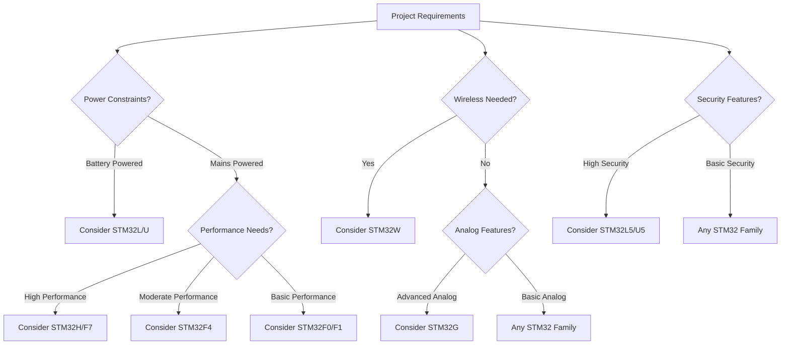

# STM32 Families

## Introduction

STM32 microcontrollers, developed by STMicroelectronics, have become one of the most popular choices for embedded systems developers worldwide. Based on ARM Cortex-M cores, these powerful and versatile microcontrollers are organized into distinct families, each tailored for specific application needs.

In this guide, we'll explore the various STM32 families, understand their unique characteristics, and learn how to select the right STM32 microcontroller for your embedded project.

## STM32 Naming Convention

Before diving into the different families, let's understand how STM32 microcontrollers are named:

```
STM32F407VGT6
│    │ │ │ │ │
│    │ │ │ │ └─ Package type (e.g., T = LQFP)
│    │ │ │ └─── Temperature range (6 = -40°C to 85°C)
│    │ │ └───── Memory size (G = 1024KB Flash)
│    │ └─────── Pin count (V = 100 pins)
│    └───────── Subfamily (4 = Performance line)
└────────────── Family (F = mainstream)
```

This naming convention helps identify various aspects of the microcontroller at a glance.

## Overview of STM32 Families

<div className="stm32-families-overview">

STM32 microcontrollers are grouped into several main families, each represented by a letter:

| Family | Core           | Focus Area                               | Typical Applications                                |
|--------|----------------|------------------------------------------|-----------------------------------------------------|
| F      | Cortex-M0/3/4/7| General purpose / Mainstream             | General embedded applications                        |
| G      | Cortex-M33     | Advanced analog                          | Precision measurement, signal processing             |
| H      | Cortex-M7      | High performance                         | Real-time processing, advanced graphics             |
| L      | Cortex-M0+/3/4 | Low power                               | Battery-operated devices, IoT sensors                |
| U      | Cortex-M0+/4/7 | Ultra-low power                         | Wearables, energy harvesting applications            |
| W      | Cortex-M0/4    | Wireless                                | Bluetooth, Wi-Fi enabled applications                |

</div>

Let's explore each family in detail.

## STM32F Family - The Foundation

The STM32F family is the original and most diverse STM32 family, offering a broad range of performance, memory, and peripheral options.

### Key Subfamilies:

#### STM32F0 (Entry-level)
- **Core**: ARM Cortex-M0
- **Clock Speed**: Up to 48 MHz
- **Features**: Basic peripherals, low cost
- **Ideal for**: Simple control applications, cost-sensitive projects

#### STM32F1 (Access line)
- **Core**: ARM Cortex-M3
- **Clock Speed**: Up to 72 MHz
- **Features**: Good balance of performance and cost
- **Ideal for**: General purpose applications

#### STM32F4 (High-performance)
- **Core**: ARM Cortex-M4 with FPU
- **Clock Speed**: Up to 180 MHz
- **Features**: DSP instructions, advanced peripherals
- **Ideal for**: Audio processing, motor control, complex algorithms

#### STM32F7 (Advanced)
- **Core**: ARM Cortex-M7
- **Clock Speed**: Up to 216 MHz
- **Features**: Advanced peripherals, high-speed interfaces
- **Ideal for**: Graphics applications, real-time processing

### Code Example - Blinking LED with STM32F4

Here's a simple example showing how to initialize and blink an LED on an STM32F4 microcontroller:

```c
#include "stm32f4xx_hal.h"

void SystemClock_Config(void);
static void MX_GPIO_Init(void);

int main(void)
{
  /* Reset of all peripherals, initialize the Flash interface and the Systick */
  HAL_Init();
  
  /* Configure the system clock */
  SystemClock_Config();
  
  /* Initialize GPIO */
  MX_GPIO_Init();
  
  /* Infinite loop */
  while (1)
  {
    /* Toggle LED */
    HAL_GPIO_TogglePin(GPIOA, GPIO_PIN_5);
    
    /* Delay 500ms */
    HAL_Delay(500);
  }
}

static void MX_GPIO_Init(void)
{
  GPIO_InitTypeDef GPIO_InitStruct = {0};
  
  /* GPIO Ports Clock Enable */
  __HAL_RCC_GPIOA_CLK_ENABLE();
  
  /* Configure GPIO pin : PA5 (LED) */
  GPIO_InitStruct.Pin = GPIO_PIN_5;
  GPIO_InitStruct.Mode = GPIO_MODE_OUTPUT_PP;
  GPIO_InitStruct.Pull = GPIO_NOPULL;
  GPIO_InitStruct.Speed = GPIO_SPEED_FREQ_LOW;
  HAL_GPIO_Init(GPIOA, &GPIO_InitStruct);
}
```

## STM32L Family - Low Power Champions

The STM32L family is optimized for energy-efficient applications, making it ideal for battery-powered devices.

### Key Features:
- Multiple low-power modes (Run, Sleep, Low-power run, Low-power sleep, Stop, Standby)
- Ultra-low-power peripherals
- Fast wake-up times
- Power consumption as low as 200 nA in standby mode

### Subfamilies:
- **STM32L0**: Ultra-low-power with Cortex-M0+
- **STM32L1**: Ultra-low-power with Cortex-M3
- **STM32L4/L4+**: Ultra-low-power with Cortex-M4 and higher performance
- **STM32L5**: Ultra-low-power with Cortex-M33 and TrustZone security

### Code Example - Low Power Mode with STM32L4

```c
#include "stm32l4xx_hal.h"

void EnterLowPowerMode(void)
{
  /* Configure the low power mode */
  HAL_PWREx_ControlVoltageScaling(PWR_REGULATOR_VOLTAGE_SCALE2);
  
  /* Enter Stop Mode */
  HAL_PWR_EnterSTOPMode(PWR_LOWPOWERREGULATOR_ON, PWR_STOPENTRY_WFI);
  
  /* After waking up, reconfigure the system clock */
  SystemClock_Config();
}
```

## STM32G Family - Analog Excellence

The STM32G family focuses on advanced analog capabilities while maintaining good computational performance.

### Key Features:
- High-resolution ADCs (up to 16-bit)
- Advanced analog peripherals
- Low-power design
- High processing efficiency

### Real-world Application: Precision Measurement System

```c
#include "stm32g4xx_hal.h"

#define ADC_RESOLUTION ADC_RESOLUTION_16B
#define VREF_INTERNAL  1.212f  // Internal reference voltage in volts

float ReadVoltage(void)
{
  uint32_t adcValue;
  float voltage;
  
  /* Start ADC conversion */
  HAL_ADC_Start(&hadc1);
  
  /* Wait for conversion to complete */
  HAL_ADC_PollForConversion(&hadc1, 100);
  
  /* Get ADC value */
  adcValue = HAL_ADC_GetValue(&hadc1);
  
  /* Convert to voltage */
  voltage = (float)adcValue * VREF_INTERNAL / 65535.0f;
  
  return voltage;
}
```

## STM32H Family - High Performance

The STM32H family is designed for applications requiring significant computational power, featuring the powerful Cortex-M7 core.

### Key Features:
- Dual-core architecture in some models (Cortex-M7 + Cortex-M4)
- Clock speeds up to 480 MHz
- Large memory (up to 2MB Flash, 1MB RAM)
- Advanced graphics acceleration
- Hardware encryption acceleration

### Application Domains:
- Motor control
- Industrial automation
- Medical equipment
- Smart home gateways

## STM32W Family - Wireless Connectivity

The STM32W family integrates wireless capabilities directly into the microcontroller, simplifying IoT designs.

### Key Features:
- Integrated wireless transceivers (Bluetooth LE, IEEE 802.15.4)
- Low power consumption
- Adequate processing power for IoT applications
- Security features for connected devices

### Wireless Variants:
- **STM32WB**: Bluetooth LE, Thread, Zigbee
- **STM32WL**: Long-range wireless (LoRa, Sigfox)

## Choosing the Right STM32 Family

Selecting the appropriate STM32 family depends on various factors:



### Factors to Consider:
1. **Processing requirements**: CPU speed, core type
2. **Memory requirements**: Flash and RAM size
3. **Peripheral needs**: Specific communication interfaces, ADCs, etc.
4. **Power consumption**: Battery life requirements
5. **Cost constraints**: Budget limitations
6. **Development ecosystem**: Available development boards and tools

## Development Tools and Resources

Each STM32 family is supported by STMicroelectronics' development ecosystem:

### Hardware Development Tools:
- **Discovery Boards**: Low-cost evaluation boards for specific families
- **Nucleo Boards**: Arduino-compatible development boards 
- **Evaluation Boards**: Full-featured boards showcasing all peripherals

### Software Development Tools:
- **STM32CubeIDE**: Eclipse-based IDE with integrated debugging
- **STM32CubeMX**: Graphical initialization code generator
- **STM32CubeMonitor**: Runtime variables monitoring tool
- **HAL Libraries**: Hardware Abstraction Layer for easier development

## Summary

STM32 microcontrollers are organized into several families, each with specific strengths and target applications:

- **STM32F**: The mainstream family with a wide range of options
- **STM32L**: Focused on low power consumption
- **STM32G**: Excellent analog capabilities
- **STM32H**: High-performance computing 
- **STM32W**: Integrated wireless capabilities

By understanding the different STM32 families and their characteristics, you can select the most appropriate microcontroller for your specific application needs, balancing performance, power consumption, and cost.

## Exercises

1. **Family Selection**: For each application below, identify the most suitable STM32 family:
   - Battery-powered temperature sensor transmitting data wirelessly
   - High-speed motor control with precise position feedback
   - Portable medical monitoring device requiring analog measurements
   - Industrial control panel with graphical user interface

2. **Part Number Decoding**: Decode the following STM32 part numbers and identify the family, series, and key features:
   - STM32F103RBT6
   - STM32L432KCU6
   - STM32H743ZIT6

3. **Feature Comparison**: Create a table comparing the key features of STM32F4, STM32L4, and STM32G4 subfamilies.

## Additional Resources

- [STMicroelectronics Product Selector](https://www.st.com/en/microcontrollers-microprocessors/stm32-32-bit-arm-cortex-mcus.html)
- [STM32 Online Training](https://www.st.com/content/st_com/en/support/learning/stm32-education.html)
- [STM32 Community](https://community.st.com/)
- Reference manuals for specific STM32 families (available on ST's website)