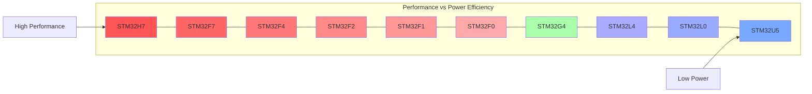

# STM32 Naming Convention

## Introduction

When first exploring the world of STM32 microcontrollers, you'll quickly notice that they have names like "STM32F103C8T6" or "STM32L476RGT6". These names might seem like random combinations of letters and numbers, but they actually follow a well-defined convention that encodes important information about the device's capabilities, features, and packaging.

Understanding this naming convention is essential when selecting the right microcontroller for your projects, as it helps you quickly identify important characteristics without having to read through lengthy datasheets.

## The STM32 Naming Structure

ST Microelectronics (the manufacturer) uses a systematic approach to name their microcontrollers. Let's break down a typical STM32 name:

```
STM32F103C8T6
│   ││││││││
│   │││││││└─ Package type
│   ││││││└── Temperature range
│   │││││└─── Pin count
│   ││││└──── Flash memory size
│   │││└───── Device variant
│   ││└────── Product line
│   │└─────── STM32 family
│   └──────── Core type (Cortex-M)
└────────────── Manufacturer (ST Microelectronics)
```

Let's explore each part in detail:

## Core Type and Family

### STM32

All STM32 microcontrollers start with "STM32", indicating they are 32-bit microcontrollers from ST Microelectronics based on the ARM Cortex-M core.

### Family (Letter)

The letter after "STM32" indicates the product family:

- **F**: General-purpose family (Foundation)
- **L**: Low-power family
- **H**: High-performance family
- **G**: General-purpose with advanced analog features
- **W**: Wireless (with built-in radio)
- **U**: Ultra-low-power family
- **C**: Connectivity line for advanced communication features

Each family has specific characteristics optimized for different applications:

| Family | Main Features | Typical Applications |
|--------|--------------|---------------------|
| F | Performance and cost balance | General embedded systems |
| L | Ultra-low-power | Battery-powered devices |
| H | High performance | Complex real-time systems |
| G | Analog performance | Mixed-signal applications |
| W | Wireless connectivity | IoT devices |
| U | Lowest power consumption | Wearables and sensors |
| C | Advanced communication | Network-connected devices |

## Product Line (Digits)

The digits that follow the family letter define the product line. For example:

- **STM32F1**: First-generation mainstream family
- **STM32F4**: High-performance line (Cortex-M4F)
- **STM32L4**: Ultra-low-power line with performance
- **STM32G4**: Mixed-signal performance line

The first digit typically indicates the product line generation, while the second digit provides more specific categorization within that generation.

## Device Variant (Letter)

This letter indicates specific variant features such as peripheral set, I/O count, etc:

- **x0x**: Access line (basic)
- **x1x**: Access/mainstream line
- **x2x**: USB line
- **x3x**: Mainstream performance line
- **x4x**: Performance line with DSP
- **x5x**: Advanced line with FPU/DSP
- **x7x**: Premium line with advanced features
- **x9x**: High performance/max features

## Flash Memory Size (Letter)

This letter indicates the amount of Flash memory:

- **B**: 128 KB
- **C**: 256 KB
- **D**: 384 KB
- **E**: 512 KB
- **F**: 768 KB
- **G**: 1 MB
- **H**: 1.5 MB
- **I**: 2 MB
- **8**: 64 KB
- **6**: 32 KB
- **4**: 16 KB
- **2**: 8 KB

## Pin Count (Letter)

This indicates the number of pins on the package:

- **T**: 36 pins
- **C**: 48 pins
- **R**: 64 pins
- **V**: 100 pins
- **Z**: 144 pins
- **I**: 176 pins
- **A**: 180 pins
- **B**: 208 pins
- **N**: 216 pins
- **F**: 20 pins
- **G**: 28 pins
- **H**: 40 pins

## Temperature Range and Package Type

The last characters indicate the temperature range and package type:

- **Temperature Range**:
  - **T**: -40°C to +85°C (Industrial)
  - **Y**: -40°C to +105°C (Extended)
  - **H**: -40°C to +125°C (High temperature)

- **Package Type**:
  - **H**: BGA
  - **T**: LQFP
  - **U**: VFQFPN
  - **Y**: WLCSP
  - **J**: UFBGA

## Practical Examples

Let's decode some common STM32 microcontrollers to understand their specifications:

### Example 1: STM32F103C8T6

This is one of the most popular STM32 microcontrollers, especially for beginners:

- **STM32**: 32-bit microcontroller from ST
- **F**: General-purpose family
- **1**: First-generation
- **0**: Access line
- **3**: Mainstream performance line
- **C**: Package with 48 pins
- **8**: 64 KB of Flash memory
- **T**: Industrial temperature range (-40°C to +85°C)
- **6**: LQFP package

### Example 2: STM32L476RGT6

- **STM32**: 32-bit microcontroller from ST
- **L**: Low-power family
- **4**: Fourth-generation
- **7**: Premium line
- **6**: Specific variant
- **R**: Package with 64 pins
- **G**: 1 MB of Flash memory
- **T**: Industrial temperature range (-40°C to +85°C)
- **6**: LQFP package

## Understanding Product Lines Visually

Let's use a diagram to show how the different STM32 families compare in terms of performance and power consumption:



## Selecting the Right STM32 Microcontroller

When choosing an STM32 microcontroller for your project, consider:

1. **Performance Requirements**: CPU speed, FPU, DSP capabilities
2. **Memory Needs**: Flash and RAM sizes
3. **Peripherals**: Required communication interfaces (UART, SPI, I2C, etc.)
4. **Power Constraints**: Battery-powered or not
5. **Physical Constraints**: Space available for your device

## Practical Application: Choosing an STM32 for Different Projects

Let's look at how you might select appropriate STM32 microcontrollers for different projects:

### Simple LED Controller
- Requirements: Low cost, small size, basic I/O
- Good choice: **STM32F030F4P6**
  - F0 family (basic, low-cost)
  - 16KB Flash (4)
  - 20-pin package (F)
  - Sufficient for basic I/O control

### Battery-Powered Sensor Node
- Requirements: Ultra-low power, sleep modes, ADC
- Good choice: **STM32L071KBT6**
  - L0 family (ultra-low power)
  - 128KB Flash (B)
  - Excellent sleep modes for battery conservation

### Audio Processing Device
- Requirements: DSP capabilities, higher performance, more memory
- Good choice: **STM32F407VGT6**
  - F4 family with FPU and DSP instructions
  - 1MB Flash (G)
  - 100-pin package (V) for many peripherals

## Code Example: Identifying Your STM32 Model

When working with STM32 microcontrollers, you can identify which chip you're using programmatically. Here's a code example showing how to read the device ID and flash size:

```c
#include "stm32f1xx_hal.h"
#include <stdio.h>

void printMCUInfo(void) {
    uint16_t deviceId = (DBGMCU->IDCODE) & DBGMCU_IDCODE_DEV_ID;
    uint16_t revId = (DBGMCU->IDCODE >> 16) & DBGMCU_IDCODE_REV_ID;
    
    printf("Device ID: 0x%04X
", deviceId);
    printf("Revision ID: 0x%04X
", revId);
    
    // Calculate flash size in KB
    uint16_t flashSize = *(__IO uint16_t *)(0x1FFFF7E0);
    printf("Flash size: %d KB
", flashSize);
    
    // Determine STM32 family from device ID
    printf("STM32 Family: ");
    switch(deviceId) {
        case 0x412: printf("STM32F1 Low/Medium density
"); break;
        case 0x410: printf("STM32F1 Medium density
"); break;
        case 0x414: printf("STM32F1 High density
"); break;
        case 0x430: printf("STM32F1 XL density
"); break;
        case 0x418: printf("STM32F1 Connectivity line
"); break;
        case 0x431: printf("STM32F4 device
"); break;
        // Add more families as needed
        default: printf("Unknown
"); break;
    }
}
```

Output example for an STM32F103C8T6:
```
Device ID: 0x0410
Revision ID: 0x1000
Flash size: 64 KB
STM32 Family: STM32F1 Medium density
```

## Summary

The STM32 naming convention may seem complex at first, but it provides a systematic way to understand the capabilities of each microcontroller at a glance. By decoding the model name, you can quickly determine:

- The processor family and its general characteristics
- The specific product line and variant
- The amount of Flash memory
- The pin count and package type
- The temperature range the device is rated for

This knowledge is invaluable when selecting the right microcontroller for your projects or when trying to understand the capabilities of a device you're working with.

## Additional Resources

To deepen your understanding of STM32 microcontrollers:

1. Explore the official ST Microelectronics product selector tool
2. Read the STM32 datasheets and reference manuals
3. Try working with different STM32 families to understand their practical differences
4. Join STM32 developer communities to learn from others' experiences

## Exercises

1. Decode the following STM32 model numbers and list their specifications:
   - STM32F401CCU6
   - STM32L152RET6
   - STM32G431CBU6

2. For a weather station project requiring low power consumption, multiple ADC channels, and wireless connectivity, which STM32 family would you recommend and why?

3. Research and compare the differences between STM32F103C8T6 and STM32F103CBT6. What's the main difference, and how might it affect your project selection?