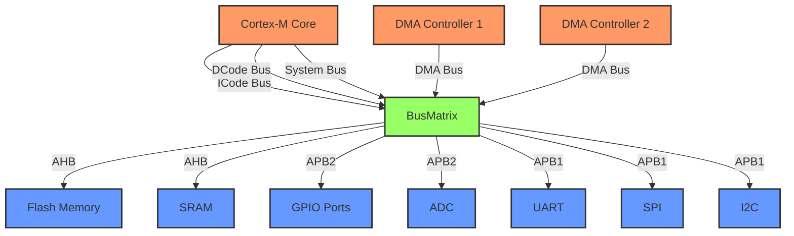
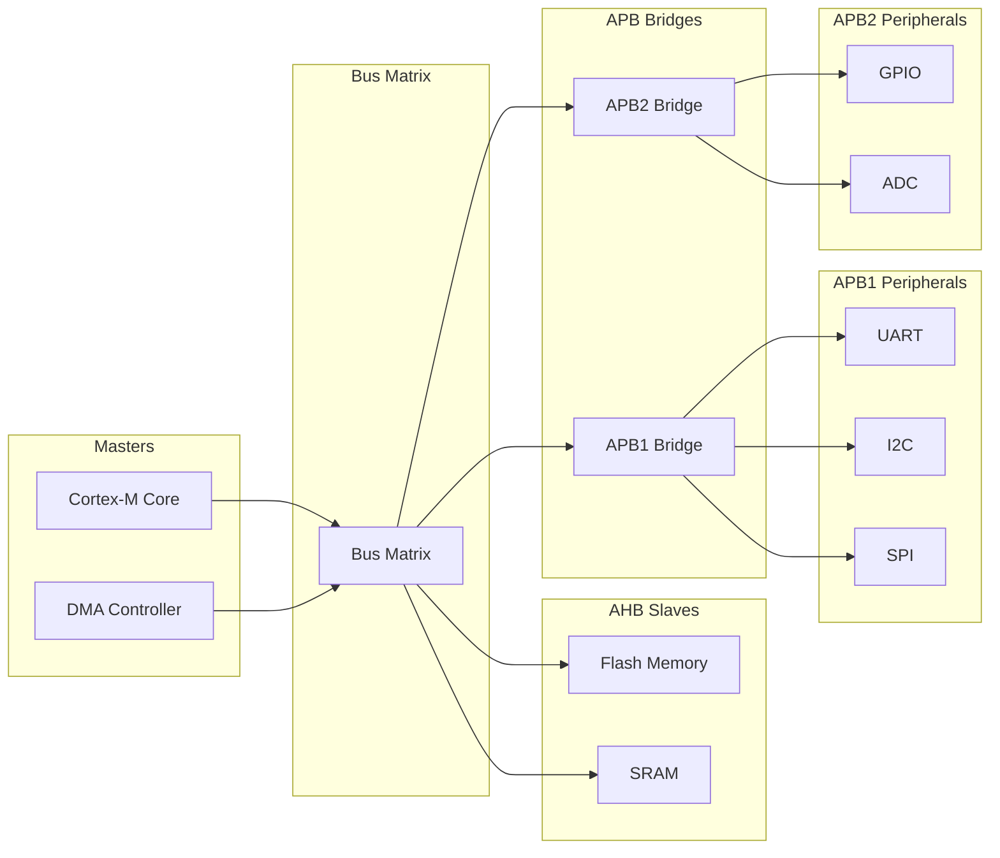

# STM32 Bus Architecture

## Introduction

The STM32 family of microcontrollers, based on ARM Cortex-M cores, features a sophisticated bus architecture that forms the backbone of how data moves within the chip. Understanding this architecture is essential for optimizing performance and making the most of the STM32's capabilities in your embedded applications.

In this guide, we'll explore how the various buses in an STM32 microcontroller connect different components, enabling them to communicate efficiently. Whether you're designing high-performance applications or trying to optimize power consumption, a solid understanding of the STM32 bus architecture will serve as a valuable foundation.

## Core Concepts: What is a Bus?

Before diving into the STM32-specific details, let's clarify what a bus is in a microcontroller context:

A **bus** is a communication system that transfers data between components inside a computer or between computers. It consists of physical connectors (wires or PCB traces) and a defined protocol for how data is transmitted.

Think of buses as highways for data:
- Multiple components can share the same bus
- Each bus has a specific bandwidth (data transfer capacity)
- Different buses may operate at different speeds
- Buses have defined protocols for arbitration (who gets to use the bus when)

## STM32 Bus Architecture Overview

STM32 microcontrollers implement a multi-layer bus matrix architecture. This is more sophisticated than a simple shared bus approach and allows multiple masters to communicate with multiple slaves simultaneously, as long as they're using different paths through the matrix.



## Main Bus Types in STM32

STM32 microcontrollers typically feature the following bus types:

### 1. AHB (Advanced High-performance Bus)

The AHB is designed for high-performance system modules:

- **Speed**: Typically runs at the core clock frequency (up to hundreds of MHz)
- **Width**: 32-bit data path
- **Connected to**: Flash memory, SRAM, DMA controllers, and high-speed peripherals
- **Purpose**: Provides high-bandwidth communication for core operations

### 2. APB (Advanced Peripheral Bus)

The APB is optimized for low-power peripheral control:

- **APB1**: Lower-speed peripherals (timers, UART, SPI, I2C, etc.)
- **APB2**: Higher-speed peripherals (GPIO, ADC, advanced timers)
- **Speed**: Typically runs at a fraction of the core clock
- **Width**: 32-bit data path
- **Purpose**: Provides efficient access to peripherals while minimizing power consumption

### 3. Core Buses

The ARM Cortex-M core itself has several buses:

- **I-Code**: Instruction fetch from Flash memory
- **D-Code**: Data access from Flash memory
- **System Bus**: Access to SRAM, peripherals, and other components

## Bus Matrix: The Traffic Controller

The bus matrix is a key element of the STM32 architecture that allows multiple bus masters (like the CPU and DMA controllers) to access multiple slaves (like memory and peripherals) simultaneously.



The bus matrix implements arbitration policies to resolve conflicts when multiple masters request access to the same slave. Typically, the CPU has the highest priority by default, followed by DMA controllers.

## Programming Example: Configuring Bus Speed

To optimize performance or power consumption, you might need to configure the clock frequency for different buses. Here's a simple example using the STM32 HAL library:

```c
// Configure bus clocks using the RCC (Reset and Clock Control)
void ConfigureBusClocks(void)
{
  RCC_ClkInitTypeDef RCC_ClkInitStruct = {0};
  RCC_OscInitTypeDef RCC_OscInitStruct = {0};
  
  // Configure the main internal regulator output voltage
  __HAL_RCC_PWR_CLK_ENABLE();
  __HAL_PWR_VOLTAGESCALING_CONFIG(PWR_REGULATOR_VOLTAGE_SCALE1);
  
  // Initialize the CPU, AHB and APB buses clocks
  RCC_OscInitStruct.OscillatorType = RCC_OSCILLATORTYPE_HSE;
  RCC_OscInitStruct.HSEState = RCC_HSE_ON;
  RCC_OscInitStruct.PLL.PLLState = RCC_PLL_ON;
  RCC_OscInitStruct.PLL.PLLSource = RCC_PLLSOURCE_HSE;
  RCC_OscInitStruct.PLL.PLLM = 8;
  RCC_OscInitStruct.PLL.PLLN = 336;
  RCC_OscInitStruct.PLL.PLLP = RCC_PLLP_DIV2;
  RCC_OscInitStruct.PLL.PLLQ = 7;
  HAL_RCC_OscConfig(&RCC_OscInitStruct);
  
  // Set bus clock frequencies
  // CPU Clock: 168 MHz
  // AHB: 168 MHz (HCLK = SYSCLK)
  // APB1: 42 MHz (PCLK1 = HCLK/4)
  // APB2: 84 MHz (PCLK2 = HCLK/2)
  RCC_ClkInitStruct.ClockType = RCC_CLOCKTYPE_HCLK | RCC_CLOCKTYPE_SYSCLK
                              | RCC_CLOCKTYPE_PCLK1 | RCC_CLOCKTYPE_PCLK2;
  RCC_ClkInitStruct.SYSCLKSource = RCC_SYSCLKSOURCE_PLLCLK;
  RCC_ClkInitStruct.AHBCLKDivider = RCC_SYSCLK_DIV1;
  RCC_ClkInitStruct.APB1CLKDivider = RCC_HCLK_DIV4;
  RCC_ClkInitStruct.APB2CLKDivider = RCC_HCLK_DIV2;
  HAL_RCC_ClockConfig(&RCC_ClkInitStruct, FLASH_LATENCY_5);
}
```

## Bus Access Timing

When working with STM32 microcontrollers, it's important to understand that different buses have different access times. For example:

1. **Flash memory access**: May require wait states at high clock frequencies
2. **SRAM access**: Typically faster than Flash, often zero wait states
3. **Peripheral access**: May involve crossing multiple bus bridges (AHB to APB)

Here's a code example showing how to configure Flash wait states based on the CPU frequency:

```c
// Configure Flash wait states based on the CPU frequency
void ConfigureFlashWaitStates(uint32_t cpuFrequency)
{
  uint32_t waitStates = 0;
  
  // Determine the required number of wait states
  if (cpuFrequency <= 24000000) {
    waitStates = FLASH_LATENCY_0;      // 0 wait states for <= 24 MHz
  } else if (cpuFrequency <= 48000000) {
    waitStates = FLASH_LATENCY_1;      // 1 wait state for <= 48 MHz
  } else if (cpuFrequency <= 72000000) {
    waitStates = FLASH_LATENCY_2;      // 2 wait states for <= 72 MHz
  } else if (cpuFrequency <= 96000000) {
    waitStates = FLASH_LATENCY_3;      // 3 wait states for <= 96 MHz
  } else if (cpuFrequency <= 120000000) {
    waitStates = FLASH_LATENCY_4;      // 4 wait states for <= 120 MHz
  } else {
    waitStates = FLASH_LATENCY_5;      // 5 wait states for > 120 MHz
  }
  
  // Configure the Flash wait states
  __HAL_FLASH_SET_LATENCY(waitStates);
}
```

## Real-World Optimization Example

Let's look at a practical example of optimizing a system based on bus understanding:

### Scenario: High-Speed Data Acquisition

Imagine you're building a data acquisition system that needs to sample an analog signal at high speed using the ADC, then process and store the data.

#### Suboptimal Approach:

```c
// This approach might cause bottlenecks
void ADC_Conversion_Callback(void)
{
  // Read ADC value
  uint16_t adcValue = HAL_ADC_GetValue(&hadc1);
  
  // Process the value (e.g., apply filtering)
  uint16_t processedValue = ApplyFilter(adcValue);
  
  // Store in memory
  dataBuffer[bufferIndex++] = processedValue;
  
  // Start next conversion
  HAL_ADC_Start_IT(&hadc1);
}
```

#### Optimized Approach using Bus Architecture Knowledge:

```c
// Configure DMA to transfer ADC values directly to memory
void SetupOptimizedAcquisition(void)
{
  // Configure ADC
  hadc1.Instance = ADC1;
  hadc1.Init.Resolution = ADC_RESOLUTION_12B;
  hadc1.Init.ScanConvMode = DISABLE;
  hadc1.Init.ContinuousConvMode = ENABLE;
  hadc1.Init.ExternalTrigConv = ADC_SOFTWARE_START;
  hadc1.Init.DataAlign = ADC_DATAALIGN_RIGHT;
  hadc1.Init.NbrOfConversion = 1;
  HAL_ADC_Init(&hadc1);
  
  // Configure DMA
  hdma_adc1.Instance = DMA2_Stream0;
  hdma_adc1.Init.Channel = DMA_CHANNEL_0;
  hdma_adc1.Init.Direction = DMA_PERIPH_TO_MEMORY;
  hdma_adc1.Init.PeriphInc = DMA_PINC_DISABLE;
  hdma_adc1.Init.MemInc = DMA_MINC_ENABLE;
  hdma_adc1.Init.PeriphDataAlignment = DMA_PDATAALIGN_HALFWORD;
  hdma_adc1.Init.MemDataAlignment = DMA_MDATAALIGN_HALFWORD;
  hdma_adc1.Init.Mode = DMA_CIRCULAR;
  hdma_adc1.Init.Priority = DMA_PRIORITY_HIGH;
  HAL_DMA_Init(&hdma_adc1);
  
  // Link DMA to ADC
  __HAL_LINKDMA(&hadc1, DMA_Handle, hdma_adc1);
  
  // Start ADC with DMA
  HAL_ADC_Start_DMA(&hadc1, (uint32_t*)dataBuffer, BUFFER_SIZE);
}
```

**Why this is better:**
1. DMA transfers occur directly between the ADC and memory without CPU intervention
2. The CPU is free to perform other tasks or enter low-power modes
3. Multiple bus masters (CPU and DMA) work simultaneously
4. Higher throughput is achieved with lower CPU overhead

## Debugging Bus-Related Issues

When working with STM32 microcontrollers, you might encounter issues related to the bus architecture. Here are some common problems and their solutions:

### 1. Hardfault During Memory Access

If your program crashes with a hardfault when accessing certain memory regions, it might be due to:
- Accessing a peripheral on a bus that's not enabled
- Incorrect peripheral base address

Solution:
```c
// Make sure to enable the peripheral clock before access
void EnablePeripheralClock(void)
{
  // Enable GPIOA clock
  __HAL_RCC_GPIOA_CLK_ENABLE();
  
  // Enable USART2 clock
  __HAL_RCC_USART2_CLK_ENABLE();
  
  // Now it's safe to access these peripherals
}
```

### 2. Slow Performance

If your application is running slower than expected, the bus configuration might be suboptimal:

Solution:
```c
// Optimize memory access for performance-critical code
void OptimizeMemoryAccess(void)
{
  // Place performance-critical variables in SRAM (faster than Flash)
  static uint32_t __attribute__((section(".data"))) criticalData[1000];
  
  // Use DMA for bulk data transfers when possible
  HAL_DMA_Start(&hdma, (uint32_t)sourceBuffer, (uint32_t)destBuffer, size);
}
```

## Advanced Topic: Memory Barriers

When working with multiple buses and DMA transfers, you might need to use memory barriers to ensure data coherency:

```c
// Example of using memory barriers
void ProcessDMAData(void)
{
  // Start DMA transfer
  HAL_DMA_Start(&hdma, (uint32_t)source, (uint32_t)destination, size);
  
  // Wait for DMA to complete
  while (HAL_DMA_GetState(&hdma) != HAL_DMA_STATE_READY) {}
  
  // Memory barrier to ensure all transfers are complete
  __DSB();
  
  // Now it's safe to access the data
  ProcessData(destination, size);
}
```

## Summary

Understanding the STM32 bus architecture is essential for developing efficient embedded applications. Key takeaways include:

1. STM32 uses a multi-layer bus matrix connecting masters (CPU, DMA) to slaves (memories, peripherals)
2. Main bus types include AHB (high-speed) and APB (peripheral buses)
3. Proper configuration of bus clocks can optimize performance and power consumption
4. Using DMA effectively can offload the CPU and leverage the full potential of the bus architecture
5. Being aware of bus access timing helps avoid performance bottlenecks

By understanding how data moves through your STM32 microcontroller, you can write more efficient code, avoid performance pitfalls, and make the most of the hardware capabilities.

## Exercises

1. Configure the STM32 clock system to run the CPU at 80MHz, with APB1 at 40MHz and APB2 at 80MHz.
2. Set up a DMA transfer from an SPI peripheral to memory without CPU intervention.
3. Create a memory benchmarking program that measures access times for Flash vs. SRAM.
4. Implement a system that uses multiple DMA channels simultaneously to transfer data between peripherals.

## Further Learning

To deepen your understanding of STM32 bus architecture:

- Explore the STM32 reference manuals, particularly the sections on RCC (Reset and Clock Control) and bus matrices
- Experiment with different clock configurations and measure their impact on performance
- Practice using DMA for various peripherals to offload the CPU
- Learn about memory protection units (MPU) to control access permissions on different buses