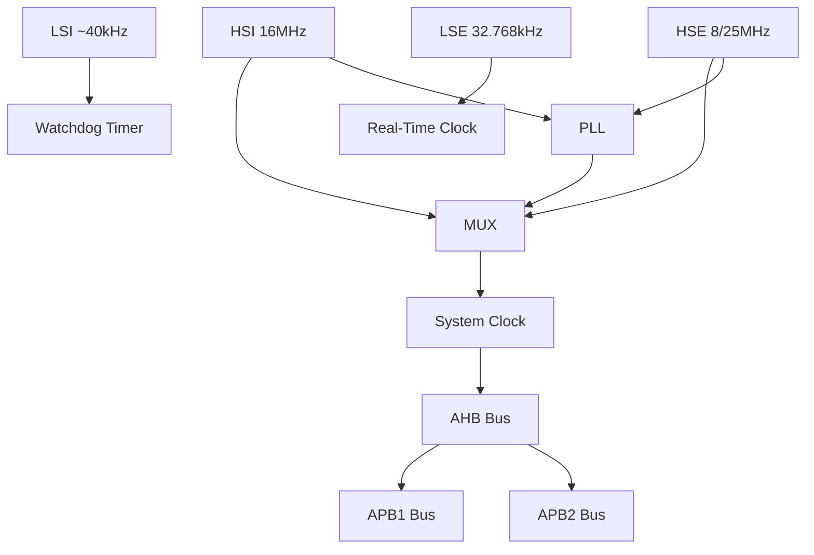

# STM32 Clock System

## Introduction

The clock system is one of the most fundamental aspects of any microcontroller, including the STM32 family. It serves as the heartbeat of the entire system, controlling the execution speed of instructions, peripheral operations, and power consumption. Understanding the clock system is essential for developing efficient and reliable embedded applications.

In this guide, we'll explore the STM32 clock system from the ground up. We'll learn about the different clock sources, how to configure them, and how to optimize them for your specific application needs.

## Clock Sources in STM32

The STM32 microcontrollers offer multiple clock sources with different characteristics:

1. **High-Speed External (HSE) clock** - A crystal oscillator (typically 8MHz or 25MHz)
2. **High-Speed Internal (HSI) clock** - An internal RC oscillator (typically 16MHz)
3. **Low-Speed External (LSE) clock** - A crystal oscillator for the real-time clock (32.768kHz)
4. **Low-Speed Internal (LSI) clock** - An internal RC oscillator for the watchdog timer (~40kHz)
5. **Phase-Locked Loop (PLL)** - A circuit that multiplies clock frequencies

Let's visualize the clock system architecture:



## Clock Configuration Basics

Before diving into code, let's understand the key components involved in clock configuration:

### 1. RCC (Reset and Clock Control)

The RCC peripheral manages all clocks in the STM32 microcontroller. It allows you to:
- Enable/disable different clock sources
- Configure the PLL
- Set prescalers for different buses (AHB, APB1, APB2)
- Select the system clock source

### 2. Clock Domains

STM32 has several clock domains:
- **SYSCLK**: The main system clock
- **HCLK**: The AHB bus clock (derived from SYSCLK)
- **PCLK1**: The APB1 peripheral clock
- **PCLK2**: The APB2 peripheral clock

### 3. PLL Configuration

The PLL can multiply the frequency of HSI or HSE to achieve higher clock frequencies. It involves:
- Selecting the input source (HSI or HSE)
- Setting the multiplication factor
- Configuring dividers

## Basic Clock Configuration Example

Let's look at a simple example to configure the system clock to run at 72MHz using the HSE and PLL:

```c
void SystemClockConfig(void)
{
    // Enable HSE
    RCC->CR |= RCC_CR_HSEON;
    
    // Wait until HSE is ready
    while(!(RCC->CR & RCC_CR_HSERDY)) {}
    
    // Configure Flash latency (2 wait states for 48MHz < SYSCLK <= 72MHz)
    FLASH->ACR = (FLASH->ACR & ~FLASH_ACR_LATENCY) | FLASH_ACR_LATENCY_2;
    
    // Configure PLL (HSE as source, x9 multiplication for 8MHz HSE)
    RCC->CFGR &= ~RCC_CFGR_PLLSRC;    // Clear PLLSRC bit
    RCC->CFGR |= RCC_CFGR_PLLSRC;     // Set PLLSRC to HSE
    RCC->CFGR &= ~RCC_CFGR_PLLMULL;   // Clear PLLMULL bits
    RCC->CFGR |= RCC_CFGR_PLLMULL9;   // Set PLL multiplier to 9
    
    // Enable PLL
    RCC->CR |= RCC_CR_PLLON;
    
    // Wait until PLL is ready
    while(!(RCC->CR & RCC_CR_PLLRDY)) {}
    
    // Select PLL as system clock
    RCC->CFGR &= ~RCC_CFGR_SW;        // Clear SW bits
    RCC->CFGR |= RCC_CFGR_SW_PLL;     // Set SW to PLL
    
    // Wait until PLL is used as system clock
    while((RCC->CFGR & RCC_CFGR_SWS) != RCC_CFGR_SWS_PLL) {}
    
    // Configure AHB, APB1, APB2 prescalers
    RCC->CFGR &= ~RCC_CFGR_HPRE;      // AHB prescaler = 1
    RCC->CFGR &= ~RCC_CFGR_PPRE1;     // Clear PPRE1 bits
    RCC->CFGR |= RCC_CFGR_PPRE1_DIV2; // APB1 prescaler = 2 (36MHz max)
    RCC->CFGR &= ~RCC_CFGR_PPRE2;     // APB2 prescaler = 1
}
```

In this example:
1. We enable the HSE clock and wait until it's stable
2. Configure Flash latency for the target frequency
3. Configure the PLL to multiply HSE (8MHz) by 9 to get 72MHz
4. Enable the PLL and wait until it's stable
5. Select the PLL as the system clock source
6. Configure bus prescalers (APB1 needs a prescaler because its maximum frequency is 36MHz)

## Using HAL Library for Clock Configuration

For beginners, it's often easier to use the HAL (Hardware Abstraction Layer) library for clock configuration:

```c
void SystemClock_Config(void)
{
    RCC_OscInitTypeDef RCC_OscInitStruct = {0};
    RCC_ClkInitTypeDef RCC_ClkInitStruct = {0};

    // Configure the main internal regulator output voltage
    __HAL_RCC_PWR_CLK_ENABLE();
    __HAL_PWR_VOLTAGESCALING_CONFIG(PWR_REGULATOR_VOLTAGE_SCALE1);

    // Configure oscillators (HSE, HSI, PLL)
    RCC_OscInitStruct.OscillatorType = RCC_OSCILLATORTYPE_HSE;
    RCC_OscInitStruct.HSEState = RCC_HSE_ON;
    RCC_OscInitStruct.PLL.PLLState = RCC_PLL_ON;
    RCC_OscInitStruct.PLL.PLLSource = RCC_PLLSOURCE_HSE;
    RCC_OscInitStruct.PLL.PLLM = 8;
    RCC_OscInitStruct.PLL.PLLN = 336;
    RCC_OscInitStruct.PLL.PLLP = RCC_PLLP_DIV2;
    RCC_OscInitStruct.PLL.PLLQ = 7;
    HAL_RCC_OscConfig(&RCC_OscInitStruct);

    // Configure system, AHB and APB bus clocks
    RCC_ClkInitStruct.ClockType = RCC_CLOCKTYPE_HCLK|RCC_CLOCKTYPE_SYSCLK
                                |RCC_CLOCKTYPE_PCLK1|RCC_CLOCKTYPE_PCLK2;
    RCC_ClkInitStruct.SYSCLKSource = RCC_SYSCLKSOURCE_PLLCLK;
    RCC_ClkInitStruct.AHBCLKDivider = RCC_SYSCLK_DIV1;
    RCC_ClkInitStruct.APB1CLKDivider = RCC_HCLK_DIV4;
    RCC_ClkInitStruct.APB2CLKDivider = RCC_HCLK_DIV2;
    HAL_RCC_ClockConfig(&RCC_ClkInitStruct, FLASH_LATENCY_5);
}
```

This HAL example configures an STM32F4 device to run at 168MHz with HSE as the input to the PLL.

## Clock Configuration in STM32CubeMX

STM32CubeMX is a graphical tool that simplifies the configuration process:

1. Open your project in STM32CubeMX
2. Go to the "Clock Configuration" tab
3. Set your desired clock frequencies by clicking on the diagram
4. The tool will automatically calculate the necessary PLL settings and prescalers
5. Generate code that includes the proper clock configuration

## Checking the Current Clock Frequency

To verify your clock configuration is working correctly:

```c
#include "stm32f4xx_hal.h"

void printClockFrequencies(void)
{
    uint32_t sysclk = HAL_RCC_GetSysClockFreq();
    uint32_t hclk = HAL_RCC_GetHCLKFreq();
    uint32_t pclk1 = HAL_RCC_GetPCLK1Freq();
    uint32_t pclk2 = HAL_RCC_GetPCLK2Freq();
    
    printf("SYSCLK: %lu Hz\r
", sysclk);
    printf("HCLK: %lu Hz\r
", hclk);
    printf("PCLK1: %lu Hz\r
", pclk1);
    printf("PCLK2: %lu Hz\r
", pclk2);
}
```

This function will print the current frequency of each clock domain to your console/UART.

## Real-World Applications

### 1. Power Management

Adjusting clock frequencies is crucial for power management in battery-operated devices:

```c
void EnterLowPowerMode(void)
{
    RCC_ClkInitTypeDef RCC_ClkInitStruct = {0};
    RCC_OscInitTypeDef RCC_OscInitStruct = {0};
    
    // Switch to HSI (16MHz)
    RCC_OscInitStruct.OscillatorType = RCC_OSCILLATORTYPE_HSI;
    RCC_OscInitStruct.HSIState = RCC_HSI_ON;
    RCC_OscInitStruct.PLL.PLLState = RCC_PLL_OFF;
    HAL_RCC_OscConfig(&RCC_OscInitStruct);
    
    // Reduce system clock to 8MHz (16MHz with div2)
    RCC_ClkInitStruct.ClockType = RCC_CLOCKTYPE_SYSCLK | RCC_CLOCKTYPE_HCLK;
    RCC_ClkInitStruct.SYSCLKSource = RCC_SYSCLKSOURCE_HSI;
    RCC_ClkInitStruct.AHBCLKDivider = RCC_SYSCLK_DIV2;
    HAL_RCC_ClockConfig(&RCC_ClkInitStruct, FLASH_LATENCY_0);
    
    // Disable HSE to save power
    __HAL_RCC_HSE_DISABLE();
    
    // Further power saving could include disabling peripherals
    // and entering Stop or Standby modes
}
```

### 2. Peripheral Clock Control

Selectively enabling peripheral clocks saves power and is a good practice:

```c
void configurePeripheralClocks(void)
{
    // Enable GPIOA clock
    __HAL_RCC_GPIOA_CLK_ENABLE();
    
    // Enable USART2 clock
    __HAL_RCC_USART2_CLK_ENABLE();
    
    // Configure peripherals...
    
    // Disable unused peripheral clocks to save power
    // For example, if GPIOB is not used:
    __HAL_RCC_GPIOB_CLK_DISABLE();
}
```

### 3. Dynamic Clock Adjustment

For applications that need different processing power at different times:

```c
void adjustClockForTask(ClockMode_t mode)
{
    RCC_ClkInitTypeDef RCC_ClkInitStruct = {0};
    RCC_OscInitTypeDef RCC_OscInitStruct = {0};
    
    switch(mode) {
        case CLOCK_MODE_LOW: // 8MHz for low-power operations
            RCC_OscInitStruct.OscillatorType = RCC_OSCILLATORTYPE_HSI;
            RCC_OscInitStruct.HSIState = RCC_HSI_ON;
            RCC_OscInitStruct.PLL.PLLState = RCC_PLL_OFF;
            HAL_RCC_OscConfig(&RCC_OscInitStruct);
            
            RCC_ClkInitStruct.ClockType = RCC_CLOCKTYPE_SYSCLK | RCC_CLOCKTYPE_HCLK;
            RCC_ClkInitStruct.SYSCLKSource = RCC_SYSCLKSOURCE_HSI;
            RCC_ClkInitStruct.AHBCLKDivider = RCC_SYSCLK_DIV2;
            HAL_RCC_ClockConfig(&RCC_ClkInitStruct, FLASH_LATENCY_0);
            break;
            
        case CLOCK_MODE_HIGH: // Max frequency for demanding tasks
            // Re-enable HSE if it was disabled
            RCC_OscInitStruct.OscillatorType = RCC_OSCILLATORTYPE_HSE;
            RCC_OscInitStruct.HSEState = RCC_HSE_ON;
            RCC_OscInitStruct.PLL.PLLState = RCC_PLL_ON;
            RCC_OscInitStruct.PLL.PLLSource = RCC_PLLSOURCE_HSE;
            // Configure PLL for max frequency according to device
            // ...
            HAL_RCC_OscConfig(&RCC_OscInitStruct);
            
            // Switch to PLL and configure prescalers
            // ...
            break;
    }
}
```

## Common Challenges and Solutions

### 1. Clock Configuration Failures

If your clock configuration fails, consider these common issues:

- **HSE not oscillating**: Check crystal/oscillator connections
- **PLL not locking**: Ensure PLL settings are valid for your device
- **Flash latency**: Incorrect Flash wait states for the target frequency
- **Power supply**: Some high frequencies require higher voltage settings

### 2. Clock Calibration

The internal HSI oscillator may not be precise enough for certain applications. You can calibrate it:

```c
void calibrateHSI(void)
{
    // Assuming you have a precise external reference (e.g., LSE)
    
    // Disable HSI calibration trimming
    RCC->CR &= ~RCC_CR_HSITRIM;
    
    // Apply custom trimming value (example)
    RCC->CR |= (16 << RCC_CR_HSITRIM_Pos);
    
    // Wait for stabilization
    HAL_Delay(10);
    
    // Fine-tune by measuring frequency and adjusting trim value
    // This requires a hardware method to measure the frequency
}
```

### 3. Clock Security System (CSS)

Enable CSS to detect clock failures and switch to a backup clock:

```c
void enableClockSecurity(void)
{
    // Enable HSI as backup
    RCC->CR |= RCC_CR_HSION;
    while(!(RCC->CR & RCC_CR_HSIRDY)) {}
    
    // Enable Clock Security System
    RCC->CR |= RCC_CR_CSSON;
    
    // Configure CSS interrupt if needed
    NVIC_EnableIRQ(RCC_IRQn);
}
```

## Summary

The STM32 clock system is a flexible and powerful subsystem that allows you to:

1. Choose from multiple clock sources (HSI, HSE, LSI, LSE)
2. Multiply frequencies using the PLL
3. Adjust clock frequencies for different bus domains
4. Control peripheral clocks individually
5. Implement power-saving strategies
6. Ensure system reliability with clock monitoring features

Understanding the clock system is fundamental to mastering STM32 microcontrollers. It affects every aspect of your application, from processing speed to power consumption.

## Exercises

1. Configure your STM32 to run at its maximum frequency using the HSE as the source.
2. Create a function that switches between different clock modes based on system needs.
3. Implement a power-saving mode that reduces clock frequencies when the device is idle.
4. Develop a clock monitoring system that detects failures and switches to a backup clock.
5. Measure and calculate the actual frequency of your HSI oscillator.

## Additional Resources

- STM32 Reference Manuals (specific to your device family)
- STM32CubeMX User Manual
- ST's application notes on clock configuration and power management
- STM32 HAL documentation for RCC functions