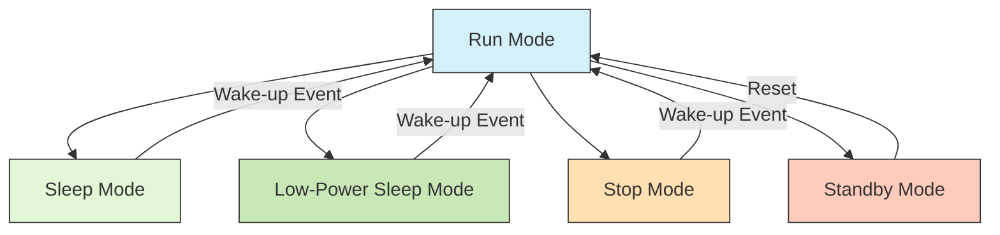

# STM32 Power Modes

## Introduction

Power consumption is a critical factor in many embedded systems, especially battery-powered devices. STM32 microcontrollers offer several power-saving modes that allow developers to significantly extend battery life while maintaining necessary functionality.

In this tutorial, we'll explore the various power modes available in STM32 microcontrollers, understand when to use each mode, and learn how to implement them in your applications. By the end, you'll be able to optimize your STM32-based projects for power efficiency.

## STM32 Power Modes Overview

STM32 microcontrollers provide multiple power modes, each offering different levels of power savings and wake-up capabilities. The main power modes are:

1. **Run Mode** - Normal operation mode
2. **Sleep Mode** - CPU is stopped, peripherals continue running
3. **Low-Power Sleep Mode** - Similar to Sleep, but with reduced peripheral clocks
4. **Stop Mode** - All clocks stopped, voltage regulator running
5. **Standby Mode** - Deepest power saving, minimal retention, longest wake-up time

Let's visualize the relationship between these power modes:



The power consumption decreases (and wake-up time increases) as we move from Run Mode towards Standby Mode.

## Detailed Look at Each Power Mode

### Run Mode

This is the normal operating mode where the CPU and all peripherals are active and running at full speed.

**Characteristics:**
- Highest power consumption
- All clocks and peripherals are active
- No power-saving features enabled

### Sleep Mode

In Sleep mode, the CPU is stopped, but peripherals continue to operate normally.

**Characteristics:**
- CPU clock is stopped
- Peripherals continue to operate
- Fast wake-up time (microseconds)
- Wake-up sources: any interrupt

**Example code to enter Sleep mode:**

```c
#include "stm32f4xx_hal.h"

void enterSleepMode(void)
{
  /* Suspend Tick increment to prevent wakeup by Systick interrupt */
  HAL_SuspendTick();
  
  /* Enter Sleep Mode */
  HAL_PWR_EnterSLEEPMode(PWR_MAINREGULATOR_ON, PWR_SLEEPENTRY_WFI);
  
  /* Resume Tick interrupt */
  HAL_ResumeTick();
}
```

### Low-Power Sleep Mode

Similar to Sleep mode but with peripheral clocks running at reduced speeds.

**Characteristics:**
- CPU clock is stopped
- Peripheral clocks are reduced
- Moderate power savings
- Wake-up sources: any interrupt

### Stop Mode

Stop mode offers significant power savings by stopping all clocks while maintaining the system state.

**Characteristics:**
- All clocks are stopped
- Content of SRAM and registers is preserved
- Voltage regulator is running (can be in low-power mode)
- Wake-up time: medium (microseconds)
- Wake-up sources: external interrupt, RTC alarm, etc.

**Example code to enter Stop mode:**

```c
#include "stm32f4xx_hal.h"

void enterStopMode(void)
{
  /* Configure the wake-up source (e.g., EXTI line) */
  HAL_GPIO_WritePin(LED_GPIO_Port, LED_Pin, GPIO_PIN_RESET); // Turn off LED
  
  /* Suspend Tick increment to prevent wakeup by Systick interrupt */
  HAL_SuspendTick();
  
  /* Enter Stop Mode */
  HAL_PWR_EnterSTOPMode(PWR_LOWPOWERREGULATOR_ON, PWR_STOPENTRY_WFI);
  
  /* System resumed from STOP mode */
  SystemClock_Config(); // Reconfigure the system clock
  
  /* Resume Tick interrupt */
  HAL_ResumeTick();
  
  HAL_GPIO_WritePin(LED_GPIO_Port, LED_Pin, GPIO_PIN_SET); // Turn on LED to indicate wake-up
}
```

### Standby Mode

Standby mode provides the lowest power consumption but at the cost of losing most system states.

**Characteristics:**
- Voltage regulator is powered off
- Most registers and SRAM content is lost
- Only backup registers and RTC are preserved (if enabled)
- Longest wake-up time (milliseconds)
- Wake-up sources: WKUP pin, RTC alarm, IWDG reset

**Example code to enter Standby mode:**

```c
#include "stm32f4xx_hal.h"

void enterStandbyMode(void)
{
  /* Configure RTC if needed for wake-up */
  /* ... RTC configuration code ... */
  
  /* Enable WKUP pin if needed */
  HAL_PWR_EnableWakeUpPin(PWR_WAKEUP_PIN1);
  
  /* Enter Standby Mode */
  HAL_PWR_EnterSTANDBYMode();
  
  /* Code execution will never reach here unless the device is reset */
}
```

## Power Consumption Comparison

Here's a comparison of typical power consumption across different STM32F4 power modes:

| Power Mode | Current Consumption | Wake-up Time | State Retention |
|------------|---------------------|--------------|-----------------|
| Run (at 168 MHz) | 90-150 mA | N/A | Full |
| Sleep | 10-40 mA | ~1 µs | Full |
| Low-Power Sleep | 5-15 mA | ~1 µs | Full |
| Stop | 30-60 µA | ~5-10 µs | Full |
| Standby | 1-3 µA | ~60-100 µs | Minimal |

Note: These values are approximate and can vary based on the specific STM32 model, peripheral usage, and operating conditions.

## Practical Examples

### Example 1: Battery-Powered Temperature Sensor

This example demonstrates a battery-powered temperature sensor that wakes up periodically, takes a reading, and goes back to sleep.

```c
#include "stm32f4xx_hal.h"
#include <stdio.h>

/* Define temperature sensor pins and functions (example) */
#define TEMP_SENSOR_PIN GPIO_PIN_0
#define TEMP_SENSOR_PORT GPIOA

float readTemperature(void);
void sendDataOverBLE(float temp);

int main(void)
{
  HAL_Init();
  SystemClock_Config();
  
  /* Initialize GPIO, ADC, BLE module, etc. */
  /* ... initialization code ... */
  
  /* Configure RTC for periodic wake-up (every 10 minutes) */
  HAL_RTC_Init(&hrtc);
  
  while (1)
  {
    /* Wake up, read temperature and send data */
    float temperature = readTemperature();
    sendDataOverBLE(temperature);
    
    /* Go to Stop mode until next RTC alarm */
    HAL_PWR_EnterSTOPMode(PWR_LOWPOWERREGULATOR_ON, PWR_STOPENTRY_WFI);
    
    /* Code execution continues here after wake-up */
    SystemClock_Config(); // Reconfigure system clock after Stop mode
  }
}
```

### Example 2: Button-Activated Calculator

This example shows a simple calculator that stays in low-power mode until a button is pressed.

```c
#include "stm32f4xx_hal.h"

/* Function prototypes */
void configureWakeupButton(void);
void runCalculator(void);

int main(void)
{
  HAL_Init();
  SystemClock_Config();
  
  /* Initialize calculator peripherals (LCD, keypad, etc.) */
  /* ... initialization code ... */
  
  /* Configure wake-up button with external interrupt */
  configureWakeupButton();
  
  while (1)
  {
    /* Turn off display and enter Stop mode */
    displayOff();
    HAL_PWR_EnterSTOPMode(PWR_LOWPOWERREGULATOR_ON, PWR_STOPENTRY_WFI);
    
    /* After wake-up (button press) */
    SystemClock_Config(); // Reconfigure system clock
    displayOn();
    
    /* Run calculator function until idle timeout */
    runCalculator();
  }
}

/* EXTI callback function */
void HAL_GPIO_EXTI_Callback(uint16_t GPIO_Pin)
{
  /* This function is called on button interrupt */
  /* No need to add code here - the interrupt itself will wake the MCU */
}
```

## Implementing Power Management Strategy

When designing a power-efficient STM32 application, follow these steps:

1. **Identify Power Requirements**: Determine your battery life goals and available power budget
2. **Profile Your Application**: Understand which parts of your code consume the most energy
3. **Choose Appropriate Power Modes**: Select the deepest power mode that meets your responsiveness needs
4. **Configure Wake-up Sources**: Properly set up interrupts that will wake the device
5. **Optimize Peripheral Usage**: Use peripherals judiciously and disable when not needed
6. **Implement Clock Gating**: Turn off clocks to unused peripherals
7. **Test and Measure**: Verify your power consumption with proper measurement tools

## Debugging Low-Power Applications

Debugging low-power applications can be challenging since debug connections often prevent the device from entering deep sleep modes. Here are some tips:

1. Use LED indicators to signal mode transitions
2. Add debug printf statements before entering low-power modes
3. Use current measurement tools that can capture brief wake-up events
4. Consider using the STM32CubeMonitor-Power tool for advanced power profiling

## Common Pitfalls to Avoid

- **Forgetting to reconfigure clocks**: Always reconfigure your system clock after exiting Stop mode
- **Debug connections preventing sleep**: Remember that maintaining an active debug connection can prevent the deepest sleep modes
- **Interrupts keeping the device awake**: Ensure all unneeded interrupts are disabled before entering low-power modes
- **Peripheral activity continuing**: Make sure to properly disable peripherals that might continue operating and consuming power
- **Forgetting to suspend/resume SysTick**: Always suspend SysTick before entering sleep modes and resume after waking up

## Summary

STM32 microcontrollers offer a comprehensive set of power-saving options that allow developers to balance performance and power consumption based on application requirements. By understanding and properly implementing these power modes, you can significantly extend the battery life of your embedded applications.

Remember these key points:
- Use Sleep mode when you need fast wake-up and peripheral operation
- Use Stop mode for deeper power savings while maintaining system state
- Use Standby mode for the lowest power consumption when state retention isn't critical
- Always consider wake-up sources and timing requirements when selecting a power mode
- Properly handle system clock reconfiguration after wake-up

## Exercises

1. Create a simple LED blinker that uses Stop mode between blinks to minimize power consumption.
2. Modify the temperature sensor example to use Standby mode instead of Stop mode. How does this affect power consumption and responsiveness?
3. Implement a power-efficient system that uses different power modes based on battery level (e.g., normal operation above 50% battery, aggressive power saving below 20%).
4. Design a wake-up sequence that uses multiple wake-up sources (button press, RTC alarm, and external sensor interrupt).
5. Measure and compare the actual power consumption of your STM32 board in different power modes.

## Additional Resources

- STM32 Reference Manuals for your specific device family
- STM32CubeF4 HAL Driver documentation
- "Getting Started with STM32 - Low Power Modes" application note (AN4621)
- STM32CubeMonitor-Power tool for power consumption analysis
- ST Community forums for troubleshooting power management issues