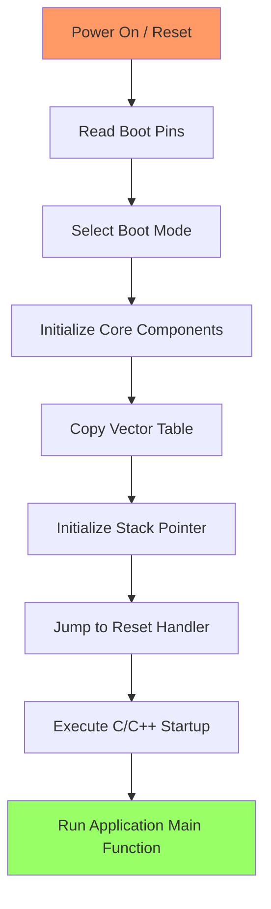
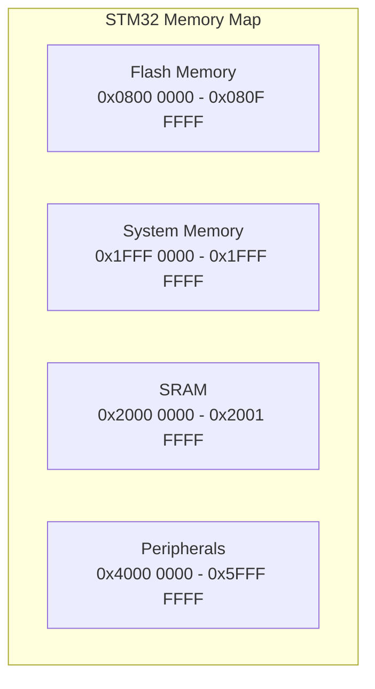

# STM32 Boot Sequence

## Introduction

The boot sequence of an STM32 microcontroller is a critical process that occurs every time the device powers up or resets. Understanding this sequence is fundamental for embedded systems developers, as it determines how your program gets loaded and executed, and provides important configuration options that can affect your entire application.

In this tutorial, we'll explore the STM32 boot process step-by-step, from the moment power is applied until your application code begins running. We'll cover boot modes, memory mapping, reset behavior, and how to configure your STM32 for different boot scenarios.

## Boot Process Overview

When an STM32 microcontroller is powered on or reset, it follows a predetermined sequence before execution of your application code begins:



Let's break down each stage of this process in detail.

## Boot Mode Selection

STM32 microcontrollers have multiple boot modes that determine where the device will look for code to execute. These boot modes are selected using dedicated BOOT pins:

| Boot Mode | BOOT1 | BOOT0 | Description |
|-----------|-------|-------|-------------|
| Main Flash Memory | X | 0 | Boot from the internal flash memory (most common) |
| System Memory | 0 | 1 | Boot from the internal bootloader (used for programming) |
| Embedded SRAM | 1 | 1 | Boot from internal SRAM (for debugging or special cases) |

Here's how to configure these pins for the most common scenarios:

```c
// For normal operation (boot from Flash)
// Set BOOT0 pin to LOW (0)
// BOOT1 state doesn't matter in this case

// For bootloader mode (used with ST-Link, USB, UART programming)
// Set BOOT0 pin to HIGH (1)
// Set BOOT1 pin to LOW (0)
```

## Memory Map and Boot Locations

The STM32 has a well-defined memory map that determines where code and data are stored:



Depending on the boot mode selected, the microcontroller will map the appropriate memory region to address `0x0000 0000` (where execution begins after reset):

1. **Flash Memory Boot**: Maps the Flash memory to address 0x0000 0000
2. **System Memory Boot**: Maps the internal bootloader to address 0x0000 0000
3. **SRAM Boot**: Maps the SRAM to address 0x0000 0000

## Reset Sequence in Detail

When a reset occurs (whether from power-on, the NRST pin, or a software reset), the following sequence happens:

1. **Core Reset**: The CPU and peripherals are put into their default state
2. **Clock Configuration**: The system clock defaults to the internal 8/16 MHz HSI (High-Speed Internal) oscillator
3. **Boot Pin Sampling**: The BOOT0 and BOOT1 pins are sampled to determine the boot mode
4. **Memory Mapping**: The appropriate memory region is mapped to address 0x0000 0000
5. **Vector Table Reading**: The first 4 bytes at 0x0000 0000 are read to set the initial Stack Pointer (SP)
6. **Reset Vector Reading**: The second 4 bytes at 0x0000 0004 are read to get the Reset Handler address
7. **Execution Begin**: The CPU jumps to the Reset Handler address and begins execution

## The Vector Table

The Vector Table is a fundamental structure in STM32 microcontrollers that resides at the beginning of your program memory. It contains addresses of various exception handlers:

```c
// Simplified example of a vector table in C
__attribute__((section(".isr_vector"))) const void * const VectorTable[] = {
    (void*)&_estack,              // Initial Stack Pointer
    (void*)Reset_Handler,         // Reset Handler
    (void*)NMI_Handler,           // NMI Handler
    (void*)HardFault_Handler,     // Hard Fault Handler
    // ...other exception handlers
};
```

The first entry in the Vector Table is not actually a handler address but the value that will be loaded into the Stack Pointer (SP) register upon reset.

## Startup Code Execution

After loading the initial Stack Pointer and jumping to the Reset Handler, the following typical sequence occurs:

1. **Low-level initialization**: Setting up critical hardware (clocks, PLLs, Flash access timings)
2. **Data section initialization**: Copying initialized variables from Flash to RAM
3. **BSS section clearing**: Setting uninitialized variables to zero
4. **C library initialization**: Setting up C/C++ runtime environment
5. **Call to main()**: Starting your application code

Here's a simplified example of what happens in the Reset_Handler:

```c
void Reset_Handler(void) {
    // Copy initialized data from Flash to SRAM
    memcpy(&_sdata, &_sidata, &_edata - &_sdata);
    
    // Zero-fill the BSS section
    memset(&_sbss, 0, &_ebss - &_sbss);
    
    // Initialize the system
    SystemInit();
    
    // Call C++ constructors
    __libc_init_array();
    
    // Call the application's entry point
    main();
    
    // Infinite loop in case main() returns
    while (1);
}
```

## Customizing the Boot Process

You can customize various aspects of the boot process for your specific application needs:

### 1. Boot Pin Configuration

For permanent boot mode selection, you can connect the BOOT pins to fixed levels:

```c
// For normal operation, connect:
// BOOT0 pin to GND (through a pull-down resistor, typically 10k)

// For systems that need to switch boot modes, connect:
// BOOT0 pin to a GPIO (through a pull-down resistor)
// Then control it in software before reset:
GPIO_WritePin(BOOT0_GPIO_Port, BOOT0_Pin, GPIO_PIN_SET); // For bootloader mode
NVIC_SystemReset(); // Trigger a reset to enter bootloader
```

### 2. Vector Table Relocation

STM32 allows you to relocate the vector table at runtime using the SCB->VTOR register:

```c
// Relocate vector table to SRAM (e.g., for bootloaders)
// First, copy the vector table to its new location
memcpy((void*)SRAM_BASE, (void*)FLASH_BASE, 0x198); // Copy vector table

// Then, update the Vector Table Offset Register
SCB->VTOR = SRAM_BASE;
```

### 3. Custom Boot Behavior

For advanced applications like bootloaders, you might want to check for special conditions before running the main application:

```c
int main(void) {
    // Initialize necessary hardware
    SystemClock_Config();
    HAL_Init();
    
    // Check for bootloader entry conditions
    if (HAL_GPIO_ReadPin(BOOTLOADER_BUTTON_PORT, BOOTLOADER_BUTTON_PIN) == GPIO_PIN_RESET) {
        // Enter bootloader mode
        Bootloader_Execute();
    } else {
        // Jump to application
        JumpToApplication(APPLICATION_ADDRESS);
    }
    
    // Should never reach here
    while (1);
}
```

## Real-world Application: Bootloader Implementation

One common application of understanding the boot sequence is implementing a custom bootloader. Here's a simplified example:

```c
// Bootloader main function
int main(void) {
    // 1. Initialize system
    SystemInit();
    HAL_Init();
    
    // 2. Check if update is needed
    if (CheckForUpdateRequest()) {
        // 3. Initialize communication (UART, USB, etc.)
        Communication_Init();
        
        // 4. Receive and flash new firmware
        ReceiveAndFlashFirmware();
        
        // 5. Verify new firmware
        if (VerifyFirmware()) {
            // Set flag to indicate successful update
            WriteUpdateSuccessFlag();
        }
    }
    
    // 6. Jump to main application
    JumpToApplication(APPLICATION_START_ADDRESS);
    
    // Should never reach here
    while (1);
}

void JumpToApplication(uint32_t address) {
    // Typedef for the application's entry point
    typedef void (*pFunction)(void);
    
    // Get the application's reset handler address
    uint32_t jumpAddress = *(__IO uint32_t*)(address + 4);
    pFunction jumpToApplication = (pFunction)jumpAddress;
    
    // Deinitialize peripherals
    HAL_DeInit();
    
    // Set the main stack pointer
    __set_MSP(*(__IO uint32_t*)address);
    
    // Jump to the application
    jumpToApplication();
}
```

## Common Boot Issues and Troubleshooting

When working with STM32 boot processes, you might encounter some common issues:

1. **Boot Loop**: If your device keeps resetting, check for:
   - Watchdog not being disabled or refreshed
   - Stack overflow (increase stack size in linker script)
   - Power supply issues causing brownouts

2. **Failure to Boot**: If your device doesn't start at all:
   - Verify BOOT pin connections
   - Check that your firmware is properly flashed
   - Ensure the vector table is correctly set up

3. **Bootloader Entry Issues**: If you can't enter bootloader mode:
   - Verify BOOT pin timing (pins must be set before reset is released)
   - Check pull-up/pull-down resistors on BOOT pins

## Summary

Understanding the STM32 boot sequence is essential for developing robust embedded applications. In this tutorial, we've covered:

- How STM32 microcontrollers start up and initialize
- The different boot modes and how to select them
- Memory mapping during boot
- The reset sequence in detail
- Vector table structure and function
- Startup code execution flow
- Ways to customize the boot process
- Practical applications like bootloader implementation
- Common boot issues and how to troubleshoot them

This knowledge forms the foundation for more advanced STM32 programming concepts and allows you to take full control of your microcontroller from the moment it powers on.

## Exercises

1. Configure your STM32 board to boot from system memory (bootloader) by manipulating the BOOT pins.
2. Write a simple program that relocates the vector table to SRAM at runtime.
3. Implement a basic bootloader that checks a GPIO pin at startup and enters a special mode if the pin is held low.
4. Modify the linker script to change where your application is stored in flash memory, and adjust the boot sequence accordingly.
5. Create a dual-bank application that can run from either of two flash regions, with the ability to update one region while running from the other.

## Additional Resources

For further exploration of STM32 boot mechanisms, refer to:

- ST's application note AN2606: "STM32 microcontroller system memory boot mode"
- Your specific STM32 microcontroller's reference manual, particularly the sections on:
  - Boot configuration
  - Memory mapping
  - Reset and clock control (RCC)
- ST's firmware examples for bootloaders and memory management
- The CMSIS-Core documentation for information on vector table relocation