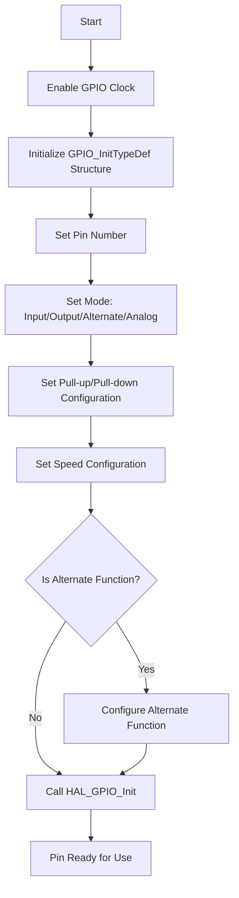

# STM32 Pin Configuration

## Introduction

STM32 microcontrollers are powerful devices with versatile General Purpose Input/Output (GPIO) pins that can be configured for various functions. Understanding how to properly configure these pins is fundamental to building any STM32-based project.

In this tutorial, we'll explore how GPIO pins work on STM32 microcontrollers, how to configure them for different modes of operation, and walk through practical examples demonstrating common pin configurations. By the end, you'll be comfortable setting up pins for input, output, alternate functions, and analog operations.

## GPIO Basics on STM32

STM32 microcontrollers organize GPIO pins into ports (typically labeled PORTA, PORTB, etc.), with each port containing up to 16 pins (numbered 0-15). Before using any GPIO pin, we need to understand:

1. **Pin Modes**: Input, Output, Alternate Function, or Analog
2. **Output Types**: Push-Pull or Open-Drain
3. **Pull Resistors**: Pull-up, Pull-down, or No-pull
4. **Speed Settings**: Low, Medium, High, or Very High speed

Let's examine each of these settings in detail.

## Pin Configuration Structure

The STM32 hardware abstraction layer (HAL) provides a structure for configuring GPIO pins:

```c
typedef struct {
  uint32_t Pin;       /* Specifies the GPIO pins to be configured */
  uint32_t Mode;      /* Specifies the operating mode for the selected pins */
  uint32_t Pull;      /* Specifies the Pull-up or Pull-down activation for the selected pins */
  uint32_t Speed;     /* Specifies the speed for the selected pins */
  uint32_t Alternate; /* Peripheral to be connected to the selected pins */
} GPIO_InitTypeDef;
```

## Pin Configuration Process

### Step 1: Enable the GPIO Clock

Before configuring any GPIO pin, you must enable the clock for the corresponding GPIO port:

```c
// Enable clock for GPIOA
__HAL_RCC_GPIOA_CLK_ENABLE();

// Enable clock for GPIOB
__HAL_RCC_GPIOB_CLK_ENABLE();
```

### Step 2: Configure the GPIO Pin

Next, you define the configuration structure and initialize the pin:

```c
GPIO_InitTypeDef GPIO_InitStruct = {0};

// Configure PA5 as output (LED pin on many STM32 boards)
GPIO_InitStruct.Pin = GPIO_PIN_5;
GPIO_InitStruct.Mode = GPIO_MODE_OUTPUT_PP;  // Push-pull output
GPIO_InitStruct.Pull = GPIO_NOPULL;          // No pull-up or pull-down
GPIO_InitStruct.Speed = GPIO_SPEED_FREQ_LOW; // Low speed to reduce noise and power

// Apply the configuration
HAL_GPIO_Init(GPIOA, &GPIO_InitStruct);
```

## Common Pin Configurations

### 1. Digital Output Configuration

Digital outputs are used to control LEDs, relays, and other devices:

```c
void configureOutputPin(GPIO_TypeDef* port, uint16_t pin) {
  GPIO_InitTypeDef GPIO_InitStruct = {0};
  
  // Configure as output
  GPIO_InitStruct.Pin = pin;
  GPIO_InitStruct.Mode = GPIO_MODE_OUTPUT_PP;  // Push-pull output
  GPIO_InitStruct.Pull = GPIO_NOPULL;          // No pull resistor
  GPIO_InitStruct.Speed = GPIO_SPEED_FREQ_LOW; // Low speed
  
  HAL_GPIO_Init(port, &GPIO_InitStruct);
}

// Usage example (LED on PA5)
configureOutputPin(GPIOA, GPIO_PIN_5);

// Control the output
HAL_GPIO_WritePin(GPIOA, GPIO_PIN_5, GPIO_PIN_SET);   // Turn ON
HAL_GPIO_WritePin(GPIOA, GPIO_PIN_5, GPIO_PIN_RESET); // Turn OFF
HAL_GPIO_TogglePin(GPIOA, GPIO_PIN_5);                // Toggle state
```

### 2. Digital Input Configuration

Digital inputs can read buttons, switches, and digital sensors:

```c
void configureInputPin(GPIO_TypeDef* port, uint16_t pin) {
  GPIO_InitTypeDef GPIO_InitStruct = {0};
  
  // Configure as input with pull-up
  GPIO_InitStruct.Pin = pin;
  GPIO_InitStruct.Mode = GPIO_MODE_INPUT;  // Input mode
  GPIO_InitStruct.Pull = GPIO_PULLUP;      // Enable pull-up resistor
  GPIO_InitStruct.Speed = GPIO_SPEED_FREQ_LOW;
  
  HAL_GPIO_Init(port, &GPIO_InitStruct);
}

// Usage example (Button on PC13 - Common on many STM32 boards)
configureInputPin(GPIOC, GPIO_PIN_13);

// Read the input
GPIO_PinState buttonState = HAL_GPIO_ReadPin(GPIOC, GPIO_PIN_13);
if (buttonState == GPIO_PIN_RESET) {  // Pressed (when using pull-up)
  // Button is pressed
}
```

### 3. External Interrupt Configuration

For button presses or external events that need immediate attention:

```c
void configureExternalInterrupt(GPIO_TypeDef* port, uint16_t pin) {
  GPIO_InitTypeDef GPIO_InitStruct = {0};
  
  // Configure as interrupt with falling edge trigger
  GPIO_InitStruct.Pin = pin;
  GPIO_InitStruct.Mode = GPIO_MODE_IT_FALLING;  // Interrupt on falling edge
  GPIO_InitStruct.Pull = GPIO_PULLUP;           // Enable pull-up resistor
  
  HAL_GPIO_Init(port, &GPIO_InitStruct);
  
  // Enable the EXTI interrupt line in NVIC
  IRQn_Type irqn;
  if (pin == GPIO_PIN_0) irqn = EXTI0_IRQn;
  else if (pin == GPIO_PIN_1) irqn = EXTI1_IRQn;
  // ... continue for other pins or use a switch statement
  
  HAL_NVIC_SetPriority(irqn, 0, 0);
  HAL_NVIC_EnableIRQ(irqn);
}

// Usage example (Button on PC13)
configureExternalInterrupt(GPIOC, GPIO_PIN_13);

// Interrupt handler (must be implemented in your code)
void EXTI15_10_IRQHandler(void) {
  HAL_GPIO_EXTI_IRQHandler(GPIO_PIN_13);
}

// Callback function that gets called when interrupt is triggered
void HAL_GPIO_EXTI_Callback(uint16_t GPIO_Pin) {
  if (GPIO_Pin == GPIO_PIN_13) {
    // Button pressed, do something
  }
}
```

### 4. Alternate Function Configuration

For peripherals like UART, SPI, I2C that use specific pins:

```c
void configureAlternateFunction(GPIO_TypeDef* port, uint16_t pin, uint8_t alternateFunction) {
  GPIO_InitTypeDef GPIO_InitStruct = {0};
  
  // Configure for alternate function
  GPIO_InitStruct.Pin = pin;
  GPIO_InitStruct.Mode = GPIO_MODE_AF_PP;       // Alternate function push-pull
  GPIO_InitStruct.Pull = GPIO_NOPULL;           // No pull resistor
  GPIO_InitStruct.Speed = GPIO_SPEED_FREQ_HIGH; // Higher speed for peripherals
  GPIO_InitStruct.Alternate = alternateFunction; // Set the alternate function
  
  HAL_GPIO_Init(port, &GPIO_InitStruct);
}

// Example: Configure USART2 TX pin (PA2) on STM32F4
configureAlternateFunction(GPIOA, GPIO_PIN_2, GPIO_AF7_USART2);
```

### 5. Analog Input Configuration

For ADC readings:

```c
void configureAnalogInput(GPIO_TypeDef* port, uint16_t pin) {
  GPIO_InitTypeDef GPIO_InitStruct = {0};
  
  // Configure as analog
  GPIO_InitStruct.Pin = pin;
  GPIO_InitStruct.Mode = GPIO_MODE_ANALOG;  // Analog mode
  GPIO_InitStruct.Pull = GPIO_NOPULL;       // No pull resistor for analog
  
  HAL_GPIO_Init(port, &GPIO_InitStruct);
}

// Example: Configure PA0 as analog input for ADC
configureAnalogInput(GPIOA, GPIO_PIN_0);
```

## Pin Configuration Flow Diagram

Let's visualize the GPIO configuration process:



## Real-World Example: Traffic Light Controller

Let's create a simple traffic light controller to demonstrate pin configuration:

```c
#include "main.h"

// Define the pins for traffic lights
#define RED_LED_PIN     GPIO_PIN_5
#define YELLOW_LED_PIN  GPIO_PIN_6
#define GREEN_LED_PIN   GPIO_PIN_7
#define BUTTON_PIN      GPIO_PIN_13

void configureLEDs(void) {
  // Enable GPIO clock
  __HAL_RCC_GPIOA_CLK_ENABLE();
  
  GPIO_InitTypeDef GPIO_InitStruct = {0};
  
  // Configure LED pins as outputs
  GPIO_InitStruct.Pin = RED_LED_PIN | YELLOW_LED_PIN | GREEN_LED_PIN;
  GPIO_InitStruct.Mode = GPIO_MODE_OUTPUT_PP;
  GPIO_InitStruct.Pull = GPIO_NOPULL;
  GPIO_InitStruct.Speed = GPIO_SPEED_FREQ_LOW;
  
  HAL_GPIO_Init(GPIOA, &GPIO_InitStruct);
  
  // Initially turn off all LEDs
  HAL_GPIO_WritePin(GPIOA, RED_LED_PIN | YELLOW_LED_PIN | GREEN_LED_PIN, GPIO_PIN_RESET);
}

void configureButton(void) {
  // Enable GPIO clock
  __HAL_RCC_GPIOC_CLK_ENABLE();
  
  GPIO_InitTypeDef GPIO_InitStruct = {0};
  
  // Configure button pin as input with interrupt
  GPIO_InitStruct.Pin = BUTTON_PIN;
  GPIO_InitStruct.Mode = GPIO_MODE_IT_FALLING;
  GPIO_InitStruct.Pull = GPIO_PULLUP;
  
  HAL_GPIO_Init(GPIOC, &GPIO_InitStruct);
  
  // Enable the EXTI interrupt line in NVIC
  HAL_NVIC_SetPriority(EXTI15_10_IRQn, 0, 0);
  HAL_NVIC_EnableIRQ(EXTI15_10_IRQn);
}

// Main function
int main(void) {
  // Initialize the system
  HAL_Init();
  SystemClock_Config();
  
  // Initialize LEDs and button
  configureLEDs();
  configureButton();
  
  // Traffic light sequence (Red -> Green -> Yellow -> Red)
  while (1) {
    // Red light
    HAL_GPIO_WritePin(GPIOA, RED_LED_PIN, GPIO_PIN_SET);
    HAL_GPIO_WritePin(GPIOA, YELLOW_LED_PIN | GREEN_LED_PIN, GPIO_PIN_RESET);
    HAL_Delay(5000);  // 5 seconds
    
    // Green light
    HAL_GPIO_WritePin(GPIOA, GREEN_LED_PIN, GPIO_PIN_SET);
    HAL_GPIO_WritePin(GPIOA, RED_LED_PIN | YELLOW_LED_PIN, GPIO_PIN_RESET);
    HAL_Delay(5000);  // 5 seconds
    
    // Yellow light
    HAL_GPIO_WritePin(GPIOA, YELLOW_LED_PIN, GPIO_PIN_SET);
    HAL_GPIO_WritePin(GPIOA, RED_LED_PIN | GREEN_LED_PIN, GPIO_PIN_RESET);
    HAL_Delay(2000);  // 2 seconds
  }
}

// Interrupt handler for the button
void EXTI15_10_IRQHandler(void) {
  HAL_GPIO_EXTI_IRQHandler(BUTTON_PIN);
}

// Callback function
void HAL_GPIO_EXTI_Callback(uint16_t GPIO_Pin) {
  if (GPIO_Pin == BUTTON_PIN) {
    // Pedestrian button pressed - immediately switch to red
    HAL_GPIO_WritePin(GPIOA, RED_LED_PIN, GPIO_PIN_SET);
    HAL_GPIO_WritePin(GPIOA, YELLOW_LED_PIN | GREEN_LED_PIN, GPIO_PIN_RESET);
    HAL_Delay(8000);  // 8 seconds for pedestrian crossing
  }
}
```

This example demonstrates configuring multiple pins with different functions:
- Output pins for the three traffic light LEDs
- Input pin with interrupt for a pedestrian crossing button

## Common Pitfalls and Tips

### 1. Forgetting to Enable the GPIO Clock

One of the most common mistakes is forgetting to enable the clock for the GPIO port:

```c
// Always do this before configuring pins
__HAL_RCC_GPIOx_CLK_ENABLE();  // Replace x with the port letter (A, B, C, etc.)
```

### 2. Incorrect Pull-up/Pull-down Configuration

When reading inputs like buttons:
- For buttons connected to GND: Use `GPIO_PULLUP` 
- For buttons connected to VCC: Use `GPIO_PULLDOWN`

### 3. Missing Alternate Function Configuration

When using peripherals, remember to set both the Mode AND the Alternate function:

```c
GPIO_InitStruct.Mode = GPIO_MODE_AF_PP;
GPIO_InitStruct.Alternate = GPIO_AF7_USART2;  // Check reference manual for correct AF
```

### 4. Power Consumption Considerations

For low-power applications:
- Configure unused pins as Analog to reduce power consumption
- Use appropriate speed settings (lower speeds consume less power)

```c
// Configure unused pins to save power
GPIO_InitStruct.Pin = UNUSED_PINS;
GPIO_InitStruct.Mode = GPIO_MODE_ANALOG;
GPIO_InitStruct.Pull = GPIO_NOPULL;
HAL_GPIO_Init(GPIOx, &GPIO_InitStruct);
```

## Summary

In this tutorial, we explored STM32 GPIO pin configuration, covering:

1. The basics of GPIO pins and their organization into ports
2. The configuration structure and process
3. Different pin modes: Input, Output, Alternate Function, and Analog
4. Pull-up and pull-down resistor configurations
5. Speed settings and their impact
6. Practical examples for different configurations
7. A complete traffic light controller example

By mastering pin configuration, you've taken a crucial step in your journey with STM32 microcontrollers. This knowledge forms the foundation for interfacing with various sensors, actuators, and peripherals in your embedded projects.

## Exercises

To solidify your understanding, try these exercises:

1. Create a program that blinks three LEDs in sequence (one after another).
2. Modify the traffic light example to include a pedestrian crossing light.
3. Create a simple digital input project that reads the state of four switches and displays their status on four LEDs.
4. Configure a pin for analog input, read the value using ADC, and control the brightness of an LED based on the reading.
5. Set up UART communication by configuring the appropriate pins for alternate function.

## Additional Resources

To deepen your knowledge of STM32 GPIO configuration:

- Review the GPIO sections in the STM32 Reference Manual for your specific microcontroller
- Explore ST's HAL and LL driver documentation for additional GPIO functions
- Practice with different configuration combinations on an STM32 development board
- Study the pinout diagrams for your specific STM32 microcontroller to understand pin capabilities