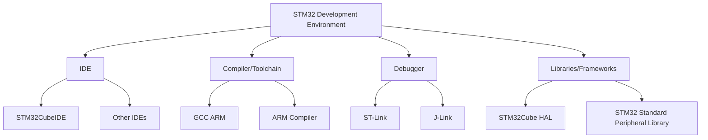

# STM32 IDE Setup

## Introduction

Setting up a proper development environment is the first critical step in working with STM32 microcontrollers. STM32 microcontrollers are powerful ARM Cortex-M based devices manufactured by STMicroelectronics, widely used in embedded systems, IoT devices, and industrial applications. This guide will walk you through the process of setting up an Integrated Development Environment (IDE) for STM32 development, making your journey into embedded programming smoother and more productive.

In this tutorial, we'll cover the installation and configuration of STM32CubeIDE, which is the official and recommended IDE for STM32 development. We'll also explore alternative development environments to help you choose the best option for your specific needs.

## Prerequisites

Before we begin, ensure you have:
- A computer running Windows 10/11, macOS, or Linux
- At least 2GB of RAM (4GB or more recommended)
- At least 5GB of free disk space
- Administrator privileges on your computer
- An internet connection for downloading the necessary software
- Basic understanding of microcontrollers (optional but helpful)

## Understanding STM32 Development Tools

Before diving into the installation process, let's understand the key components of an STM32 development environment:



## Installing STM32CubeIDE

STM32CubeIDE is an all-in-one development platform that combines:
- A powerful code editor
- GCC compiler for ARM
- Debugging capabilities
- STM32CubeMX for graphical configuration and code generation

### Step 1: Download STM32CubeIDE

1. Visit the [official STMicroelectronics website](https://www.st.com/en/development-tools/stm32cubeide.html)
2. Click on the "Get Software" button
3. You will be prompted to log in or create an account (it's free)
4. After logging in, select the appropriate version for your operating system
5. Accept the license agreement and download the installer

### Step 2: Install STM32CubeIDE

#### On Windows:

1. Locate the downloaded installer file (`.exe` or `.zip`)
2. If it's a zip file, extract it first
3. Right-click on the installer and select "Run as administrator"
4. Follow the installation wizard:
   - Accept the license agreement
   - Choose the installation directory (default is recommended)
   - Select components to install (keep all default selections)
   - Choose whether to create shortcuts
   - Click "Install"
5. Wait for the installation to complete

#### On macOS:

1. Locate the downloaded `.dmg` file
2. Double-click to mount it
3. Drag the STM32CubeIDE application to the Applications folder
4. Right-click on the application and select "Open" (this is necessary the first time to bypass security warnings)
5. Follow any additional prompts to complete the installation

#### On Linux:

1. Open a terminal in the directory where you downloaded the installer
2. Make the installer executable:
   ```bash
   chmod +x en.st-stm32cubeide_*.sh
   ```
3. Run the installer:
   ```bash
   sudo ./en.st-stm32cubeide_*.sh
   ```
4. Follow the installation wizard prompts
5. Accept the license agreement and select the installation directory

### Step 3: First Launch Configuration

When launching STM32CubeIDE for the first time:

1. You'll be prompted to select a workspace directory (this is where your projects will be stored)
2. Create a new folder or use the default location
3. Check "Use this as default and do not ask again" if desired
4. Click "Launch"
5. The IDE will start and you might see a welcome screen with tutorials and documentation

## Creating Your First STM32 Project

Let's create a basic project to verify that your setup is working correctly:

### Step 1: Create a New Project

1. Click on File → New → STM32 Project
2. The STM32 Project wizard will appear (this is actually STM32CubeMX integrated into the IDE)
3. Select your target STM32 board or MCU:
   - Choose "Board Selector" if you have an STM32 development board
   - Choose "MCU/MPU Selector" if you're using a custom board with an STM32 chip
4. If using "Board Selector", find your board from the list (e.g., NUCLEO-F401RE)
5. Click "Next"

### Step 2: Project Configuration

1. Enter a project name (e.g., "LEDBlink")
2. Keep the default location or choose a custom one
3. Select the targeted language:
   - C
   - C++
4. Keep the default settings for:
   - Targeted Project Type: STM32Cube
   - Binary Type: Executable
5. Click "Finish"

### Step 3: Configure the Microcontroller

The STM32CubeMX interface will open, allowing you to graphically configure:

1. Clock settings
2. Peripherals
3. Middleware
4. Pins and GPIO

For a simple LED blink project:

1. Navigate to the Pinout & Configuration tab
2. Find the pin connected to the built-in LED on your board (usually labeled "LD2" on NUCLEO boards)
3. Configure it as GPIO_Output
4. Go to Clock Configuration tab to setup the system clock
5. Go to Project Manager tab to confirm project settings
6. Click "Generate Code" to create the project structure

### Step 4: Write Code

After code generation, you'll see a project with the following structure:

```
LEDBlink/
├── Core/
│   ├── Inc/           # Header files
│   │   ├── main.h
│   │   ├── stm32f4xx_hal_conf.h
│   │   └── ...
│   └── Src/           # Source files
│       ├── main.c
│       ├── stm32f4xx_it.c
│       └── ...
├── Drivers/           # HAL and CMSIS libraries
├── .project
└── ...
```

Now let's modify the main.c file to create a simple LED blink program. Look for the "USER CODE BEGIN" and "USER CODE END" comments, which mark the sections you should modify.

Find the `while (1)` loop in the main function and add the following code between the USER CODE markers:

```c
/* USER CODE BEGIN 3 */
HAL_GPIO_TogglePin(LD2_GPIO_Port, LD2_Pin);
HAL_Delay(500);
/* USER CODE END 3 */
```

### Step 5: Build and Run

1. Save all files (Ctrl+S or Cmd+S)
2. Build the project by clicking the hammer icon or pressing Ctrl+B
3. Connect your STM32 board to your computer via USB
4. Click the "Run" button (green play icon) or press F11
5. If prompted to switch to the Debug perspective, click "Yes"
6. The program will be downloaded to your board and start running
7. You should see the LED blinking at a rate of once per second

## Debugging Your Code

One of the most powerful features of STM32CubeIDE is its debugging capability:

1. Set a breakpoint by double-clicking in the margin next to a line of code
2. Start debugging by clicking the bug icon or pressing F11
3. The program will run until it hits your breakpoint
4. Use the debugging controls to:
   - Step Into (F5): Execute the current line and stop at the first line of any function called
   - Step Over (F6): Execute the current line and stop at the next line in the same function
   - Resume (F8): Continue execution until the next breakpoint
5. Inspect variables by hovering over them or using the Variables view
6. Use the Registers view to inspect hardware registers
7. Use the Memory view to examine memory contents

## Alternative Development Environments

While STM32CubeIDE is the recommended option for beginners, there are several alternatives worth considering:

### 1. Keil MDK

- Commercial IDE with excellent ARM support
- Comprehensive debugging features
- Requires a license for full functionality

### 2. IAR Embedded Workbench

- Professional-grade IDE
- High-performance compiler
- Commercial solution with licensing costs

### 3. PlatformIO + Visual Studio Code


Setup steps:
1. Install Visual Studio Code
2. Install the PlatformIO extension
3. Create a new project selecting an STM32 board
4. Configure `platformio.ini` with your board settings
5. Write your code using the Arduino or STM32Cube framework
6. Build and upload using PlatformIO commands

Example `platformio.ini` for an STM32 Nucleo F401RE board:

```ini
[env:nucleo_f401re]
platform = ststm32
board = nucleo_f401re
framework = stm32cube
```

### 4. STM32CubeProgrammer

Not an IDE, but a useful companion tool for:
- Programming STM32 devices
- Reading/writing memory and configuration
- Firmware upgrades
- Production programming

## Troubleshooting Common Issues

### Problem: "ST-LINK not detected"
- Ensure the ST-LINK is properly connected
- Check USB cable (try a different one)
- Install or update ST-LINK drivers
- Try a different USB port

### Problem: "Cannot build project"
- Check for syntax errors in your code
- Ensure toolchain is properly installed
- Clean and rebuild the project
- Check project properties for correct settings

### Problem: "Program doesn't run on the board"
- Verify board power (check power LEDs)
- Ensure proper target device is selected
- Reset the board before uploading
- Try lower debugging frequency

## Best Practices for STM32 Development

1. **Organize your projects** in a dedicated workspace
2. **Use version control** (Git) to track changes
3. **Document your code** thoroughly
4. **Backup your workspace** regularly
5. **Follow the STM32 HAL coding style** for consistency
6. **Create reusable code modules** for common functionality
7. **Use STM32CubeMX** to generate initial configurations
8. **Consult reference manuals** and datasheets regularly

## Summary

In this tutorial, you've learned how to:
- Install and configure STM32CubeIDE
- Create your first STM32 project
- Build and flash a program to an STM32 board
- Debug your code using the built-in tools
- Explore alternative development environments

Setting up a proper development environment is crucial for efficient embedded systems programming. With STM32CubeIDE, you have a powerful, integrated platform that simplifies the development process, from initialization to debugging.

## Additional Resources

- [STM32 Online Training](https://www.st.com/content/st_com/en/support/learning/stm32-education.html)
- [STM32 Reference Manuals](https://www.st.com/en/microcontrollers-microprocessors/stm32-32-bit-arm-cortex-mcus.html)
- [STM32 Community](https://community.st.com/)
- [ST YouTube Channel](https://www.youtube.com/user/STonlineMedia)

## Exercises

1. **Basic LED Patterns**: Modify the LED blink code to create different patterns (e.g., SOS in Morse code)
2. **Button Input**: Add code to read a push button and control the LED with it
3. **Multiple LEDs**: If your board has multiple LEDs, create a sequence or running light effect
4. **Timer Interrupts**: Replace the `HAL_Delay()` function with a timer interrupt for more precise timing
5. **Serial Communication**: Add code to send debug messages via UART to your computer

Now that you have your development environment set up, you're ready to explore the fascinating world of STM32 microcontrollers and embedded systems programming!