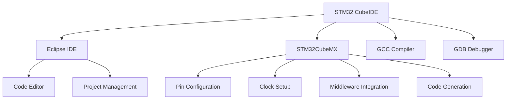

# STM32 CubeIDE

## Introduction

STM32 CubeIDE is an all-in-one development environment for STM32 microcontrollers, developed by STMicroelectronics. It combines the power of the Eclipse IDE with STM32-specific tools and features, making it the ideal platform for beginners and professionals to develop applications for STM32 devices.

In this guide, we'll explore what makes STM32 CubeIDE special, how to set it up, create your first project, and build real-world applications. Whether you're new to embedded systems or transitioning from another platform, this guide will help you master STM32 CubeIDE.

## What is STM32 CubeIDE?

STM32 CubeIDE is a free, integrated development environment that combines several tools:

- **Eclipse-based IDE**: A professional coding environment with advanced features
- **STM32CubeMX**: A graphical tool for microcontroller configuration
- **GCC Compiler**: A C/C++ compiler optimized for ARM Cortex-M processors
- **GDB Debugger**: A powerful debugging tool

Together, these components create a seamless workflow for developing, building, and debugging STM32 applications.



## Getting Started with STM32 CubeIDE

### Installation

1. Visit the [STMicroelectronics website](https://www.st.com/en/development-tools/stm32cubeide.html)
2. Download the appropriate version for your operating system (Windows, macOS, or Linux)
3. Run the installer and follow the on-screen instructions
4. Launch STM32 CubeIDE after installation

### Creating Your First Project

Let's create a simple LED blinking project to understand the basics:

1. Launch STM32 CubeIDE
2. Click on **File > New > STM32 Project**
3. In the MCU/MPU Selector, choose your STM32 board (e.g., NUCLEO-F401RE)
4. Give your project a name (e.g., "LED_Blink")
5. Click **Next** and then **Finish**

This will open STM32CubeMX within the IDE, where you can configure your microcontroller.

### Configuring GPIO for LED Control

To make an LED blink:

1. In the Pinout view, find the pin connected to your board's LED (usually PA5 on Nucleo boards)
2. Click on the pin and set it as **GPIO_Output**
3. In the left panel, go to **System Core > GPIO**
4. Set a label for your pin (e.g., "LED")
5. Click on **Project > Generate Code**

STM32CubeMX will generate the necessary initialization code for your project.

## Understanding the Generated Code

After code generation, STM32 CubeIDE will open the C project with several files:

- `main.c`: Contains the main function and application code
- `stm32fxxx_hal_msp.c`: Hardware-specific initialization
- `stm32fxxx_it.c`: Interrupt handlers
- Various HAL (Hardware Abstraction Layer) files

The most important file for beginners is `main.c`, which contains two key functions:

- `main()`: The program entry point
- `SystemClock_Config()`: Sets up the system clock

### Writing LED Blinking Code

Now let's add code to make the LED blink. Open `main.c` and find the "while (1)" loop in the main function:

```c
/* Infinite loop */
while (1)
{
  /* USER CODE BEGIN 3 */
  
  /* USER CODE END 3 */
}
```

Add your blinking code between the USER CODE comments:

```c
/* Infinite loop */
while (1)
{
  /* USER CODE BEGIN 3 */
  HAL_GPIO_TogglePin(LED_GPIO_Port, LED_Pin);
  HAL_Delay(500);  // 500ms delay
  /* USER CODE END 3 */
}
```

This code toggles the LED state and waits for 500 milliseconds, creating a blinking effect.

## Building and Uploading Your Project

To build and upload your project:

1. Click on the **Build** button (hammer icon) or press **Ctrl+B**
2. Connect your STM32 board to your computer via USB
3. Click on the **Run** button (play icon) or press **F11**

STM32 CubeIDE will build your project, flash it to your microcontroller, and start execution. You should see the LED on your board blinking at 1 Hz (once per second).

## Advanced Features of STM32 CubeIDE

### Debugging Your Project

STM32 CubeIDE includes powerful debugging features:

1. Set breakpoints by clicking in the margin next to your code
2. Click on the **Debug** button (bug icon)
3. Use the debug toolbar to control execution (step-over, step-into, continue)
4. Monitor variables, registers, and memory in real-time

Example of using breakpoints to debug:

```c
while (1)
{
  uint32_t before = HAL_GetTick();  // Get current time
  
  // Toggle LED
  HAL_GPIO_TogglePin(LED_GPIO_Port, LED_Pin);
  
  uint32_t after = HAL_GetTick();   // Get time after operation
  uint32_t operation_time = after - before;  // Calculate operation duration
  
  HAL_Delay(500 - operation_time);  // Compensate for operation time
}
```

Set a breakpoint on the `uint32_t operation_time = after - before;` line to inspect the values of `before` and `after`.

### Using STM32CubeMX Middleware

STM32 CubeIDE integrates STM32CubeMX, which provides access to middleware libraries for various peripherals:

- **USB**: Device and host stacks
- **TCP/IP**: LwIP stack for networking
- **File System**: FatFS for storage
- **Graphics**: TouchGFX for GUI applications
- **RTOS**: FreeRTOS for real-time applications

To add middleware:

1. Open your project in CubeMX (click on the `.ioc` file)
2. Go to the **Middleware** section in the left panel
3. Select and configure the middleware you need
4. Generate code

### Using Trace and Analysis Tools

STM32 CubeIDE includes advanced trace and analysis tools:

- **SWV (Serial Wire Viewer)**: For real-time variable tracing
- **ETM (Embedded Trace Macrocell)**: For instruction-level tracing
- **Core clock analysis**: For performance optimization

## Real-World Project Example: UART Communication

Let's create a more practical example of reading temperature from a sensor and sending it over UART:

### 1. Configure GPIO and UART in CubeMX

1. Configure a GPIO pin for the temperature sensor (ADC)
2. Set up UART2 for communication
3. Generate code

### 2. Write the Application Code

```c
#include "main.h"
#include <stdio.h>
#include <string.h>

UART_HandleTypeDef huart2;
ADC_HandleTypeDef hadc1;

char buffer[64];

int main(void)
{
  /* Reset of all peripherals, Initializes the Flash interface and the Systick. */
  HAL_Init();
  
  /* Configure the system clock */
  SystemClock_Config();
  
  /* Initialize all configured peripherals */
  MX_GPIO_Init();
  MX_USART2_UART_Init();
  MX_ADC1_Init();
  
  /* Infinite loop */
  while (1)
  {
    uint32_t adcValue = 0;
    float temperature = 0.0;
    
    // Start ADC conversion
    HAL_ADC_Start(&hadc1);
    
    // Wait for conversion to complete
    if (HAL_ADC_PollForConversion(&hadc1, 100) == HAL_OK)
    {
      // Read ADC value
      adcValue = HAL_ADC_GetValue(&hadc1);
      
      // Convert ADC value to temperature (example conversion)
      temperature = (adcValue * 3.3 / 4096) * 100;
      
      // Format string with temperature
      sprintf(buffer, "Temperature: %.2f C\r
", temperature);
      
      // Send over UART
      HAL_UART_Transmit(&huart2, (uint8_t*)buffer, strlen(buffer), 100);
    }
    
    // Wait one second before next reading
    HAL_Delay(1000);
  }
}
```

### 3. Testing the Application

1. Connect your STM32 board to your computer
2. Open a serial terminal (like PuTTY or Termite) with the correct COM port and baud rate (115200)
3. Build and run your project
4. Observe temperature readings in the terminal

## Optimizing STM32 Projects

### 1. Power Optimization

STM32 CubeIDE provides tools to optimize power consumption:

```c
// Enter low-power mode after sending data
HAL_UART_Transmit(&huart2, (uint8_t*)buffer, strlen(buffer), 100);
HAL_PWR_EnterSLEEPMode(PWR_MAINREGULATOR_ON, PWR_SLEEPENTRY_WFI);
```

### 2. Code Size Optimization

Optimize compiler settings:

1. Right-click on your project
2. Select **Properties**
3. Navigate to **C/C++ Build > Settings > Tool Settings > MCU GCC Compiler > Optimization**
4. Choose optimization level (Size optimization `-Os` or balanced optimization `-O2`)

### 3. Performance Optimization

Use DMA (Direct Memory Access) for efficient data transfer:

```c
// Configure DMA for UART transmission
HAL_UART_Transmit_DMA(&huart2, (uint8_t*)buffer, strlen(buffer));

// Continue with other tasks while DMA handles transfer
// ...

// In the DMA completion callback
void HAL_UART_TxCpltCallback(UART_HandleTypeDef *huart)
{
  // Handle completion of transmission
  HAL_GPIO_TogglePin(LED_GPIO_Port, LED_Pin);
}
```

## Summary

STM32 CubeIDE is a powerful, integrated development environment that streamlines the process of programming STM32 microcontrollers. With its combination of Eclipse IDE features, STM32CubeMX configuration tools, and debugging capabilities, it provides everything you need to develop embedded systems applications.

In this guide, we've covered:

- Installation and setup of STM32 CubeIDE
- Creating and configuring projects
- Writing, building, and debugging code
- Using middleware and advanced features
- Optimizing STM32 applications

As you continue your journey with STM32 microcontrollers, you'll discover even more features and capabilities that make STM32 CubeIDE an invaluable tool for embedded systems development.

## Further Resources and Exercises

### Exercises for Practice

1. **LED Patterns**: Modify the LED blink project to create different blinking patterns (SOS signal, binary counter, etc.)
2. **Button Input**: Add a button to control the LED (toggle on/off, change blink rate)
3. **Serial Communication**: Create a command-line interface over UART to control your board
4. **Sensor Integration**: Connect an I2C or SPI sensor and read data
5. **RTOS Project**: Create a simple FreeRTOS project with multiple tasks

### Additional Resources

- STM32 CubeIDE User Manual
- STM32 HAL API Reference
- STM32 Community Forums
- STM32 YouTube Tutorials
- STM32 Application Notes and Examples