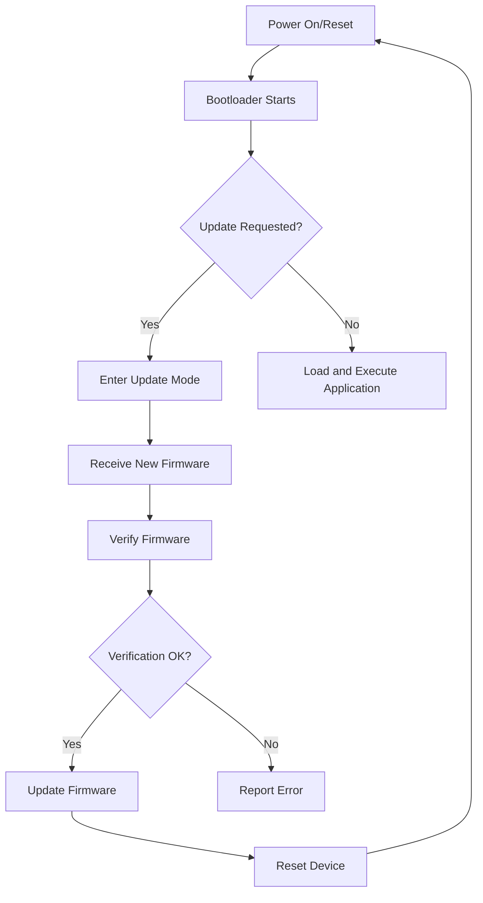
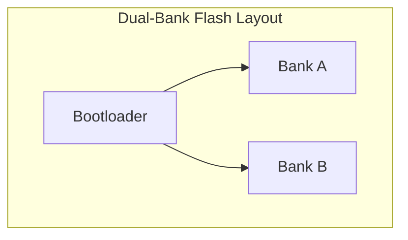

# STM32 Firmware Update

In embedded systems development, firmware updates are essential for maintaining and improving your products after they've been deployed. This guide covers everything you need to know about implementing firmware updates for STM32 microcontrollers.

## Introduction

Firmware is the software that runs on microcontrollers like the STM32 series. Unlike traditional software applications on a computer, updating firmware on embedded devices presents unique challenges because:

1. Embedded devices often operate in resource-constrained environments
2. Updates need to be reliable and fail-safe to prevent "bricking" the device
3. The update process may need to work without user intervention
4. Security is critical to prevent unauthorized code execution

This guide will walk you through the concepts, methods, and implementation of firmware update systems for STM32 microcontrollers.

## Firmware Update Concepts

### Bootloader Architecture

A bootloader is a small piece of code that runs before your main application and can be used to update the firmware. The standard architecture looks like this:



### Memory Layout

STM32 microcontrollers use flash memory to store the firmware. For firmware updates, we typically divide this memory into sections:


The bootloader area is write-protected after initial programming to ensure it can't be accidentally overwritten. The application area contains your main firmware, and the backup/update area is used to temporarily store new firmware during the update process.

## Update Methods

### In-Application Programming (IAP)

In-Application Programming allows the application to update itself. This is useful for simple updates where downtime is acceptable.

### Over-The-Air (OTA) Updates

OTA updates are delivered wirelessly, usually via Bluetooth, Wi-Fi, or other RF protocols. This method is essential for remote or inaccessible devices.

### Serial/UART Updates

Updates can be performed via UART, SPI, I2C, or USB interfaces for direct connections during development or field service.

## Implementing a Basic Bootloader

Let's implement a simple UART-based bootloader for an STM32F4 device.

### Step 1: Set Up Memory Layout

First, define your memory layout in the linker script:

```c
/* bootloader.ld */
MEMORY
{
  FLASH (rx)      : ORIGIN = 0x8000000, LENGTH = 32K   /* Bootloader: 32KB */
  APPLICATION (rx): ORIGIN = 0x8008000, LENGTH = 224K  /* Application: 224KB */
  SRAM (rwx)      : ORIGIN = 0x20000000, LENGTH = 64K  /* RAM: 64KB */
}
```

### Step 2: Bootloader Implementation

Here's a simplified version of the bootloader code:

```c
/* bootloader.c */
#include "stm32f4xx.h"

#define APP_ADDRESS 0x08008000 // Application start address

// Function pointer type for jumping to application
typedef void (*pFunction)(void);

// UART initialization for receiving firmware
void UART_Init(void) {
  // Configure UART pins (PA9 and PA10)
  RCC->AHB1ENR |= RCC_AHB1ENR_GPIOAEN;
  GPIOA->MODER &= ~(GPIO_MODER_MODER9 | GPIO_MODER_MODER10);
  GPIOA->MODER |= (GPIO_MODER_MODER9_1 | GPIO_MODER_MODER10_1);
  GPIOA->AFR[1] |= (7 << ((9 - 8) * 4)) | (7 << ((10 - 8) * 4));
  
  // Configure UART
  RCC->APB2ENR |= RCC_APB2ENR_USART1EN;
  USART1->BRR = SystemCoreClock / 115200;
  USART1->CR1 = USART_CR1_UE | USART_CR1_TE | USART_CR1_RE;
}

// Flash unlock function
void Flash_Unlock(void) {
  FLASH->KEYR = 0x45670123;
  FLASH->KEYR = 0xCDEF89AB;
}

// Flash erase function
void Flash_Erase(uint32_t address, uint8_t numPages) {
  uint8_t i;
  
  for(i = 0; i < numPages; i++) {
    FLASH->CR &= ~FLASH_CR_PSIZE;
    FLASH->CR |= FLASH_CR_PSIZE_1; // Program size = 32 bits
    FLASH->CR |= FLASH_CR_SER;
    FLASH->AR = address + (i * 0x4000); // 16KB sectors for STM32F4
    FLASH->CR |= FLASH_CR_STRT;
    
    while(FLASH->SR & FLASH_SR_BSY);
  }
  
  FLASH->CR &= ~FLASH_CR_SER;
}

// Flash write function (32-bit aligned)
void Flash_Write(uint32_t address, uint32_t *data, uint32_t length) {
  uint32_t i;
  
  FLASH->CR &= ~FLASH_CR_PSIZE;
  FLASH->CR |= FLASH_CR_PSIZE_1; // Program size = 32 bits
  FLASH->CR |= FLASH_CR_PG;
  
  for(i = 0; i < length; i++) {
    *(__IO uint32_t*)(address + (i * 4)) = data[i];
    while(FLASH->SR & FLASH_SR_BSY);
  }
  
  FLASH->CR &= ~FLASH_CR_PG;
}

// Function to check if update is requested
uint8_t Is_Update_Requested(void) {
  // Check GPIO input (e.g., button press)
  RCC->AHB1ENR |= RCC_AHB1ENR_GPIOAEN;
  GPIOA->MODER &= ~GPIO_MODER_MODER0;
  GPIOA->PUPDR |= GPIO_PUPDR_PUPDR0_0;
  
  // Wait for debounce
  for(volatile uint32_t i = 0; i < 1000000; i++);
  
  // Return 1 if button is pressed (PA0 is low)
  return (GPIOA->IDR & GPIO_IDR_ID0) == 0;
}

// Receive byte via UART
uint8_t UART_ReceiveByte(void) {
  while(!(USART1->SR & USART_SR_RXNE));
  return USART1->DR;
}

// Send byte via UART
void UART_SendByte(uint8_t byte) {
  while(!(USART1->SR & USART_SR_TXE));
  USART1->DR = byte;
}

// CRC calculation for firmware verification
uint32_t Calculate_CRC(uint32_t *data, uint32_t length) {
  uint32_t crc = 0xFFFFFFFF;
  
  // Enable CRC peripheral
  RCC->AHB1ENR |= RCC_AHB1ENR_CRCEN;
  
  // Reset CRC
  CRC->CR = CRC_CR_RESET;
  
  // Calculate CRC
  for(uint32_t i = 0; i < length; i++) {
    CRC->DR = data[i];
  }
  
  return CRC->DR;
}

int main(void) {
  // System initialization
  SystemInit();
  UART_Init();
  
  // Check if update is requested
  if(Is_Update_Requested()) {
    // Send acknowledgment to host
    UART_SendByte('U');
    
    // Receive firmware size
    uint32_t firmwareSize = 0;
    for(int i = 0; i < 4; i++) {
      firmwareSize |= (UART_ReceiveByte() << (i * 8));
    }
    
    // Receive expected CRC
    uint32_t expectedCRC = 0;
    for(int i = 0; i < 4; i++) {
      expectedCRC |= (UART_ReceiveByte() << (i * 8));
    }
    
    // Allocate memory for firmware
    uint32_t numWords = (firmwareSize + 3) / 4; // Round up to nearest word
    uint32_t *firmware = (uint32_t*)0x20000000; // Use start of SRAM
    
    // Receive firmware
    for(uint32_t i = 0; i < numWords; i++) {
      firmware[i] = 0;
      for(int j = 0; j < 4; j++) {
        firmware[i] |= (UART_ReceiveByte() << (j * 8));
      }
    }
    
    // Verify firmware using CRC
    uint32_t calculatedCRC = Calculate_CRC(firmware, numWords);
    
    if(calculatedCRC == expectedCRC) {
      // CRC OK, proceed with update
      UART_SendByte('O'); // Send OK
      
      // Unlock flash
      Flash_Unlock();
      
      // Erase application area
      Flash_Erase(APP_ADDRESS, (firmwareSize + 16383) / 16384); // Round up to nearest 16KB sector
      
      // Write new firmware
      Flash_Write(APP_ADDRESS, firmware, numWords);
      
      // Send completion confirmation
      UART_SendByte('C');
      
      // Reset system to load new firmware
      NVIC_SystemReset();
    } else {
      // CRC error
      UART_SendByte('E');
    }
  } else {
    // No update requested, jump to application if valid
    
    // Check if application is valid by verifying the stack pointer
    if((*(__IO uint32_t*)APP_ADDRESS & 0x2FFE0000) == 0x20000000) {
      // Set vector table offset register
      SCB->VTOR = APP_ADDRESS;
      
      // Get application's reset handler address
      pFunction jumpToApplication = (pFunction)(*(__IO uint32_t*)(APP_ADDRESS + 4));
      
      // Initialize application's stack pointer
      __set_MSP(*(__IO uint32_t*)APP_ADDRESS);
      
      // Jump to application
      jumpToApplication();
    }
  }
  
  // If we reach here, application is invalid or update failed
  while(1) {
    // Error indicator, e.g., blink LED
    for(volatile uint32_t i = 0; i < 500000; i++);
    // Toggle LED
    GPIOA->ODR ^= GPIO_ODR_OD5;
  }
}
```

### Step 3: Application Modification

Your application must be compiled to run from the correct address:

```c
/* application.c */
#include "stm32f4xx.h"

int main(void) {
  // Your application code here
  
  // Example: Toggle LED
  RCC->AHB1ENR |= RCC_AHB1ENR_GPIOAEN;
  GPIOA->MODER &= ~GPIO_MODER_MODER5;
  GPIOA->MODER |= GPIO_MODER_MODER5_0;
  
  while(1) {
    GPIOA->ODR ^= GPIO_ODR_OD5;
    for(volatile uint32_t i = 0; i < 1000000; i++);
  }
}
```

And modify your application's linker script:

```c
/* application.ld */
MEMORY
{
  FLASH (rx)      : ORIGIN = 0x8008000, LENGTH = 224K  /* Application: 224KB */
  SRAM (rwx)      : ORIGIN = 0x20000000, LENGTH = 64K  /* RAM: 64KB */
}
```

## Creating a Host-Side Update Tool

Let's create a simple Python script to send firmware updates via UART:

```python
import serial
import struct
import zlib
import sys
import time

def send_firmware_update(com_port, firmware_file):
    # Read firmware binary
    with open(firmware_file, 'rb') as f:
        firmware = f.read()
    
    # Calculate size and CRC
    size = len(firmware)
    crc = zlib.crc32(firmware) & 0xFFFFFFFF
    
    print(f"Firmware size: {size} bytes")
    print(f"Firmware CRC: 0x{crc:08X}")
    
    # Open serial port
    ser = serial.Serial(com_port, 115200, timeout=5)
    
    # Wait for device to be ready
    print("Waiting for device to enter bootloader mode...")
    print("Press the update button on your device now.")
    
    # Wait for acknowledgment ('U')
    ack = ser.read(1)
    if not ack or ack != b'U':
        print("Error: Device did not enter update mode")
        ser.close()
        return False
    
    print("Device in update mode. Sending firmware...")
    
    # Send firmware size (4 bytes, little-endian)
    ser.write(struct.pack('<I', size))
    
    # Send CRC (4 bytes, little-endian)
    ser.write(struct.pack('<I', crc))
    
    # Send firmware
    ser.write(firmware)
    
    # Wait for verification result
    result = ser.read(1)
    
    if result == b'O':
        print("Firmware verification passed. Updating...")
        
        # Wait for completion
        completion = ser.read(1)
        
        if completion == b'C':
            print("Update completed successfully!")
            return True
        else:
            print("Error during firmware writing")
            return False
    elif result == b'E':
        print("Error: Firmware verification failed (CRC mismatch)")
        return False
    else:
        print("Error: No response or unexpected response from device")
        return False
    
    ser.close()

if __name__ == "__main__":
    if len(sys.argv) != 3:
        print("Usage: python update_firmware.py COM_PORT FIRMWARE_FILE")
        sys.exit(1)
    
    com_port = sys.argv[1]
    firmware_file = sys.argv[2]
    
    success = send_firmware_update(com_port, firmware_file)
    
    if success:
        print("Firmware update process completed successfully")
    else:
        print("Firmware update failed")
```

## Secure Firmware Updates

For production systems, security is crucial. Here are some techniques to secure your firmware updates:

### 1. Encryption

Encrypt your firmware images to prevent unauthorized access:

```c
// Example using AES-256 (pseudo-code)
void Decrypt_Firmware(uint8_t *encrypted_data, uint8_t *decrypted_data, uint32_t size, uint8_t *key) {
  // Initialize AES context
  AES_init_ctx(&ctx, key);
  
  // Decrypt blocks
  for(uint32_t i = 0; i < size; i += 16) {
    AES_ECB_decrypt(&ctx, &encrypted_data[i]);
    memcpy(&decrypted_data[i], &encrypted_data[i], 16);
  }
}
```

### 2. Digital Signatures

Use digital signatures to verify the authenticity of firmware:

```c
// Example using ECDSA (pseudo-code)
bool Verify_Signature(uint8_t *firmware, uint32_t size, uint8_t *signature, uint8_t *public_key) {
  // Hash the firmware
  uint8_t hash[32];
  SHA256_CTX sha256;
  SHA256_Init(&sha256);
  SHA256_Update(&sha256, firmware, size);
  SHA256_Final(hash, &sha256);
  
  // Verify signature
  return ECDSA_verify(hash, signature, public_key);
}
```

### 3. Secure Boot

Implement a secure boot process that verifies firmware before execution:

```c
bool Verify_Secure_Boot(void) {
  // Check for valid signatures in flash
  uint32_t *app_start = (uint32_t*)APP_ADDRESS;
  uint32_t app_size = *(uint32_t*)(APP_ADDRESS + 0x20);
  uint8_t *signature = (uint8_t*)(APP_ADDRESS + app_size - 64);
  
  return Verify_Signature((uint8_t*)app_start, app_size - 64, signature, public_key);
}
```

## Dual-Bank Updates

For critical systems, a dual-bank approach provides fail-safe updates:



With this approach:
1. The active firmware runs from one bank
2. The new firmware is written to the inactive bank
3. After verification, the bootloader switches banks
4. If the update fails, the device can revert to the previous bank

Here's a simple implementation:

```c
// Structure to store bank metadata
typedef struct {
  uint32_t firmware_version;
  uint32_t crc;
  uint32_t is_valid;
  uint32_t is_active;
} BankMetadata;

// Flash addresses for dual-bank setup
#define BANK_A_ADDRESS        0x08010000
#define BANK_A_METADATA       0x0800F000
#define BANK_B_ADDRESS        0x08090000
#define BANK_B_METADATA       0x0808F000

// Get current active bank
uint32_t Get_Active_Bank(void) {
  BankMetadata *bankA = (BankMetadata*)BANK_A_METADATA;
  BankMetadata *bankB = (BankMetadata*)BANK_B_METADATA;
  
  if(bankA->is_valid && bankA->is_active) {
    return BANK_A_ADDRESS;
  } else if(bankB->is_valid && bankB->is_active) {
    return BANK_B_ADDRESS;
  } else if(bankA->is_valid) {
    return BANK_A_ADDRESS;
  } else if(bankB->is_valid) {
    return BANK_B_ADDRESS;
  } else {
    return 0; // No valid bank
  }
}

// Get inactive bank for update
uint32_t Get_Inactive_Bank(void) {
  uint32_t active_bank = Get_Active_Bank();
  
  if(active_bank == BANK_A_ADDRESS) {
    return BANK_B_ADDRESS;
  } else {
    return BANK_A_ADDRESS;
  }
}

// Swap active bank after successful update
void Swap_Active_Bank(void) {
  uint32_t inactive_bank = Get_Inactive_Bank();
  BankMetadata *activeMetadata;
  BankMetadata *inactiveMetadata;
  
  if(inactive_bank == BANK_A_ADDRESS) {
    activeMetadata = (BankMetadata*)BANK_B_METADATA;
    inactiveMetadata = (BankMetadata*)BANK_A_METADATA;
  } else {
    activeMetadata = (BankMetadata*)BANK_A_METADATA;
    inactiveMetadata = (BankMetadata*)BANK_B_METADATA;
  }
  
  // Update metadata
  Flash_Unlock();
  
  // Erase metadata sectors
  Flash_Erase((uint32_t)activeMetadata, 1);
  Flash_Erase((uint32_t)inactiveMetadata, 1);
  
  // Write new metadata
  BankMetadata newActive = {
    .firmware_version = activeMetadata->firmware_version,
    .crc = activeMetadata->crc,
    .is_valid = 1,
    .is_active = 0
  };
  
  BankMetadata newInactive = {
    .firmware_version = inactiveMetadata->firmware_version,
    .crc = inactiveMetadata->crc,
    .is_valid = 1,
    .is_active = 1
  };
  
  Flash_Write((uint32_t)activeMetadata, (uint32_t*)&newActive, sizeof(BankMetadata)/4);
  Flash_Write((uint32_t)inactiveMetadata, (uint32_t*)&newInactive, sizeof(BankMetadata)/4);
}
```

## Real-World Example: Delta Updates

For bandwidth-constrained systems, delta updates can significantly reduce update sizes by only sending the differences between versions:

```c
// Apply delta patch (simplified example)
void Apply_Delta_Patch(uint32_t *source, uint32_t *delta, uint32_t *destination, uint32_t size) {
  for(uint32_t i = 0; i < size/4; i++) {
    // XOR with delta to get new value
    destination[i] = source[i] ^ delta[i];
  }
}
```

The host-side tool would generate the delta by comparing the current and new firmware:

```python
def generate_delta(old_firmware, new_firmware):
    # Ensure both files are the same length by padding
    max_length = max(len(old_firmware), len(new_firmware))
    old_padded = old_firmware.ljust(max_length, b'\x00')
    new_padded = new_firmware.ljust(max_length, b'\x00')
    
    # Generate delta using XOR
    delta = bytes(a ^ b for a, b in zip(old_padded, new_padded))
    
    return delta
```

## Over-The-Air (OTA) Firmware Updates

For IoT devices, OTA updates are essential. Here's a simplified BLE OTA implementation:

```c
// BLE OTA Service UUIDs
#define OTA_SERVICE_UUID        "1D14D6EE-FD63-4FA1-BFA4-8F47B42119F0"
#define OTA_CONTROL_CHAR_UUID   "F7BF3564-FB6D-4E53-88A4-5E37E0326063"
#define OTA_DATA_CHAR_UUID      "984227F3-34FC-4045-A5D0-2C581F81A153"

// OTA States
typedef enum {
  OTA_IDLE,
  OTA_RECEIVING,
  OTA_VERIFYING,
  OTA_UPDATING,
  OTA_COMPLETE,
  OTA_ERROR
} OtaState;

// OTA Control Commands
#define OTA_CMD_START      0x01
#define OTA_CMD_END        0x02
#define OTA_CMD_ABORT      0x03
#define OTA_CMD_VERIFY     0x04

// OTA Context
typedef struct {
  OtaState state;
  uint32_t total_size;
  uint32_t received_size;
  uint32_t crc;
  uint32_t *buffer;
} OtaContext;

OtaContext ota_ctx;

// Handle OTA control characteristic writes
void OTA_Control_Handler(uint8_t *data, uint16_t len) {
  if(len < 1) return;
  
  uint8_t cmd = data[0];
  
  switch(cmd) {
    case OTA_CMD_START:
      if(len >= 9) {
        // Extract firmware size and CRC
        ota_ctx.total_size = (data[1] | (data[2] << 8) | (data[3] << 16) | (data[4] << 24));
        ota_ctx.crc = (data[5] | (data[6] << 8) | (data[7] << 16) | (data[8] << 24));
        ota_ctx.received_size = 0;
        ota_ctx.state = OTA_RECEIVING;
        
        // Allocate buffer
        ota_ctx.buffer = (uint32_t*)malloc((ota_ctx.total_size + 3) / 4 * 4); // Align to 4 bytes
        
        // Send response
        uint8_t response = 0x01; // OK
        BLE_Send_Notification(OTA_CONTROL_CHAR_UUID, &response, 1);
      }
      break;
      
    case OTA_CMD_END:
      if(ota_ctx.state == OTA_RECEIVING) {
        ota_ctx.state = OTA_VERIFYING;
        
        // Verify CRC
        uint32_t calculated_crc = Calculate_CRC(ota_ctx.buffer, (ota_ctx.total_size + 3) / 4);
        
        if(calculated_crc == ota_ctx.crc) {
          uint8_t response = 0x02; // CRC OK
          BLE_Send_Notification(OTA_CONTROL_CHAR_UUID, &response, 1);
          
          ota_ctx.state = OTA_UPDATING;
          
          // Start update process
          // (Flash erase and write operations would go here)
          
          ota_ctx.state = OTA_COMPLETE;
          
          // Send completion notification
          response = 0x03; // Update complete
          BLE_Send_Notification(OTA_CONTROL_CHAR_UUID, &response, 1);
          
          // Schedule reset after notification is sent
          Schedule_System_Reset(500); // Reset after 500ms
        } else {
          uint8_t response = 0x04; // CRC Error
          BLE_Send_Notification(OTA_CONTROL_CHAR_UUID, &response, 1);
          ota_ctx.state = OTA_ERROR;
        }
      }
      break;
      
    case OTA_CMD_ABORT:
      // Clean up and return to idle state
      if(ota_ctx.buffer) {
        free(ota_ctx.buffer);
        ota_ctx.buffer = NULL;
      }
      ota_ctx.state = OTA_IDLE;
      break;
  }
}

// Handle OTA data characteristic writes
void OTA_Data_Handler(uint8_t *data, uint16_t len) {
  if(ota_ctx.state == OTA_RECEIVING) {
    // Check if we have space
    if(ota_ctx.received_size + len <= ota_ctx.total_size) {
      // Copy data to buffer
      memcpy((uint8_t*)ota_ctx.buffer + ota_ctx.received_size, data, len);
      ota_ctx.received_size += len;
      
      // Send progress notification every 10%
      uint8_t progress = (ota_ctx.received_size * 100) / ota_ctx.total_size;
      if(progress % 10 == 0) {
        uint8_t response[2] = {0x05, progress}; // Progress update
        BLE_Send_Notification(OTA_CONTROL_CHAR_UUID, response, 2);
      }
    }
  }
}
```

## Summary

In this guide, we've covered:

1. The fundamentals of firmware updates for STM32 microcontrollers
2. How to implement a basic bootloader
3. Secure firmware update techniques
4. Dual-bank updates for fail-safe operation
5. Delta updates to reduce bandwidth usage
6. Over-the-air update implementation

Firmware updates are a critical part of embedded systems development. They allow you to fix bugs, add features, and improve security even after your devices are deployed in the field. By implementing a robust firmware update system, you ensure your products remain maintainable and secure throughout their lifecycle.

## Additional Resources

- [STM32 Bootloader Application Note (AN2606)](https://www.st.com/resource/en/application_note/cd00167594-stm32-microcontroller-system-memory-boot-mode-stmicroelectronics.pdf)
- [STM32 In-Application Programming Application Note (AN3155)](https://www.st.com/resource/en/application_note/cd00264342-usart-protocol-used-in-the-stm32-bootloader-stmicroelectronics.pdf)
- [STM32 Flash Memory Programming Manual](https://www.st.com/resource/en/programming_manual/pm0081-stm32f40xxx-stm32f41xxx-stm32f42xxx-stm32f43xxx-advanced-armbased-32bit-mcus-stmicroelectronics.pdf)

## Practice Exercises

1. **Basic Bootloader**: Implement the UART bootloader described in this guide on an STM32F4 development board. Use the provided host-side tool to upload a simple blinking LED application.

2. **Secure Bootloader**: Extend the basic bootloader to include firmware verification using SHA-256 and a pre-shared key.

3. **Dual-Bank Implementation**: Modify the firmware to support dual-bank updates with automatic fallback if the new firmware fails to boot.

4. **BLE OTA**: If you have an STM32 with Bluetooth capability, implement the OTA update mechanism described in this guide.

5. **Web Update Tool**: Create a web interface that connects to your STM32 device via WebUSB and allows firmware updates directly from the browser.