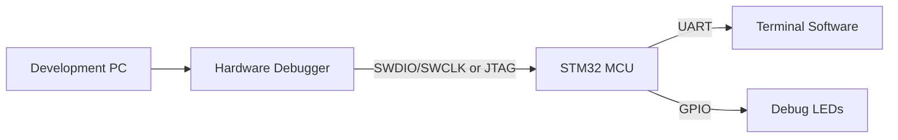

# STM32 Debugging Tools

## Introduction

Debugging is a critical skill in embedded systems development. When working with STM32 microcontrollers, having the right debugging tools and techniques can save hours of frustration and help you develop reliable applications. Unlike traditional software development where you have a rich operating system environment, embedded systems often require specialized hardware and software tools to observe and control program execution.

This guide explores the various debugging tools available for STM32 development, from simple techniques like LED debugging to more sophisticated approaches using dedicated hardware debuggers and IDE integrations.

## Debugging Fundamentals for STM32

Before diving into specific tools, let's understand what makes debugging embedded systems different:

1. **Limited Resources**: STM32 microcontrollers have limited RAM and processing power
2. **Real-time Constraints**: Many embedded applications have timing requirements
3. **Hardware Interactions**: Software interacts directly with hardware peripherals
4. **No Operating System** (in many cases): No built-in debugging facilities

These constraints make specialized debugging tools essential for efficient development.

## Basic Debugging Techniques

### LED Debugging

The simplest form of debugging uses LEDs connected to GPIO pins to indicate program state.

```c
// Simple LED debugging example
void process_data(void) {
    // Turn on debugging LED to indicate function entry
    HAL_GPIO_WritePin(DEBUG_LED_PORT, DEBUG_LED_PIN, GPIO_PIN_SET);
    
    // Process data here...
    
    // Turn off LED to indicate function exit
    HAL_GPIO_WritePin(DEBUG_LED_PORT, DEBUG_LED_PIN, GPIO_PIN_RESET);
}
```

**Advantages:**
- No additional hardware required
- Works even when communication interfaces are unavailable
- Doesn't affect timing significantly

**Limitations:**
- Very limited information can be conveyed
- Requires physical observation
- Can't track complex program flow

### Printf Debugging

Many STM32 developers redirect `printf()` output to a UART interface for basic logging.

```c
// Redirect printf to UART
int _write(int file, char *ptr, int len) {
    HAL_UART_Transmit(&huart2, (uint8_t*)ptr, len, HAL_MAX_DELAY);
    return len;
}

// Example usage
void temperature_sensor_read(void) {
    float temp = read_temperature();
    printf("Temperature reading: %.2f°C\r
", temp);
    
    if (temp > 50.0f) {
        printf("WARNING: Temperature threshold exceeded!\r
");
    }
}
```

**Advantages:**
- Provides rich textual information
- Can log complex data values
- Easy to implement

**Limitations:**
- Affects timing (slow UART transmission)
- Requires UART pins
- Consumes flash and RAM resources
- Can cause issues in interrupt contexts

## Hardware Debugging Interfaces

STM32 microcontrollers support industry-standard debugging interfaces that allow direct access to the CPU core.

### JTAG Interface

JTAG (Joint Test Action Group) is a standardized interface that provides testing and debugging capabilities.

**Key features:**
- Multiple-wire interface (typically 5 signals: TDI, TDO, TCK, TMS, TRST)
- Supports boundary scan testing
- Allows full access to CPU and peripherals
- Works with multiple devices in a chain

### SWD Interface

SWD (Serial Wire Debug) is ARM's 2-pin alternative to JTAG, optimized for microcontrollers.

**Key features:**
- Uses only 2 pins (SWDIO and SWCLK)
- Provides the same debugging capabilities as JTAG
- More suitable for pin-constrained devices
- Supported by all STM32 microcontrollers

Here's a diagram showing how these interfaces connect to an STM32 device:



## Hardware Debugging Tools

### ST-LINK/V2

The ST-LINK/V2 is ST's official debugging and programming tool for STM32 devices.

**Features:**
- Integrated on most STM32 development boards (Nucleo, Discovery)
- Supports both JTAG and SWD interfaces
- USB connection to host computer
- Works with ST's tools and third-party IDEs
- Virtual COM port for UART communication

### J-Link

Segger's J-Link is a professional debugger with advanced features.

**Features:**
- High-speed programming and debugging
- Supports unlimited breakpoints (even in flash memory)
- Works with multiple IDEs
- Advanced features like Real-Time Transfer (RTT) for logging
- Supports a wide range of microcontrollers beyond STM32

### STLINK-V3

The latest generation of ST's debugging probe with enhanced features.

**Features:**
- Faster programming and debugging speed
- Multiple communication interfaces
- Power monitoring capabilities
- Virtual COM port and bridge interfaces
- Compatible with all STM32 series

## Software Debugging Tools

### STM32CubeIDE

ST's official IDE combines code generation tools with debugging capabilities.

**Debugging features:**
- Breakpoints and watchpoints
- Variable watching and memory inspection
- Peripheral register view
- Live expressions
- Disassembly view

Here's how to set up a basic debugging session in STM32CubeIDE:

1. Connect your ST-LINK debugger to the target board
2. Build your project with debugging information
3. Click the "Debug" button or select "Debug As > STM32 C/C++ Application"
4. Use breakpoints to pause execution at specific points
5. Inspect variables and memory contents in the debug perspective

```c
// Example code with strategic breakpoint placement
int main(void) {
    HAL_Init();
    SystemClock_Config();
    MX_GPIO_Init();
    MX_USART2_UART_Init();
    
    uint32_t counter = 0;
    
    while (1) {
        // Good breakpoint location to inspect the counter
        counter++;
        
        // Process based on counter value
        if (counter % 100 == 0) {
            HAL_GPIO_TogglePin(LD2_GPIO_Port, LD2_Pin);
            printf("Counter reached: %lu\r
", counter);
        }
        
        HAL_Delay(10);
    }
}
```

### OpenOCD

Open On-Chip Debugger is an open-source debugging tool that supports various debug adapters.

**Features:**
- Works with ST-LINK, J-Link, and other adapters
- Command-line interface for scripting
- GDB server for integration with IDEs
- Flash programming capabilities
- Configurable for custom hardware

Example OpenOCD configuration for STM32F4 with ST-LINK:

```bash
# Launch OpenOCD with STM32F4 and ST-LINK
openocd -f interface/stlink.cfg -f target/stm32f4x.cfg
```

### GDB (GNU Debugger)

GDB provides a powerful command-line debugging interface that can connect to OpenOCD.

**Key GDB commands:**
- `break <location>`: Set breakpoint
- `continue`: Resume execution
- `step`: Execute one line, stepping into functions
- `next`: Execute one line, stepping over functions
- `print <variable>`: Examine variable values
- `backtrace`: Show call stack

Example GDB session:

```bash
# Connect GDB to OpenOCD
arm-none-eabi-gdb -ex "target remote localhost:3333" your_program.elf

# Set a breakpoint at main
(gdb) break main
Breakpoint 1 at 0x8000130: file main.c, line 42.

# Start execution
(gdb) continue
Continuing.

Breakpoint 1, main () at main.c:42
42    HAL_Init();

# Inspect a variable
(gdb) print counter
$1 = 0
```

## Advanced Debugging Techniques

### Logic Analyzer

A logic analyzer can capture digital signals to analyze timing and protocol issues.

**Applications:**
- Debugging communication protocols (SPI, I2C, UART)
- Measuring timing between events
- Correlating hardware signals with program execution
- Protocol decoding

### Trace Capabilities

Some STM32 microcontrollers support trace capabilities through the SWO (Serial Wire Output) pin.

**Features:**
- Real-time tracing without stopping the CPU
- Instrumentation Trace Macrocell (ITM) for printf-style debugging
- Event and data tracing
- Performance analysis

Example ITM printf implementation:

```c
// Redirect printf to ITM Stimulus Port 0
int _write(int file, char *ptr, int len) {
    for (int i = 0; i < len; i++) {
        ITM_SendChar((*ptr++));
    }
    return len;
}
```

### Memory Watchpoints

Watchpoints trigger when specific memory locations are accessed or modified.

**Use cases:**
- Detecting unintended memory writes
- Tracking down memory corruption
- Understanding data flow in complex programs

### Fault Analysis

STM32 Cortex-M processors provide fault status registers to diagnose hard faults and other exceptions.

```c
// Fault handler with analysis
void HardFault_Handler(void) {
    // Retrieve fault status registers
    volatile uint32_t CFSR = SCB->CFSR;
    volatile uint32_t HFSR = SCB->HFSR;
    volatile uint32_t DFSR = SCB->DFSR;
    volatile uint32_t AFSR = SCB->AFSR;
    volatile uint32_t MMFAR = SCB->MMFAR;
    volatile uint32_t BFAR = SCB->BFAR;
    
    // Here you can set a breakpoint and inspect these registers
    // to determine the cause of the fault
    
    while (1); // Halt execution
}
```

## Best Practices for STM32 Debugging

1. **Build incrementally**: Test small portions of code before integrating
2. **Use defensive programming**: Check return values and validate inputs
3. **Design for debuggability**: Add debug hooks and logging infrastructure
4. **Layer your approach**: Start with simple methods before using complex tools
5. **Document unexpected behaviors**: Keep notes about strange issues for future reference
6. **Use version control**: Track changes to identify when issues were introduced
7. **Understand the hardware**: Many bugs stem from misunderstanding peripheral behavior

## Debugging Common STM32 Issues

### Clock Configuration Problems

Symptoms:
- System runs slower than expected
- Peripherals don't work correctly
- Inconsistent behavior

Debugging approach:
1. Verify clock source configuration
2. Check PLL settings and dividers
3. Use an oscilloscope to measure clock signals
4. Review peripheral clock enabling

### HAL Initialization Issues

Symptoms:
- HAL functions return error codes
- Peripherals don't initialize

Debugging approach:
1. Check that MX_* initialization functions are called
2. Verify pin configurations match hardware
3. Review peripheral clock enabling
4. Examine hardware constraints (power domains, conflicting peripherals)

### Memory Corruption

Symptoms:
- Random crashes
- Variables changing unexpectedly
- Stack overflow errors

Debugging approach:
1. Use larger stack sizes during development
2. Check array bounds in loops
3. Enable memory protection unit when available
4. Use static analysis tools to detect potential issues

## Summary

Effective debugging is essential for successful STM32 development. Starting with simple techniques like LED toggling and printf debugging, you can progress to more advanced methods using hardware debuggers and sophisticated software tools. Understanding the full debugging ecosystem—from JTAG/SWD interfaces to trace capabilities—will significantly accelerate your development process and help you create more reliable embedded systems.

Remember that debugging is a skill that improves with practice. Each debugging session not only helps solve the immediate problem but also builds your experience and intuition for future projects.

## Additional Resources

- [STM32 Programming Manual](https://www.st.com): Official documentation from ST
- [ARM CoreSight Debug and Trace](https://developer.arm.com): Details on ARM's debug architecture
- [OpenOCD Documentation](http://openocd.org/doc/html/index.html): Comprehensive guide to OpenOCD
- [Debugging with GDB](https://sourceware.org/gdb/current/onlinedocs/gdb/): Official GDB documentation

## Exercises

1. Set up printf debugging over UART on your STM32 development board and log peripheral initialization status.
2. Use the STM32CubeIDE debugger to set a breakpoint in a loop and observe how a variable changes over time.
3. Create a simple LED-based debugging system with different blink patterns to indicate various error conditions.
4. Configure OpenOCD and GDB to connect to your STM32 board without using an IDE.
5. Write a custom hard fault handler that outputs diagnostic information through a debug interface.