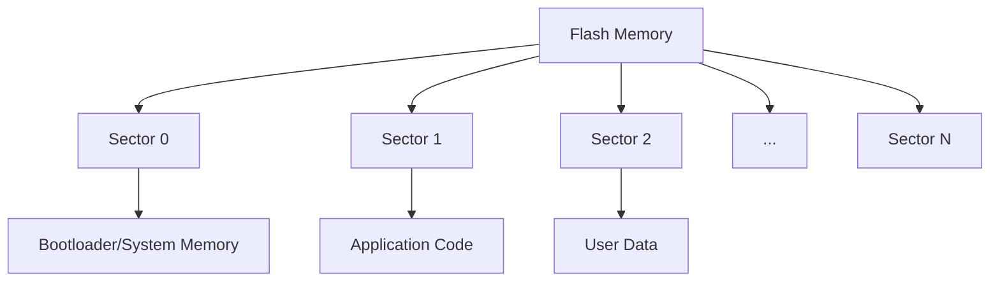

# STM32 Flash Programming

## Introduction

Flash memory is a critical component of any microcontroller, including the STM32 family. It's the non-volatile memory where your program code and persistent data are stored. Understanding how to properly program, erase, and manage flash memory is essential for developing robust STM32 applications, especially when you need to:

- Store configuration data that persists across power cycles
- Update firmware in the field
- Implement bootloaders for application updates
- Manage data that exceeds RAM capacity

This guide will walk you through the fundamentals of STM32 flash programming, from basic concepts to practical implementations, all aimed at beginners who are just starting their journey with STM32 microcontrollers.

## Flash Memory Architecture in STM32

Before diving into programming, it's important to understand how flash memory is organized in STM32 devices.

### Key Characteristics

- **Non-volatile**: Data remains when power is removed
- **Sector-based**: Memory is divided into sectors (or pages)
- **Limited write cycles**: Typically 10,000 to 100,000 erase/write cycles
- **Word-aligned access**: Data must be written in specific word sizes (usually 32-bit or 64-bit depending on the STM32 family)

### Memory Organization

Flash memory in STM32 microcontrollers is typically organized as follows:



The specific size and number of sectors vary across different STM32 families. For example:

- STM32F1 series: Uniform 2KB or 4KB pages
- STM32F4 series: Non-uniform sectors (16KB, 64KB, 128KB sectors)
- STM32L4 series: Uniform 2KB pages

## Basic Flash Operations

### Reading Flash Memory

Reading from flash memory is straightforward and similar to reading from any memory address:

```c
// Reading a 32-bit value from a specific flash address
uint32_t readValue = *(volatile uint32_t*)(FLASH_ADDRESS);
```

### Writing to Flash Memory - The Process

Writing to flash requires a specific sequence:

1. Unlock the flash memory
2. Erase the target sector (you cannot write to flash without erasing first)
3. Program the data
4. Lock the flash memory

Let's see how these operations are performed.

## Programming Flash Memory: Step by Step

### 1. Unlocking Flash Memory

Before performing any write or erase operations, you must unlock the flash control register:

```c
// Unlock sequence
HAL_FLASH_Unlock();

// If using low-level approach instead of HAL:
// FLASH->KEYR = 0x45670123;
// FLASH->KEYR = 0xCDEF89AB;
```

### 2. Erasing a Flash Sector

```c
// Using HAL library
FLASH_EraseInitTypeDef EraseInitStruct;
uint32_t SectorError = 0;

EraseInitStruct.TypeErase = FLASH_TYPEERASE_SECTORS;
EraseInitStruct.Sector = FLASH_SECTOR_NUMBER;  // Replace with your sector number
EraseInitStruct.NbSectors = 1;
EraseInitStruct.VoltageRange = FLASH_VOLTAGE_RANGE_3; // Adjust based on your board

if (HAL_FLASHEx_Erase(&EraseInitStruct, &SectorError) != HAL_OK) {
    // Error handling
}
```

### 3. Writing Data to Flash

After erasing, you can write data to the flash:

```c
// Example: Writing a 32-bit value to flash
uint32_t address = 0x08010000; // Example address, adjust based on your requirements
uint32_t data = 0x12345678;

if (HAL_FLASH_Program(FLASH_TYPEPROGRAM_WORD, address, data) != HAL_OK) {
    // Error handling
}
```

### 4. Locking Flash

After you're done with flash operations, it's crucial to lock the flash again:

```c
HAL_FLASH_Lock();
```

## Complete Example: Storing Configuration Data

Here's a practical example of storing a configuration structure in flash memory:

```c
#include "stm32f4xx_hal.h"

// Define a configuration structure
typedef struct {
    uint32_t deviceId;
    uint32_t baudRate;
    uint32_t mode;
    uint32_t checksum;
} DeviceConfig_t;

// Address where we'll store the configuration
// Make sure this is in a sector you're not using for your program!
#define CONFIG_FLASH_ADDR 0x080E0000  // Example: Sector 11 on STM32F407

// Function to save configuration to flash
HAL_StatusTypeDef SaveConfig(DeviceConfig_t *config) {
    HAL_StatusTypeDef status;
    uint32_t *source_addr = (uint32_t *)config;
    uint32_t destination_addr = CONFIG_FLASH_ADDR;
    
    // 1. Unlock flash
    HAL_FLASH_Unlock();
    
    // 2. Erase the sector
    FLASH_EraseInitTypeDef EraseInitStruct;
    uint32_t SectorError = 0;
    
    EraseInitStruct.TypeErase = FLASH_TYPEERASE_SECTORS;
    EraseInitStruct.Sector = FLASH_SECTOR_11;  // Adjust based on your device
    EraseInitStruct.NbSectors = 1;
    EraseInitStruct.VoltageRange = FLASH_VOLTAGE_RANGE_3;
    
    status = HAL_FLASHEx_Erase(&EraseInitStruct, &SectorError);
    if (status != HAL_OK) {
        HAL_FLASH_Lock();
        return status;
    }
    
    // 3. Program the data word by word
    for (int i = 0; i < sizeof(DeviceConfig_t) / 4; i++) {
        status = HAL_FLASH_Program(FLASH_TYPEPROGRAM_WORD, 
                                  destination_addr, 
                                  source_addr[i]);
        
        if (status != HAL_OK) {
            HAL_FLASH_Lock();
            return status;
        }
        
        destination_addr += 4;
    }
    
    // 4. Lock the flash
    HAL_FLASH_Lock();
    
    return HAL_OK;
}

// Function to load configuration from flash
HAL_StatusTypeDef LoadConfig(DeviceConfig_t *config) {
    // Simply copy data from flash to the config structure
    memcpy(config, (void*)CONFIG_FLASH_ADDR, sizeof(DeviceConfig_t));
    
    // You might want to verify the checksum here
    // ...
    
    return HAL_OK;
}

// Example usage in main
int main(void) {
    HAL_Init();
    // Other initialization code...
    
    DeviceConfig_t myConfig;
    
    // Try to load config
    if (LoadConfig(&myConfig) != HAL_OK) {
        // If loading fails or it's the first run, initialize with defaults
        myConfig.deviceId = 12345;
        myConfig.baudRate = 9600;
        myConfig.mode = 1;
        myConfig.checksum = myConfig.deviceId + myConfig.baudRate + myConfig.mode;
        
        // Save the default config
        SaveConfig(&myConfig);
    }
    
    // Now use the configuration
    // ...
    
    while (1) {
        // Main loop
    }
}
```

## Best Practices and Considerations

### 1. Memory Alignment

Always ensure that your write addresses are properly aligned according to the STM32 family requirements:
- 32-bit alignment for most STM32 devices
- 64-bit alignment for some high-performance variants

### 2. Power Supply Stability

Flash programming requires stable power. Voltage drops during programming can corrupt your flash memory:

```c
// Check if voltage is sufficient before programming
if (HAL_PWREx_GetVoltageRange() == FLASH_VOLTAGE_RANGE_3) {
    // Safe to program
} else {
    // Voltage too low, abort
}
```

### 3. Wear Leveling

Since flash has limited write cycles, implement wear leveling for data that changes frequently:

```c
// Simple wear leveling approach - rotate through multiple sectors
#define NUM_STORAGE_SLOTS 10
#define SLOT_SIZE 1024

uint32_t FindNextFreeSlot(void) {
    uint32_t baseAddress = CONFIG_FLASH_ADDR;
    for (int i = 0; i < NUM_STORAGE_SLOTS; i++) {
        uint32_t slotAddr = baseAddress + (i * SLOT_SIZE);
        // Check if slot is empty (contains 0xFFFFFFFF)
        if (*(uint32_t*)slotAddr == 0xFFFFFFFF) {
            return slotAddr;
        }
    }
    
    // All slots used, need to erase entire section
    return CONFIG_FLASH_ADDR;
}
```

### 4. Error Handling

Always check return values from flash operations and implement proper error handling:

```c
HAL_StatusTypeDef status = HAL_FLASH_Program(FLASH_TYPEPROGRAM_WORD, address, data);
if (status != HAL_OK) {
    switch (status) {
        case HAL_ERROR:
            // Handle general errors
            break;
        case HAL_BUSY:
            // Flash is busy, try again later
            break;
        case HAL_TIMEOUT:
            // Operation timed out
            break;
        default:
            // Unexpected error
            break;
    }
}
```

## Advanced Topic: Data Serialization

When storing complex data structures, consider serialization:

```c
// Function to serialize a structure into a byte array
void SerializeConfig(DeviceConfig_t *config, uint8_t *buffer) {
    uint32_t *ptr = (uint32_t *)buffer;
    
    ptr[0] = config->deviceId;
    ptr[1] = config->baudRate;
    ptr[2] = config->mode;
    ptr[3] = config->checksum;
}

// Function to deserialize from a byte array into a structure
void DeserializeConfig(uint8_t *buffer, DeviceConfig_t *config) {
    uint32_t *ptr = (uint32_t *)buffer;
    
    config->deviceId = ptr[0];
    config->baudRate = ptr[1];
    config->mode = ptr[2];
    config->checksum = ptr[3];
}
```

## Real-World Application: Simple Bootloader

One of the most practical applications of flash programming is implementing a bootloader that can update the main application:

```c
// Simplified bootloader concept
void CheckForFirmwareUpdate(void) {
    // Check if new firmware is available (e.g., in external flash or via UART)
    if (NewFirmwareAvailable()) {
        // 1. Unlock flash
        HAL_FLASH_Unlock();
        
        // 2. Erase application sectors
        EraseApplicationSectors();
        
        // 3. Program new firmware
        ProgramNewFirmware();
        
        // 4. Verify checksum/CRC
        if (VerifyFirmware()) {
            // 5. Update firmware version in a dedicated flash sector
            UpdateFirmwareVersion();
            
            // 6. Reset to start the new firmware
            NVIC_SystemReset();
        } else {
            // Firmware verification failed - handle error
            HandleFirmwareError();
        }
        
        // Lock flash before exiting
        HAL_FLASH_Lock();
    }
}
```

## Summary

Flash programming in STM32 microcontrollers is a powerful capability that enables persistent storage, firmware updates, and configuration management. In this guide, we've covered:

- Flash memory architecture and organization
- Basic operations: unlocking, erasing, programming, and locking
- Complete examples for storing configuration data
- Best practices for working with flash memory
- Advanced topics like wear leveling and data serialization
- Real-world application in the form of a simple bootloader

Remember these key points:

1. Always unlock before operating on flash and lock afterward
2. Erase before writing to flash
3. Respect memory alignment requirements
4. Implement error checking for all flash operations
5. Consider wear leveling for frequently updated data
6. Ensure stable power during flash operations

## Additional Resources and Exercises

### Resources
- STM32 Reference Manuals: Check the specific manual for your STM32 device family
- ST's application notes:
  - AN2594: STM32 microcontroller Flash memory in-application programming
  - AN3969: EEPROM emulation techniques for STM32 microcontrollers

### Exercises

1. **Basic Flash Writing**: Create a program that stores a counter value in flash that increments each time the device boots up.

2. **Configuration Manager**: Implement a complete configuration system that allows storing and retrieving multiple parameters with different data types.

3. **EEPROM Emulation**: Use flash memory to emulate EEPROM behavior with proper wear leveling.

4. **Firmware Update**: Develop a simple bootloader that can receive a new application image over UART and program it into flash.

5. **Data Logging**: Create a circular buffer in flash memory that can store sensor readings even when power is lost.

By mastering STM32 flash programming, you'll be able to develop more sophisticated and reliable embedded applications that can store data persistently and even update themselves in the field.