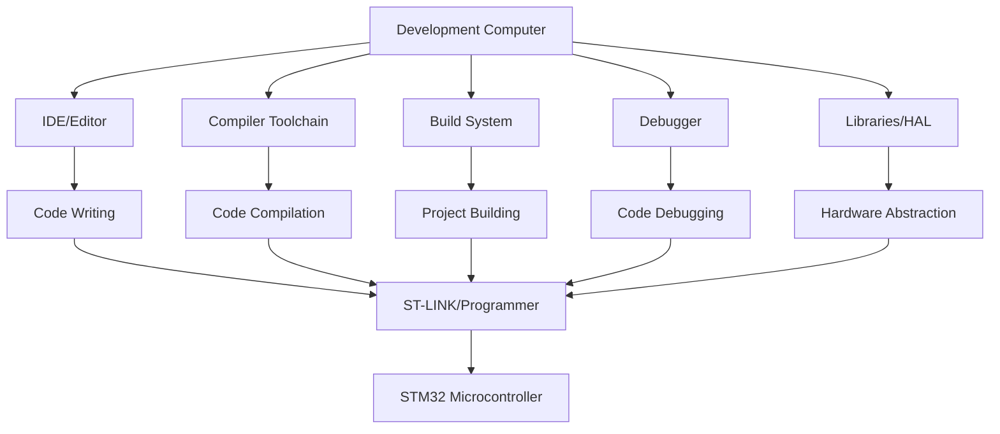

# STM32 Toolchain Setup

## Introduction

The STM32 family of microcontrollers, based on ARM Cortex-M cores, offers a powerful platform for embedded systems development. Before you can start building projects, you need to set up a proper development toolchain. A toolchain is a collection of software tools used to develop, compile, debug, and deploy code to your microcontroller.

In this guide, we'll walk through setting up a complete STM32 development environment that works across Windows, macOS, and Linux. By the end, you'll have everything you need to write, compile, and debug code for STM32 microcontrollers.

## What is a Toolchain?

A toolchain for STM32 development typically includes:

1. **Compiler and build tools** - To convert your source code into binary files that can run on the microcontroller
2. **Programmer/debugger** - To upload your code to the device and help with debugging
3. **IDE or code editor** - To write and organize your code
4. **Libraries and middleware** - To simplify interaction with the hardware

Let's set up each component step by step.

## Toolchain Components



## 1. Installing the ARM GCC Toolchain

The ARM GNU Toolchain provides the compiler and associated tools needed to build firmware for STM32 microcontrollers.

### Windows Installation

1. Download the ARM GCC toolchain from the [ARM Developer website](https://developer.arm.com/tools-and-software/open-source-software/developer-tools/gnu-toolchain/gnu-rm/downloads)
2. Run the installer and follow the installation wizard
3. Check the option to add the toolchain to your system PATH
4. Verify installation by opening Command Prompt and typing:

```bash
arm-none-eabi-gcc --version
```

### macOS Installation

Using Homebrew:

```bash
brew install --cask gcc-arm-embedded
```

Verify installation:

```bash
arm-none-eabi-gcc --version
```

### Linux Installation

For Ubuntu/Debian:

```bash
sudo apt update
sudo apt install gcc-arm-none-eabi binutils-arm-none-eabi
```

For Fedora/Red Hat:

```bash
sudo dnf install arm-none-eabi-gcc arm-none-eabi-binutils
```

Verify installation:

```bash
arm-none-eabi-gcc --version
```

## 2. Installing Build Tools

### Make

Make is a build automation tool that automatically builds executable programs and libraries from source code.

#### Windows

Download and install Make from [ezwinports](https://sourceforge.net/projects/ezwinports/files/) or install via Chocolatey:

```bash
choco install make
```

#### macOS

Make comes with Xcode command line tools:

```bash
xcode-select --install
```

#### Linux

Make is usually pre-installed. If not:

```bash
sudo apt install make    # Ubuntu/Debian
sudo dnf install make    # Fedora/Red Hat
```

### CMake (Optional but Recommended)

CMake is a more modern build system generator that can create build files for various platforms.

#### Windows

Download and install from the [CMake website](https://cmake.org/download/) or use Chocolatey:

```bash
choco install cmake
```

#### macOS

```bash
brew install cmake
```

#### Linux

```bash
sudo apt install cmake    # Ubuntu/Debian
sudo dnf install cmake    # Fedora/Red Hat
```

## 3. Installing a Debugging Tool

ST-Link is a popular programming and debugging tool for STM32 microcontrollers.

### Windows

Download and install [STM32CubeProgrammer](https://www.st.com/en/development-tools/stm32cubeprog.html) from ST Microelectronics.

### macOS and Linux

Install OpenOCD, which supports ST-Link and other debug probes:

```bash
# macOS
brew install openocd

# Ubuntu/Debian
sudo apt install openocd

# Fedora/Red Hat
sudo dnf install openocd
```

## 4. Choosing an IDE/Editor

You have several options for developing STM32 applications:

### STM32CubeIDE

This is the official IDE from ST Microelectronics that combines a code editor, project manager, and debugging tools.

1. Download [STM32CubeIDE](https://www.st.com/en/development-tools/stm32cubeide.html)
2. Run the installer and follow the instructions
3. The IDE includes the necessary plugins and tools for STM32 development

### VS Code with Extensions

Visual Studio Code with the right extensions offers a lightweight yet powerful environment:

1. Install [Visual Studio Code](https://code.visualstudio.com/)
2. Install these extensions:
   - C/C++ Extension
   - Cortex-Debug
   - cmake-tools (if using CMake)

Example VS Code `launch.json` for debugging an STM32 project:

```json
{
  "version": "0.2.0",
  "configurations": [
    {
      "name": "Cortex Debug",
      "cwd": "${workspaceFolder}",
      "executable": "./build/your_project.elf",
      "request": "launch",
      "type": "cortex-debug",
      "servertype": "openocd",
      "device": "STM32F103C8",
      "configFiles": [
        "interface/stlink.cfg",
        "target/stm32f1x.cfg"
      ]
    }
  ]
}
```

Example `tasks.json` for building your project:

```json
{
  "version": "2.0.0",
  "tasks": [
    {
      "label": "Build",
      "type": "shell",
      "command": "make",
      "group": {
        "kind": "build",
        "isDefault": true
      }
    },
    {
      "label": "Clean",
      "type": "shell",
      "command": "make clean"
    }
  ]
}
```

## 5. Setting Up STM32 Libraries

### STM32Cube MCU Packages

ST provides comprehensive software packages for each STM32 family that include:
- Hardware Abstraction Layer (HAL)
- Low-Level drivers
- Middleware components
- Code examples

To install:

1. Download the package for your specific STM32 series from [ST's website](https://www.st.com/en/embedded-software/stm32cube-mcu-packages.html)
2. Extract the package to a known location
3. Reference this location in your build system

## Creating Your First Project

Let's put everything together and create a simple "Blink LED" project for an STM32F103 (Blue Pill) board.

### 1. Project Structure

Create the following directory structure:

```
my_stm32_project/
├── inc/
│   ├── main.h
├── src/
│   ├── main.c
│   ├── system_stm32f1xx.c
├── startup/
│   ├── startup_stm32f103xb.s
├── Makefile
├── linker_script.ld
```

### 2. Writing the Makefile

```makefile
# Project name
PROJECT = blink_led

# MCU details
MCU_FAMILY = STM32F1xx
MCU_MODEL = STM32F103xB
CPU = -mcpu=cortex-m3
FPU = -mfpu=softvfp
FLOAT-ABI = -mfloat-abi=soft

# Paths
BUILD_DIR = build
SRC_DIR = src
INC_DIR = inc
STARTUP_DIR = startup
CUBE_DIR = /path/to/STM32Cube/Repository/STM32CubeF1

# Source files
SRC = $(wildcard $(SRC_DIR)/*.c)
ASM = $(wildcard $(STARTUP_DIR)/*.s)

# Include paths
INCLUDES = -I$(INC_DIR) \
           -I$(CUBE_DIR)/Drivers/CMSIS/Device/ST/STM32F1xx/Include \
           -I$(CUBE_DIR)/Drivers/CMSIS/Include \
           -I$(CUBE_DIR)/Drivers/STM32F1xx_HAL_Driver/Inc

# Compiler flags
CFLAGS = $(CPU) $(FPU) $(FLOAT-ABI) -mthumb -Wall -g -O0 \
         -D$(MCU_MODEL) -DUSE_HAL_DRIVER \
         $(INCLUDES)

# Linker flags
LDFLAGS = -T linker_script.ld -Wl,-Map=$(BUILD_DIR)/$(PROJECT).map \
          --specs=nano.specs -lc -lm -lnosys

# Tools
CC = arm-none-eabi-gcc
AS = arm-none-eabi-as
LD = arm-none-eabi-ld
OBJCOPY = arm-none-eabi-objcopy
SIZE = arm-none-eabi-size

# Object files
OBJECTS = $(addprefix $(BUILD_DIR)/,$(notdir $(SRC:.c=.o)))
OBJECTS += $(addprefix $(BUILD_DIR)/,$(notdir $(ASM:.s=.o)))

# Targets
.PHONY: all clean flash

all: $(BUILD_DIR) $(BUILD_DIR)/$(PROJECT).elf $(BUILD_DIR)/$(PROJECT).hex $(BUILD_DIR)/$(PROJECT).bin

$(BUILD_DIR):
	mkdir -p $@

$(BUILD_DIR)/%.o: $(SRC_DIR)/%.c
	$(CC) -c $(CFLAGS) $< -o $@

$(BUILD_DIR)/%.o: $(STARTUP_DIR)/%.s
	$(AS) -c $(CFLAGS) $< -o $@

$(BUILD_DIR)/$(PROJECT).elf: $(OBJECTS)
	$(CC) $(OBJECTS) $(CFLAGS) $(LDFLAGS) -o $@
	$(SIZE) $@

$(BUILD_DIR)/$(PROJECT).hex: $(BUILD_DIR)/$(PROJECT).elf
	$(OBJCOPY) -O ihex $< $@

$(BUILD_DIR)/$(PROJECT).bin: $(BUILD_DIR)/$(PROJECT).elf
	$(OBJCOPY) -O binary $< $@

flash:
	st-flash write $(BUILD_DIR)/$(PROJECT).bin 0x8000000

clean:
	rm -rf $(BUILD_DIR)
```

### 3. Writing the Linker Script

Save this to `linker_script.ld`:

```
/* Entry Point */
ENTRY(Reset_Handler)

/* Memories definition */
MEMORY
{
  RAM    (xrw)    : ORIGIN = 0x20000000,   LENGTH = 20K
  FLASH    (rx)    : ORIGIN = 0x8000000,   LENGTH = 64K
}

/* Sections */
SECTIONS
{
  /* The program code and other data goes into FLASH */
  .text :
  {
    . = ALIGN(4);
    *(.isr_vector)
    *(.text)
    *(.text*)
    *(.rodata)
    *(.rodata*)
    . = ALIGN(4);
    _etext = .;
  } >FLASH

  /* Data values initialized by the program */
  .data :
  {
    . = ALIGN(4);
    _sdata = .;
    *(.data)
    *(.data*)
    . = ALIGN(4);
    _edata = .;
  } >RAM AT> FLASH

  /* Uninitialized data */
  .bss :
  {
    . = ALIGN(4);
    _sbss = .;
    *(.bss)
    *(.bss*)
    *(COMMON)
    . = ALIGN(4);
    _ebss = .;
  } >RAM

  /* User_heap_stack section */
  ._user_heap_stack :
  {
    . = ALIGN(8);
    PROVIDE ( end = . );
    . = . + 0x400;
    . = ALIGN(8);
  } >RAM
}
```

### 4. Creating the Main Application

In `inc/main.h`:

```c
#ifndef MAIN_H
#define MAIN_H

#include "stm32f1xx.h"

void SystemClock_Config(void);
void Error_Handler(void);

#endif /* MAIN_H */
```

In `src/main.c`:

```c
#include "main.h"

void delay(volatile uint32_t count)
{
    while(count--);
}

int main(void)
{
    /* Enable GPIOC clock */
    RCC->APB2ENR |= RCC_APB2ENR_IOPCEN;
    
    /* Configure PC13 as output push-pull (Blue Pill LED) */
    GPIOC->CRH &= ~(GPIO_CRH_CNF13);
    GPIOC->CRH |= GPIO_CRH_MODE13_0;
    
    while (1)
    {
        /* Toggle LED */
        GPIOC->ODR ^= (1 << 13);
        
        /* Delay */
        delay(500000);
    }
}

void SystemClock_Config(void)
{
    /* Set up the clock system */
    /* Default configuration is 8MHz HSI */
}

void Error_Handler(void)
{
    /* Handle errors here */
    while(1);
}
```

### 5. Building and Flashing

Now you can build and flash your project:

```bash
# Navigate to your project directory
cd my_stm32_project

# Build the project
make

# Flash to the device
make flash
```

## Using STM32CubeMX for Code Generation

STM32CubeMX is a graphical tool that can generate initialization code for your STM32 projects, making it easier to configure peripherals.

1. Download and install [STM32CubeMX](https://www.st.com/en/development-tools/stm32cubemx.html)
2. Create a new project
3. Select your STM32 microcontroller
4. Configure pins, clocks, and peripherals
5. Configure the project settings and select your IDE/toolchain
6. Generate the code

This tool creates all the initialization code and can generate project files for various IDEs and build systems.

## Common Errors and Troubleshooting

### "arm-none-eabi-gcc: command not found"

**Solution**: Ensure the toolchain is properly installed and added to your PATH.

### "Could not open source file 'stm32f1xx.h'"

**Solution**: Check your include paths in the Makefile and make sure they point to the correct locations.

### ST-Link not found when flashing

**Solution**:
- Check the USB connection
- Ensure drivers are installed
- Try restarting the ST-Link by unplugging and reconnecting

### Linker errors about undefined references

**Solution**: Ensure you're including all necessary source files and libraries in your build.

## Optimizing Your STM32 Builds

Once your basic setup is working, you can optimize your builds:

1. **Compiler Optimizations**:
   ```makefile
   CFLAGS += -O2  # For size optimization
   CFLAGS += -Os  # For better size optimization
   CFLAGS += -O3  # For speed optimization
   ```

2. **Link Time Optimization**:
   ```makefile
   CFLAGS += -flto
   ```

3. **Reducing Binary Size**:
   ```makefile
   CFLAGS += -ffunction-sections -fdata-sections
   LDFLAGS += -Wl,--gc-sections
   ```

## Advanced Setup: Integrating Debugging

For effective debugging, add these steps:

1. Install OpenOCD (On-Chip Debugger):
   ```bash
   # Ubuntu/Debian
   sudo apt install openocd
   
   # macOS
   brew install openocd
   
   # Windows (via Chocolatey)
   choco install openocd
   ```

2. Add a debug target to your Makefile:
   ```makefile
   debug:
       openocd -f interface/stlink.cfg -f target/stm32f1x.cfg -c "program $(BUILD_DIR)/$(PROJECT).elf verify reset" -c "exit"
   ```

3. For GDB debugging, in one terminal:
   ```bash
   openocd -f interface/stlink.cfg -f target/stm32f1x.cfg
   ```

4. And in another terminal:
   ```bash
   arm-none-eabi-gdb build/your_project.elf
   (gdb) target remote localhost:3333
   (gdb) monitor reset halt
   (gdb) load
   (gdb) continue
   ```

## Summary

Setting up an STM32 development toolchain involves:

1. Installing the ARM GCC toolchain for compilation
2. Setting up build tools like Make or CMake
3. Installing debugging tools and programmers
4. Choosing and configuring an IDE or editor
5. Obtaining STM32 libraries and HAL
6. Creating a project structure and build system

While the initial setup may seem complex, it provides a powerful and flexible environment for STM32 development that will serve you well for all your embedded projects.

## Additional Resources

- [STM32 Online Documentation](https://www.st.com/content/st_com/en/support/learning.html)
- [ARM Cortex-M Programming Guide](https://developer.arm.com/documentation/dui0552/latest/)
- [Embedded C Programming Tutorials](https://www.embedded.com/category/programming-languages/)

## Exercises

1. Modify the blink example to use different patterns of LED blinking
2. Add a button input to control the LED
3. Configure and use a timer peripheral instead of delay loops
4. Use STM32CubeMX to generate a project with UART communication
5. Create a project that uses multiple peripherals (e.g., ADC, I2C, and GPIO)

By following this guide, you've established a complete STM32 development environment that will serve as the foundation for your embedded systems journey. Happy coding!