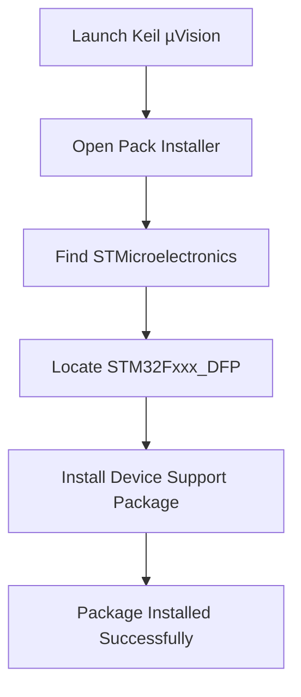

# STM32 Keil Setup

## Introduction

The STM32 family of 32-bit ARM Cortex-M microcontrollers from STMicroelectronics offers a powerful and versatile platform for embedded systems development. To begin developing applications for STM32 devices, you'll need a proper development environment. One of the most popular options is the Keil MDK-ARM (Microcontroller Development Kit), which provides a comprehensive set of tools specifically designed for ARM-based microcontrollers.

This guide will walk you through the complete process of setting up Keil MDK-ARM for STM32 development, including installation, configuration, and creating your first project. By the end of this tutorial, you'll have a functioning development environment ready for STM32 programming.

## What You'll Need

Before we begin, make sure you have:

- A computer running Windows (Keil MDK-ARM is primarily a Windows application)
- Internet connection for downloading the required software
- An STM32 development board (optional, but recommended for testing)
- A USB cable to connect your development board to your computer

## Step 1: Downloading Keil MDK-ARM

1. Visit the official Keil website at [https://www.keil.com/download/product/](https://www.keil.com/download/product/)
2. Locate the MDK-ARM entry and click on the download link
3. You'll be prompted to create a free account or log in if you already have one
4. Download the MDK-ARM installer (typically named "MDK###.EXE" where ### represents the version number)

## Step 2: Installing Keil MDK-ARM

1. Run the installer file you downloaded
2. Accept the license agreement and follow the on-screen instructions
3. When prompted for components to install, ensure the following are selected:
   - MDK-ARM Core
   - ARM Compiler
   - MDK-Essential
   - CMSIS

4. Complete the installation process

## Step 3: Installing STM32 Device Support

To work with STM32 microcontrollers, you need to install device support packages. Here's how:

1. Launch Keil MDK-ARM (µVision)
2. Navigate to **Project** → **Manage** → **Pack Installer**
3. In the Pack Installer window, locate "STMicroelectronics" in the list of vendors
4. Expand the STMicroelectronics section and find "Keil::STM32Fxxx_DFP" (Device Family Pack) for your specific STM32 family
5. Click the "Install" button next to the appropriate package



## Step 4: Activating Your License

Keil MDK-ARM offers different license options:

- **Evaluation License**: Free, but limited to 32KB code size
- **Professional License**: Paid, with unlimited code size and additional features

For beginners, the evaluation license is sufficient. To activate it:

1. Open Keil µVision
2. Navigate to **File** → **License Management**
3. Click on "Get LIC via Internet..." and follow the instructions
4. Your license will be activated automatically

## Step 5: Creating Your First STM32 Project

Now that your environment is set up, let's create a simple project:

1. Open Keil µVision
2. Go to **Project** → **New µVision Project**
3. Choose a location and name for your project (e.g., "STM32_LED_Blink")
4. In the "Select Device for Target" dialog, expand "STMicroelectronics"
5. Select your specific STM32 device (e.g., "STM32F103C8" for the popular Blue Pill board)
6. Click "OK"
7. In the "Manage Run-Time Environment" dialog, expand "CMSIS" and select "CORE"
8. Expand "Device" and select "Startup"
9. Click "OK"

Your project structure will be created with necessary startup files.

## Step 6: Adding Source Code

Let's add a simple LED blinking program. Right-click on "Source Group 1" in the Project panel and select "Add New Item to Group" → "C File (.c)". Name it "main.c" and add the following code:

```c
#include "stm32f10x.h"

// Delay function
void delay(int time) {
    int i;
    for(i = 0; i < time * 8000; i++) {
        __NOP();  // No operation
    }
}

int main(void) {
    // Enable GPIOC clock
    RCC->APB2ENR |= RCC_APB2ENR_IOPCEN;
    
    // Configure PC13 as output push-pull (Blue Pill LED)
    GPIOC->CRH &= ~(GPIO_CRH_MODE13 | GPIO_CRH_CNF13);
    GPIOC->CRH |= GPIO_CRH_MODE13_0 | GPIO_CRH_MODE13_1;
    
    while(1) {
        // Toggle LED
        GPIOC->ODR ^= (1 << 13);
        delay(500);  // Delay 500ms
    }
}
```

**Note**: This code is for an STM32F103 microcontroller with an LED on pin PC13 (common on Blue Pill boards). Adjust the pin and port if your board is different.

## Step 7: Configuring Project Options

Before building your project, you need to configure a few options:

1. Right-click on "Target 1" in the Project panel and select "Options for Target 'Target 1'"
2. Go to the "Target" tab and set the crystal frequency according to your board (typically 8.0 MHz for Blue Pill)
3. Navigate to the "C/C++" tab and add the following to the "Define" box: `USE_STDPERIPH_DRIVER`
4. In the "Debug" tab, select your debug adapter (e.g., "ST-Link Debugger")
5. Click "OK" to save your settings

## Step 8: Building and Flashing the Project

Now you're ready to build and flash your project:

1. Click on the "Build" button (or press F7) to compile your code
2. If successful, the output window will show "0 Error(s), 0 Warning(s)"
3. Connect your STM32 board to your computer using a USB cable
4. Click on the "Download" button (or press F8) to flash the program to your board

If everything is set up correctly, you should see the LED on your STM32 board blinking!

## Common Issues and Troubleshooting

### Error: "Error: Flash Download failed"
- Ensure your board is properly connected
- Check that you've selected the correct debug adapter
- Try resetting your board

### Error: "Error: No Device Found"
- Check your USB connection
- Make sure you have the correct STM32 USB drivers installed
- Try a different USB port

### Build Errors
- Verify that you've installed the correct device support package
- Check your code for syntax errors
- Ensure all necessary CMSIS files are included

## Advanced Configuration: Using STM32CubeMX with Keil

For more complex projects, you can use STM32CubeMX to generate initialization code:

1. Download and install STM32CubeMX from the ST website
2. Create a new project in STM32CubeMX
3. Configure pins, peripherals, and clocks as needed
4. In the "Project Manager" tab, select "MDK-ARM V5" as the Toolchain/IDE
5. Generate the code
6. Open the generated project in Keil µVision

## Summary

Congratulations! You've successfully set up Keil MDK-ARM for STM32 development. In this tutorial, you learned:

- How to download and install Keil MDK-ARM
- How to add STM32 device support
- How to create, build, and flash a simple STM32 project
- Basic troubleshooting techniques

This setup provides a solid foundation for developing a wide range of applications on STM32 microcontrollers, from simple LED blinking to complex embedded systems.

## Further Learning Resources

To continue your STM32 development journey, explore these topics:

- STM32 HAL (Hardware Abstraction Layer) libraries
- STM32 peripherals (UART, SPI, I2C, ADC, etc.)
- RTOS (Real-Time Operating System) implementation on STM32
- Direct Memory Access (DMA) for efficient data transfer
- Low-power modes and battery-operated applications

## Practice Exercises

1. Modify the LED blinking code to create different blinking patterns
2. Connect multiple LEDs and create a sequence
3. Add a button to control the LED state
4. Implement a PWM output to control LED brightness
5. Create a UART interface to control your STM32 from a computer terminal

Remember that embedded development is best learned through hands-on practice, so don't hesitate to experiment with your STM32 board and explore its capabilities!