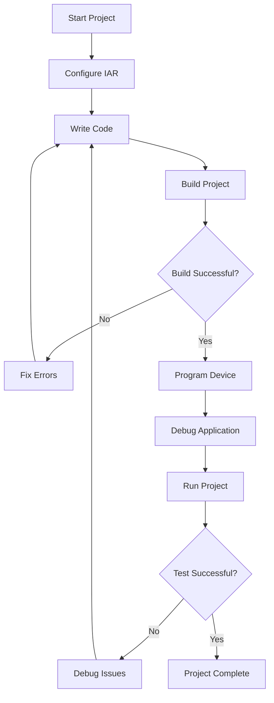

# STM32 IAR Setup

## Introduction

Setting up a proper development environment is the first crucial step in embedded systems programming. This guide focuses on configuring IAR Embedded Workbench for STM32 microcontrollers. IAR is a powerful commercial Integrated Development Environment (IDE) widely used in the industry for professional embedded development. It offers comprehensive features including code editing, compilation, debugging, and project management specifically designed for microcontroller development.

## Prerequisites

Before we begin setting up IAR for STM32 development, ensure you have:

- A Windows computer (IAR primarily targets Windows environments)
- Administrator rights on your computer
- At least 2GB of free disk space
- An STM32 development board (e.g., STM32F4Discovery, Nucleo, etc.)
- A USB cable compatible with your development board

## Installation Process

### 1. Downloading the IAR Embedded Workbench

IAR Embedded Workbench comes in different versions for various microcontroller architectures. For STM32 (which uses ARM Cortex-M cores), you'll need the IAR Embedded Workbench for ARM.

1. Visit the [IAR Systems official website](https://www.iar.com)
2. Navigate to the Products section and select "IAR Embedded Workbench for ARM"
3. Select the latest version available
4. You'll need to register for either:
   - A commercial license
   - A time-limited evaluation version
   - A size-limited Kickstart Edition (free but with code size restrictions)

### 2. Installing IAR Embedded Workbench

Once downloaded, follow these steps to install:

1. Run the installer executable (.exe file)
2. Accept the license agreement
3. Choose the installation location (default is usually fine)
4. Select the components to install:
   - Core IAR Embedded Workbench
   - ARM device support
   - Example projects
   - Documentation

5. Complete the installation process

### 3. Installing STM32 Device Support

IAR requires specific support files for STM32 devices:

1. In IAR, go to `Tools > Package Manager`
2. Find and install the "STMicroelectronics STM32" package
3. This package includes device descriptions, headers, and debug configurations

Alternatively, you can manually install ST's device pack:

1. Download the CMSIS Device pack for your STM32 family from ST's website
2. In IAR, go to `Tools > Options > Package Manager`
3. Use "Import" to add the downloaded package

## Creating Your First STM32 Project in IAR

Let's create a simple project to verify our setup:

### 1. Project Creation

1. Launch IAR Embedded Workbench
2. Go to `Project > Create New Project`
3. Select `C > main` template
4. Choose a location and name for your project
5. Select your STM32 device in the device selector:
   - Expand the ST section
   - Select your specific microcontroller (e.g., STM32F407VG)

### 2. Project Configuration

Configure your project settings:

1. Right-click the project name in the workspace and select `Options`
2. Under `General Options > Target`:
   - Verify the device is correctly selected
   - Set Core to the appropriate ARM core (e.g., Cortex-M4 for STM32F4)

3. Under `Debugger`:
   - Set driver to "ST-LINK"
   - Configure any specific debugging options

4. Under `Linker`:
   - Select the appropriate linker configuration file for your device
   - IAR typically provides default linker files for STM32 devices

### 3. Basic LED Blink Program

Let's write a simple program to blink an LED on your STM32 board. This example assumes an STM32F4Discovery board with an LED on port D, pin 12:

```c
#include "stm32f4xx.h"

void delay(int count) {
  while (count--) {
    // Simple delay loop
    volatile int i = 8000;
    while (i--);
  }
}

int main() {
  // Enable clock for GPIOD
  RCC->AHB1ENR |= RCC_AHB1ENR_GPIODEN;
  
  // Configure PD12 as output
  GPIOD->MODER |= GPIO_MODER_MODER12_0;
  GPIOD->MODER &= ~GPIO_MODER_MODER12_1;
  
  while (1) {
    // Toggle LED
    GPIOD->ODR ^= GPIO_ODR_OD12;
    delay(500);
  }
}
```

### 4. Building and Flashing

1. Build your project with `Project > Make` or press F7
2. Connect your STM32 board to your computer via USB
3. Go to `Project > Download and Debug` or press Ctrl+D
4. IAR should program the device and enter debug mode
5. Press F5 to run the program

## Debugging in IAR

IAR provides powerful debugging capabilities:

### 1. Setting Breakpoints

1. Click in the margin next to a line of code to set a breakpoint
2. Alternatively, use `Debug > Toggle Breakpoint` or press F9

### 2. Viewing Variables

1. When in debug mode, hover over variables to see their values
2. Use the Watch window to monitor specific variables
3. The Locals window shows variables in the current scope

### 3. Register and Memory Inspection

1. Use the Register window to view and edit CPU and peripheral registers
2. The Memory window allows inspection of any memory location



## Advanced Configuration

### 1. Using External Tools with IAR

IAR supports integration with various external tools:

1. Go to `Tools > Configure Tools`
2. Click `Add` to configure new tools
3. You can add ST-specific tools like STM32CubeMX for configuration

### 2. Optimizing Code for Size or Speed

IAR provides various optimization levels:

1. In project options, go to `C/C++ Compiler > Optimizations`
2. Choose optimization level:
   - None: No optimization (best for debugging)
   - Low: Basic optimizations
   - Medium: Good balance
   - High: Maximum optimization (may be harder to debug)

3. Select between optimization for size or speed

### 3. Flash Loader Configuration

For custom programming options:

1. In project options, go to `Debugger > Download`
2. Configure flash loading parameters
3. You can specify which memory regions to program

## Common Issues and Troubleshooting

### 1. ST-LINK Connection Problems

If IAR cannot connect to your device:

1. Verify USB connection is secure
2. Check if ST-LINK drivers are properly installed
3. Try updating ST-LINK firmware via ST's STM32CubeProgrammer
4. Ensure the board is powered properly

### 2. Build Errors

For compilation issues:

1. Check include paths in project options
2. Verify the correct device is selected
3. Look for missing header files or dependencies
4. Check for syntax errors in your code

### 3. Debugging Issues

If debugging doesn't work properly:

1. Verify debug settings in project options
2. Check if optimization levels are interfering with debugging
3. Try resetting the device and reconnecting
4. Use a lower clock speed during debugging

## Real-World Example: UART Communication

Let's create a more practical example that demonstrates UART communication with an STM32 using IAR:

```c
#include "stm32f4xx.h"

void UART_Init(void) {
  // Enable clock for GPIOA and USART2
  RCC->AHB1ENR |= RCC_AHB1ENR_GPIOAEN;
  RCC->APB1ENR |= RCC_APB1ENR_USART2EN;
  
  // Configure PA2 (TX) and PA3 (RX) for USART2
  GPIOA->MODER &= ~(GPIO_MODER_MODER2_0 | GPIO_MODER_MODER3_0);
  GPIOA->MODER |= (GPIO_MODER_MODER2_1 | GPIO_MODER_MODER3_1);  // Alternate function
  
  // Set alternate function to USART2 (AF7)
  GPIOA->AFR[0] &= ~(GPIO_AFRL_AFRL2 | GPIO_AFRL_AFRL3);
  GPIOA->AFR[0] |= (7 << (4 * 2)) | (7 << (4 * 3));
  
  // Configure USART2: 9600 baud, 8-bit data, no parity, 1 stop bit
  // Assuming 16 MHz system clock
  USART2->BRR = 0x0683;  // 16MHz/9600 = 1666 = 0x0683
  
  // Enable USART2 transmitter and receiver
  USART2->CR1 = USART_CR1_TE | USART_CR1_RE | USART_CR1_UE;
}

void UART_SendChar(char c) {
  // Wait until transmit data register is empty
  while (!(USART2->SR & USART_SR_TXE));
  
  // Send character
  USART2->DR = c;
}

void UART_SendString(char* str) {
  while (*str) {
    UART_SendChar(*str++);
  }
}

char UART_ReceiveChar(void) {
  // Wait until data is received
  while (!(USART2->SR & USART_SR_RXNE));
  
  // Return received data
  return (char)USART2->DR;
}

int main(void) {
  // Initialize UART
  UART_Init();
  
  // Send welcome message
  UART_SendString("STM32 UART Example\r
");
  
  while (1) {
    // Echo received characters
    char received = UART_ReceiveChar();
    UART_SendChar(received);
  }
}
```

To test this example:
1. Build and flash the program
2. Connect to the UART pins (PA2 and PA3) using a USB-to-UART converter
3. Open a terminal program (like PuTTY or Tera Term) with these settings:
   - Baud rate: 9600
   - Data bits: 8
   - Parity: None
   - Stop bits: 1
   - Flow control: None

4. Type messages in the terminal and see them echo back

## Summary

Setting up IAR Embedded Workbench for STM32 development provides a powerful environment for embedded systems programming. In this guide, we've covered:

- Installation and configuration of IAR Embedded Workbench
- Setting up device support for STM32 microcontrollers
- Creating and configuring a basic project
- Writing, building, and debugging embedded applications
- Troubleshooting common issues
- Creating a practical UART communication example

This setup gives you a professional-grade development environment that's widely used in the industry. The combination of IAR's powerful toolchain and STM32's versatile microcontrollers provides an excellent platform for learning embedded systems programming.

## Additional Resources

To continue learning about STM32 development with IAR:

- Explore IAR's built-in example projects
- Read the STM32 family reference manuals
- Study the peripheral library documentation
- Practice with different peripherals like SPI, I2C, ADC, etc.

## Exercises

1. Modify the LED blink example to use a different GPIO pin or change the blink pattern
2. Expand the UART example to process commands received via serial port
3. Create a project that uses multiple peripherals together (e.g., read an ADC value and output it via UART)
4. Implement a simple state machine for controlling your application
5. Try debugging with breakpoints and watch variables to understand program flow