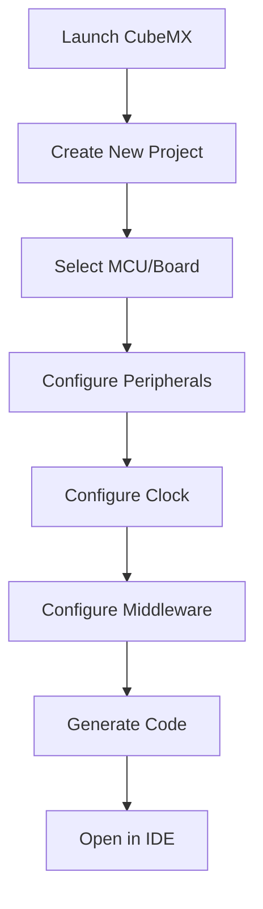

# STM32 CubeMX

## Introduction

STM32 CubeMX is a graphical tool that allows developers to configure STM32 microcontrollers and generate initialization C code for their applications. It's an essential part of the STM32 development environment that significantly simplifies the process of setting up microcontrollers, configuring peripherals, and generating project structures.

In this guide, we'll explore how CubeMX streamlines embedded development for beginners and experienced developers alike, eliminating much of the complexity involved in microcontroller configuration.

## What is STM32 CubeMX?

STM32 CubeMX is a free software tool developed by STMicroelectronics that provides:

- A graphical interface to configure STM32 microcontrollers
- Automatic initialization code generation
- Clock configuration visualization
- Power consumption estimation
- Middleware configuration (USB, TCP/IP, file systems, etc.)
- Integration with popular IDEs like STM32CubeIDE, Keil MDK, IAR EWARM, and others

Rather than writing hundreds of lines of low-level register configuration code, CubeMX allows you to set up your microcontroller through an intuitive graphical interface and automatically generates clean, optimized code based on your selections.

## Getting Started with STM32 CubeMX

### Installation

To begin working with STM32 CubeMX:

1. Visit the [STMicroelectronics website](https://www.st.com/en/development-tools/stm32cubemx.html)
2. Download the installer for your operating system (Windows, macOS, or Linux)
3. Follow the installation instructions
4. Launch the application

### Creating a New Project

Let's walk through creating a basic project:

1. Open STM32 CubeMX
2. Click "New Project" from the File menu
3. Select your STM32 microcontroller:
   - By series (F0, F1, F4, etc.)
   - By filtering specific features
   - By entering the exact part number



## Core Features

### Pin Configuration

The pin configuration view is where most of your work happens. Here you can:

1. Assign functions to microcontroller pins
2. Configure GPIO parameters (input, output, pull-up, pull-down)
3. Resolve pin conflicts
4. Visualize pin assignments

Each microcontroller pin can serve multiple functions, and CubeMX helps you navigate these options with color-coding and validation.

For example, to configure USART communication:

1. Locate the USART block you want to use
2. Click to activate it
3. Configure its parameters in the configuration panel
4. CubeMX will automatically assign the required pins or suggest alternatives

### Clock Configuration

The clock configuration view provides a visual representation of the microcontroller's clock tree. Here you can:

1. Set up system clocks (HSI, HSE, PLL)
2. Configure clock dividers
3. Optimize for performance or power consumption
4. Validate your configuration against hardware limitations

Clock configuration is typically one of the most challenging aspects of microcontroller setup, but CubeMX makes it intuitive through its visual interface.

### Peripheral Configuration

CubeMX allows detailed configuration of all on-chip peripherals:

- Communication interfaces (UART, SPI, I2C, CAN, etc.)
- Timers and counters
- ADC and DAC
- DMA controllers
- External memory interfaces
- And many more

Let's look at configuring an ADC as an example:

1. Click on the ADC peripheral in the pin configuration view
2. In the configuration panel, set parameters like:
   - Resolution (8/10/12-bit)
   - Scan mode
   - Continuous conversion
   - Sampling time
3. Configure the channels you want to use
4. Set up interrupts or DMA if needed

### Middleware and Software Packs

CubeMX extends beyond hardware configuration by offering software components:

- USB stacks (Host, Device, CDC, HID, etc.)
- File systems (FatFS)
- TCP/IP stack (LwIP)
- Graphics libraries
- RTOS integration (FreeRTOS)

These components come with their own configuration interfaces within CubeMX.

## Code Generation

Once your configuration is complete, you can generate initialization code that implements all your settings:

1. Go to the "Project Manager" tab
2. Configure project settings:
   - Toolchain/IDE selection
   - Code generator options
   - Project location
3. Click "Generate Code"

CubeMX will create:

- A complete project structure for your chosen IDE
- Generated initialization code based on your configuration
- HAL (Hardware Abstraction Layer) or LL (Low Layer) driver integration
- Middleware initialization if configured

Let's look at a simple example of generated code for GPIO configuration:

```c
/* GPIO Ports Clock Enable */
__HAL_RCC_GPIOA_CLK_ENABLE();
__HAL_RCC_GPIOB_CLK_ENABLE();

/* Configure GPIO pin : PA5 */
GPIO_InitStruct.Pin = GPIO_PIN_5;
GPIO_InitStruct.Mode = GPIO_MODE_OUTPUT_PP;
GPIO_InitStruct.Pull = GPIO_NOPULL;
GPIO_InitStruct.Speed = GPIO_SPEED_FREQ_LOW;
HAL_GPIO_Init(GPIOA, &GPIO_InitStruct);
```

This code initializes a GPIO pin as output – something that would typically require several register operations to set up manually.

## Practical Example: Blinking LED

Let's walk through a complete example of creating a simple LED blinking project:

### Step 1: Create a New Project

1. Create a new project and select your STM32 board (e.g., NUCLEO-F401RE)
2. In the Pinout view, find the user LED pin (typically PA5 on Nucleo boards)
3. Configure it as a GPIO_Output

### Step 2: Clock Configuration

1. Go to the Clock Configuration tab
2. Configure the system clock (typically 84MHz for F4 series)
3. Ensure all peripheral clocks are properly derived

### Step 3: Project Configuration

1. Go to Project Manager
2. Select your preferred toolchain (e.g., STM32CubeIDE)
3. Name your project "LED_Blink"
4. Click "Generate Code"

### Step 4: Add Application Code

After code generation, open the project in your IDE and modify the `main.c` file:

```c
/* USER CODE BEGIN WHILE */
while (1)
{
  /* USER CODE END WHILE */
  
  /* USER CODE BEGIN 3 */
  HAL_GPIO_TogglePin(GPIOA, GPIO_PIN_5);
  HAL_Delay(500);
}
/* USER CODE END 3 */
```

This code toggles the LED state every 500ms, creating a blinking effect.

## Advanced Features

### Power Consumption Calculator

CubeMX includes a power consumption estimation tool that:

1. Analyzes your configuration
2. Estimates power usage in different operation modes
3. Helps identify power optimization opportunities

### Middleware Configuration

For more complex applications, you can add middleware components:

1. Go to the Middleware section
2. Add components like FreeRTOS, USB, or TCP/IP stack
3. Configure them through dedicated interfaces

For example, to add FreeRTOS:

1. Select FreeRTOS from the middleware list
2. Configure tasks, semaphores, and mutexes
3. Set stack sizes and priorities
4. CubeMX will generate all the necessary initialization code

### Custom Code Protection

When regenerating code, CubeMX preserves your custom code by using special comment markers:

```c
/* USER CODE BEGIN 0 */
// Your code here will be preserved during code regeneration
/* USER CODE END 0 */
```

Always place your custom code between these markers to prevent it from being overwritten during regeneration.

## Best Practices

### Project Organization

1. **Keep configurations in version control**: Save your `.ioc` files along with your source code
2. **Document your pin choices**: Use CubeMX's pin configuration report feature
3. **Create template projects**: For common configurations you use repeatedly

### Common Pitfalls

1. **Clock configuration errors**: Always validate your clock tree
2. **Pin conflicts**: Be aware of alternate function limitations
3. **Overwriting custom code**: Always use the USER CODE sections
4. **Middleware conflicts**: Some middleware components have specific requirements

## Summary

STM32 CubeMX revolutionizes microcontroller development by providing:

- A visual approach to hardware configuration
- Automatic code generation
- Integration with middleware and software libraries
- Validation of your design choices

By leveraging CubeMX, you can:
- Reduce development time significantly
- Minimize configuration errors
- Focus on application logic rather than hardware details
- Create portable projects across the STM32 family

## Additional Resources

To continue your learning journey:

- STMicroelectronics official tutorials and documentation
- STM32 HAL library reference
- Sample projects for your specific board
- Online communities focused on STM32 development

## Exercises

1. Create a project that configures multiple communication peripherals (UART, I2C, SPI)
2. Set up an ADC to read an analog sensor, with DMA to transfer readings without CPU intervention
3. Configure a timer to generate PWM signals for controlling motor speed or LED brightness
4. Create a project with FreeRTOS integration, defining multiple tasks with different priorities
5. Implement a USB device (like a virtual COM port) using CubeMX middleware

By mastering STM32 CubeMX, you'll have a powerful tool for rapidly developing embedded applications with STM32 microcontrollers, allowing you to focus on solving problems rather than dealing with low-level configuration complexities.