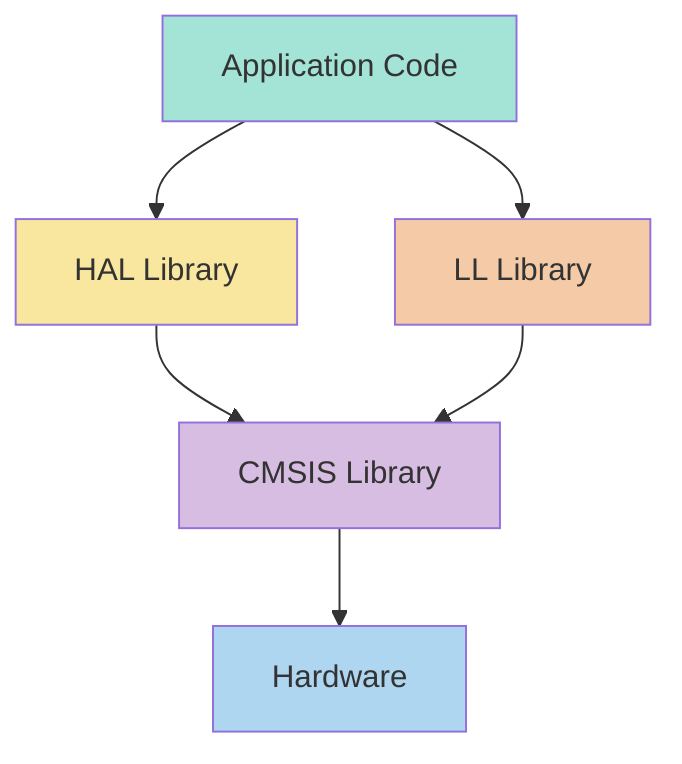
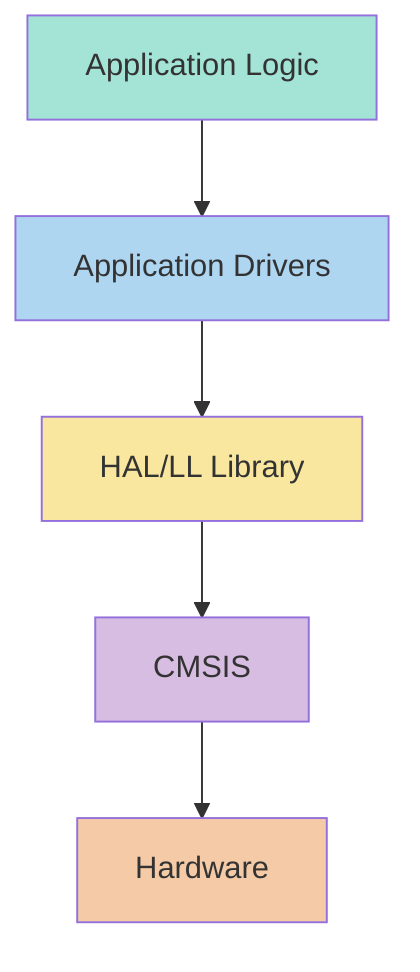

# STM32 Libraries

## Introduction

Libraries are essential components in embedded systems programming, especially when working with complex microcontrollers like the STM32 family. They provide pre-written code that abstracts hardware complexity, allowing developers to focus on application logic rather than low-level details.

In the STM32 ecosystem, libraries serve as bridges between your application code and the hardware, handling complex initialization sequences, peripheral configurations, and communication protocols. This article explores the various libraries available for STM32 development, their purposes, and how to effectively use them in your projects.

## Core Libraries in the STM32 Ecosystem

STM32 development relies on several key libraries that form layers of abstraction. Let's explore them from the lowest level to the highest:



### 1. CMSIS Library (Cortex Microcontroller Software Interface Standard)

CMSIS is the foundation of STM32 software development, providing a hardware abstraction layer for the Arm Cortex-M processor series.

#### Key Components of CMSIS:

- **CMSIS-Core**: Standardized interface to the processor and peripherals
- **CMSIS-DSP**: Digital signal processing functions optimized for Cortex-M
- **CMSIS-RTOS**: Real-time operating system API
- **CMSIS-Driver**: Standardized peripheral driver interfaces

#### Example: Using CMSIS to Access Core Processor Features

```c
#include "stm32f4xx.h"

void SystemInit(void)
{
  // Set FPU settings
  #if (__FPU_PRESENT == 1) && (__FPU_USED == 1)
    SCB->CPACR |= ((3UL << 10*2)|(3UL << 11*2));  // Set CP10 and CP11 Full Access
  #endif
  
  // Configure the System clock
  SetSysClock();
}
```

### 2. HAL Library (Hardware Abstraction Layer)

The HAL library provides a higher-level, more user-friendly API for STM32 peripherals. It's designed to be portable across different STM32 families, making code migration easier.

#### Key Features of HAL:

- Complete peripheral APIs with error handling
- Callback-based APIs for interrupt-driven operations
- Built-in timeouts and error recovery mechanisms
- Consistent API structure across all peripherals

#### Example: Blinking an LED with HAL

```c
#include "stm32f4xx_hal.h"

int main(void)
{
  HAL_Init();                     // Initialize the HAL library
  SystemClock_Config();           // Configure the system clock
  
  GPIO_InitTypeDef GPIO_InitStruct = {0};
  
  // Enable GPIO clock
  __HAL_RCC_GPIOA_CLK_ENABLE();
  
  // Configure GPIO pin for the LED
  GPIO_InitStruct.Pin = GPIO_PIN_5;
  GPIO_InitStruct.Mode = GPIO_MODE_OUTPUT_PP;
  GPIO_InitStruct.Pull = GPIO_NOPULL;
  GPIO_InitStruct.Speed = GPIO_SPEED_FREQ_LOW;
  HAL_GPIO_Init(GPIOA, &GPIO_InitStruct);
  
  while (1)
  {
    HAL_GPIO_TogglePin(GPIOA, GPIO_PIN_5);  // Toggle the LED
    HAL_Delay(500);                         // Delay 500ms
  }
}
```

### 3. LL Library (Low-Layer)

The Low-Layer (LL) library provides a lightweight, high-performance alternative to the HAL. It offers a balance between the complexity of direct register access and the overhead of the HAL.

#### Key Features of LL:

- Lower RAM and flash footprint compared to HAL
- Higher performance (fewer clock cycles) for operations
- Register-oriented API for fine-grained control
- Compatible with HAL (can be used together)

#### Example: Same LED Blinking with LL APIs

```c
#include "stm32f4xx_ll_gpio.h"
#include "stm32f4xx_ll_bus.h"
#include "stm32f4xx_ll_system.h"

void SysTick_Handler(void)
{
  static uint32_t counter = 0;
  counter++;
  
  if (counter >= 500) {
    counter = 0;
    LL_GPIO_TogglePin(GPIOA, LL_GPIO_PIN_5);
  }
}

int main(void)
{
  // System and SysTick initialization
  SystemClock_Config();
  SysTick_Config(SystemCoreClock / 1000);  // 1ms tick
  
  // Enable GPIOA clock
  LL_AHB1_GRP1_EnableClock(LL_AHB1_GRP1_PERIPH_GPIOA);
  
  // Configure GPIO for LED
  LL_GPIO_SetPinMode(GPIOA, LL_GPIO_PIN_5, LL_GPIO_MODE_OUTPUT);
  LL_GPIO_SetPinOutputType(GPIOA, LL_GPIO_PIN_5, LL_GPIO_OUTPUT_PUSHPULL);
  LL_GPIO_SetPinSpeed(GPIOA, LL_GPIO_PIN_5, LL_GPIO_SPEED_FREQ_LOW);
  LL_GPIO_SetPinPull(GPIOA, LL_GPIO_PIN_5, LL_GPIO_PULL_NO);
  
  while (1) {
    // Main loop - LED toggling handled by SysTick
  }
}
```

## Specialized Libraries for STM32

Beyond the core libraries, the STM32 ecosystem offers specialized libraries for specific functionalities:

### 1. STM32Cube Middleware

STM32Cube middleware components provide higher-level APIs for complex functionalities:

- **FatFS**: File system implementation for storage devices
- **FreeRTOS**: Real-time operating system
- **LwIP**: Lightweight TCP/IP stack
- **USB Host/Device**: USB communication stack
- **TouchGFX/STemWin**: Graphics libraries for user interfaces
- **X-CUBE**: Expansion packages for specialized functions

#### Example: Using FatFS to Read a File from an SD Card

```c
#include "fatfs.h"

FATFS fs;           // File system object
FIL file;           // File object
FRESULT result;     // Result code
uint8_t buffer[64]; // File read buffer
UINT bytesRead;     // Number of bytes read

int main(void)
{
  HAL_Init();
  SystemClock_Config();
  
  // Initialize peripherals and SD card
  MX_GPIO_Init();
  MX_SPI1_Init();
  MX_FATFS_Init();
  
  // Mount the file system
  result = f_mount(&fs, "", 0);
  if (result != FR_OK) {
    Error_Handler();
  }
  
  // Open a file
  result = f_open(&file, "data.txt", FA_READ);
  if (result != FR_OK) {
    Error_Handler();
  }
  
  // Read data from the file
  result = f_read(&file, buffer, sizeof(buffer), &bytesRead);
  if (result != FR_OK) {
    Error_Handler();
  }
  
  // Close the file
  f_close(&file);
  
  // Process data in buffer...
  
  while (1) {
    // Main loop
  }
}
```

### 2. BSP (Board Support Package) Libraries

BSP libraries are specific to STM32 development boards (Discovery, Nucleo, Evaluation boards), providing simplified APIs for onboard components.

#### Key Features of BSP:

- Ready-to-use APIs for onboard peripherals (LEDs, buttons, sensors)
- Standardized interface across different boards
- Simplified initialization and usage

#### Example: Using BSP to Initialize On-board Components on an STM32F4 Discovery Board

```c
#include "stm32f4_discovery.h"

int main(void)
{
  HAL_Init();
  SystemClock_Config();
  
  // Initialize all LEDs
  BSP_LED_Init(LED3);  // Orange LED
  BSP_LED_Init(LED4);  // Green LED
  BSP_LED_Init(LED5);  // Red LED
  BSP_LED_Init(LED6);  // Blue LED
  
  // Initialize the push button
  BSP_PB_Init(BUTTON_KEY, BUTTON_MODE_GPIO);
  
  while (1)
  {
    // Check if button is pressed
    if (BSP_PB_GetState(BUTTON_KEY) != RESET) {
      BSP_LED_On(LED4);    // Turn on green LED
    } else {
      BSP_LED_Off(LED4);   // Turn off green LED
    }
    
    // Blink other LEDs
    BSP_LED_Toggle(LED3);
    HAL_Delay(200);
  }
}
```

## Custom Library Development for STM32

As your projects grow, you might need to create your own libraries to organize code, improve reusability, and simplify maintenance.

### Creating Your First Custom Library

Let's build a simple library for a temperature sensor:

#### Step 1: Define the Header File (temp_sensor.h)

```c
#ifndef TEMP_SENSOR_H
#define TEMP_SENSOR_H

#include "stm32f4xx_hal.h"

// Error codes
typedef enum {
  TEMP_OK       = 0,
  TEMP_ERROR    = 1,
  TEMP_TIMEOUT  = 2
} TempStatus;

// Configuration structure
typedef struct {
  GPIO_TypeDef* PortSCL;
  uint16_t PinSCL;
  GPIO_TypeDef* PortSDA;
  uint16_t PinSDA;
  float calibration_offset;
} TempSensor_Config;

// Public functions
TempStatus TEMP_Init(TempSensor_Config* config);
TempStatus TEMP_ReadTemperature(float* temperature);
TempStatus TEMP_SetMode(uint8_t mode);
void TEMP_Shutdown(void);

#endif /* TEMP_SENSOR_H */
```

#### Step 2: Implement the Source File (temp_sensor.c)

```c
#include "temp_sensor.h"

// Private variables
static TempSensor_Config sensor_config;
static uint8_t initialized = 0;
static I2C_HandleTypeDef hi2c1;

// Private function prototypes
static TempStatus TEMP_I2C_Init(void);
static TempStatus TEMP_ReadRegister(uint8_t reg, uint8_t* data);
static TempStatus TEMP_WriteRegister(uint8_t reg, uint8_t data);

// Implementation of TEMP_Init
TempStatus TEMP_Init(TempSensor_Config* config)
{
  if (config == NULL) {
    return TEMP_ERROR;
  }
  
  // Copy configuration
  sensor_config = *config;
  
  // Initialize I2C
  if (TEMP_I2C_Init() != TEMP_OK) {
    return TEMP_ERROR;
  }
  
  // Reset the sensor
  if (TEMP_WriteRegister(0x02, 0x01) != TEMP_OK) {
    return TEMP_ERROR;
  }
  
  // Wait for reset to complete
  HAL_Delay(10);
  
  // Configure sensor settings
  if (TEMP_WriteRegister(0x03, 0x80) != TEMP_OK) {
    return TEMP_ERROR;
  }
  
  initialized = 1;
  return TEMP_OK;
}

// Implementation of TEMP_ReadTemperature
TempStatus TEMP_ReadTemperature(float* temperature)
{
  uint8_t tempMSB, tempLSB;
  int16_t tempRaw;
  
  if (!initialized || temperature == NULL) {
    return TEMP_ERROR;
  }
  
  // Read temperature registers
  if (TEMP_ReadRegister(0x00, &tempMSB) != TEMP_OK) {
    return TEMP_ERROR;
  }
  
  if (TEMP_ReadRegister(0x01, &tempLSB) != TEMP_OK) {
    return TEMP_ERROR;
  }
  
  // Convert raw values to temperature
  tempRaw = (tempMSB << 8) | tempLSB;
  *temperature = (tempRaw / 256.0) + sensor_config.calibration_offset;
  
  return TEMP_OK;
}

// ... other function implementations ...

// Private function to initialize I2C
static TempStatus TEMP_I2C_Init(void)
{
  // Initialize I2C hardware
  // This is a simplified example - in real code, you would use HAL I2C APIs
  
  return TEMP_OK;
}
```

#### Step 3: Using Your Custom Library

```c
#include "temp_sensor.h"

int main(void)
{
  HAL_Init();
  SystemClock_Config();
  
  // Configure the temperature sensor
  TempSensor_Config sensor_cfg = {
    .PortSCL = GPIOB,
    .PinSCL = GPIO_PIN_6,
    .PortSDA = GPIOB,
    .PinSDA = GPIO_PIN_7,
    .calibration_offset = -1.5  // Calibration value
  };
  
  // Initialize the sensor
  TempStatus status = TEMP_Init(&sensor_cfg);
  if (status != TEMP_OK) {
    Error_Handler();
  }
  
  while (1)
  {
    float temperature;
    
    // Read temperature
    if (TEMP_ReadTemperature(&temperature) == TEMP_OK) {
      // Process temperature value
      // For example, display it or send via UART
    }
    
    HAL_Delay(1000);  // Read every second
  }
}
```

## Best Practices for Working with STM32 Libraries

### 1. Choose the Right Abstraction Level

Select your library based on project requirements:
- **HAL**: For portability, ease of use, and faster development
- **LL**: For better performance and smaller footprint
- **Direct Register Access**: For maximum performance and control
- **Mixed Approach**: Use HAL for most features and LL/Register access for performance-critical sections

### 2. Use STM32CubeMX for Library Configuration

STM32CubeMX is an invaluable tool that:
- Generates initialization code for all peripherals
- Configures middleware components
- Resolves conflicts between peripheral settings
- Creates project structures for various IDEs

### 3. Organize Your Code into Layers



- **Application Logic**: Focus on business logic
- **Application Drivers**: Custom libraries for modules and peripherals
- **HAL/LL**: Hardware abstraction
- **CMSIS**: Core system functionality

### 4. Consistent Error Handling

Implement robust error handling across your libraries:

```c
// Example of consistent error handling in library functions
TempStatus TEMP_ReadTemperature(float* temperature)
{
  // Parameter validation
  if (temperature == NULL) {
    return TEMP_ERROR;
  }
  
  // Initialization check
  if (!initialized) {
    return TEMP_ERROR;
  }
  
  // Operation with timeout
  uint32_t timeout = HAL_GetTick() + 100; // 100ms timeout
  
  while (/* operation not complete */) {
    if (HAL_GetTick() > timeout) {
      return TEMP_TIMEOUT;
    }
  }
  
  // Success case
  return TEMP_OK;
}
```

### 5. Documentation and Comments

Document your libraries thoroughly:

```c
/**
 * @brief  Reads the current temperature from the sensor
 * @param  temperature: Pointer to store the temperature value (in Celsius)
 * @retval TEMP_OK if successful, error code otherwise
 * @note   The sensor must be initialized before calling this function
 */
TempStatus TEMP_ReadTemperature(float* temperature);
```

## Real-World Applications

### Example 1: Weather Station with Multiple Sensors

This example shows how to use various libraries together in a weather station project.

```c
#include "stm32f4xx_hal.h"
#include "temp_sensor.h"         // Our custom temperature sensor library
#include "pressure_sensor.h"     // Custom barometric pressure sensor library
#include "humidity_sensor.h"     // Custom humidity sensor library
#include "lcd_display.h"         // Custom LCD display library
#include "fatfs.h"               // FatFS middleware for data logging

// Sensor configurations
TempSensor_Config temp_cfg;
PressureSensor_Config pressure_cfg;
HumiditySensor_Config humidity_cfg;
LCD_Config lcd_cfg;

// Data logging structure
typedef struct {
  float temperature;
  float pressure;
  float humidity;
  RTC_TimeTypeDef time;
  RTC_DateTypeDef date;
} WeatherData;

// Function prototypes
void SystemClock_Config(void);
void Error_Handler(void);
void InitializeSensors(void);
void LogDataToSD(WeatherData* data);
void DisplayData(WeatherData* data);

int main(void)
{
  // Initialize system
  HAL_Init();
  SystemClock_Config();
  
  // Initialize peripherals
  MX_GPIO_Init();
  MX_I2C1_Init();
  MX_SPI1_Init();
  MX_RTC_Init();
  MX_FATFS_Init();
  
  // Initialize our custom modules
  InitializeSensors();
  LCD_Init(&lcd_cfg);
  
  // Create weather data structure
  WeatherData weather_data;
  
  while (1)
  {
    // Read sensor values
    TEMP_ReadTemperature(&weather_data.temperature);
    PRESSURE_ReadPressure(&weather_data.pressure);
    HUMIDITY_ReadHumidity(&weather_data.humidity);
    
    // Get current time and date
    HAL_RTC_GetTime(&hrtc, &weather_data.time, RTC_FORMAT_BIN);
    HAL_RTC_GetDate(&hrtc, &weather_data.date, RTC_FORMAT_BIN);
    
    // Display data on LCD
    DisplayData(&weather_data);
    
    // Log data to SD card every minute
    if (weather_data.time.Seconds == 0) {
      LogDataToSD(&weather_data);
    }
    
    // Wait 1 second before next reading
    HAL_Delay(1000);
  }
}

// Implementation of the initialization function
void InitializeSensors(void)
{
  // Configure temperature sensor
  temp_cfg.PortSCL = GPIOB;
  temp_cfg.PinSCL = GPIO_PIN_6;
  temp_cfg.PortSDA = GPIOB;
  temp_cfg.PinSDA = GPIO_PIN_7;
  temp_cfg.calibration_offset = -1.2;
  
  // Initialize temperature sensor
  if (TEMP_Init(&temp_cfg) != TEMP_OK) {
    Error_Handler();
  }
  
  // Similar initialization for other sensors...
}
```

### Example 2: Motor Control System Using HAL and LL Libraries Together

This example demonstrates using both HAL and LL libraries for a motor control application:

```c
#include "stm32f4xx_hal.h"
#include "stm32f4xx_ll_tim.h"
#include "stm32f4xx_ll_gpio.h"

// PWM timer handle
TIM_HandleTypeDef htim1;

// Function prototypes
void SystemClock_Config(void);
void Error_Handler(void);
void ConfigureMotorControlPWM(void);
void SetMotorSpeed(uint8_t speed_percent);
void SetMotorDirection(uint8_t forward);

int main(void)
{
  // Initialize system
  HAL_Init();
  SystemClock_Config();
  
  // Initialize GPIO with HAL
  MX_GPIO_Init();
  
  // Configure PWM for motor control
  ConfigureMotorControlPWM();
  
  // Test motor control sequence
  while (1)
  {
    // Set forward direction
    SetMotorDirection(1);
    
    // Accelerate
    for (uint8_t speed = 0; speed <= 100; speed += 5) {
      SetMotorSpeed(speed);
      HAL_Delay(100);
    }
    
    // Full speed for 2 seconds
    HAL_Delay(2000);
    
    // Decelerate
    for (uint8_t speed = 100; speed > 0; speed -= 5) {
      SetMotorSpeed(speed);
      HAL_Delay(100);
    }
    
    // Stop for 1 second
    SetMotorSpeed(0);
    HAL_Delay(1000);
    
    // Reverse direction and repeat
    SetMotorDirection(0);
    
    // Accelerate
    for (uint8_t speed = 0; speed <= 100; speed += 5) {
      SetMotorSpeed(speed);
      HAL_Delay(100);
    }
    
    // Full speed for 2 seconds
    HAL_Delay(2000);
    
    // Decelerate
    for (uint8_t speed = 100; speed > 0; speed -= 5) {
      SetMotorSpeed(speed);
      HAL_Delay(100);
    }
    
    // Stop for 1 second
    SetMotorSpeed(0);
    HAL_Delay(1000);
  }
}

// Configure PWM using HAL
void ConfigureMotorControlPWM(void)
{
  TIM_MasterConfigTypeDef sMasterConfig = {0};
  TIM_OC_InitTypeDef sConfigOC = {0};
  
  // Configure timer with HAL
  htim1.Instance = TIM1;
  htim1.Init.Prescaler = 167;
  htim1.Init.CounterMode = TIM_COUNTERMODE_UP;
  htim1.Init.Period = 999;
  htim1.Init.ClockDivision = TIM_CLOCKDIVISION_DIV1;
  htim1.Init.RepetitionCounter = 0;
  htim1.Init.AutoReloadPreload = TIM_AUTORELOAD_PRELOAD_DISABLE;
  
  if (HAL_TIM_PWM_Init(&htim1) != HAL_OK) {
    Error_Handler();
  }
  
  sMasterConfig.MasterOutputTrigger = TIM_TRGO_RESET;
  sMasterConfig.MasterSlaveMode = TIM_MASTERSLAVEMODE_DISABLE;
  
  if (HAL_TIMEx_MasterConfigSynchronization(&htim1, &sMasterConfig) != HAL_OK) {
    Error_Handler();
  }
  
  sConfigOC.OCMode = TIM_OCMODE_PWM1;
  sConfigOC.Pulse = 0;
  sConfigOC.OCPolarity = TIM_OCPOLARITY_HIGH;
  sConfigOC.OCNPolarity = TIM_OCNPOLARITY_HIGH;
  sConfigOC.OCFastMode = TIM_OCFAST_DISABLE;
  sConfigOC.OCIdleState = TIM_OCIDLESTATE_RESET;
  sConfigOC.OCNIdleState = TIM_OCNIDLESTATE_RESET;
  
  if (HAL_TIM_PWM_ConfigChannel(&htim1, &sConfigOC, TIM_CHANNEL_1) != HAL_OK) {
    Error_Handler();
  }
  
  HAL_TIM_PWM_Start(&htim1, TIM_CHANNEL_1);
}

// Set motor speed using LL library (more efficient for frequent updates)
void SetMotorSpeed(uint8_t speed_percent)
{
  // Validate input
  if (speed_percent > 100) {
    speed_percent = 100;
  }
  
  // Calculate PWM value (0-999 for 0-100%)
  uint32_t pulse = (speed_percent * htim1.Init.Period) / 100;
  
  // Use LL library for efficient pulse update
  LL_TIM_OC_SetCompareCH1(TIM1, pulse);
}

// Set motor direction using LL library (for low latency)
void SetMotorDirection(uint8_t forward)
{
  if (forward) {
    LL_GPIO_SetOutputPin(GPIOE, LL_GPIO_PIN_9);
    LL_GPIO_ResetOutputPin(GPIOE, LL_GPIO_PIN_11);
  } else {
    LL_GPIO_ResetOutputPin(GPIOE, LL_GPIO_PIN_9);
    LL_GPIO_SetOutputPin(GPIOE, LL_GPIO_PIN_11);
  }
}
```

## Summary

STM32 libraries provide different layers of abstraction that help simplify microcontroller programming:

1. **CMSIS**: The foundation, providing direct processor access and standardization
2. **HAL**: High-level, portable abstraction for easy development
3. **LL**: Lower-level, higher-performance alternative with less overhead
4. **Middleware**: Ready-made solutions for complex functionality (USB, filesystem, networking)
5. **BSP**: Board-specific libraries for quick hardware access
6. **Custom Libraries**: Your own abstractions for application-specific needs

Choosing the right library for your application depends on your priorities:
- **Development Speed**: HAL, Middleware, BSP
- **Code Size & Performance**: LL, CMSIS
- **Portability**: HAL, Middleware
- **Predictability & Control**: LL, CMSIS

## Additional Resources

### Learning Resources

- [STMicroelectronics Official Documentation](https://www.st.com/en/microcontrollers-microprocessors/stm32-32-bit-arm-cortex-mcus.html)
- [STM32CubeIDE User Manual](https://www.st.com/resource/en/user_manual/dm00603964.pdf)
- [Mastering STM32](https://leanpub.com/mastering-stm32) by Carmine Noviello
- [STM32 Tutorials on DigiKey](https://www.digikey.com/en/maker/projects/getting-started-with-stm32-introduction-to-stm32cubeide/6a6c60a670c447abb90fd0fd78008697)

### Practice Exercises

1. **Basic Library Usage**:
   - Create a project that uses the HAL library to read the state of a button and control an LED
   - Implement the same functionality using the LL library and compare code size

2. **Custom Library Creation**:
   - Create a custom library for an I2C sensor (e.g., BME280)
   - Implement functions for initialization, reading data, and power management
   - Add proper error handling and documentation

3. **Middleware Integration**:
   - Create a data logger that records sensor data to an SD card using FatFS
   - Add a simple command interface over UART

4. **Advanced Optimization**:
   - Identify performance-critical sections in an existing HAL-based project
   - Reimplement these sections using LL or direct register access
   - Measure and compare performance improvements