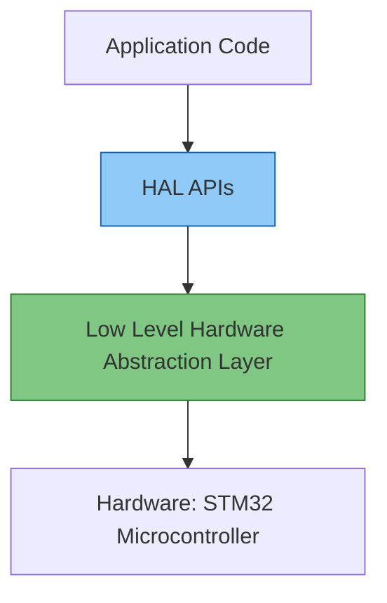
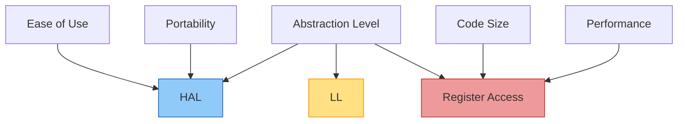

# STM32 HAL Introduction

## What is HAL?

The Hardware Abstraction Layer (HAL) is a software framework provided by ST Microelectronics that simplifies the development process for STM32 microcontrollers. It offers a high-level API that abstracts the complexities of the underlying hardware, making it easier for developers to write portable and maintainable code.

Think of HAL as a translator between your application code and the microcontroller's hardware. Instead of directly manipulating registers and dealing with hardware-specific details, you can use intuitive function calls that work across different STM32 microcontroller families.



## Why Use HAL?

The STM32 HAL offers several advantages over traditional register-level programming:

1. **Portability**: Code written using HAL can be easily ported across different STM32 microcontroller families.
2. **Readability**: HAL functions are named intuitively, making code more readable and self-documenting.
3. **Reduced Learning Curve**: Developers don't need to memorize complex register addresses and bit patterns.
4. **Consistent API**: The same function calls work across different peripherals and microcontroller variants.
5. **Built-in Error Handling**: Many HAL functions return status codes to help identify issues.

## HAL Structure

The STM32 HAL is organized into several modules, each responsible for a specific peripheral or function:

- **Core**: Basic functions for the microcontroller core
- **GPIO**: General Purpose Input/Output control
- **UART/USART**: Serial communication
- **I2C/SPI**: Communication bus protocols
- **ADC/DAC**: Analog-to-Digital and Digital-to-Analog conversion
- **Timers**: Various timer functionalities
- **And many more** specialized modules for specific peripherals

Each module follows a consistent naming convention:

```c
HAL_PPP_FunctionName();
```

Where `PPP` represents the peripheral (GPIO, UART, I2C, etc.) and `FunctionName` describes the action.

## Getting Started with HAL

### HAL Initialization

Before using any HAL functions, you need to initialize the HAL system:

```c
// Initialize the HAL Library
HAL_Init();

// Configure the system clock
SystemClock_Config();
```

The `HAL_Init()` function:
- Configures the SysTick timer for time base generation
- Sets up the NVIC (Nested Vectored Interrupt Controller)
- Initializes time stamp functionality
- Initializes debug modules

### GPIO Example with HAL

Let's see how to configure and use a GPIO pin to control an LED using HAL:

```c
// LED pin configuration structure
GPIO_InitTypeDef GPIO_InitStruct = {0};

// Enable the GPIO clock
__HAL_RCC_GPIOA_CLK_ENABLE();

// Configure the GPIO pin
GPIO_InitStruct.Pin = GPIO_PIN_5;           // Select pin 5 (LED on many STM32 boards)
GPIO_InitStruct.Mode = GPIO_MODE_OUTPUT_PP; // Push-pull output
GPIO_InitStruct.Pull = GPIO_NOPULL;         // No pull-up or pull-down
GPIO_InitStruct.Speed = GPIO_SPEED_FREQ_LOW; // Low speed is sufficient for an LED

// Initialize the GPIO pin with the configuration
HAL_GPIO_Init(GPIOA, &GPIO_InitStruct);

// Toggle the LED
HAL_GPIO_TogglePin(GPIOA, GPIO_PIN_5);

// Turn on the LED
HAL_GPIO_WritePin(GPIOA, GPIO_PIN_5, GPIO_PIN_SET);

// Turn off the LED
HAL_GPIO_WritePin(GPIOA, GPIO_PIN_5, GPIO_PIN_RESET);

// Read the state of a pin
GPIO_PinState pinState = HAL_GPIO_ReadPin(GPIOA, GPIO_PIN_0);
```

### UART Communication Example

Here's how to initialize and use UART for serial communication:

```c
// UART configuration structure
UART_HandleTypeDef huart2;

// Configure UART parameters
huart2.Instance = USART2;
huart2.Init.BaudRate = 115200;
huart2.Init.WordLength = UART_WORDLENGTH_8B;
huart2.Init.StopBits = UART_STOPBITS_1;
huart2.Init.Parity = UART_PARITY_NONE;
huart2.Init.Mode = UART_MODE_TX_RX;
huart2.Init.HwFlowCtl = UART_HWCONTROL_NONE;
huart2.Init.OverSampling = UART_OVERSAMPLING_16;

// Initialize the UART
if (HAL_UART_Init(&huart2) != HAL_OK) {
  Error_Handler();
}

// Send data
uint8_t data[] = "Hello, STM32!";
HAL_UART_Transmit(&huart2, data, sizeof(data)-1, HAL_MAX_DELAY);

// Receive data (blocking mode)
uint8_t rxData[20];
HAL_UART_Receive(&huart2, rxData, 10, HAL_MAX_DELAY);
```

## HAL vs LL vs Register Access

STM32 offers three levels of hardware access:

1. **HAL (Hardware Abstraction Layer)**: High-level, portable, feature-rich but larger code size
2. **LL (Low-Layer)**: Intermediate level with better performance and smaller code size
3. **Direct Register Access**: Fastest performance, smallest code size, but hardest to maintain



You can choose the appropriate level based on your project requirements. For beginners and most applications, HAL provides the best balance of ease of use and functionality.

## Handling HAL API Returns

Most HAL functions return a status code that indicates the success or failure of the operation:

```c
// Example of error handling
if (HAL_UART_Init(&huart2) != HAL_OK) {
  // Handle error
  Error_Handler();
}
```

Common return values include:
- `HAL_OK`: Operation completed successfully
- `HAL_ERROR`: Error occurred
- `HAL_BUSY`: Module is busy
- `HAL_TIMEOUT`: Timeout occurred

## Practical Real-World Example: Temperature Sensor with UART Output

Let's implement a more complex example that reads temperature from an analog sensor connected to an ADC channel and sends the data via UART:

```c
#include "stm32f4xx_hal.h"
#include <stdio.h>
#include <string.h>

ADC_HandleTypeDef hadc1;
UART_HandleTypeDef huart2;
char buffer[50];

void SystemClock_Config(void);
void Error_Handler(void);
static void MX_GPIO_Init(void);
static void MX_ADC1_Init(void);
static void MX_USART2_UART_Init(void);
float Convert_To_Temperature(uint32_t adcValue);

int main(void) {
  // Initialize HAL
  HAL_Init();
  
  // Configure the system clock
  SystemClock_Config();
  
  // Initialize peripherals
  MX_GPIO_Init();
  MX_ADC1_Init();
  MX_USART2_UART_Init();
  
  // Main program loop
  while (1) {
    uint32_t adcValue = 0;
    
    // Start ADC conversion
    HAL_ADC_Start(&hadc1);
    
    // Wait for conversion to complete
    if (HAL_ADC_PollForConversion(&hadc1, 100) == HAL_OK) {
      // Read ADC value
      adcValue = HAL_ADC_GetValue(&hadc1);
      
      // Convert ADC value to temperature
      float temperature = Convert_To_Temperature(adcValue);
      
      // Format the message
      sprintf(buffer, "Temperature: %.2f°C\r
", temperature);
      
      // Send via UART
      HAL_UART_Transmit(&huart2, (uint8_t*)buffer, strlen(buffer), HAL_MAX_DELAY);
    }
    
    // Wait before next reading
    HAL_Delay(1000);
  }
}

// Convert ADC value to temperature (example for LM35 sensor)
float Convert_To_Temperature(uint32_t adcValue) {
  // For a 12-bit ADC with reference voltage of 3.3V
  float voltage = (adcValue * 3.3f) / 4095.0f;
  
  // LM35 outputs 10mV per degree Celsius
  return voltage * 100.0f;
}

// ADC initialization function
static void MX_ADC1_Init(void) {
  ADC_ChannelConfTypeDef sConfig = {0};
  
  // Configure the ADC
  hadc1.Instance = ADC1;
  hadc1.Init.ClockPrescaler = ADC_CLOCK_SYNC_PCLK_DIV4;
  hadc1.Init.Resolution = ADC_RESOLUTION_12B;
  hadc1.Init.ScanConvMode = DISABLE;
  hadc1.Init.ContinuousConvMode = DISABLE;
  hadc1.Init.DiscontinuousConvMode = DISABLE;
  hadc1.Init.ExternalTrigConvEdge = ADC_EXTERNALTRIGCONVEDGE_NONE;
  hadc1.Init.ExternalTrigConv = ADC_SOFTWARE_START;
  hadc1.Init.DataAlign = ADC_DATAALIGN_RIGHT;
  hadc1.Init.NbrOfConversion = 1;
  hadc1.Init.DMAContinuousRequests = DISABLE;
  hadc1.Init.EOCSelection = ADC_EOC_SINGLE_CONV;
  
  if (HAL_ADC_Init(&hadc1) != HAL_OK) {
    Error_Handler();
  }
  
  // Configure ADC regular channel
  sConfig.Channel = ADC_CHANNEL_0;
  sConfig.Rank = 1;
  sConfig.SamplingTime = ADC_SAMPLETIME_84CYCLES;
  
  if (HAL_ADC_ConfigChannel(&hadc1, &sConfig) != HAL_OK) {
    Error_Handler();
  }
}

// UART initialization function
static void MX_USART2_UART_Init(void) {
  huart2.Instance = USART2;
  huart2.Init.BaudRate = 115200;
  huart2.Init.WordLength = UART_WORDLENGTH_8B;
  huart2.Init.StopBits = UART_STOPBITS_1;
  huart2.Init.Parity = UART_PARITY_NONE;
  huart2.Init.Mode = UART_MODE_TX_RX;
  huart2.Init.HwFlowCtl = UART_HWCONTROL_NONE;
  huart2.Init.OverSampling = UART_OVERSAMPLING_16;
  
  if (HAL_UART_Init(&huart2) != HAL_OK) {
    Error_Handler();
  }
}
```

## HAL Callback Functions

HAL provides callback functions that are automatically called when specific events occur. You can implement these functions to handle events like interrupt completion:

```c
// This function is called when UART transmission is completed
void HAL_UART_TxCpltCallback(UART_HandleTypeDef *huart) {
  // Turn on an LED to indicate transmission complete
  HAL_GPIO_WritePin(GPIOA, GPIO_PIN_5, GPIO_PIN_SET);
}

// This function is called when UART reception is completed
void HAL_UART_RxCpltCallback(UART_HandleTypeDef *huart) {
  // Process received data
  // Start another reception if needed
  HAL_UART_Receive_IT(huart, rxBuffer, RX_BUFFER_SIZE);
}
```

## Summary

The STM32 HAL provides a powerful and beginner-friendly way to program STM32 microcontrollers:

- It abstracts hardware complexities, making your code more portable and maintainable
- Follows a consistent naming convention (`HAL_PPP_FunctionName`)
- Provides comprehensive error handling
- Supports all STM32 peripherals with a unified API approach
- Ideal for beginners and most applications where code portability is more important than extreme optimization

While HAL adds a slight performance overhead compared to direct register access, the benefits in terms of development speed, code readability, and maintainability make it the recommended approach for most STM32 projects, especially for beginners.

## Additional Resources and Exercises

### Resources

- ST Microelectronics official HAL documentation
- STM32CubeIDE and STM32CubeMX tools for HAL-based project generation
- ST's HAL driver reference manuals for specific microcontroller families

### Exercises

1. **Blinking LED**: Implement a program to blink an LED at different rates using HAL Timer functions.
2. **Button Interrupt**: Configure a button to toggle an LED using HAL GPIO interrupts.
3. **Serial Echo**: Create a program that echoes characters received via UART using HAL UART functions.
4. **ADC Reading**: Read values from an analog sensor and convert them to meaningful units.
5. **Timer PWM**: Generate a PWM signal to control the brightness of an LED using HAL Timer functions.

### Next Steps

After mastering HAL basics, explore more advanced STM32 topics:
- DMA (Direct Memory Access) for efficient data transfer
- RTOS integration with HAL
- Low-power modes and energy-efficient programming
- External peripheral interfacing (displays, sensors, actuators)