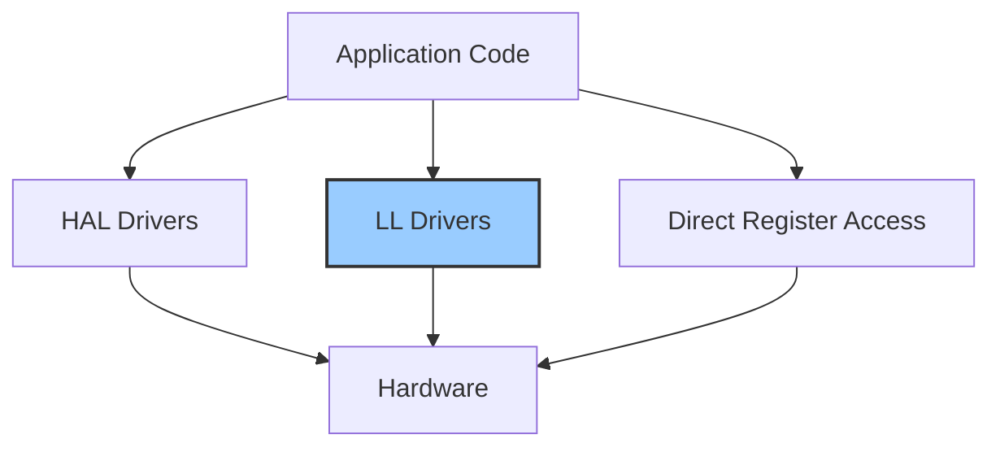

# STM32 LL Drivers

## Introduction

STM32 microcontrollers are powerful devices used in various embedded applications, from simple IoT devices to complex industrial control systems. To effectively interface with these microcontrollers, STMicroelectronics provides several abstraction layers for developers. Among these are the **Low-Level (LL) drivers**, which offer a balanced approach between direct register manipulation and higher-level abstractions.

In this guide, we'll explore what STM32 LL drivers are, their advantages and disadvantages, and how to effectively use them in your embedded projects.

## What are STM32 LL Drivers?

LL (Low-Level) drivers are a set of lightweight functions that provide a thin abstraction layer over the STM32 hardware registers. They sit between the hardware abstraction layer (HAL) drivers and direct register manipulation:



LL drivers offer several key characteristics:

- **Minimal overhead**: They add very little additional code compared to direct register manipulation
- **Performance-oriented**: Designed for applications where execution speed and memory footprint are critical
- **Granular control**: Provide fine-grained control over peripheral features
- **Compatibility**: Work alongside HAL drivers in the same project
- **Readability**: More readable than direct register manipulation while maintaining similar performance

## LL Drivers vs. HAL Drivers vs. Direct Register Access

To understand where LL drivers fit in your development strategy, let's compare the three main approaches to STM32 peripheral programming:

| Aspect | Direct Register | LL Drivers | HAL Drivers |
|--------|----------------|------------|-------------|
| Code Size | Smallest | Small | Larger |
| Performance | Highest | High | Medium |
| Ease of Use | Difficult | Moderate | Easiest |
| Readability | Poor | Good | Excellent |
| Portability | Poor | Medium | Excellent |
| Debug Support | Minimal | Basic | Comprehensive |

## Setting Up Your Project with LL Drivers

Before using LL drivers, you need to set up your project correctly. Here's how:

### Using STM32CubeMX

1. Launch STM32CubeMX and create a new project or open an existing one
2. Configure your microcontroller's clock, peripherals, and pins as needed
3. Go to the "Project Manager" tab
4. Under "Advanced Settings", select "LL" for the peripherals you want to use with Low-Level drivers
5. Generate the code

### Manual Setup

If you're not using STM32CubeMX, you'll need to:

1. Include the necessary LL header files for your peripherals
2. Configure the system clock
3. Initialize the required peripherals

Here's an example of the required includes for GPIO manipulation with LL drivers:

```c
#include "stm32f4xx_ll_gpio.h"
#include "stm32f4xx_ll_bus.h"
```

## Basic Examples Using LL Drivers

Let's explore some fundamental examples to get you started with LL drivers.

### Example 1: GPIO Configuration and Control

This example shows how to configure and control a GPIO pin using LL drivers:

```c
// Enable GPIOA clock
LL_AHB1_GRP1_EnableClock(LL_AHB1_GRP1_PERIPH_GPIOA);

// Configure PA5 (LED pin on many STM32 boards) as output
LL_GPIO_SetPinMode(GPIOA, LL_GPIO_PIN_5, LL_GPIO_MODE_OUTPUT);
LL_GPIO_SetPinOutputType(GPIOA, LL_GPIO_PIN_5, LL_GPIO_OUTPUT_PUSHPULL);
LL_GPIO_SetPinSpeed(GPIOA, LL_GPIO_PIN_5, LL_GPIO_SPEED_FREQ_LOW);
LL_GPIO_SetPinPull(GPIOA, LL_GPIO_PIN_5, LL_GPIO_PULL_NO);

// Toggle the LED
while (1) {
    LL_GPIO_TogglePin(GPIOA, LL_GPIO_PIN_5);
    // Simple delay
    for (volatile int i = 0; i < 1000000; i++);
}
```

In this example:
1. We enable the clock for GPIOA using the LL_AHB1_GRP1_EnableClock function
2. We configure PA5 as a push-pull output with low speed and no pull-up/down resistors
3. We repeatedly toggle the pin state to blink an LED

### Example 2: UART Communication

Here's how to set up and use UART communication with LL drivers:

```c
// Enable clocks for GPIOA and USART2
LL_AHB1_GRP1_EnableClock(LL_AHB1_GRP1_PERIPH_GPIOA);
LL_APB1_GRP1_EnableClock(LL_APB1_GRP1_PERIPH_USART2);

// Configure PA2 as USART2_TX
LL_GPIO_SetPinMode(GPIOA, LL_GPIO_PIN_2, LL_GPIO_MODE_ALTERNATE);
LL_GPIO_SetAFPin_0_7(GPIOA, LL_GPIO_PIN_2, LL_GPIO_AF_7);
LL_GPIO_SetPinSpeed(GPIOA, LL_GPIO_PIN_2, LL_GPIO_SPEED_FREQ_HIGH);
LL_GPIO_SetPinOutputType(GPIOA, LL_GPIO_PIN_2, LL_GPIO_OUTPUT_PUSHPULL);
LL_GPIO_SetPinPull(GPIOA, LL_GPIO_PIN_2, LL_GPIO_PULL_UP);

// Configure PA3 as USART2_RX
LL_GPIO_SetPinMode(GPIOA, LL_GPIO_PIN_3, LL_GPIO_MODE_ALTERNATE);
LL_GPIO_SetAFPin_0_7(GPIOA, LL_GPIO_PIN_3, LL_GPIO_AF_7);
LL_GPIO_SetPinSpeed(GPIOA, LL_GPIO_PIN_3, LL_GPIO_SPEED_FREQ_HIGH);
LL_GPIO_SetPinOutputType(GPIOA, LL_GPIO_PIN_3, LL_GPIO_OUTPUT_PUSHPULL);
LL_GPIO_SetPinPull(GPIOA, LL_GPIO_PIN_3, LL_GPIO_PULL_UP);

// Configure USART2
LL_USART_SetTransferDirection(USART2, LL_USART_DIRECTION_TX_RX);
LL_USART_ConfigCharacter(USART2, LL_USART_DATAWIDTH_8B, LL_USART_PARITY_NONE, LL_USART_STOPBITS_1);
LL_USART_SetBaudRate(USART2, SystemCoreClock, LL_USART_OVERSAMPLING_16, 9600);
LL_USART_Enable(USART2);

// Send a "Hello, World!" message
const char *message = "Hello, World!\r
";
for (int i = 0; message[i] != '\0'; i++) {
    while (!LL_USART_IsActiveFlag_TXE(USART2));
    LL_USART_TransmitData8(USART2, message[i]);
}
```

This example:
1. Enables the necessary clocks
2. Configures PA2 and PA3 as USART2 TX and RX pins respectively
3. Sets up USART2 with 8-bit data, no parity, 1 stop bit, and 9600 baud
4. Sends a "Hello, World!" message

### Example 3: ADC Conversion

The following example demonstrates how to perform an analog-to-digital conversion:

```c
// Enable clocks
LL_AHB1_GRP1_EnableClock(LL_AHB1_GRP1_PERIPH_GPIOA);
LL_APB2_GRP1_EnableClock(LL_APB2_GRP1_PERIPH_ADC1);

// Configure PA0 as analog input
LL_GPIO_SetPinMode(GPIOA, LL_GPIO_PIN_0, LL_GPIO_MODE_ANALOG);

// Configure ADC1
LL_ADC_SetResolution(ADC1, LL_ADC_RESOLUTION_12B);
LL_ADC_SetDataAlignment(ADC1, LL_ADC_DATA_ALIGN_RIGHT);

// Configure regular channel
LL_ADC_REG_SetSequencerRanks(ADC1, LL_ADC_REG_RANK_1, LL_ADC_CHANNEL_0);
LL_ADC_SetChannelSamplingTime(ADC1, LL_ADC_CHANNEL_0, LL_ADC_SAMPLINGTIME_56CYCLES);

// Enable ADC
LL_ADC_Enable(ADC1);

// Read ADC value
uint16_t adc_value;
while (1) {
    // Start conversion
    LL_ADC_REG_StartConversionSWStart(ADC1);
    
    // Wait for conversion to complete
    while (!LL_ADC_IsActiveFlag_EOCS(ADC1));
    
    // Read value
    adc_value = LL_ADC_REG_ReadConversionData12(ADC1);
    
    // Do something with adc_value
    // ...
    
    // Simple delay
    for (volatile int i = 0; i < 100000; i++);
}
```

In this example:
1. We configure PA0 as an analog input
2. We set up ADC1 with 12-bit resolution and right alignment
3. We configure the regular channel sequence to convert channel 0 (PA0)
4. We repeatedly start conversions and read the results

## Advanced Topics: Interrupts with LL Drivers

One of the powerful features of STM32 microcontrollers is their interrupt capabilities. Here's how to configure and use interrupts with LL drivers:

### Example: Timer Interrupt

```c
// Enable clocks
LL_APB1_GRP1_EnableClock(LL_APB1_GRP1_PERIPH_TIM2);
LL_AHB1_GRP1_EnableClock(LL_AHB1_GRP1_PERIPH_GPIOA);

// Configure PA5 as output (LED)
LL_GPIO_SetPinMode(GPIOA, LL_GPIO_PIN_5, LL_GPIO_MODE_OUTPUT);
LL_GPIO_SetPinOutputType(GPIOA, LL_GPIO_PIN_5, LL_GPIO_OUTPUT_PUSHPULL);

// Configure Timer2
LL_TIM_SetPrescaler(TIM2, 8000 - 1); // For an 8 MHz clock, this gives 1 kHz
LL_TIM_SetAutoReload(TIM2, 1000 - 1); // 1000 ms = 1 second
LL_TIM_SetCounterMode(TIM2, LL_TIM_COUNTERMODE_UP);
LL_TIM_EnableIT_UPDATE(TIM2); // Enable update interrupt
LL_TIM_EnableCounter(TIM2);

// Configure NVIC
NVIC_SetPriority(TIM2_IRQn, 0);
NVIC_EnableIRQ(TIM2_IRQn);

// Main loop
while (1) {
    // Background processing...
}

// Interrupt handler (in stm32f4xx_it.c)
void TIM2_IRQHandler(void) {
    if (LL_TIM_IsActiveFlag_UPDATE(TIM2)) {
        LL_TIM_ClearFlag_UPDATE(TIM2);
        
        // Toggle LED
        LL_GPIO_TogglePin(GPIOA, LL_GPIO_PIN_5);
    }
}
```

This example:
1. Sets up Timer2 to generate an interrupt every second
2. Configures the NVIC to enable the Timer2 interrupt
3. Defines an interrupt handler that toggles an LED

## Best Practices for Using LL Drivers

To make the most of LL drivers, follow these best practices:

1. **Mix and match when appropriate**: Use LL drivers for performance-critical sections and HAL for convenience in non-critical sections
2. **Check for errors**: Always validate the return values of LL functions
3. **Use the debugger**: Verify register configurations during debugging
4. **Consult the reference manual**: Always refer to the microcontroller's reference manual to understand the hardware details
5. **Keep code modular**: Create wrapper functions for common operations to enhance code reusability
6. **Comment your code**: LL drivers are less self-explanatory than HAL, so good comments are essential

## Real-World Application: Digital Signal Processing

Let's create a more complex example that demonstrates a real-world application using LL drivers for performance-critical operations:

```c
// Sample application: FIR filter implementation with ADC and DAC
// This example reads signals from an analog input, 
// applies a low-pass filter, and outputs the result to a DAC

#define FILTER_TAP_NUM 16

// Filter coefficients for a low-pass filter
const float filter_coeffs[FILTER_TAP_NUM] = {
    0.0055, 0.0214, 0.0532, 0.0959, 0.1431, 0.1850, 0.2132, 0.2235,
    0.2235, 0.2132, 0.1850, 0.1431, 0.0959, 0.0532, 0.0214, 0.0055
};

uint16_t adc_buffer[FILTER_TAP_NUM] = {0};
uint16_t filter_index = 0;

void SystemClock_Config(void) {
    // Clock configuration code...
}

int main(void) {
    // Initialize system
    SystemClock_Config();
    
    // Enable peripheral clocks
    LL_AHB1_GRP1_EnableClock(LL_AHB1_GRP1_PERIPH_GPIOA);
    LL_APB2_GRP1_EnableClock(LL_APB2_GRP1_PERIPH_ADC1);
    LL_APB1_GRP1_EnableClock(LL_APB1_GRP1_PERIPH_DAC1);
    
    // Configure PA0 as analog input (ADC)
    LL_GPIO_SetPinMode(GPIOA, LL_GPIO_PIN_0, LL_GPIO_MODE_ANALOG);
    
    // Configure PA4 as analog output (DAC)
    LL_GPIO_SetPinMode(GPIOA, LL_GPIO_PIN_4, LL_GPIO_MODE_ANALOG);
    
    // Configure ADC
    LL_ADC_SetResolution(ADC1, LL_ADC_RESOLUTION_12B);
    LL_ADC_REG_SetSequencerRanks(ADC1, LL_ADC_REG_RANK_1, LL_ADC_CHANNEL_0);
    LL_ADC_SetChannelSamplingTime(ADC1, LL_ADC_CHANNEL_0, LL_ADC_SAMPLINGTIME_28CYCLES);
    LL_ADC_Enable(ADC1);
    
    // Configure DAC
    LL_DAC_Enable(DAC1, LL_DAC_CHANNEL_1);
    
    // Main processing loop
    while (1) {
        // Sample ADC
        LL_ADC_REG_StartConversionSWStart(ADC1);
        while (!LL_ADC_IsActiveFlag_EOCS(ADC1));
        adc_buffer[filter_index] = LL_ADC_REG_ReadConversionData12(ADC1);
        
        // Apply FIR filter
        float filtered_value = 0.0f;
        for (int i = 0; i < FILTER_TAP_NUM; i++) {
            uint16_t sample_index = (filter_index + FILTER_TAP_NUM - i) % FILTER_TAP_NUM;
            filtered_value += filter_coeffs[i] * adc_buffer[sample_index];
        }
        
        // Output filtered value to DAC
        LL_DAC_ConvertData12RightAligned(DAC1, LL_DAC_CHANNEL_1, (uint16_t)filtered_value);
        
        // Update filter index
        filter_index = (filter_index + 1) % FILTER_TAP_NUM;
        
        // Small delay for sampling rate control
        for (volatile int i = 0; i < 1000; i++);
    }
}
```

This example demonstrates:
1. Configuring both ADC and DAC using LL drivers
2. Implementing a digital signal processing algorithm (FIR filter)
3. Reading input, processing it, and outputting the result in a continuous loop

## Debugging LL Driver Applications

When working with LL drivers, debugging becomes especially important as you operate closer to the hardware level. Here are some tips:

1. **Register viewing**: Keep an eye on peripheral registers during debugging to verify proper configuration
2. **Use debug printf**: Configure a UART for debugging output when needed
3. **Logic analyzer**: For timing-critical applications, use external tools like a logic analyzer
4. **Step-by-step verification**: Debug your initialization sequence step by step to ensure proper configuration

## Summary

STM32 LL drivers provide an excellent balance between performance and ease of use. They offer:

- Minimal overhead compared to direct register manipulation
- Better readability and maintainability than register-level programming
- Finer control and better performance than HAL drivers
- Compatibility with HAL drivers for a mixed approach

Whether you're developing performance-critical applications or just want more control over your STM32 peripherals, LL drivers are a powerful tool in your embedded development toolkit.

## Further Learning

To deepen your understanding of STM32 LL drivers, consider:

1. **Practice exercises**:
   - Implement a PWM controller using LL timer functions
   - Create an I2C communication protocol with LL drivers
   - Build a state machine using LL drivers and interrupts

2. **Suggested topics to explore next**:
   - Mixing LL and HAL drivers in the same project
   - Advanced timer configurations with LL drivers
   - DMA operations using LL drivers
   - Low-power modes with LL drivers

3. **Resource files to study**:
   - STM32 reference manuals for your specific microcontroller family
   - LL driver header files to understand available functions
   - STM32CubeF4/F1/L4/etc. example projects that use LL drivers