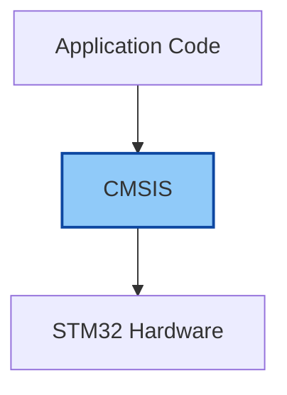

# STM32 CMSIS

## Introduction

When starting with STM32 microcontroller programming, you'll quickly encounter the term **CMSIS** (Cortex Microcontroller Software Interface Standard). CMSIS is a vendor-independent hardware abstraction layer for ARM Cortex-M processors that simplifies microcontroller programming and improves code portability between different ARM devices.

Think of CMSIS as a standardized interface that sits between your application code and the hardware, providing consistent access to processor features and peripherals regardless of the specific microcontroller you're using.



In this tutorial, we'll explore CMSIS in the context of STM32 development, understand its components, and learn how to use it in your projects.

## What is CMSIS?

CMSIS was developed by ARM in collaboration with various silicon vendors (including ST Microelectronics) to standardize the software interface to the processor. Before CMSIS, each microcontroller vendor had their own way of accessing core processor features, making it difficult to port code between different manufacturers' devices.

CMSIS provides a consistent and simple API for:

1. The ARM Cortex-M core and peripherals
2. Real-Time Operating System (RTOS) interfaces
3. DSP (Digital Signal Processing) functionality
4. Debug interfaces

## CMSIS Components

CMSIS is made up of several components:

- **CMSIS-Core**: Provides the core peripherals interface for Cortex-M processors
- **CMSIS-Driver**: Defines generic peripheral driver interfaces for middleware
- **CMSIS-DSP**: A library of DSP functions for Cortex-M processors
- **CMSIS-RTOS**: A common API for real-time operating systems
- **CMSIS-Pack**: A standardized way to distribute software components

For STM32 programming, the most commonly used component is CMSIS-Core, which we'll focus on in this tutorial.

## Getting Started with CMSIS in STM32

When you install the STM32CubeIDE or the STM32CubeMX tool, the CMSIS files are automatically included. If you're using a different IDE, you'll need to download the CMSIS files from the [ARM website](https://developer.arm.com/tools-and-software/embedded/cmsis) or get them as part of the STM32Cube package.

### Directory Structure

In an STM32Cube project, CMSIS files are typically located in:

- `/Drivers/CMSIS/Device/ST/STM32Fxxx/` - Contains device-specific files
- `/Drivers/CMSIS/Include/` - Contains core CMSIS files

### Key Files in CMSIS

Several important files make up the CMSIS framework:

1. **Device Header File (`stm32fxxx.h`)**: Contains all register definitions specific to your STM32 device family
2. **Core Peripheral Access Layer (`core_cm4.h`, etc.)**: Provides direct access to all Cortex-M core peripherals
3. **System File (`system_stm32fxxx.c`)**: Contains the system initialization code
4. **Startup File (`startup_stm32fxxx.s`)**: Assembly file that sets up the C environment and vector table

## Using CMSIS in Your STM32 Project

Let's look at how to use CMSIS for basic operations:

### 1. Including CMSIS Headers

Every STM32 project starts by including the appropriate device header:

```c
#include "stm32f4xx.h"   // For STM32F4 series
// OR
#include "stm32f1xx.h"   // For STM32F1 series
// OR 
#include "stm32l4xx.h"   // For STM32L4 series
```

This single include gives you access to all peripheral registers and CMSIS core functions.

### 2. Accessing Peripherals with CMSIS

CMSIS defines consistent naming conventions for all peripherals. For example, to access GPIO registers:

```c
// Set pin 5 on GPIOA high using CMSIS
GPIOA->ODR |= (1 << 5);

// Or alternatively using the BSRR register (better practice)
GPIOA->BSRR = (1 << 5);

// Set pin 5 on GPIOA low
GPIOA->BSRR = (1 << (5 + 16));
```

### 3. System Initialization

CMSIS provides a standard function for system initialization:

```c
int main(void)
{
    // Initialize the system and clock setup
    SystemInit();
    
    // Configure the SysTick timer
    SysTick_Config(SystemCoreClock / 1000);
    
    // Your application code here
    
    while(1) {
        // Main loop
    }
}
```

### 4. Interrupt Handling

CMSIS standardizes interrupt handling with predefined interrupt handler names:

```c
// USART1 interrupt handler
void USART1_IRQHandler(void)
{
    // Check if USART1 receive interrupt occurred
    if(USART1->SR & USART_SR_RXNE) {
        // Read received data
        uint8_t data = USART1->DR;
        
        // Process data...
    }
}
```

## Practical Example: LED Blinking with CMSIS

Let's create a simple example that blinks an LED on an STM32F4 Discovery board using only CMSIS:

```c
#include "stm32f4xx.h"

// Simple delay function
void delay(uint32_t cycles)
{
    for(uint32_t i = 0; i < cycles; i++) {
        __NOP(); // No operation - prevents optimization
    }
}

int main(void)
{
    // Enable clock to GPIOD peripheral
    RCC->AHB1ENR |= RCC_AHB1ENR_GPIODEN;
    
    // Configure PD12 (Green LED) as output
    GPIOD->MODER &= ~(0x3 << (12 * 2)); // Clear mode bits
    GPIOD->MODER |= (0x1 << (12 * 2));  // Set as output
    
    while(1) {
        // Toggle the LED
        GPIOD->ODR ^= (1 << 12);
        
        // Delay
        delay(1000000);
    }
}
```

## Core CMSIS Functions

CMSIS provides many useful functions for core CPU operations:

### SysTick Timer Configuration

```c
// Configure SysTick to generate interrupt every 1ms
SysTick_Config(SystemCoreClock / 1000);
```

### NVIC (Nested Vectored Interrupt Controller) Operations

```c
// Enable USART1 interrupt
NVIC_EnableIRQ(USART1_IRQn);

// Set USART1 interrupt priority (0 to 15, lower is higher priority)
NVIC_SetPriority(USART1_IRQn, 5);
```

### Critical Section Management

```c
// Disable all interrupts
__disable_irq();

// Critical section code here
// ...

// Re-enable interrupts
__enable_irq();
```

## Advanced Example: UART Communication with CMSIS

Let's implement a more complex example using UART communication:

```c
#include "stm32f4xx.h"
#include <stdint.h>

void UART_Init(void)
{
    // Enable clock for GPIOA and USART2
    RCC->AHB1ENR |= RCC_AHB1ENR_GPIOAEN;
    RCC->APB1ENR |= RCC_APB1ENR_USART2EN;
    
    // Configure PA2 (USART2_TX) and PA3 (USART2_RX) for alternate function
    // Set mode to alternate function
    GPIOA->MODER &= ~(GPIO_MODER_MODER2_Msk | GPIO_MODER_MODER3_Msk);
    GPIOA->MODER |= (GPIO_MODER_MODER2_1 | GPIO_MODER_MODER3_1);
    
    // Set alternate function to USART2 (AF7)
    GPIOA->AFR[0] &= ~(GPIO_AFRL_AFRL2_Msk | GPIO_AFRL_AFRL3_Msk);
    GPIOA->AFR[0] |= (7 << GPIO_AFRL_AFRL2_Pos) | (7 << GPIO_AFRL_AFRL3_Pos);
    
    // Configure USART2
    // Reset USART2 configuration
    USART2->CR1 = 0;
    USART2->CR2 = 0;
    USART2->CR3 = 0;
    
    // Set baud rate to 9600 (assuming 16MHz APB1 clock)
    // Baud = fCK / (16 * USARTDIV)
    // USARTDIV = fCK / (16 * Baud) = 16MHz / (16 * 9600) = 104.167
    // We need to multiply by 16 for the register: 104.167 * 16 = 1666.67 = 0x0683
    USART2->BRR = 0x0683;
    
    // Enable USART2, transmitter, and receiver
    USART2->CR1 |= USART_CR1_UE | USART_CR1_TE | USART_CR1_RE;
}

void UART_SendChar(char c)
{
    // Wait until the transmit data register is empty
    while(!(USART2->SR & USART_SR_TXE));
    
    // Send the character
    USART2->DR = c;
}

void UART_SendString(const char* str)
{
    while(*str) {
        UART_SendChar(*str++);
    }
}

char UART_ReceiveChar(void)
{
    // Wait until data is received
    while(!(USART2->SR & USART_SR_RXNE));
    
    // Return the received data
    return (char)USART2->DR;
}

int main(void)
{
    // Initialize system
    SystemInit();
    
    // Initialize UART
    UART_Init();
    
    // Send welcome message
    UART_SendString("CMSIS UART Example\r
");
    
    while(1) {
        // Echo received characters
        char received = UART_ReceiveChar();
        UART_SendChar(received);
    }
}
```

This example demonstrates how to:
1. Configure GPIO pins for UART communication
2. Set up the USART peripheral with specific baud rate
3. Send and receive data using the UART

## CMSIS vs HAL vs LL

When programming STM32 microcontrollers, you have several abstraction layer options:

1. **CMSIS**: Low-level, direct register access with standardized naming
2. **LL (Low Level)**: Thin wrapper over CMSIS with improved readability
3. **HAL (Hardware Abstraction Layer)**: High-level API with more abstraction and portability

Here's a comparison of the same operation (toggling an LED) using each approach:

### CMSIS approach

```c
// Toggle LED with CMSIS
GPIOD->ODR ^= (1 << 12);
```

### LL approach

```c
// Toggle LED with LL
LL_GPIO_TogglePin(GPIOD, LL_GPIO_PIN_12);
```

### HAL approach

```c
// Toggle LED with HAL
HAL_GPIO_TogglePin(GPIOD, GPIO_PIN_12);
```

The main differences are:

| Feature | CMSIS | LL | HAL |
|---------|-------|----|----|
| Code Size | Smallest | Small | Larger |
| Abstraction | Low | Medium | High |
| Portability | Good | Better | Best |
| Performance | Fastest | Fast | Slower |
| Learning Curve | Steeper | Medium | Gentler |

## When to Use CMSIS

CMSIS is particularly useful when:

1. You need maximum performance and minimal overhead
2. You're developing time-critical applications
3. You want better control over hardware resources
4. You need to reduce code size for resource-constrained devices
5. You're learning how the microcontroller works at a deeper level

## Practical Tips for Working with CMSIS

1. **Keep datasheets handy**: You'll need to refer to them to understand register configurations
2. **Use bit definitions**: Instead of raw numbers, use the defined bit masks and positions
3. **Pay attention to clock configuration**: Most peripheral issues are related to improper clock setup
4. **Start simple**: Begin with basic examples and gradually add complexity
5. **Remember peripheral initialization**: Always enable clocks to peripherals before using them

## Summary

CMSIS provides a standardized way to interact with ARM Cortex-M based microcontrollers, including the STM32 family. It offers direct access to hardware features while maintaining a consistent API across different devices. 

While it has a steeper learning curve compared to HAL, CMSIS gives you better performance, smaller code size, and deeper understanding of the hardware. It's an essential skill for any serious STM32 developer, especially for optimizing critical sections of code or working on resource-constrained devices.

As you advance in your STM32 journey, you'll likely use a combination of abstraction layers - HAL for general-purpose code and CMSIS for performance-critical sections.

## Exercises

1. Write a CMSIS-based program to read the state of a button and toggle an LED when pressed.
2. Modify the UART example to implement a circular buffer for receiving data.
3. Implement a PWM signal to fade an LED using CMSIS Timer configuration.
4. Create a simple ADC program that reads an analog value and transmits it over UART.
5. Use the SysTick timer to implement a precise 1-second delay function.

## Additional Resources

- [ARM CMSIS Documentation](https://arm-software.github.io/CMSIS_5/General/html/index.html)
- [STM32 Reference Manuals](https://www.st.com/en/microcontrollers-microprocessors/stm32-32-bit-arm-cortex-mcus.html)
- [STM32F4 Discovery Board Resources](https://www.st.com/en/evaluation-tools/stm32f4discovery.html)
- ST's programming manual: "PM0214 STM32F3, STM32F4 and STM32L4 Series Cortex®-M4 Programming Manual"

Remember that mastering CMSIS takes practice. Start with simple examples, understand each line of code, and gradually tackle more complex projects. With time, you'll develop an intuitive understanding of the STM32 peripherals and how to control them efficiently.