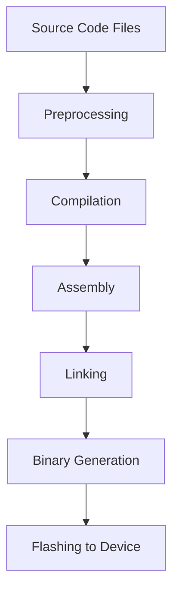

# STM32 Build Process

## Introduction

The STM32 build process transforms your C/C++ source code into executable firmware that runs on STM32 microcontrollers. Understanding this process is essential for effective debugging, optimizing your applications, and troubleshooting common issues. This guide explains each step of the STM32 build process, from preprocessing your code to flashing the final binary onto your device.

## The Build Process Overview

The STM32 build process consists of several sequential steps that convert your human-readable source code into machine code that can execute on the microcontroller.



Let's examine each step in detail:

## 1. Preprocessing

Before actual compilation, the C preprocessor processes directives like `#include`, `#define`, and conditional compilation statements (`#ifdef`, `#ifndef`, etc.).

### What happens during preprocessing:

- Header files are included
- Macros are expanded
- Conditional compilation is resolved
- Comments are removed

### Example:

```c
#include "stm32f4xx_hal.h"

#define LED_PIN GPIO_PIN_13
#define LED_PORT GPIOC

#ifdef DEBUG_MODE
  #define DEBUG_PRINT(x) printf(x)
#else
  #define DEBUG_PRINT(x)
#endif

void initLED(void) {
  // Initialize LED pin
  HAL_GPIO_WritePin(LED_PORT, LED_PIN, GPIO_PIN_RESET);
}
```

After preprocessing, the file might look something like this (simplified):

```c
/* Content of stm32f4xx_hal.h expanded here */

void initLED(void) {
  // Initialize LED pin
  HAL_GPIO_WritePin(GPIOC, GPIO_PIN_13, GPIO_PIN_RESET);
}
```

## 2. Compilation

The compiler translates the preprocessed C/C++ code into assembly language specific to the ARM Cortex-M architecture used by STM32 microcontrollers.

### What happens during compilation:

- Syntax checking
- Type checking
- Optimization (based on compiler flags)
- Machine-independent code improvements
- Generation of assembly code

### Common compiler flags for STM32 development:

```bash
-mcpu=cortex-m4        # Specify the CPU core
-mthumb                # Use Thumb instruction set
-mfloat-abi=hard       # Hardware floating-point
-mfpu=fpv4-sp-d16      # Floating-point unit specification
-O2                    # Optimization level
-Wall                  # Enable all warnings
```

## 3. Assembly

The assembler converts the assembly code into machine code (object files). Each source file is processed into a corresponding object file (`.o`).

### What happens during assembly:

- Assembly instructions are converted to machine code
- Symbol table generation
- Creation of relocatable object files

### Example command:

```bash
arm-none-eabi-as -mcpu=cortex-m4 -mthumb file.s -o file.o
```

## 4. Linking

The linker combines multiple object files, resolves references between them, and allocates memory addresses according to the linker script (`.ld`).

### What happens during linking:

- Combines object files
- Resolves symbol references
- Allocates memory according to the linker script
- Performs global optimizations
- Creates an executable file (`.elf`)

### Linker Script

The linker script is crucial as it defines the memory layout for your STM32 device:

```c
/* Simplified linker script example */
MEMORY
{
  FLASH (rx)      : ORIGIN = 0x08000000, LENGTH = 1024K
  RAM (xrw)       : ORIGIN = 0x20000000, LENGTH = 128K
}

SECTIONS
{
  .text :
  {
    *(.isr_vector)
    *(.text)
    *(.text*)
    *(.rodata)
    *(.rodata*)
    . = ALIGN(4);
  } >FLASH
  
  .data :
  {
    . = ALIGN(4);
    _sdata = .;
    *(.data)
    *(.data*)
    . = ALIGN(4);
    _edata = .;
  } >RAM AT> FLASH
  
  .bss :
  {
    . = ALIGN(4);
    _sbss = .;
    *(.bss)
    *(.bss*)
    *(COMMON)
    . = ALIGN(4);
    _ebss = .;
  } >RAM
}
```

## 5. Binary Generation

After linking, various utilities convert the ELF file into formats suitable for flashing onto the STM32 device.

### Common output formats:

- `.elf` - Contains debugging information
- `.hex` - Intel HEX format for programming
- `.bin` - Raw binary format

### Example commands:

```bash
# Generate binary file from ELF
arm-none-eabi-objcopy -O binary app.elf app.bin

# Generate HEX file from ELF
arm-none-eabi-objcopy -O ihex app.elf app.hex

# Display size information
arm-none-eabi-size app.elf
```

The size command output might look like:

```
   text    data     bss     dec     hex filename
  65536    1024    2048   68608   10C00 app.elf
```

## 6. Flashing to Device

The final step is to program the binary onto the STM32 microcontroller using tools like ST-Link, J-Link, or DFU (Device Firmware Upgrade).

### Common flashing methods:

#### Using ST-Link with OpenOCD:

```bash
openocd -f interface/stlink.cfg -f target/stm32f4x.cfg -c "program app.bin 0x08000000 verify reset exit"
```

#### Using ST-Link Utility (GUI):

1. Connect ST-Link to your STM32 board
2. Open ST-Link Utility
3. Navigate to File → Open File and select your `.bin` or `.hex` file
4. Set the correct starting address (usually 0x08000000)
5. Click "Program & Verify"

## Practical Example: Complete Build Process

Let's walk through a practical example using Makefile-based build for a simple LED blinking application:

### Project Structure:

```
my_stm32_project/
├── Makefile
├── stm32f4xx_hal_conf.h
├── startup_stm32f407xx.s
├── STM32F407VGTx_FLASH.ld
├── src/
│   ├── main.c
│   ├── stm32f4xx_it.c
│   └── system_stm32f4xx.c
└── include/
    ├── main.h
    └── stm32f4xx_it.h
```

### Makefile:

```make
# Project Name
TARGET = led_blink

# Paths
SRC_DIR = src
INC_DIR = include
BUILD_DIR = build

# Toolchain
CC = arm-none-eabi-gcc
AS = arm-none-eabi-as
LD = arm-none-eabi-ld
OBJCOPY = arm-none-eabi-objcopy
SIZE = arm-none-eabi-size

# MCU flags
MCU = -mcpu=cortex-m4 -mthumb -mfloat-abi=hard -mfpu=fpv4-sp-d16

# C flags
CFLAGS = $(MCU) -Wall -O2
CFLAGS += -DUSE_HAL_DRIVER -DSTM32F407xx
CFLAGS += -I$(INC_DIR) -I./

# Linker flags
LDFLAGS = $(MCU) -T STM32F407VGTx_FLASH.ld -Wl,--gc-sections

# Find source files
SRC = $(wildcard $(SRC_DIR)/*.c)
ASM = startup_stm32f407xx.s

# Objects
OBJECTS = $(addprefix $(BUILD_DIR)/,$(notdir $(SRC:.c=.o)))
OBJECTS += $(addprefix $(BUILD_DIR)/,$(notdir $(ASM:.s=.o)))

# Main build rule
all: $(BUILD_DIR) $(BUILD_DIR)/$(TARGET).bin

# Create build directory
$(BUILD_DIR):
	mkdir -p $@

# Compile C files
$(BUILD_DIR)/%.o: $(SRC_DIR)/%.c
	$(CC) $(CFLAGS) -c $< -o $@

# Assemble
$(BUILD_DIR)/%.o: %.s
	$(AS) $(MCU) $< -o $@

# Link
$(BUILD_DIR)/$(TARGET).elf: $(OBJECTS)
	$(CC) $(LDFLAGS) $^ -o $@
	$(SIZE) $@

# Create binary
$(BUILD_DIR)/$(TARGET).bin: $(BUILD_DIR)/$(TARGET).elf
	$(OBJCOPY) -O binary $< $@

# Flash the device
flash: $(BUILD_DIR)/$(TARGET).bin
	openocd -f interface/stlink.cfg -f target/stm32f4x.cfg -c "program $< 0x08000000 verify reset exit"

# Clean
clean:
	rm -rf $(BUILD_DIR)

.PHONY: all flash clean
```

### Simple LED Blink Source Code:

```c
/* main.c */
#include "main.h"

void SystemClock_Config(void);
static void MX_GPIO_Init(void);

int main(void)
{
  /* Reset of all peripherals, Initializes the Flash interface and the Systick. */
  HAL_Init();
  
  /* Configure the system clock */
  SystemClock_Config();
  
  /* Initialize GPIO */
  MX_GPIO_Init();
  
  /* Infinite loop */
  while (1)
  {
    /* Toggle LED */
    HAL_GPIO_TogglePin(GPIOC, GPIO_PIN_13);
    
    /* Delay */
    HAL_Delay(500);
  }
}

static void MX_GPIO_Init(void)
{
  GPIO_InitTypeDef GPIO_InitStruct = {0};
  
  /* Enable GPIOC clock */
  __HAL_RCC_GPIOC_CLK_ENABLE();
  
  /* Configure LED pin */
  GPIO_InitStruct.Pin = GPIO_PIN_13;
  GPIO_InitStruct.Mode = GPIO_MODE_OUTPUT_PP;
  GPIO_InitStruct.Pull = GPIO_NOPULL;
  GPIO_InitStruct.Speed = GPIO_SPEED_FREQ_LOW;
  HAL_GPIO_Init(GPIOC, &GPIO_InitStruct);
}
```

### Building the Project:

To build the project, you would execute these commands:

```bash
# Create build directory
mkdir -p build

# Build the project
make

# Output will look something like:
arm-none-eabi-gcc -mcpu=cortex-m4 -mthumb -mfloat-abi=hard -mfpu=fpv4-sp-d16 -Wall -O2 -DUSE_HAL_DRIVER -DSTM32F407xx -Iinclude -I./ -c src/main.c -o build/main.o
arm-none-eabi-gcc -mcpu=cortex-m4 -mthumb -mfloat-abi=hard -mfpu=fpv4-sp-d16 -Wall -O2 -DUSE_HAL_DRIVER -DSTM32F407xx -Iinclude -I./ -c src/stm32f4xx_it.c -o build/stm32f4xx_it.o
arm-none-eabi-gcc -mcpu=cortex-m4 -mthumb -mfloat-abi=hard -mfpu=fpv4-sp-d16 -Wall -O2 -DUSE_HAL_DRIVER -DSTM32F407xx -Iinclude -I./ -c src/system_stm32f4xx.c -o build/system_stm32f4xx.o
arm-none-eabi-as -mcpu=cortex-m4 -mthumb startup_stm32f407xx.s -o build/startup_stm32f407xx.o
arm-none-eabi-gcc -mcpu=cortex-m4 -mthumb -mfloat-abi=hard -mfpu=fpv4-sp-d16 -T STM32F407VGTx_FLASH.ld -Wl,--gc-sections build/main.o build/stm32f4xx_it.o build/system_stm32f4xx.o build/startup_stm32f407xx.o -o build/led_blink.elf
arm-none-eabi-size build/led_blink.elf
   text    data     bss     dec     hex filename
  11476     104    1568   13148    3364 build/led_blink.elf
arm-none-eabi-objcopy -O binary build/led_blink.elf build/led_blink.bin

# Flash to device
make flash
```

## Modern Build Systems for STM32

While Makefiles are traditional and powerful, modern STM32 development often uses integrated build systems:

### STM32CubeIDE

An Eclipse-based IDE with integrated build tools and debugging capabilities.

Key features:
- Project generation from STM32CubeMX configurations
- Integrated build process
- Automatic generation of build files
- Integrated debugging with ST-Link

### CMake

A cross-platform build system becoming popular for STM32 development:

```cmake
# Simplified CMakeLists.txt for STM32 project
cmake_minimum_required(VERSION 3.13)

# Set toolchain file for cross-compilation
set(CMAKE_TOOLCHAIN_FILE ${CMAKE_SOURCE_DIR}/cmake/arm-none-eabi-gcc.cmake)

# Project details
project(LED_Blink C ASM)

# Add executable
add_executable(${PROJECT_NAME}
    src/main.c
    src/stm32f4xx_it.c
    src/system_stm32f4xx.c
    startup_stm32f407xx.s
)

# Include directories
target_include_directories(${PROJECT_NAME} PRIVATE
    ${CMAKE_SOURCE_DIR}/include
    ${CMAKE_SOURCE_DIR}
)

# Compile definitions
target_compile_definitions(${PROJECT_NAME} PRIVATE
    -DUSE_HAL_DRIVER
    -DSTM32F407xx
)

# Linker script
target_link_options(${PROJECT_NAME} PRIVATE
    -T${CMAKE_SOURCE_DIR}/STM32F407VGTx_FLASH.ld
    -Wl,--gc-sections
)

# Post-build commands to create binary
add_custom_command(TARGET ${PROJECT_NAME} POST_BUILD
    COMMAND ${CMAKE_OBJCOPY} -O binary ${PROJECT_NAME} ${PROJECT_NAME}.bin
    COMMAND ${CMAKE_SIZE} ${PROJECT_NAME}
)
```

## Common Build Issues and Troubleshooting

### 1. Linker Errors

```
undefined reference to `HAL_GPIO_Init'
```

**Solution**: Include the HAL GPIO module in your build by adding the appropriate source files or libraries.

### 2. Memory Allocation Issues

```
region `FLASH' overflowed by 1234 bytes
```

**Solution**: Reduce code size, optimize compilation, or modify the linker script to match your device's memory.

### 3. Incorrect CPU/FPU Flags

```
Error: selected processor does not support `vfp' instruction
```

**Solution**: Ensure your compiler flags match your specific STM32 model's capabilities.

### 4. Startup Code Issues

```
No reset handler defined
```

**Solution**: Ensure the startup file (startup_stm32xxxx.s) is included in your build.

## Summary

Understanding the STM32 build process is essential for effective embedded development. The process transforms your source code into machine-executable firmware through preprocessing, compilation, assembly, linking, binary generation, and flashing.

Key takeaways:
- The build process follows a logical sequence from source code to executable firmware
- The linker script is critical for proper memory allocation
- Various output formats (.elf, .bin, .hex) serve different purposes
- Modern build systems like CMake and STM32CubeIDE simplify the build process
- Understanding the build process helps in troubleshooting common issues

## Additional Resources

- [STM32 Programming Manual](https://www.st.com/resource/en/programming_manual/pm0214-stm32-cortexm4-mcus-and-mpus-programming-manual-stmicroelectronics.pdf)
- [ARM GCC Compiler Documentation](https://gcc.gnu.org/onlinedocs/)
- [OpenOCD User's Guide](http://openocd.org/doc/html/index.html)

## Exercises

1. Create a simple STM32 project using both Makefile and CMake build systems.
2. Modify the linker script to add a custom section for configuration data.
3. Analyze the size impact of different optimization levels (-O0, -O1, -O2, -O3, -Os).
4. Set up a continuous integration pipeline that builds your STM32 firmware automatically.
5. Implement a dual-bootloader system that requires careful memory allocation in the linker script.