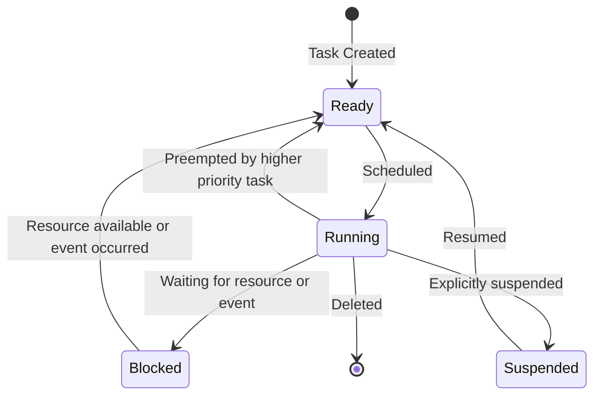

# STM32 RTOS Basics

## Introduction

Real-Time Operating Systems (RTOS) provide a powerful framework for managing tasks, timing, and resources in embedded systems. When working with STM32 microcontrollers, integrating an RTOS can help you create more complex applications while maintaining predictable timing behavior.

In this tutorial, we'll explore the fundamentals of RTOS and how to implement it on STM32 microcontrollers. We'll focus on FreeRTOS, one of the most popular open-source RTOS options for embedded systems.

## What is an RTOS?

A Real-Time Operating System is specialized software designed to run applications with precise timing and a high degree of reliability. Unlike general-purpose operating systems (like Windows or Linux), an RTOS prioritizes deterministic behavior and meeting timing deadlines.

Key characteristics of an RTOS include:

- **Task Management**: Running multiple tasks (threads) concurrently
- **Scheduling**: Determining which task runs when
- **Determinism**: Ensuring predictable response times
- **Resource Management**: Coordinating access to shared resources
- **Inter-Task Communication**: Allowing tasks to communicate safely

## Why Use an RTOS with STM32?

STM32 microcontrollers are powerful enough to handle multiple tasks, but managing them efficiently requires proper organization. Here's why you might want to use an RTOS:

1. **Simplified Complex Applications**: Breaking your application into separate tasks makes complex programs easier to design and maintain
2. **Improved Responsiveness**: Critical tasks can be given higher priority
3. **Efficient Resource Usage**: The CPU can switch between tasks rather than busy-waiting
4. **Better Code Organization**: Each task can focus on a specific function
5. **Standardized Timing and Synchronization**: Using RTOS services for timing instead of custom solutions

## RTOS Concepts

Before diving into code, let's understand the fundamental concepts of an RTOS.

### Tasks

Tasks (sometimes called threads) are independent functions that run concurrently. Each task has:

- Its own stack
- A priority level
- A state (Running, Ready, Blocked, Suspended)



### Scheduler

The scheduler determines which task runs at any given time. FreeRTOS uses a priority-based preemptive scheduler, meaning:

- Higher-priority tasks run before lower-priority ones
- A higher-priority task can interrupt (preempt) a lower-priority task
- Tasks with the same priority can share CPU time using time-slicing

### Synchronization Primitives

RTOS provides several mechanisms to coordinate between tasks:

- **Semaphores**: Control access to resources
- **Mutexes**: Protect shared data (similar to semaphores but with priority inheritance)
- **Event Flags**: Signal when events occur
- **Message Queues**: Pass data between tasks

## Setting Up FreeRTOS on STM32

Let's now look at how to set up FreeRTOS on an STM32 microcontroller.

### Prerequisites

- STM32 microcontroller (any STM32 family device)
- STM32CubeIDE or similar development environment
- Basic understanding of C programming and STM32 peripherals

### Step 1: Project Creation

The easiest way to get started is using STM32CubeIDE:

1. Create a new STM32 project
2. Select your specific STM32 board or microcontroller
3. In the project configuration, navigate to the "Middleware" section
4. Enable "FREERTOS" and select "CMSIS_V1" or "CMSIS_V2" interface

Alternatively, you can add FreeRTOS to an existing project through the STM32CubeMX tool.

### Step 2: Configuring FreeRTOS

After enabling FreeRTOS, you'll need to configure it. The main configuration file is `FreeRTOSConfig.h`. Here are some important parameters:

```c
/* Basic configurations */
#define configUSE_PREEMPTION                    1
#define configUSE_PORT_OPTIMISED_TASK_SELECTION 0
#define configUSE_TICKLESS_IDLE                 0
#define configCPU_CLOCK_HZ                      ( SystemCoreClock )
#define configTICK_RATE_HZ                      ( ( TickType_t ) 1000 )
#define configMAX_PRIORITIES                    ( 7 )
#define configMINIMAL_STACK_SIZE                ( ( uint16_t ) 128 )
#define configMAX_TASK_NAME_LEN                 ( 16 )
#define configUSE_16_BIT_TICKS                  0
#define configIDLE_SHOULD_YIELD                 1
#define configUSE_TASK_NOTIFICATIONS            1

/* Memory allocation related definitions */
#define configTOTAL_HEAP_SIZE                   ( ( size_t ) 15360 )
#define configSUPPORT_STATIC_ALLOCATION         0
#define configSUPPORT_DYNAMIC_ALLOCATION        1
```

These settings control:
- How the scheduler works
- How many priorities your system supports
- How much memory to allocate for the RTOS
- Various feature enables/disables

### Step 3: Creating Tasks

Now let's create a simple task:

```c
/* Task function prototype */
void vBlinkyTask(void *pvParameters);

/* Task handle */
TaskHandle_t xBlinkyTaskHandle = NULL;

int main(void)
{
  /* MCU Configuration */
  HAL_Init();
  SystemClock_Config();
  MX_GPIO_Init();
  
  /* Create the blinky task */
  xTaskCreate(
    vBlinkyTask,             /* Task function */
    "Blinky",                /* Task name (for debugging) */
    configMINIMAL_STACK_SIZE,/* Stack size in words, not bytes */
    NULL,                    /* Parameters passed to the task */
    tskIDLE_PRIORITY + 1,    /* Priority */
    &xBlinkyTaskHandle       /* Task handle */
  );
  
  /* Start the scheduler */
  vTaskStartScheduler();
  
  /* Should never reach here as scheduler is running */
  while(1) {}
}

/* Blinky task implementation */
void vBlinkyTask(void *pvParameters)
{
  /* Task code runs in an infinite loop, NEVER return or exit */
  for(;;)
  {
    HAL_GPIO_TogglePin(LD2_GPIO_Port, LD2_Pin);  /* Toggle LED */
    vTaskDelay(pdMS_TO_TICKS(500));              /* Delay for 500ms */
  }
}
```

This creates a simple task that blinks an LED every 500ms. Notice the infinite loop in the task - RTOS tasks should never return or exit.

## Using RTOS Features

Let's explore some common RTOS features with practical examples.

### Example 1: Multiple Tasks

Here's how to create multiple tasks with different priorities:

```c
/* Task handles */
TaskHandle_t xBlinkyTaskHandle = NULL;
TaskHandle_t xButtonTaskHandle = NULL;

int main(void)
{
  /* MCU Configuration */
  HAL_Init();
  SystemClock_Config();
  MX_GPIO_Init();
  
  /* Create tasks */
  xTaskCreate(vBlinkyTask, "Blinky", configMINIMAL_STACK_SIZE, 
              NULL, tskIDLE_PRIORITY + 1, &xBlinkyTaskHandle);
              
  xTaskCreate(vButtonTask, "Button", configMINIMAL_STACK_SIZE, 
              NULL, tskIDLE_PRIORITY + 2, &xButtonTaskHandle);
  
  /* Start the scheduler */
  vTaskStartScheduler();
  
  /* Should never reach here */
  while(1) {}
}

void vBlinkyTask(void *pvParameters)
{
  for(;;)
  {
    HAL_GPIO_TogglePin(LD2_GPIO_Port, LD2_Pin);
    vTaskDelay(pdMS_TO_TICKS(500));
  }
}

void vButtonTask(void *pvParameters)
{
  for(;;)
  {
    /* Check button state */
    if(HAL_GPIO_ReadPin(B1_GPIO_Port, B1_Pin) == GPIO_PIN_RESET)
    {
      /* Button is pressed (active low) */
      HAL_GPIO_WritePin(LD2_GPIO_Port, LD2_Pin, GPIO_PIN_SET);
      
      /* Suspend the blinky task */
      vTaskSuspend(xBlinkyTaskHandle);
    }
    else
    {
      /* Resume the blinky task if it was suspended */
      vTaskResume(xBlinkyTaskHandle);
    }
    
    /* Small delay to debounce */
    vTaskDelay(pdMS_TO_TICKS(50));
  }
}
```

This example creates two tasks:
1. A lower-priority task that blinks an LED
2. A higher-priority task that checks a button and suspends the blinky task when pressed

### Example 2: Using Queues for Communication

Queues allow tasks to safely exchange data:

```c
/* Queue handle */
QueueHandle_t xDataQueue;

/* Define a simple data structure */
typedef struct {
  uint32_t sensorValue;
  uint32_t timestamp;
} SensorData_t;

int main(void)
{
  /* MCU Configuration */
  HAL_Init();
  SystemClock_Config();
  MX_GPIO_Init();
  MX_ADC1_Init();
  
  /* Create queue - can hold 5 items of SensorData_t size */
  xDataQueue = xQueueCreate(5, sizeof(SensorData_t));
  
  /* Create tasks */
  xTaskCreate(vSensorTask, "Sensor", configMINIMAL_STACK_SIZE, 
              NULL, tskIDLE_PRIORITY + 1, NULL);
              
  xTaskCreate(vProcessTask, "Process", configMINIMAL_STACK_SIZE, 
              NULL, tskIDLE_PRIORITY + 2, NULL);
  
  /* Start the scheduler */
  vTaskStartScheduler();
  
  /* Should never reach here */
  while(1) {}
}

void vSensorTask(void *pvParameters)
{
  SensorData_t data;
  uint32_t adcValue;
  
  for(;;)
  {
    /* Read ADC value */
    HAL_ADC_Start(&hadc1);
    HAL_ADC_PollForConversion(&hadc1, 100);
    adcValue = HAL_ADC_GetValue(&hadc1);
    
    /* Fill data structure */
    data.sensorValue = adcValue;
    data.timestamp = HAL_GetTick();
    
    /* Send to queue, wait up to 10 ticks if queue is full */
    xQueueSend(xDataQueue, &data, pdMS_TO_TICKS(10));
    
    /* Read sensor every 100ms */
    vTaskDelay(pdMS_TO_TICKS(100));
  }
}

void vProcessTask(void *pvParameters)
{
  SensorData_t receivedData;
  
  for(;;)
  {
    /* Wait for data to arrive in the queue */
    if(xQueueReceive(xDataQueue, &receivedData, portMAX_DELAY) == pdPASS)
    {
      /* Process the received data */
      if(receivedData.sensorValue > 2000)
      {
        HAL_GPIO_WritePin(LD2_GPIO_Port, LD2_Pin, GPIO_PIN_SET);
      }
      else
      {
        HAL_GPIO_WritePin(LD2_GPIO_Port, LD2_Pin, GPIO_PIN_RESET);
      }
      
      /* For debugging - could send to UART */
      /* printf("Value: %lu, Time: %lu\r
", 
             receivedData.sensorValue, 
             receivedData.timestamp); */
    }
  }
}
```

This example:
1. Creates a queue that can hold 5 sensor data structures
2. The sensor task reads ADC values and sends them to the queue
3. The processing task waits for data in the queue and processes it

### Example 3: Using Semaphores

Semaphores help coordinate access to shared resources:

```c
/* Semaphore handle */
SemaphoreHandle_t xUartSemaphore;

int main(void)
{
  /* MCU Configuration */
  HAL_Init();
  SystemClock_Config();
  MX_GPIO_Init();
  MX_USART2_UART_Init();
  
  /* Create mutex semaphore for UART access */
  xUartSemaphore = xSemaphoreCreateMutex();
  
  /* Create tasks */
  xTaskCreate(vTask1, "Task1", configMINIMAL_STACK_SIZE, 
              NULL, tskIDLE_PRIORITY + 1, NULL);
              
  xTaskCreate(vTask2, "Task2", configMINIMAL_STACK_SIZE, 
              NULL, tskIDLE_PRIORITY + 1, NULL);
  
  /* Start the scheduler */
  vTaskStartScheduler();
  
  /* Should never reach here */
  while(1) {}
}

void vTask1(void *pvParameters)
{
  const char *message = "Message from Task 1\r
";
  
  for(;;)
  {
    /* Try to take the semaphore */
    if(xSemaphoreTake(xUartSemaphore, pdMS_TO_TICKS(100)) == pdTRUE)
    {
      /* We have the semaphore, safe to use UART */
      HAL_UART_Transmit(&huart2, (uint8_t*)message, strlen(message), 100);
      
      /* Release the semaphore */
      xSemaphoreGive(xUartSemaphore);
    }
    
    vTaskDelay(pdMS_TO_TICKS(200));
  }
}

void vTask2(void *pvParameters)
{
  const char *message = "Message from Task 2\r
";
  
  for(;;)
  {
    /* Try to take the semaphore */
    if(xSemaphoreTake(xUartSemaphore, pdMS_TO_TICKS(100)) == pdTRUE)
    {
      /* We have the semaphore, safe to use UART */
      HAL_UART_Transmit(&huart2, (uint8_t*)message, strlen(message), 100);
      
      /* Release the semaphore */
      xSemaphoreGive(xUartSemaphore);
    }
    
    vTaskDelay(pdMS_TO_TICKS(300));
  }
}
```

In this example:
1. We create a mutex semaphore to protect access to the UART
2. Two tasks want to print messages via UART
3. Each task must take the semaphore before using the UART and give it back afterward
4. This prevents messages from being interleaved or corrupted

## Real-World Application: Sensor Data Logger

Let's combine everything into a more practical example - a sensor data logger that reads temperature, processes the data, and logs results to UART:

```c
/* Handles */
TaskHandle_t xSensorTaskHandle = NULL;
TaskHandle_t xProcessTaskHandle = NULL;
TaskHandle_t xLogTaskHandle = NULL;
QueueHandle_t xSensorDataQueue = NULL;
QueueHandle_t xLogQueue = NULL;
SemaphoreHandle_t xI2CSemaphore = NULL;
SemaphoreHandle_t xUartSemaphore = NULL;

/* Data structures */
typedef struct {
  float temperature;
  uint32_t timestamp;
} TempData_t;

typedef struct {
  char message[64];
  uint8_t priority;  /* 0=low, 1=normal, 2=high */
} LogMessage_t;

int main(void)
{
  /* MCU Configuration */
  HAL_Init();
  SystemClock_Config();
  MX_GPIO_Init();
  MX_I2C1_Init();
  MX_USART2_UART_Init();
  
  /* Create queues */
  xSensorDataQueue = xQueueCreate(10, sizeof(TempData_t));
  xLogQueue = xQueueCreate(20, sizeof(LogMessage_t));
  
  /* Create semaphores */
  xI2CSemaphore = xSemaphoreCreateMutex();
  xUartSemaphore = xSemaphoreCreateMutex();
  
  /* Create tasks */
  xTaskCreate(vSensorTask, "Sensor", configMINIMAL_STACK_SIZE * 2, 
              NULL, tskIDLE_PRIORITY + 3, &xSensorTaskHandle);
              
  xTaskCreate(vProcessTask, "Process", configMINIMAL_STACK_SIZE * 2, 
              NULL, tskIDLE_PRIORITY + 2, &xProcessTaskHandle);
              
  xTaskCreate(vLogTask, "Log", configMINIMAL_STACK_SIZE * 2, 
              NULL, tskIDLE_PRIORITY + 1, &xLogTaskHandle);
  
  /* Start the scheduler */
  vTaskStartScheduler();
  
  /* Should never reach here */
  while(1) {}
}

void vSensorTask(void *pvParameters)
{
  TempData_t data;
  LogMessage_t logMsg;
  
  for(;;)
  {
    /* Take I2C semaphore to access the sensor */
    if(xSemaphoreTake(xI2CSemaphore, pdMS_TO_TICKS(100)) == pdTRUE)
    {
      /* Read temperature from I2C sensor (simplified) */
      /* In real code, you would use HAL_I2C functions */
      data.temperature = 25.5f;  /* Example value */
      data.timestamp = HAL_GetTick();
      
      /* Give back the I2C semaphore */
      xSemaphoreGive(xI2CSemaphore);
      
      /* Send data to processing queue */
      if(xQueueSend(xSensorDataQueue, &data, pdMS_TO_TICKS(10)) != pdPASS)
      {
        /* Queue is full, log an error */
        sprintf(logMsg.message, "ERROR: Sensor queue full at %lu", HAL_GetTick());
        logMsg.priority = 2;  /* High priority */
        xQueueSend(xLogQueue, &logMsg, 0);
      }
    }
    
    /* Read temperature every 1 second */
    vTaskDelay(pdMS_TO_TICKS(1000));
  }
}

void vProcessTask(void *pvParameters)
{
  TempData_t data;
  LogMessage_t logMsg;
  static float avgTemp = 0;
  static int sampleCount = 0;
  
  for(;;)
  {
    /* Wait for temperature data */
    if(xQueueReceive(xSensorDataQueue, &data, pdMS_TO_TICKS(5000)) == pdPASS)
    {
      /* Update running average */
      sampleCount++;
      avgTemp = avgTemp + (data.temperature - avgTemp) / sampleCount;
      
      /* Check for alarm conditions */
      if(data.temperature > 30.0f)
      {
        /* High temperature alarm */
        sprintf(logMsg.message, "ALARM: High temp %.1f C at %lu", 
                data.temperature, data.timestamp);
        logMsg.priority = 2;  /* High priority */
        xQueueSend(xLogQueue, &logMsg, pdMS_TO_TICKS(10));
        
        /* Turn on alarm LED */
        HAL_GPIO_WritePin(LD2_GPIO_Port, LD2_Pin, GPIO_PIN_SET);
      }
      else
      {
        /* Normal operation */
        HAL_GPIO_WritePin(LD2_GPIO_Port, LD2_Pin, GPIO_PIN_RESET);
      }
      
      /* Log every 10th reading */
      if(sampleCount % 10 == 0)
      {
        sprintf(logMsg.message, "INFO: Avg temp %.1f C over %d samples", 
                avgTemp, sampleCount);
        logMsg.priority = 1;  /* Normal priority */
        xQueueSend(xLogQueue, &logMsg, pdMS_TO_TICKS(10));
      }
    }
    else
    {
      /* Timeout waiting for data */
      sprintf(logMsg.message, "WARN: No temp data for 5 seconds");
      logMsg.priority = 1;
      xQueueSend(xLogQueue, &logMsg, pdMS_TO_TICKS(10));
    }
  }
}

void vLogTask(void *pvParameters)
{
  LogMessage_t logMsg;
  char buffer[80];
  
  for(;;)
  {
    /* Wait for log messages */
    if(xQueueReceive(xLogQueue, &logMsg, portMAX_DELAY) == pdPASS)
    {
      /* Format with timestamp */
      sprintf(buffer, "[%lu] %s\r
", HAL_GetTick(), logMsg.message);
      
      /* Take UART semaphore */
      if(xSemaphoreTake(xUartSemaphore, pdMS_TO_TICKS(100)) == pdTRUE)
      {
        /* Send to UART */
        HAL_UART_Transmit(&huart2, (uint8_t*)buffer, strlen(buffer), 100);
        
        /* Give back UART semaphore */
        xSemaphoreGive(xUartSemaphore);
      }
    }
  }
}
```

This more complex example demonstrates:
1. Multiple tasks with different priorities
2. Multiple queues for different data types
3. Semaphores protecting shared resources (I2C and UART)
4. Error handling and timeout management
5. A sensor-processing-logging pipeline architecture

## Common Pitfalls and Best Practices

When working with RTOS on STM32, keep these guidelines in mind:

### Pitfalls to Avoid

1. **Stack Overflow**: Allocate enough stack for each task
2. **Priority Inversion**: Use mutexes (not binary semaphores) for shared resources
3. **Deadlock**: Always acquire resources in the same order in different tasks
4. **Blocking in ISRs**: Never use blocking calls in interrupt service routines
5. **Memory Leaks**: Free resources properly when tasks are deleted

### Best Practices

1. **Use FromISR Functions**: When interacting with RTOS from interrupts, use the `...FromISR()` variants
2. **Mind Task Priorities**: Give real-time critical tasks higher priorities
3. **Avoid Busy Waiting**: Use RTOS delay functions instead of loops
4. **Handle Errors**: Always check return values from RTOS function calls
5. **Use Task Notifications**: They're faster than semaphores for simple signaling

## RTOS Debugging

Debugging RTOS applications can be challenging. Here are some techniques:

1. **Runtime Statistics**: Enable `configGENERATE_RUN_TIME_STATS` to monitor CPU usage
2. **Task Monitoring**: Use `vTaskList()` to see all tasks and their states
3. **Trace Tools**: FreeRTOS includes trace macros for detailed execution analysis
4. **Logic Analyzer**: Use spare GPIO pins to signal key events for external timing analysis

## Summary

In this tutorial, we've covered the fundamentals of using an RTOS with STM32 microcontrollers:

- RTOS concepts and benefits
- Setting up FreeRTOS on STM32
- Creating and managing tasks
- Using queues for inter-task communication
- Protecting shared resources with semaphores
- Building a practical multi-task application

Real-Time Operating Systems provide powerful tools for creating complex, responsive, and maintainable embedded applications. By breaking your program into separate tasks and using RTOS features for synchronization and communication, you can create more sophisticated applications while ensuring predictable timing behavior.

## Exercises

1. Modify the LED blinking example to use three LEDs with different blinking patterns.
2. Create a simple UART command processor that receives commands and responds to them.
3. Implement a temperature monitoring system with high and low alarms.
4. Create a data logger that stores sensor readings in flash memory.
5. Implement a priority inheritance example to demonstrate how it prevents priority inversion.

## Additional Resources

- [FreeRTOS Official Documentation](https://www.freertos.org/Documentation/RTOS_book.html)
- [STM32 HAL Documentation](https://www.st.com/resource/en/user_manual/dm00105879-description-of-stm32f4-hal-and-ll-drivers-stmicroelectronics.pdf)
- [Mastering the FreeRTOS Real Time Kernel](https://www.freertos.org/Documentation/161204_Mastering_the_FreeRTOS_Real_Time_Kernel-A_Hands-On_Tutorial_Guide.pdf)
- [STM32 Community on ST Forums](https://community.st.com/s/topic/0TO0X000000BSqSWAW/stm32)