# STM32 FreeRTOS Setup

## Introduction

FreeRTOS is a popular real-time operating system (RTOS) that allows embedded developers to manage multiple tasks efficiently on resource-constrained microcontrollers. This guide will walk you through setting up FreeRTOS on STM32 microcontrollers, enabling you to create responsive, multi-tasking embedded applications.

By the end of this tutorial, you'll understand how to:
- Install the necessary tools for STM32 FreeRTOS development
- Configure a new project with FreeRTOS support
- Create and manage tasks
- Implement basic RTOS features like semaphores and queues

## Prerequisites

Before starting, make sure you have:
- STM32CubeIDE installed (version 1.9.0 or later)
- An STM32 development board (this tutorial uses the STM32F4-Discovery board, but the concepts apply to other STM32 boards)
- Basic knowledge of STM32 programming and the C language

## Setting Up the Development Environment

### Step 1: Install STM32CubeIDE

STM32CubeIDE is an integrated development environment that includes all the necessary tools for STM32 development, including FreeRTOS support.

1. Download STM32CubeIDE from the [ST website](https://www.st.com/en/development-tools/stm32cubeide.html)
2. Follow the installation instructions for your operating system
3. Launch STM32CubeIDE after installation

### Step 2: Create a New Project with FreeRTOS

Follow these steps to create a new STM32 project with FreeRTOS integration:

1. In STM32CubeIDE, click on **File** -> **New** -> **STM32 Project**
2. Select your STM32 microcontroller series and specific part number
3. Name your project (e.g., "FreeRTOS_Demo")
4. Click **Next** and configure any board-specific settings
5. On the project configuration page, select **Advanced Settings**
6. In the middleware section, check the box for **FreeRTOS**
7. Click **Finish** to create the project

The STM32CubeIDE will generate a project with the necessary FreeRTOS files and configurations.

## Understanding the Project Structure

After creating the project, you'll notice several new folders and files:

```
MyProject/
├── Core/
│   ├── Inc/
│   │   ├── FreeRTOSConfig.h    // FreeRTOS configuration
│   │   └── ...
│   └── Src/
│       ├── freertos.c          // FreeRTOS initialization
│       └── ...
├── Middlewares/
│   └── Third_Party/
│       └── FreeRTOS/
│           ├── Source/         // FreeRTOS source code
│           └── ...
└── ...
```

The key files to be aware of are:

- **FreeRTOSConfig.h**: Contains configuration settings for FreeRTOS
- **freertos.c**: Contains initialization code for FreeRTOS and default task creation

## Configuring FreeRTOS

### Understanding FreeRTOSConfig.h

The `FreeRTOSConfig.h` file contains important settings that determine how FreeRTOS operates. Let's examine some of the key configuration options:

```c
/* Basic configurations */
#define configUSE_PREEMPTION                    1
#define configUSE_PORT_OPTIMISED_TASK_SELECTION 0
#define configUSE_TICKLESS_IDLE                 0
#define configCPU_CLOCK_HZ                      ( SystemCoreClock )
#define configTICK_RATE_HZ                      ((TickType_t)1000)
#define configMAX_PRIORITIES                    ( 7 )
#define configMINIMAL_STACK_SIZE                ((uint16_t)128)
#define configMAX_TASK_NAME_LEN                 ( 16 )
#define configUSE_16_BIT_TICKS                  0

/* Memory allocation related definitions */
#define configSUPPORT_STATIC_ALLOCATION         0
#define configSUPPORT_DYNAMIC_ALLOCATION        1
#define configTOTAL_HEAP_SIZE                   ((size_t)15360)
#define configAPPLICATION_ALLOCATED_HEAP        0

/* Hook function related definitions */
#define configUSE_IDLE_HOOK                     0
#define configUSE_TICK_HOOK                     0
#define configCHECK_FOR_STACK_OVERFLOW          0
#define configUSE_MALLOC_FAILED_HOOK            0
```

These settings control aspects like:
- Task preemption (whether higher priority tasks interrupt lower priority ones)
- System tick rate (how often the scheduler runs)
- Maximum number of task priorities
- Stack sizes and heap allocation
- Hook functions for system events

You can modify these settings based on your application's requirements.

## Creating FreeRTOS Tasks

Tasks are the building blocks of FreeRTOS applications. Each task represents an independent thread of execution.

### Step 1: Define a Task Function

First, let's define a simple LED blinking task:

```c
/* Task function declaration */
void vLedBlinkTask(void *pvParameters);

/* Task function definition */
void vLedBlinkTask(void *pvParameters)
{
  /* Infinite loop */
  for(;;)
  {
    HAL_GPIO_TogglePin(LD2_GPIO_Port, LD2_Pin);
    osDelay(500);  // Delay for 500ms
  }
  /* Tasks should never return, but if they do, delete the task */
  osThreadTerminate(NULL);
}
```

### Step 2: Create the Task

We create tasks in the `freertos.c` file, typically in the `MX_FREERTOS_Init()` function:

```c
/* Task handle */
osThreadId_t ledTaskHandle;

/* Task attributes */
const osThreadAttr_t ledTask_attributes = {
  .name = "LedTask",
  .stack_size = 128 * 4,
  .priority = (osPriority_t) osPriorityNormal,
};

void MX_FREERTOS_Init(void)
{
  /* Create the LED task */
  ledTaskHandle = osThreadNew(vLedBlinkTask, NULL, &ledTask_attributes);
}
```

### Step 3: Add the Task Declaration to Your Header File

In your main header file or a dedicated tasks header file:

```c
/* Define task handles */
extern osThreadId_t ledTaskHandle;

/* Define task functions */
void vLedBlinkTask(void *pvParameters);
```

## Task Management

FreeRTOS provides several functions for managing tasks during runtime:

### Suspending and Resuming Tasks

```c
/* Suspend a task */
vTaskSuspend(ledTaskHandle);

/* Resume a task */
vTaskResume(ledTaskHandle);
```

### Deleting Tasks

```c
/* Delete a task */
vTaskDelete(ledTaskHandle);
```

### Changing Task Priorities

```c
/* Change task priority */
vTaskPrioritySet(ledTaskHandle, osPriorityHigh);
```

## Inter-Task Communication

### Using Queues

Queues allow tasks to safely exchange data:

```c
/* Queue handle */
QueueHandle_t dataQueue;

/* Create a queue in initialization */
void MX_FREERTOS_Init(void)
{
  /* Create a queue capable of containing 10 uint32_t values */
  dataQueue = xQueueCreate(10, sizeof(uint32_t));
  
  /* Create tasks */
  /* ... */
}

/* Sender task */
void vSenderTask(void *pvParameters)
{
  uint32_t valueToSend = 0;
  
  for(;;)
  {
    /* Send value to the queue */
    xQueueSend(dataQueue, &valueToSend, portMAX_DELAY);
    
    /* Increment value for next iteration */
    valueToSend++;
    
    /* Delay */
    osDelay(1000);
  }
}

/* Receiver task */
void vReceiverTask(void *pvParameters)
{
  uint32_t receivedValue;
  
  for(;;)
  {
    /* Receive from the queue */
    if(xQueueReceive(dataQueue, &receivedValue, portMAX_DELAY) == pdPASS)
    {
      /* Process received value */
      printf("Received: %lu\r
", receivedValue);
    }
  }
}
```

### Using Semaphores

Semaphores are useful for synchronization and resource management:

```c
/* Semaphore handle */
SemaphoreHandle_t uartSemaphore;

/* Create a semaphore in initialization */
void MX_FREERTOS_Init(void)
{
  /* Create a binary semaphore */
  uartSemaphore = xSemaphoreCreateBinary();
  
  /* Give the semaphore initially */
  xSemaphoreGive(uartSemaphore);
  
  /* Create tasks */
  /* ... */
}

/* Task using the UART with semaphore protection */
void vUartTask(void *pvParameters)
{
  for(;;)
  {
    /* Take the semaphore before using UART */
    if(xSemaphoreTake(uartSemaphore, portMAX_DELAY) == pdTRUE)
    {
      /* Use UART safely here */
      printf("UART access protected by semaphore\r
");
      
      /* Delay to simulate UART operations */
      osDelay(100);
      
      /* Return the semaphore when done */
      xSemaphoreGive(uartSemaphore);
    }
    
    /* Task delay */
    osDelay(1000);
  }
}
```

## FreeRTOS Task Scheduling Visualization

Here's a visualization of how FreeRTOS might schedule tasks based on their priorities:

```mermaid
gantt
    title FreeRTOS Task Scheduling
    dateFormat  s
    axisFormat %S
    
    section High Priority Task
    Running           :a1, 0, 0.1s
    Blocked           :a2, after a1, 0.5s
    Running           :a3, after a2, 0.1s
    
    section Medium Priority Task
    Waiting           :b1, 0, 0.1s
    Running           :b2, after a1, 0.2s
    Preempted         :b3, after b2, 0.3s
    Running           :b4, after a3, 0.3s
    
    section Low Priority Task
    Waiting           :c1, 0, 0.3s
    Running           :c2, after b2, 0.1s
    Preempted         :c3, after c2, 0.5s
    Running           :c4, after b4, 0.2s
```



## Complete Project Example

Let's put it all together with a practical example: a system that reads a temperature sensor, processes the data, and displays it on an LCD.

### Task Setup

```c
/* Task handles */
osThreadId_t sensorTaskHandle;
osThreadId_t processingTaskHandle;
osThreadId_t displayTaskHandle;

/* Queue for sensor data */
QueueHandle_t temperatureQueue;

/* Semaphore for LCD access */
SemaphoreHandle_t lcdSemaphore;

/* Temperature structure */
typedef struct {
  float temperature;
  uint32_t timestamp;
} TemperatureData_t;

void MX_FREERTOS_Init(void)
{
  /* Initialize kernel */
  osKernelInitialize();
  
  /* Create the temperature queue */
  temperatureQueue = xQueueCreate(5, sizeof(TemperatureData_t));
  
  /* Create LCD semaphore */
  lcdSemaphore = xSemaphoreCreateBinary();
  xSemaphoreGive(lcdSemaphore);
  
  /* Create tasks */
  const osThreadAttr_t sensorTask_attributes = {
    .name = "SensorTask",
    .stack_size = 128 * 4,
    .priority = (osPriority_t) osPriorityHigh,
  };
  sensorTaskHandle = osThreadNew(vSensorTask, NULL, &sensorTask_attributes);
  
  const osThreadAttr_t processingTask_attributes = {
    .name = "ProcessingTask",
    .stack_size = 128 * 4,
    .priority = (osPriority_t) osPriorityNormal,
  };
  processingTaskHandle = osThreadNew(vProcessingTask, NULL, &processingTask_attributes);
  
  const osThreadAttr_t displayTask_attributes = {
    .name = "DisplayTask",
    .stack_size = 128 * 4,
    .priority = (osPriority_t) osPriorityBelowNormal,
  };
  displayTaskHandle = osThreadNew(vDisplayTask, NULL, &displayTask_attributes);
  
  /* Start scheduler */
  osKernelStart();
}
```

### Task Implementations

```c
/* Sensor reading task */
void vSensorTask(void *pvParameters)
{
  TemperatureData_t data;
  
  for(;;)
  {
    /* Read temperature from sensor (example) */
    data.temperature = (float)HAL_ADC_GetValue(&hadc1) * 0.1f;
    data.timestamp = HAL_GetTick();
    
    /* Send to queue */
    xQueueSend(temperatureQueue, &data, 0);
    
    /* Delay */
    osDelay(1000);  // Read every second
  }
}

/* Data processing task */
void vProcessingTask(void *pvParameters)
{
  TemperatureData_t rawData;
  static float processedData[10];
  static uint8_t dataIndex = 0;
  
  for(;;)
  {
    /* Receive data from queue */
    if(xQueueReceive(temperatureQueue, &rawData, portMAX_DELAY) == pdPASS)
    {
      /* Process data (simple moving average) */
      processedData[dataIndex] = rawData.temperature;
      dataIndex = (dataIndex + 1) % 10;
      
      float average = 0;
      for(int i = 0; i < 10; i++)
      {
        average += processedData[i];
      }
      average /= 10.0f;
      
      /* Create processed data structure */
      TemperatureData_t processedTemp = {
        .temperature = average,
        .timestamp = rawData.timestamp
      };
      
      /* Send to display task */
      xQueueSend(temperatureQueue, &processedTemp, 0);
    }
  }
}

/* Display task */
void vDisplayTask(void *pvParameters)
{
  TemperatureData_t displayData;
  char lcdBuffer[16];
  
  for(;;)
  {
    /* Receive data */
    if(xQueueReceive(temperatureQueue, &displayData, portMAX_DELAY) == pdPASS)
    {
      /* Format string */
      sprintf(lcdBuffer, "Temp: %.1f C", displayData.temperature);
      
      /* Take LCD semaphore */
      if(xSemaphoreTake(lcdSemaphore, portMAX_DELAY) == pdTRUE)
      {
        /* Update LCD */
        LCD_Goto(0, 0);
        LCD_Print(lcdBuffer);
        
        /* Release semaphore */
        xSemaphoreGive(lcdSemaphore);
      }
    }
  }
}
```

## Debugging FreeRTOS Applications

STM32CubeIDE provides tools for debugging FreeRTOS applications:

1. **RTOS Awareness**: The debugger can show task states and stack usage
   - Select **Window** -> **Show View** -> **RTOS**
   - This view shows all tasks and their current states

2. **Set breakpoints in tasks**: You can set breakpoints in task functions to debug their behavior

3. **Monitor system variables**: Examine FreeRTOS system variables to check for issues
   - Check stack usage with `uxTaskGetStackHighWaterMark()`
   - Monitor heap usage with `xPortGetFreeHeapSize()`

## Common FreeRTOS Pitfalls and Solutions

### Stack Overflow

**Problem**: Tasks with insufficient stack space may cause system crashes.

**Solution**: 
- Increase stack size in task creation
- Enable stack overflow checking in FreeRTOSConfig.h:
  ```c
  #define configCHECK_FOR_STACK_OVERFLOW 2
  ```
- Implement the stack overflow hook:
  ```c
  void vApplicationStackOverflowHook(TaskHandle_t xTask, char *pcTaskName)
  {
    /* Log the task name and handle the error */
    printf("Stack overflow in task: %s\r
", pcTaskName);
    /* Take appropriate action, like system reset */
  }
  ```

### Priority Inversion

**Problem**: Lower priority tasks hold resources needed by higher priority tasks.

**Solution**:
- Use mutex priority inheritance:
  ```c
  /* Create a mutex with priority inheritance */
  SemaphoreHandle_t mutex = xSemaphoreCreateMutex();
  ```

### Deadlocks

**Problem**: Tasks waiting for resources held by each other, leading to system freeze.

**Solution**:
- Always acquire resources in the same order
- Use timeouts when acquiring resources:
  ```c
  if(xSemaphoreTake(mutex, pdMS_TO_TICKS(100)) == pdFALSE)
  {
    /* Handle timeout case */
  }
  ```

## Summary

In this tutorial, you've learned:
- How to set up FreeRTOS on STM32 microcontrollers using STM32CubeIDE
- How to configure FreeRTOS using the FreeRTOSConfig.h file
- How to create and manage tasks
- How to implement inter-task communication using queues and semaphores
- How to debug FreeRTOS applications
- How to avoid common pitfalls

FreeRTOS provides a powerful framework for creating responsive, multi-tasking embedded applications on STM32 microcontrollers. By using the real-time capabilities of FreeRTOS, you can create more complex and responsive applications than would be possible with bare-metal programming.

## Additional Resources

To deepen your understanding of FreeRTOS on STM32, consider exploring:

- [Official FreeRTOS Documentation](https://www.freertos.org/Documentation/RTOS_book.html)
- [STM32 HAL and FreeRTOS Integration Guide](https://www.st.com/resource/en/user_manual/dm00105262-description-of-stm32f4-hal-and-ll-drivers-stmicroelectronics.pdf)
- [FreeRTOS Kernel Source Code](https://github.com/FreeRTOS/FreeRTOS-Kernel)

## Exercises

1. Create a simple project with three tasks of different priorities, each blinking an LED at different rates.
2. Implement a producer-consumer pattern using a queue, where one task generates data and another processes it.
3. Create a system that uses a semaphore to control access to a shared resource (like UART).
4. Implement task notifications instead of semaphores for simple synchronization between two tasks.
5. Create a system that measures and reports the stack usage of different tasks to optimize memory usage.