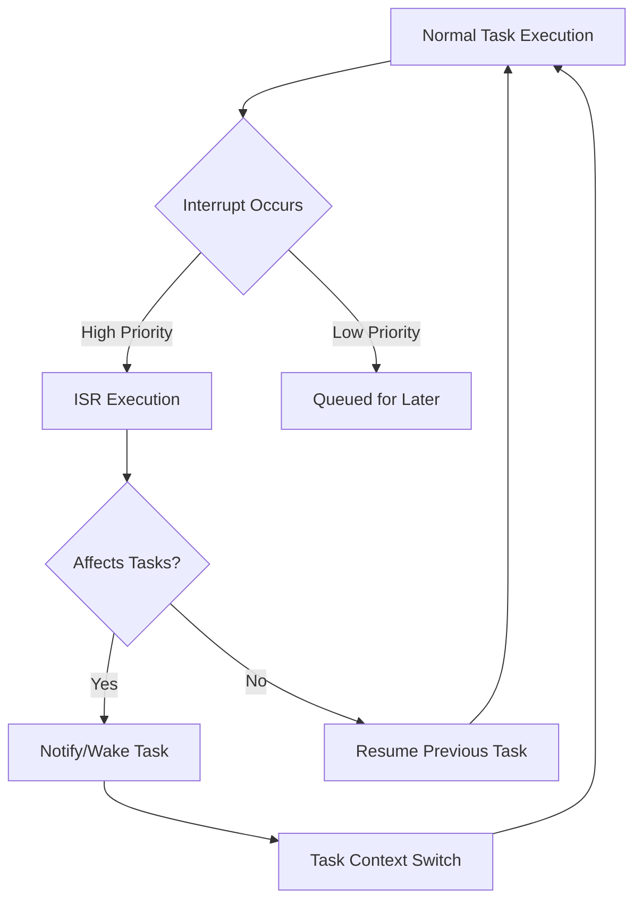

# STM32 RTOS Interrupts

## Introduction

Interrupts are critical components in embedded systems, allowing microcontrollers to respond to external events immediately without continuously polling for changes. When working with Real-Time Operating Systems (RTOS) like FreeRTOS on STM32 microcontrollers, understanding how interrupts integrate with the RTOS environment becomes essential for developing responsive and efficient applications.

This guide covers how interrupts work within an RTOS context on STM32 devices, focusing on prioritization, handling mechanisms, and best practices for reliable real-time systems.

## RTOS and Interrupts: The Fundamentals

### What Are Interrupts?

Interrupts are hardware mechanisms that allow external events to temporarily suspend normal program execution so the processor can handle high-priority tasks immediately.

In a typical scenario:
1. An external event occurs (button press, sensor trigger, timer expiration)
2. The corresponding interrupt line becomes active
3. The processor saves its current state
4. The processor jumps to a special function called an Interrupt Service Routine (ISR)
5. After the ISR completes, the processor restores its state and resumes normal execution

### The RTOS Context

When running an RTOS like FreeRTOS on STM32, interrupts become more complex because:

- The RTOS itself uses interrupts for task scheduling
- Multiple tasks might need to interact with interrupt-driven peripherals
- Interrupt handlers must follow special rules to interact safely with the RTOS

Let's visualize the relationship between RTOS tasks and interrupts:



## Interrupt Priority Levels in STM32 with RTOS

STM32 microcontrollers using Cortex-M cores support nested vectored interrupt controllers (NVIC) with multiple priority levels. When using an RTOS, interrupt priorities need careful planning.

### Priority Grouping

STM32 devices allow different priority grouping configurations. For RTOS use, this is typically configured with:

```c
// Set 4 bits for preemption priority, 0 bits for subpriority
HAL_NVIC_SetPriorityGrouping(NVIC_PRIORITYGROUP_4);
```

### RTOS-Aware Priorities

When using FreeRTOS on STM32, interrupts must be divided into two categories:

1. **RTOS-unaware interrupts**: High priority, cannot use RTOS API functions
2. **RTOS-aware interrupts**: Lower priority, can use special "FromISR" API functions

In FreeRTOS, this is configured using the `configLIBRARY_MAX_SYSCALL_INTERRUPT_PRIORITY` value. Let's see this in practice:

```c
// In FreeRTOSConfig.h
#define configLIBRARY_LOWEST_INTERRUPT_PRIORITY     15
#define configLIBRARY_MAX_SYSCALL_INTERRUPT_PRIORITY 5

// When setting an RTOS-aware interrupt:
HAL_NVIC_SetPriority(EXTI15_10_IRQn, 
                      configLIBRARY_MAX_SYSCALL_INTERRUPT_PRIORITY, 0);
```

This configuration means:
- Priorities 0-4: Higher priority than RTOS, cannot use RTOS functions
- Priorities 5-15: Lower priority than critical RTOS sections, can use RTOS functions with "FromISR" suffix

## Implementing Interrupt Handlers in an RTOS Environment

### Basic Interrupt Handler Structure

Here's how an interrupt handler might look in a FreeRTOS environment on STM32:

```c
// External interrupt handler for button press
void EXTI15_10_IRQHandler(void)
{
    // Clear the interrupt flag
    if(__HAL_GPIO_EXTI_GET_IT(GPIO_PIN_13) != RESET)
    {
        __HAL_GPIO_EXTI_CLEAR_IT(GPIO_PIN_13);
        
        // Handle the interrupt
        // ...
        
        // Optional: Notify a task
        BaseType_t xHigherPriorityTaskWoken = pdFALSE;
        vTaskNotifyGiveFromISR(buttonTaskHandle, &xHigherPriorityTaskWoken);
        
        // Request context switch if needed
        portYIELD_FROM_ISR(xHigherPriorityTaskWoken);
    }
}
```

### Safe Communication Between ISRs and Tasks

When you need to pass data from an interrupt to a task, several FreeRTOS mechanisms are available:

1. **Task Notifications**: Lightweight and efficient
2. **Queues**: For sending data
3. **Semaphores**: For synchronization
4. **Event Groups**: For multiple events

#### Example: Using a Queue from an ISR

```c
// Define a queue handle at global scope
QueueHandle_t sensorDataQueue;

// In initialization code
sensorDataQueue = xQueueCreate(10, sizeof(uint16_t));

// In the ADC interrupt handler
void ADC_IRQHandler(void)
{
    // Clear interrupt flags
    HAL_ADC_IRQHandler(&hadc1);
    
    // Get ADC value
    uint16_t adcValue = HAL_ADC_GetValue(&hadc1);
    
    // Send to queue
    BaseType_t xHigherPriorityTaskWoken = pdFALSE;
    xQueueSendFromISR(sensorDataQueue, &adcValue, &xHigherPriorityTaskWoken);
    
    // Request context switch if needed
    portYIELD_FROM_ISR(xHigherPriorityTaskWoken);
}

// In a task
void sensorProcessingTask(void *argument)
{
    uint16_t adcValue;
    
    for(;;)
    {
        if(xQueueReceive(sensorDataQueue, &adcValue, portMAX_DELAY) == pdPASS)
        {
            // Process the ADC value
            // ...
        }
    }
}
```

## Practical Example: Complete RTOS Interrupt System

Let's put everything together with a practical example of a system that:
1. Uses a timer interrupt for regular sensor sampling
2. Has a button interrupt for user input
3. Processes data in separate tasks

### Configuration

```c
// main.c

// FreeRTOS task handles
TaskHandle_t sensorTaskHandle = NULL;
TaskHandle_t processingTaskHandle = NULL;

// Communication objects
QueueHandle_t sensorDataQueue;
SemaphoreHandle_t buttonSemaphore;

// HAL Timer handle
TIM_HandleTypeDef htim2;

// Setup function
void SystemSetup(void)
{
    // Initialize peripherals
    MX_GPIO_Init();
    MX_TIM2_Init();
    
    // Create RTOS objects
    sensorDataQueue = xQueueCreate(16, sizeof(SensorData_t));
    buttonSemaphore = xSemaphoreCreateBinary();
    
    // Configure interrupts
    HAL_NVIC_SetPriority(TIM2_IRQn, configLIBRARY_MAX_SYSCALL_INTERRUPT_PRIORITY, 0);
    HAL_NVIC_EnableIRQ(TIM2_IRQn);
    
    HAL_NVIC_SetPriority(EXTI15_10_IRQn, configLIBRARY_MAX_SYSCALL_INTERRUPT_PRIORITY, 0);
    HAL_NVIC_EnableIRQ(EXTI15_10_IRQn);
    
    // Start timer
    HAL_TIM_Base_Start_IT(&htim2);
    
    // Create tasks
    xTaskCreate(SensorTask, "SensorTask", 128, NULL, 2, &sensorTaskHandle);
    xTaskCreate(ProcessingTask, "ProcessTask", 256, NULL, 1, &processingTaskHandle);
    
    // Start scheduler
    vTaskStartScheduler();
}
```

### Interrupt Handlers

```c
// stm32f4xx_it.c

// Timer interrupt for regular sampling
void TIM2_IRQHandler(void)
{
    HAL_TIM_IRQHandler(&htim2);
    
    // Notify sensor task to take a reading
    BaseType_t xHigherPriorityTaskWoken = pdFALSE;
    vTaskNotifyGiveFromISR(sensorTaskHandle, &xHigherPriorityTaskWoken);
    
    portYIELD_FROM_ISR(xHigherPriorityTaskWoken);
}

// Button interrupt handler
void EXTI15_10_IRQHandler(void)
{
    if(__HAL_GPIO_EXTI_GET_IT(GPIO_PIN_13) != RESET)
    {
        __HAL_GPIO_EXTI_CLEAR_IT(GPIO_PIN_13);
        
        // Signal button press using semaphore
        BaseType_t xHigherPriorityTaskWoken = pdFALSE;
        xSemaphoreGiveFromISR(buttonSemaphore, &xHigherPriorityTaskWoken);
        
        portYIELD_FROM_ISR(xHigherPriorityTaskWoken);
    }
}
```

### Task Implementations

```c
// app_tasks.c

// Structure for sensor data
typedef struct {
    uint16_t temperature;
    uint16_t pressure;
    uint32_t timestamp;
} SensorData_t;

// Sensor reading task
void SensorTask(void *argument)
{
    SensorData_t sensorData;
    uint32_t notificationValue;
    
    for(;;)
    {
        // Wait for notification from timer interrupt
        notificationValue = ulTaskNotifyTake(pdTRUE, portMAX_DELAY);
        
        if(notificationValue > 0)
        {
            // Read sensors (simulated)
            sensorData.temperature = HAL_ADC_GetValue(&hadc1);
            sensorData.pressure = HAL_ADC_GetValue(&hadc2);
            sensorData.timestamp = HAL_GetTick();
            
            // Send to processing task
            xQueueSend(sensorDataQueue, &sensorData, portMAX_DELAY);
        }
    }
}

// Data processing task
void ProcessingTask(void *argument)
{
    SensorData_t receivedData;
    uint8_t mode = 0; // 0: normal, 1: detailed
    
    for(;;)
    {
        // Check for mode change from button
        if(xSemaphoreTake(buttonSemaphore, 0) == pdTRUE)
        {
            // Toggle processing mode
            mode = !mode;
            HAL_GPIO_TogglePin(GPIOA, GPIO_PIN_5); // Toggle LED to indicate mode change
        }
        
        // Process any incoming sensor data
        if(xQueueReceive(sensorDataQueue, &receivedData, 100) == pdPASS)
        {
            // Process data according to mode
            if(mode == 0)
            {
                // Simple processing
                // ...
            }
            else
            {
                // Detailed processing
                // ...
            }
        }
    }
}
```

## Debugging Interrupt Issues in RTOS

When working with interrupts in an RTOS environment, several common issues can arise:

1. **Priority Inversion**: Lower priority interrupts blocking higher priority ones
2. **Deadlocks**: Tasks waiting for resources held by ISRs or other tasks
3. **Stack Overflow**: ISRs using too much stack space
4. **Race Conditions**: Unsynchronized access to shared resources

### Debugging Techniques

Here are some approaches to diagnose interrupt-related issues:

```c
// Add to FreeRTOSConfig.h for debugging
#define configCHECK_FOR_STACK_OVERFLOW               2
#define configUSE_TRACE_FACILITY                     1
#define configGENERATE_RUN_TIME_STATS                1
```

Then implement stack overflow hook:

```c
void vApplicationStackOverflowHook(TaskHandle_t xTask, char *pcTaskName)
{
    /* Stack overflow detected! */
    for(;;)
    {
        HAL_GPIO_TogglePin(GPIOA, GPIO_PIN_5); // Error indicator
        HAL_Delay(100);
    }
}
```

## Best Practices for STM32 RTOS Interrupts

1. **Keep ISRs short**: Do minimal work in the ISR, defer processing to tasks
2. **Use the "FromISR" variants**: Always use the correct API functions from ISRs
3. **Check priority levels**: Ensure your interrupts have appropriate priorities
4. **Handle context switches**: Check if a higher priority task was woken
5. **Protect shared resources**: Use proper synchronization mechanisms
6. **Avoid blocking in ISRs**: Never call functions that might block
7. **Test edge cases**: Verify system behavior under high interrupt loads

## Summary

Working with interrupts in an RTOS environment on STM32 microcontrollers requires careful consideration of:

- Interrupt priorities and their relationship with RTOS critical sections
- Safe communication between ISRs and tasks
- Resource synchronization and protection
- Efficient context switching

By following the best practices outlined in this guide, you can create responsive and reliable real-time systems that properly leverage both the interrupt capabilities of the STM32 hardware and the task management features of your RTOS.

## Exercises

1. Implement a system that samples an analog sensor at 1kHz using a timer interrupt and processes the data in a separate task.
2. Create a debounced button input system using interrupts and an RTOS task.
3. Design a communication protocol between two STM32 devices using UART interrupts within an RTOS environment.
4. Implement a priority inheritance mechanism to avoid priority inversion in a resource-sharing scenario.

## Additional Resources

- [FreeRTOS Official Documentation](https://www.freertos.org/Documentation/RTOS_book.html)
- [STM32 Cube HAL Documentation](https://www.st.com/resource/en/user_manual/dm00105879-description-of-stm32f4-hal-and-ll-drivers-stmicroelectronics.pdf)
- [ARM Cortex-M4 Generic User Guide](https://developer.arm.com/documentation/dui0553/latest/)