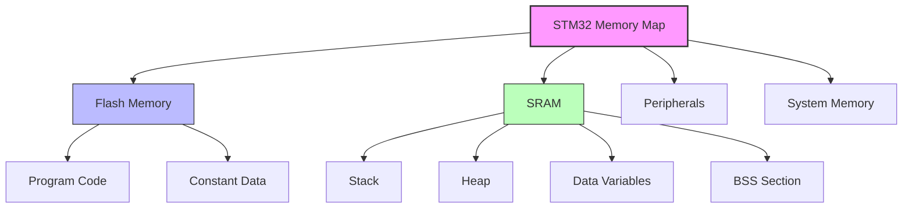
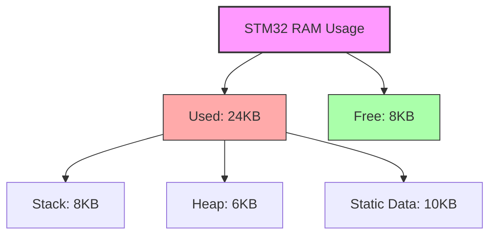

# STM32 Memory Management

## Introduction

Memory management is a critical aspect of embedded systems programming, especially when working with Real-Time Operating Systems (RTOS) on resource-constrained platforms like STM32 microcontrollers. Efficient memory allocation and deallocation can make the difference between a robust application and one that crashes unexpectedly due to memory fragmentation or exhaustion.

In this tutorial, we'll explore how memory works on STM32 microcontrollers, discuss different memory regions, and learn practical techniques for managing memory effectively when integrating an RTOS. By the end, you'll understand how to avoid common pitfalls and optimize your memory usage in real-time applications.

## STM32 Memory Architecture

STM32 microcontrollers are based on ARM Cortex-M cores and feature several types of memory:

- **Flash Memory**: Non-volatile storage for program code and constant data
- **SRAM**: Volatile memory for variables and runtime data
- **CCM (Core Coupled Memory)**: Fast memory tightly coupled to the CPU (available on some STM32 models)
- **Backup SRAM**: Small amount of memory that remains powered in low-power modes (on some models)

Let's visualize a typical STM32 memory map:



### Memory Regions in Detail

#### Flash Memory (Program Memory)
Flash memory on STM32 devices typically ranges from 16KB to 2MB depending on the model. This is where your program code and constant data reside. Flash has longer access times compared to SRAM but is non-volatile.

```c
// Constants stored in Flash
const uint32_t LOOKUP_TABLE[] = {0x01, 0x02, 0x04, 0x08, 0x10, 0x20, 0x40, 0x80};
```

#### SRAM (Data Memory)
SRAM is volatile memory that loses its contents when power is removed. It's faster than Flash and is used for:

- **Data section**: Initialized global and static variables
- **BSS section**: Uninitialized global and static variables (zero-initialized at startup)
- **Heap**: Dynamic memory allocation area
- **Stack**: Function call frames, local variables, and execution context

```c
// Global variable stored in SRAM (Data section)
uint32_t globalCounter = 0;

// Uninitialized global array (BSS section)
uint8_t buffer[512];
```

## Memory Management Challenges with RTOS

When integrating an RTOS like FreeRTOS or Azure RTOS (ThreadX) with STM32, several memory management challenges arise:

1. **Limited Resources**: STM32 microcontrollers have limited RAM
2. **Memory Fragmentation**: Dynamic allocation/deallocation can fragment memory
3. **Task Stacks**: Each RTOS task requires its own stack
4. **RTOS Overhead**: The RTOS itself consumes memory for its internal structures
5. **Priority Inversion**: Memory allocation can lead to priority inversion issues
6. **Determinism**: Dynamic memory operations may not be deterministic

## Best Practices for Memory Management

### 1. Optimize Static Memory Usage

Carefully plan your global and static variables. Use the smallest data type that meets your requirements.

```c
// Bad practice
int largeArray[1000]; // Uses 4000 bytes on 32-bit systems

// Better practice
uint8_t smallArray[1000]; // Uses only 1000 bytes
```

### 2. Stack Sizing

Each RTOS task needs its own stack. Size them appropriately:

```c
// Creating a task with a properly sized stack (FreeRTOS example)
#define TASK_STACK_SIZE 512 // Words (not bytes on ARM Cortex-M)

void createTasks(void) {
    BaseType_t status;
    
    status = xTaskCreate(
        vSensorTask,        // Task function
        "SensorTask",       // Task name
        TASK_STACK_SIZE,    // Stack size in words
        NULL,               // Parameters
        3,                  // Priority
        &sensorTaskHandle   // Task handle
    );
    
    if (status != pdPASS) {
        // Handle task creation error
    }
}
```

To determine appropriate stack sizes, you can:
- Start with a conservative estimate
- Monitor stack usage with RTOS utilities
- Adjust based on observed usage

### 3. Heap Management Strategies

RTOS environments offer several heap management strategies:

#### Static Allocation (Preferred)
Allocate all memory statically at compile time:

```c
// Task control block and stack statically allocated
StaticTask_t xTaskBuffer;
StackType_t xStack[TASK_STACK_SIZE];

TaskHandle_t xHandle = xTaskCreateStatic(
    vTaskCode,                   // Function that implements the task
    "NAME",                      // Text name for the task
    TASK_STACK_SIZE,             // Stack size in words, not bytes
    ( void * ) 1,                // Parameter passed into the task
    tskIDLE_PRIORITY + 1,        // Priority at which the task is created
    xStack,                      // Array to use as the task's stack
    &xTaskBuffer                 // Variable to hold the task's data structure
);
```

#### Memory Pools
Pre-allocate fixed-size memory blocks for specific purposes:

```c
// Define memory pool (example using CMSIS-RTOS2)
osMemoryPoolId_t mpid;
osMemoryPoolAttr_t mpattr = {
    .name = "MemPool",
    .attr_bits = 0,
    .cb_mem = NULL,
    .cb_size = 0,
    .mp_mem = NULL,
    .mp_size = 0
};

// Create memory pool with 10 blocks of 64 bytes each
mpid = osMemoryPoolNew(10, 64, &mpattr);

// Allocate block from pool
void *block = osMemoryPoolAlloc(mpid, 0);

// Process data with block
// ...

// Free block when done
osMemoryPoolFree(mpid, block);
```

#### Careful Dynamic Allocation
If you must use dynamic allocation:

```c
// Allocate memory
uint8_t *buffer = (uint8_t *)pvPortMalloc(128);
if (buffer == NULL) {
    // Handle allocation failure
    return ERROR_MEMORY_ALLOCATION;
}

// Use the buffer
// ...

// Free memory when done
vPortFree(buffer);
```

### 4. Memory Placement

STM32 devices with multiple memory regions allow strategic placement of data:

```c
// Place frequently accessed data in CCM for faster access
// (CCM is Core Coupled Memory available on some STM32 models)
__attribute__((section(".ccmram"))) uint32_t fastData[256];

// Place large buffer in regular SRAM
uint8_t regularBuffer[1024];
```

## Real-World Example: Sensor Data Processing System

Let's implement a practical example of a sensor data processing system with proper memory management:

```c
/* Include necessary headers */
#include "FreeRTOS.h"
#include "task.h"
#include "queue.h"
#include "semphr.h"

/* Define constants */
#define SENSOR_STACK_SIZE    256
#define PROCESS_STACK_SIZE   512
#define QUEUE_LENGTH         10
#define SENSOR_BUFFER_SIZE   32

/* Declare static memory for tasks */
StaticTask_t xSensorTaskBuffer;
StaticTask_t xProcessTaskBuffer;
StackType_t xSensorStack[SENSOR_STACK_SIZE];
StackType_t xProcessStack[PROCESS_STACK_SIZE];

/* Statically allocate queue */
StaticQueue_t xStaticQueue;
uint8_t ucQueueStorageArea[QUEUE_LENGTH * sizeof(SensorData_t)];

/* Data structure for sensor readings */
typedef struct {
    uint32_t timestamp;
    uint16_t temperature;
    uint16_t humidity;
    uint16_t pressure;
} SensorData_t;

/* Task handles */
TaskHandle_t xSensorTask;
TaskHandle_t xProcessTask;

/* Queue handle */
QueueHandle_t xDataQueue;

/* Task functions */
void vSensorTaskFunction(void *pvParameters) {
    // Local buffer for sensor reading (on stack)
    SensorData_t sensorData;
    
    for (;;) {
        // Read sensor data (simulated)
        sensorData.timestamp = xTaskGetTickCount();
        sensorData.temperature = (uint16_t)readTemperatureSensor();
        sensorData.humidity = (uint16_t)readHumiditySensor();
        sensorData.pressure = (uint16_t)readPressureSensor();
        
        // Send to processing task via queue
        if (xQueueSend(xDataQueue, &sensorData, pdMS_TO_TICKS(10)) != pdPASS) {
            // Handle queue full error
        }
        
        // Wait before next reading
        vTaskDelay(pdMS_TO_TICKS(1000));
    }
}

void vProcessTaskFunction(void *pvParameters) {
    // Local buffer for received data (on stack)
    SensorData_t receivedData;
    
    // Static buffer for processing results
    static uint32_t processedResults[SENSOR_BUFFER_SIZE];
    
    for (;;) {
        // Receive sensor data from queue
        if (xQueueReceive(xDataQueue, &receivedData, portMAX_DELAY) == pdPASS) {
            // Process data
            processData(&receivedData, processedResults);
            
            // Transmit results
            transmitResults(processedResults);
        }
    }
}

void initSystem(void) {
    // Create queue
    xDataQueue = xQueueCreateStatic(QUEUE_LENGTH,
                                   sizeof(SensorData_t),
                                   ucQueueStorageArea,
                                   &xStaticQueue);
    
    // Create sensor task
    xSensorTask = xTaskCreateStatic(
                    vSensorTaskFunction,
                    "SensorTask",
                    SENSOR_STACK_SIZE,
                    NULL,
                    3,
                    xSensorStack,
                    &xSensorTaskBuffer);
    
    // Create processing task
    xProcessTask = xTaskCreateStatic(
                    vProcessTaskFunction,
                    "ProcessTask",
                    PROCESS_STACK_SIZE,
                    NULL,
                    2,
                    xProcessStack,
                    &xProcessTaskBuffer);
}
```

### Key Memory Management Features in the Example:

1. **Static Task Creation**: We used `xTaskCreateStatic()` instead of `xTaskCreate()` to allocate task stacks at compile time
2. **Static Queue Creation**: We pre-allocated memory for the queue with `xQueueCreateStatic()`
3. **Stack-Based Variables**: We used local variables in tasks where possible
4. **No Dynamic Allocation**: The entire system operates without calling malloc/free
5. **Appropriate Stack Sizing**: Each task has a specifically sized stack based on its needs

## Debugging Memory Issues

STM32 projects with RTOS can experience memory-related problems. Here are some techniques to diagnose and solve them:

### Stack Overflow Detection

FreeRTOS can detect stack overflows by setting the appropriate configuration:

```c
// In FreeRTOSConfig.h
#define configCHECK_FOR_STACK_OVERFLOW    2
```

Implement the stack overflow hook:

```c
void vApplicationStackOverflowHook(TaskHandle_t xTask, char *pcTaskName) {
    // Handle stack overflow
    // Perhaps turn on an LED or log the error
    for (;;) {
        // Hang or reset
    }
}
```

### Memory Visualization

Use memory visualization tools like those provided by STM32CubeIDE to examine how memory is used:



### Memory Usage Tracking

Implement memory tracking in your RTOS heap implementation:

```c
size_t xPortGetFreeHeapSize(void) {
    // Returns the amount of free heap space
}

size_t xPortGetMinimumEverFreeHeapSize(void) {
    // Returns the minimum amount of free heap that has ever existed
}
```

## Summary

Effective memory management is crucial for creating reliable STM32 applications with RTOS. The key takeaways from this tutorial are:

- **Understand STM32 Memory Architecture**: Know the different memory types and their characteristics
- **Static Allocation**: Prefer static allocation over dynamic whenever possible
- **Task Stack Sizing**: Properly size task stacks based on their requirements
- **Avoid Fragmentation**: Use memory pools for frequent allocations/deallocations
- **Monitor Usage**: Implement memory tracking and debugging techniques
- **Strategic Placement**: Use special memory regions (like CCM) strategically

By following these practices, you'll create more robust and efficient RTOS applications on STM32 microcontrollers.

## Additional Resources and Exercises

### Resources
- ST Microelectronics Application Notes (AN4990: STM32 Microcontroller System Memory Boot Mode)
- FreeRTOS Memory Management Documentation
- STM32 Reference Manuals for your specific microcontroller

### Exercises

1. **Memory Footprint Analysis**:
   - Compile a simple STM32 RTOS project
   - Analyze the memory map file
   - Identify which sections consume the most memory

2. **Stack Size Optimization**:
   - Create a system with 3 tasks of different complexities
   - Determine the minimum stack size for each task
   - Implement stack overflow detection

3. **Memory Pool Implementation**:
   - Create a fixed-size memory pool
   - Write benchmark functions to compare allocation speeds with regular heap allocation
   - Measure fragmentation in both approaches

4. **Heap Implementation Comparison**:
   - Compare different FreeRTOS heap implementations (heap_1.c through heap_5.c)
   - Document the pros and cons of each for your specific application