# STM32 RTOS Debugging

## Introduction

Real-Time Operating Systems (RTOS) add powerful capabilities to STM32 microcontrollers, enabling concurrent task execution and resource management. However, this increased complexity creates unique debugging challenges. When multiple tasks execute concurrently with shared resources, standard debugging approaches may not reveal the root causes of issues like race conditions, deadlocks, or priority inversions.

This guide will walk you through effective strategies for debugging RTOS applications on STM32 microcontrollers. You'll learn how to identify and solve common RTOS-specific problems, use advanced debugging tools, and implement best practices that make debugging more straightforward.

## Prerequisites

Before diving into RTOS debugging, you should be familiar with:
- Basic STM32 programming
- Fundamental RTOS concepts (tasks, scheduling, synchronization)
- Using an IDE like STM32CubeIDE or Keil MDK

## Common RTOS Debugging Challenges

RTOS applications face unique challenges that don't exist in bare-metal programming:

1. **Timing-dependent bugs**: Problems that appear intermittently due to task scheduling variations
2. **Synchronization issues**: Deadlocks, race conditions, and priority inversions
3. **Resource conflicts**: Multiple tasks accessing shared resources improperly
4. **Stack overflows**: Tasks exceeding their allocated stack space
5. **Memory corruption**: Hard-to-trace bugs caused by memory being overwritten

## Essential Debugging Tools

### 1. SEGGER J-Link/ST-Link with Real-Time Transfer (RTT)

RTT allows non-intrusive debugging by enabling communication between the debug probe and the target device without halting execution.

```c
// Initialize RTT
#include "SEGGER_RTT.h"

void initRTT(void) {
  SEGGER_RTT_ConfigUpBuffer(0, NULL, NULL, 0, SEGGER_RTT_MODE_NO_BLOCK_SKIP);
}

// Later, use RTT for debug output
SEGGER_RTT_printf(0, "Task 1 entering critical section, tick: %lu\r
", xTaskGetTickCount());
```

### 2. SystemView

SEGGER's SystemView provides real-time recording and visualization of RTOS events, making it easier to understand task behavior.

```c
// Add SystemView recording to your FreeRTOS config
#include "SEGGER_SYSVIEW.h"

// In your main.c, initialize SystemView before starting the scheduler
void initDebugTools(void) {
  SEGGER_SYSVIEW_Conf();
  // Additional configuration if needed
}

int main(void) {
  // ... your initialization code
  initDebugTools();
  // ... start RTOS scheduler
}
```

### 3. ST-Link Trace

STM32 microcontrollers with SWO (Serial Wire Output) capability can stream trace data in real-time, which is invaluable for RTOS debugging.

```c
// Enable SWO trace in your code
void configureSWO(void) {
  // Configure the SWO pin (typically PB3) as alternate function
  __HAL_RCC_GPIOB_CLK_ENABLE();
  GPIO_InitTypeDef GPIO_InitStruct = {0};
  GPIO_InitStruct.Pin = GPIO_PIN_3;
  GPIO_InitStruct.Mode = GPIO_MODE_AF_PP;
  GPIO_InitStruct.Pull = GPIO_NOPULL;
  GPIO_InitStruct.Speed = GPIO_SPEED_FREQ_HIGH;
  GPIO_InitStruct.Alternate = GPIO_AF0_TRACE;
  HAL_GPIO_Init(GPIOB, &GPIO_InitStruct);
  
  // Configure the trace port interface unit
  CoreDebug->DEMCR |= CoreDebug_DEMCR_TRCENA_Msk;
  TPI->SPPR = 0x02; // Use SWO (Manchester)
  TPI->ACPR = SystemCoreClock / 2000000 - 1; // Set to output at 2MHz
  
  ITM->LAR = 0xC5ACCE55; // Unlock ITM
  ITM->TCR = 0x00010005; // Enable ITM
  ITM->TPR = 0x1; // Enable stimulus port 0
  ITM->TER = 0x1; // Enable stimulus port 0
}

// Later, write to ITM to output debug information
void debugPrint(const char* msg) {
  const char* ptr = msg;
  while (*ptr) {
    while (ITM->PORT[0].u32 == 0);
    ITM->PORT[0].u8 = (uint8_t)*ptr++;
  }
}
```

## Debugging FreeRTOS Applications

FreeRTOS is one of the most popular RTOS choices for STM32. Let's explore specific techniques for debugging FreeRTOS.

### 1. Configuring Debug Helpers in FreeRTOSConfig.h

```c
// Enable runtime stats collection
#define configGENERATE_RUN_TIME_STATS               1
#define configUSE_TRACE_FACILITY                    1

// Enable stack overflow detection
#define configCHECK_FOR_STACK_OVERFLOW              2

// Hook functions for debugging events
#define configUSE_MALLOC_FAILED_HOOK                1
#define configUSE_DAEMON_TASK_STARTUP_HOOK          1
#define configUSE_IDLE_HOOK                         1
#define configUSE_TICK_HOOK                         1

// Implement the hook functions
void vApplicationMallocFailedHook(void) {
  // Handle memory allocation failure
  for(;;) {
    // Flash an LED or log error
  }
}

void vApplicationStackOverflowHook(TaskHandle_t xTask, char *pcTaskName) {
  // Handle stack overflow
  // pcTaskName contains the name of the task that overflowed its stack
  for(;;) {
    // Flash an LED or log error
  }
}
```

### 2. Viewing Task Statistics

FreeRTOS provides functions to gather information about running tasks:

```c
// Define a buffer to hold task info
char taskListBuffer[500];

void printTaskStats(void) {
  // List all tasks and their state
  vTaskList(taskListBuffer);
  SEGGER_RTT_printf(0, "Task Status:\r
%s\r
", taskListBuffer);
  
  // Print runtime stats
  vTaskGetRunTimeStats(taskListBuffer);
  SEGGER_RTT_printf(0, "Task Runtime Stats:\r
%s\r
", taskListBuffer);
}
```

### 3. Detecting Deadlocks

Deadlocks occur when tasks are waiting for resources that will never be released.

```c
// Monitor task state changes over time to detect deadlocks
void monitorForDeadlocks(void) {
  static TaskStatus_t previousSnapshot[10];
  static TaskStatus_t currentSnapshot[10];
  static uint32_t taskCount = 0;
  
  // Get current task states
  taskCount = uxTaskGetSystemState(currentSnapshot, 10, NULL);
  
  // Compare with previous states to detect tasks that haven't changed state
  for (uint32_t i = 0; i < taskCount; i++) {
    if ((previousSnapshot[i].eCurrentState == eBlocked) && 
        (currentSnapshot[i].eCurrentState == eBlocked) &&
        (previousSnapshot[i].xTaskNumber == currentSnapshot[i].xTaskNumber)) {
        
      // This task has been blocked for at least two consecutive checks
      uint32_t blockTime = currentSnapshot[i].ulRunTimeCounter - previousSnapshot[i].ulRunTimeCounter;
      if (blockTime > DEADLOCK_THRESHOLD_TICKS) {
        SEGGER_RTT_printf(0, "WARNING: Task %s may be deadlocked\r
", currentSnapshot[i].pcTaskName);
      }
    }
  }
  
  // Save the current state for next comparison
  memcpy(previousSnapshot, currentSnapshot, sizeof(TaskStatus_t) * taskCount);
}
```

## Memory Management Debugging

### 1. Heap Usage Monitoring

```c
// For FreeRTOS heap_4.c memory manager
void checkHeapStatus(void) {
  size_t freeHeapSize = xPortGetFreeHeapSize();
  size_t minEverFreeHeapSize = xPortGetMinimumEverFreeHeapSize();
  
  SEGGER_RTT_printf(0, "Free heap: %u bytes\r
", freeHeapSize);
  SEGGER_RTT_printf(0, "Minimum ever free heap: %u bytes\r
", minEverFreeHeapSize);
  
  // Danger check
  if (freeHeapSize < HEAP_WARNING_THRESHOLD) {
    SEGGER_RTT_printf(0, "WARNING: Heap running low!\r
");
  }
}
```

### 2. Memory Corruption Detection

```c
// Fill unused memory with a pattern to detect corruption
void fillTaskStackWithPattern(void) {
  // Call this function before creating any tasks
  // This requires the task memory to be statically allocated
  uint32_t *stackPtr = (uint32_t *)&ucTaskStack[0];
  for (int i = 0; i < TASK_STACK_SIZE_WORDS; i++) {
    stackPtr[i] = 0xDEADBEEF; // Pattern to detect stack usage
  }
}

// Check stack usage by looking for the pattern
void checkTaskStackUsage(uint32_t *stackStart, uint32_t stackSizeWords) {
  uint32_t unusedWords = 0;
  
  for (int i = 0; i < stackSizeWords; i++) {
    if (stackStart[i] == 0xDEADBEEF) {
      unusedWords++;
    } else {
      break;
    }
  }
  
  uint32_t usedWords = stackSizeWords - unusedWords;
  uint32_t usagePercentage = (usedWords * 100) / stackSizeWords;
  
  SEGGER_RTT_printf(0, "Stack usage: %lu words (%lu%%)\r
", usedWords, usagePercentage);
  
  if (usagePercentage > 80) {
    SEGGER_RTT_printf(0, "WARNING: High stack usage detected!\r
");
  }
}
```

## Debugging Synchronization Issues

### 1. Detecting Priority Inversion

Priority inversion occurs when a high-priority task is blocked waiting for a resource held by a lower-priority task.

```c
// Configure mutex with priority inheritance to prevent priority inversion
void createSafeMutex(void) {
  // Using FreeRTOS priority inheritance mutex
  xMutex = xSemaphoreCreateMutex();
  
  // To detect potential priority inversions, log when tasks take mutexes
  void taskEnterCriticalSection(TaskHandle_t task, SemaphoreHandle_t mutex) {
    SEGGER_RTT_printf(0, "Task %s (priority %lu) requesting mutex\r
", 
                      pcTaskGetName(task), uxTaskPriorityGet(task));
                      
    // Record time before taking mutex
    TickType_t startTick = xTaskGetTickCount();
    
    if (xSemaphoreTake(mutex, portMAX_DELAY) == pdTRUE) {
      TickType_t endTick = xTaskGetTickCount();
      TickType_t waitTime = endTick - startTick;
      
      if (waitTime > PRIORITY_INVERSION_THRESHOLD) {
        SEGGER_RTT_printf(0, "WARNING: Task %s waited %lu ticks for mutex - possible priority inversion\r
", 
                         pcTaskGetName(task), waitTime);
      }
    }
  }
}
```

### 2. Visualizing Task Execution with Timing Diagrams

Using RTT or SystemView, you can track and visualize when tasks execute and interact with shared resources.

```mermaid
gantt
    title Task Execution Timeline
    dateFormat  HH:mm:ss
    axisFormat %S.%L
    
    section Task 1
    Running            :a1, 00:00:01, 2s
    Blocked on Mutex   :after a1, 2s
    Running            :a2, 00:00:05, 3s
    
    section Task 2
    Waiting            :00:00:01, 2s
    Running with Mutex :00:00:03, 2s
    Waiting            :00:00:05, 3s
    
    section Task 3
    Waiting            :00:00:01, 7s
```



## Practical Debugging Example: Tracking Down a Deadlock

Let's walk through an example of debugging a deadlock in an STM32 RTOS application:

### Problem: Two tasks are occasionally deadlocking

```c
// Initial problematic code
void Task1(void *argument) {
  for(;;) {
    xSemaphoreTake(xMutexA, portMAX_DELAY);
    // Do some work
    vTaskDelay(pdMS_TO_TICKS(10));
    xSemaphoreTake(xMutexB, portMAX_DELAY);
    // Do more work
    xSemaphoreGive(xMutexB);
    xSemaphoreGive(xMutexA);
    vTaskDelay(pdMS_TO_TICKS(100));
  }
}

void Task2(void *argument) {
  for(;;) {
    xSemaphoreTake(xMutexB, portMAX_DELAY);
    // Do some work
    vTaskDelay(pdMS_TO_TICKS(10));
    xSemaphoreTake(xMutexA, portMAX_DELAY);
    // Do more work
    xSemaphoreGive(xMutexA);
    xSemaphoreGive(xMutexB);
    vTaskDelay(pdMS_TO_TICKS(150));
  }
}
```

### Debugging Steps:

1. **Add logging to track mutex operations**:

```c
void Task1(void *argument) {
  for(;;) {
    SEGGER_RTT_printf(0, "Task1: Attempting to take MutexA at %lu\r
", xTaskGetTickCount());
    xSemaphoreTake(xMutexA, portMAX_DELAY);
    SEGGER_RTT_printf(0, "Task1: Acquired MutexA at %lu\r
", xTaskGetTickCount());
    
    // Do some work
    vTaskDelay(pdMS_TO_TICKS(10));
    
    SEGGER_RTT_printf(0, "Task1: Attempting to take MutexB at %lu\r
", xTaskGetTickCount());
    xSemaphoreTake(xMutexB, portMAX_DELAY);
    SEGGER_RTT_printf(0, "Task1: Acquired MutexB at %lu\r
", xTaskGetTickCount());
    
    // Do more work
    xSemaphoreGive(xMutexB);
    SEGGER_RTT_printf(0, "Task1: Released MutexB at %lu\r
", xTaskGetTickCount());
    
    xSemaphoreGive(xMutexA);
    SEGGER_RTT_printf(0, "Task1: Released MutexA at %lu\r
", xTaskGetTickCount());
    
    vTaskDelay(pdMS_TO_TICKS(100));
  }
}
```

2. **Use RTT viewer or SystemView to analyze the logs**:

After running the application, the logs might show:

```
Task1: Attempting to take MutexA at 100
Task1: Acquired MutexA at 100
Task2: Attempting to take MutexB at 105
Task2: Acquired MutexB at 105
Task1: Attempting to take MutexB at 110
Task2: Attempting to take MutexA at 115
// No more logs - deadlock!
```

3. **Fix the deadlock with a hierarchy approach**:

```c
// Fixed code with consistent mutex acquisition order
void Task1(void *argument) {
  for(;;) {
    // Always take MutexA first, then MutexB (consistent ordering)
    xSemaphoreTake(xMutexA, portMAX_DELAY);
    // Do some work
    vTaskDelay(pdMS_TO_TICKS(10));
    xSemaphoreTake(xMutexB, portMAX_DELAY);
    // Do more work
    xSemaphoreGive(xMutexB);
    xSemaphoreGive(xMutexA);
    vTaskDelay(pdMS_TO_TICKS(100));
  }
}

void Task2(void *argument) {
  for(;;) {
    // Also take MutexA first, then MutexB (consistent ordering)
    xSemaphoreTake(xMutexA, portMAX_DELAY);
    // Do some work
    vTaskDelay(pdMS_TO_TICKS(10));
    xSemaphoreTake(xMutexB, portMAX_DELAY);
    // Do more work
    xSemaphoreGive(xMutexB);
    xSemaphoreGive(xMutexA);
    vTaskDelay(pdMS_TO_TICKS(150));
  }
}
```

This example illustrates how proper logging helps identify and fix classic deadlocks in RTOS applications.

## Advanced SystemView Configuration

When dealing with complex RTOS issues, configuring SystemView for maximum insight can be very helpful:

```c
// SystemView configuration for FreeRTOS
#include "SEGGER_SYSVIEW.h"

// Define which events to record
#define SYSVIEW_FREERTOS_MAX_NOF_TASKS 16

// Application-specific events
enum {
  MY_EVENT_MUTEX_TAKE_ATTEMPT = SYSVIEW_USER_EVENT_ID_BASE,
  MY_EVENT_MUTEX_TAKE_SUCCESS,
  MY_EVENT_MUTEX_GIVE
};

// Add custom event descriptions
void SEGGER_SYSVIEW_RegisterEvents(void) {
  static const SEGGER_SYSVIEW_EVENT_PARA EventPara[] = {
    { MY_EVENT_MUTEX_TAKE_ATTEMPT, "Mutex take attempt: %s"},
    { MY_EVENT_MUTEX_TAKE_SUCCESS, "Mutex acquired: %s"},
    { MY_EVENT_MUTEX_GIVE, "Mutex released: %s"}
  };
  SEGGER_SYSVIEW_RegisterEvents(&EventPara[0], ARRAY_SIZE(EventPara));
}

// Custom wrapper functions for enhanced debugging
BaseType_t debugSemaphoreTake(SemaphoreHandle_t xSemaphore, TickType_t xBlockTime, const char* semName) {
  SEGGER_SYSVIEW_RecordString(MY_EVENT_MUTEX_TAKE_ATTEMPT, semName);
  BaseType_t result = xSemaphoreTake(xSemaphore, xBlockTime);
  if (result == pdTRUE) {
    SEGGER_SYSVIEW_RecordString(MY_EVENT_MUTEX_TAKE_SUCCESS, semName);
  }
  return result;
}

void debugSemaphoreGive(SemaphoreHandle_t xSemaphore, const char* semName) {
  SEGGER_SYSVIEW_RecordString(MY_EVENT_MUTEX_GIVE, semName);
  xSemaphoreGive(xSemaphore);
}
```

## Debugging with RTOS-Aware IDE Features

Modern IDEs like STM32CubeIDE provide RTOS-aware debugging, which lets you view task information directly in the debugger.

1. **Enabling RTOS-aware debugging in STM32CubeIDE**:
   - Open Project Properties
   - Navigate to C/C++ Build → Settings → MCU Settings
   - Enable "Use RTOS" and select your RTOS (e.g., FreeRTOS)

2. **Using RTOS Views**:
   - When debugging, open Window → Show View → RTOS
   - This provides task lists, stack usage, and other RTOS-specific information

3. **Setting conditional breakpoints based on current task**:
   - Right-click on the line and select "Add Conditional Breakpoint"
   - Use conditions like `strcmp(pxCurrentTCB->pcTaskName, "TaskName") == 0`

## Best Practices for RTOS Debugging

1. **Implement robust error handling** - Never ignore error codes from RTOS API calls:

```c
BaseType_t status = xQueueSend(xQueue, &data, timeout);
if (status != pdPASS) {
  // Log error and handle appropriately
  errorHandler(ERROR_QUEUE_SEND_FAILED);
}
```

2. **Create a system watchdog** - Implement a task that monitors system health:

```c
void watchdogTask(void *pvParameters) {
  for(;;) {
    // Check each task is responding within expected timeframes
    for (int i = 0; i < NUM_TASKS; i++) {
      if ((xTaskGetTickCount() - lastTaskResponse[i]) > taskTimeout[i]) {
        // Log task timeout event
        SEGGER_RTT_printf(0, "WARNING: Task %s hasn't responded in %lu ms\r
", 
                         taskNames[i], taskTimeout[i]);
      }
    }
    vTaskDelay(pdMS_TO_TICKS(WATCHDOG_CHECK_PERIOD_MS));
  }
}
```

3. **Use defensive programming** with RTOS:

```c
// Check handle validity before using
if (xTaskHandle != NULL) {
  vTaskDelete(xTaskHandle);
  xTaskHandle = NULL; // Prevent use-after-free
}

// Use timeouts instead of infinite waits
xStatus = xQueueReceive(xQueue, &receivedData, pdMS_TO_TICKS(1000));
if (xStatus == pdFALSE) {
  // Handle timeout - don't wait forever
}
```

4. **Use descriptive task and resource names** that appear in debug output:

```c
TaskHandle_t xTask2Handle = NULL;
xTaskCreate(vTask2, "SENSORS", STACK_SIZE, NULL, tskIDLE_PRIORITY + 2, &xTask2Handle);

// Create a named mutex for better debugging
SemaphoreHandle_t xMotorMutex = xSemaphoreCreateMutexStatic(&xMotorMutexBuffer);
pcMutexGetName(xMotorMutex) = "MOTOR_MTX";
```

## Summary

Debugging RTOS applications on STM32 microcontrollers requires specialized tools and techniques due to the concurrent nature of tasks and shared resources. By using a combination of:

- RTOS-specific debugging tools like SystemView and RTT
- Proper instrumentation with logging
- Strategic monitoring of task behavior
- RTOS-aware IDE features
- Defensive programming practices

You can effectively identify and resolve complex issues like deadlocks, priority inversions, and memory corruption.

Remember that many RTOS issues are timing-dependent and may not manifest consistently. Thorough testing with different task priorities, timing configurations, and load conditions is essential to ensure robustness.

## Additional Resources

- [FreeRTOS Debugging Techniques](https://www.freertos.org/FAQHelp.html)
- [SEGGER SystemView Documentation](https://www.segger.com/products/development-tools/systemview/)
- [STM32 Cortex-M RTOS Debugging Application Note (AN4950)](https://www.st.com)
- "Patterns for Time-Triggered Embedded Systems" by Michael J. Pont
- "Test Driven Development for Embedded C" by James W. Grenning

## Practice Exercises

1. Implement a deadlock detection system that monitors mutex ownership and waiting time
2. Create a memory leak detector that tracks dynamic memory allocations
3. Develop a priority inversion monitor that logs when low-priority tasks hold resources needed by high-priority tasks
4. Build a configurable trace system that can be enabled/disabled at runtime for specific tasks or modules
5. Add a diagnostic shell task that allows querying system status via UART or RTT