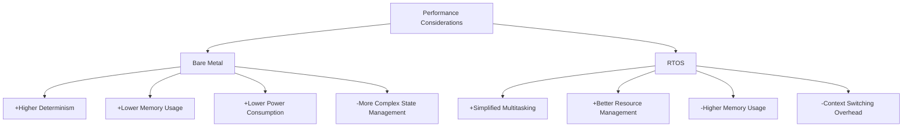

# STM32 RTOS Performance

## Introduction

Real-Time Operating Systems (RTOS) bring powerful multitasking capabilities to STM32 microcontrollers, enabling developers to build more complex and responsive embedded applications. However, integrating an RTOS introduces performance considerations that must be carefully managed to ensure your system meets its timing and resource requirements.

In this guide, we'll explore the performance aspects of running an RTOS on STM32 microcontrollers. We'll focus primarily on FreeRTOS, as it's widely used with STM32 devices, but the concepts apply to other RTOS options like Azure RTOS (ThreadX) or RT-Thread.

## Key Performance Metrics for RTOS on STM32

When evaluating RTOS performance on STM32 devices, several key metrics deserve attention:

1. **Context Switching Time**: The time required to save one task's state and restore another's
2. **Interrupt Latency**: How quickly the system can respond to interrupts
3. **Memory Footprint**: RAM and flash consumption of the RTOS
4. **CPU Utilization**: Percentage of CPU time used by the RTOS itself versus application tasks
5. **Power Consumption**: Impact of the RTOS on the overall power usage

Let's explore each of these in detail.

## Context Switching Overhead

Context switching is one of the most critical performance factors in an RTOS. On STM32 microcontrollers, the time required for a context switch depends on:

- The specific STM32 microcontroller (Cortex-M0, M3, M4, M7, etc.)
- RTOS configuration
- Compiler optimization settings

### Measuring Context Switch Time

To measure context switching time, we can use the DWT (Data Watchpoint and Trace) cycle counter available on most STM32 devices:

```c
#include "stm32f4xx.h"
#include "FreeRTOS.h"
#include "task.h"

// Variables to store timing information
volatile uint32_t startCycles, endCycles, elapsedCycles;

void vTask1(void *pvParameters) {
    while (1) {
        // Enable DWT counter
        CoreDebug->DEMCR |= CoreDebug_DEMCR_TRCENA_Msk;
        DWT->CYCCNT = 0;
        DWT->CTRL |= DWT_CTRL_CYCCNTENA_Msk;
        
        // Capture start time
        startCycles = DWT->CYCCNT;
        
        // Force a context switch by yielding
        taskYIELD();
        
        // This will execute after returning from the context switch
        endCycles = DWT->CYCCNT;
        elapsedCycles = endCycles - startCycles;
        
        // Convert cycles to microseconds (assuming 168MHz clock)
        float contextSwitchTime = (float)elapsedCycles / 168.0f;
        
        // Do something with the measurement...
        vTaskDelay(pdMS_TO_TICKS(1000));
    }
}
```

Typical context switch times on STM32 devices range from:
- 5-10μs on Cortex-M0 cores
- 2-5μs on Cortex-M4/M7 cores

### Optimizing Context Switching

To minimize context switching overhead:

1. **Reduce the number of active tasks**: Fewer tasks mean fewer context switches
2. **Optimize task priorities**: Design your system to minimize unnecessary preemption
3. **Consider using task notifications**: They're faster than semaphores or queues for simple signaling
4. **Enable compiler optimizations**: Higher optimization levels can significantly reduce context switch time

## RTOS Memory Footprint

Memory is often a scarce resource on STM32 microcontrollers. Understanding and optimizing the RTOS memory footprint is crucial for efficient system design.

### Measuring Memory Usage

You can analyze memory usage using the map file generated during compilation or using the built-in FreeRTOS functions:

```c
// Get total heap size and remaining heap
size_t totalHeapSize = configTOTAL_HEAP_SIZE;
size_t remainingHeap = xPortGetFreeHeapSize();
size_t heapUsed = totalHeapSize - remainingHeap;

// Get stack high water mark for a task
UBaseType_t stackHighWaterMark = uxTaskGetStackHighWaterMark(NULL); // NULL means current task
```

### Typical Memory Footprint

On an STM32F4 device, expect these approximate values:
- FreeRTOS kernel: 6-10KB Flash, 300-500 bytes RAM
- Each task: 50-100 bytes for control structures + stack size (typically 128-512 bytes)
- Each semaphore/mutex: 80-100 bytes
- Each queue: 80-100 bytes + storage for queue items

### Memory Optimization Strategies

To reduce memory usage:

1. **Adjust FreeRTOS configuration**:
   ```c
   // Minimize footprint by disabling features you don't need
   #define configUSE_TRACE_FACILITY                0
   #define configUSE_STATS_FORMATTING_FUNCTIONS    0
   #define configUSE_MALLOC_FAILED_HOOK            0
   ```

2. **Optimize task stack sizes**: Start with larger stacks during development, then measure actual usage with `uxTaskGetStackHighWaterMark()` and adjust accordingly

3. **Use static allocation**: Avoid dynamic memory allocation when possible
   ```c
   // Static task creation
   StaticTask_t xTaskBuffer;
   StackType_t xStack[STACK_SIZE];
   
   TaskHandle_t xHandle = xTaskCreateStatic(
       vTaskFunction,
       "Task Name",
       STACK_SIZE,
       NULL,
       tskIDLE_PRIORITY,
       xStack,
       &xTaskBuffer
   );
   ```

4. **Share resources** between tasks when appropriate

## Interrupt Latency

Interrupt latency is crucial for real-time systems. Two main factors affect interrupt latency in STM32 RTOS applications:

1. **Hardware latency**: Inherent to the ARM Cortex-M architecture
2. **RTOS-induced latency**: Additional delay caused by the RTOS

### Measuring Interrupt Latency

Here's a technique to measure interrupt latency using GPIO and timer interrupts:

```c
// Set up a GPIO pin to toggle on interrupt entry
#define LATENCY_PIN GPIO_PIN_5
#define LATENCY_PORT GPIOA

// In the timer interrupt handler
void TIM2_IRQHandler(void) {
    // Toggle pin immediately upon entering the ISR
    HAL_GPIO_WritePin(LATENCY_PORT, LATENCY_PIN, GPIO_PIN_SET);
    
    // Clear the interrupt flag
    TIM2->SR &= ~TIM_SR_UIF;
    
    // Your ISR code here
    
    // Toggle pin before exiting
    HAL_GPIO_WritePin(LATENCY_PORT, LATENCY_PIN, GPIO_PIN_RESET);
}
```

You can then measure the time between the timer trigger and the GPIO pin change using an oscilloscope.

### Reducing Interrupt Latency

To minimize interrupt latency:

1. **Use appropriate interrupt priorities**: Critical interrupts should have higher priority than the RTOS kernel
   ```c
   // Configure interrupt priority (lower number = higher priority)
   HAL_NVIC_SetPriority(TIM2_IRQn, 5, 0);
   
   // Make sure it's higher priority than configMAX_SYSCALL_INTERRUPT_PRIORITY
   // defined in FreeRTOSConfig.h
   ```

2. **Configure proper RTOS interrupt priority settings**:
   ```c
   // In FreeRTOSConfig.h
   #define configPRIO_BITS                         4
   #define configLIBRARY_LOWEST_INTERRUPT_PRIORITY 15
   #define configLIBRARY_MAX_SYSCALL_INTERRUPT_PRIORITY 5
   ```

3. **Minimize critical sections**: Keep code executed with interrupts disabled as short as possible

4. **Use direct task notifications** for interrupt-to-task communication instead of semaphores or queues when possible

## CPU Utilization

Understanding how much CPU time is consumed by the RTOS and your tasks helps identify bottlenecks and ensures your system has enough headroom for all operations.

### Measuring CPU Usage

FreeRTOS provides built-in functionality to measure CPU usage:

```c
// Enable runtime stats in FreeRTOSConfig.h
#define configGENERATE_RUN_TIME_STATS             1
#define configUSE_STATS_FORMATTING_FUNCTIONS      1

// Configure the timer used for runtime stats
// (Implementation depends on your specific hardware)
extern void vConfigureTimerForRunTimeStats(void);
extern unsigned long ulGetRunTimeCounterValue(void);

#define portCONFIGURE_TIMER_FOR_RUN_TIME_STATS()  vConfigureTimerForRunTimeStats()
#define portGET_RUN_TIME_COUNTER_VALUE()          ulGetRunTimeCounterValue()

// Later in your code, get CPU usage statistics:
char statsBuffer[512];
vTaskGetRunTimeStats(statsBuffer);
// Now statsBuffer contains task runtime information
```

Example output:
```
Task            Abs Time      % Time
----            --------      ------
IDLE            9876543       43.5%
LED_Task        5432109       23.9%
Sensor_Task     4321098       19.0%
Control_Task    3210987       14.1%
```

### Optimizing CPU Usage

To reduce CPU usage:

1. **Use event-driven design**: Tasks should block waiting for events rather than polling

2. **Optimize critical algorithms**: Identify and optimize CPU-intensive routines

3. **Use appropriate task priorities**: Higher priority tasks should be used for time-critical operations

4. **Consider hardware acceleration**: Use STM32 peripherals (DMA, hardware timers, etc.) when possible

5. **Use the idle hook** for low-priority background processing:
   ```c
   void vApplicationIdleHook(void) {
       // Perform background processing or enter low-power mode
       // This runs when no other tasks are ready
   }
   ```

## Power Consumption

Power efficiency is often crucial for battery-powered STM32 applications. The RTOS configuration can significantly impact power consumption.

### Measuring Power Consumption

For accurate power measurements, use:
- A power analyzer or specialized development board with current measurement
- STM32CubeMonitor-Power software
- Power profiling features in development tools like STM32CubeIDE

### Power Optimization Strategies

1. **Use the Tickless Idle mode**:
   ```c
   // In FreeRTOSConfig.h
   #define configUSE_TICKLESS_IDLE                 1
   ```

2. **Implement low-power idle hook**:
   ```c
   void vApplicationIdleHook(void) {
       // Enter low-power mode when idle
       HAL_PWR_EnterSLEEPMode(PWR_LOWPOWERREGULATOR_ON, PWR_SLEEPENTRY_WFI);
   }
   ```

3. **Optimize task design**:
   - Use longer sleep periods where possible
   - Batch processing to allow longer idle periods
   - Use event-driven approaches rather than polling

4. **Configure peripheral clocks** to run only when needed

## Performance Comparison: Bare Metal vs. RTOS

When deciding whether to use an RTOS or bare-metal approach, consider these performance trade-offs:



### When to Choose RTOS vs. Bare Metal

- **Choose RTOS when**:
  - Your application has multiple concurrent tasks
  - You need structured synchronization between tasks
  - Development speed is prioritized over absolute performance
  - The application is complex enough to benefit from RTOS services

- **Choose Bare Metal when**:
  - Absolute determinism is critical
  - Resources (memory, CPU) are severely constrained
  - Power consumption must be minimized
  - The application logic is simple and linear

## Practical Example: Optimizing an STM32 RTOS Application

Let's walk through a practical example of optimizing a sensor data collection system:

```c
/* Original, non-optimized implementation */
void vSensorTask(void *pvParameters) {
    while (1) {
        // Read temperature sensor
        float temp = readTemperatureSensor();
        
        // Read humidity sensor
        float humidity = readHumiditySensor();
        
        // Send to processing task via queue
        SensorData_t data = { .temperature = temp, .humidity = humidity };
        xQueueSend(xDataQueue, &data, portMAX_DELAY);
        
        // Check every 100ms
        vTaskDelay(pdMS_TO_TICKS(100));
    }
}

void vProcessingTask(void *pvParameters) {
    SensorData_t data;
    
    while (1) {
        // Wait for data from sensor task
        if (xQueueReceive(xDataQueue, &data, portMAX_DELAY) == pdTRUE) {
            // Process data (potentially CPU intensive)
            processAndStoreSensorData(data);
            
            // Update display
            updateDisplay(data);
        }
    }
}
```

### Optimized Implementation

```c
/* Optimized implementation */
void vSensorTask(void *pvParameters) {
    // Use static allocation for sensor data
    static SensorData_t data;
    
    // Configure sensors to use interrupts
    configureSensorInterrupts();
    
    while (1) {
        // Wait for sensor interrupt (power efficient)
        ulTaskNotifyTake(pdTRUE, portMAX_DELAY);
        
        // Read sensors (only when data is available)
        data.temperature = readTemperatureSensor();
        data.humidity = readHumiditySensor();
        
        // Notify processing task directly (faster than queue)
        xTaskNotify(xProcessingTask, (uint32_t)&data, eSetValueWithOverwrite);
        
        // No need for delay - we wait for interrupts
    }
}

void vProcessingTask(void *pvParameters) {
    uint32_t notificationValue;
    
    while (1) {
        // Wait for notification from sensor task
        if (xTaskNotifyWait(0, ULONG_MAX, &notificationValue, portMAX_DELAY) == pdTRUE) {
            // Get data pointer from notification
            SensorData_t *data = (SensorData_t *)notificationValue;
            
            // Process data at lower priority without blocking sensor readings
            processAndStoreSensorData(*data);
            
            // Only update display at reasonable intervals (reduces CPU usage)
            static TickType_t lastUpdateTime = 0;
            TickType_t currentTime = xTaskGetTickCount();
            
            if ((currentTime - lastUpdateTime) >= pdMS_TO_TICKS(500)) {
                updateDisplay(*data);
                lastUpdateTime = currentTime;
            }
        }
    }
}

// Sensor interrupt handler
void EXTI15_10_IRQHandler(void) {
    BaseType_t xHigherPriorityTaskWoken = pdFALSE;
    
    // Check if our sensor pin triggered the interrupt
    if (__HAL_GPIO_EXTI_GET_IT(SENSOR_PIN) != RESET) {
        // Clear interrupt flag
        __HAL_GPIO_EXTI_CLEAR_IT(SENSOR_PIN);
        
        // Notify sensor task from ISR
        vTaskNotifyGiveFromISR(xSensorTask, &xHigherPriorityTaskWoken);
        
        // Force context switch if needed
        portYIELD_FROM_ISR(xHigherPriorityTaskWoken);
    }
}
```

### Optimization Summary

The optimized implementation:
1. Uses interrupts instead of polling (reduces power consumption)
2. Uses task notifications instead of queues (faster and less memory)
3. Separates data acquisition from processing (improves responsiveness)
4. Throttles display updates (reduces CPU usage)
5. Uses static allocation (reduces memory fragmentation)

## Performance Debugging Tools

Several tools can help you analyze and debug RTOS performance issues on STM32:

1. **STM32CubeMonitor**: Provides real-time monitoring of variables and system performance
2. **Segger SystemView**: Visualizes RTOS task execution and system events
3. **Percepio Tracealyzer**: Offers detailed RTOS tracing and visualization
4. **ST-Link Analyzer**: Provides power consumption analysis

### Example: Setting up Segger SystemView with FreeRTOS

To integrate SystemView with your STM32 FreeRTOS project:

1. Download and include the SystemView files in your project
2. Configure FreeRTOS to use SystemView:
   ```c
   // In FreeRTOSConfig.h
   #define configUSE_TRACE_FACILITY                1
   #define configUSE_SEGGER_SYSTEMVIEW             1
   ```
3. Initialize SystemView in your main.c:
   ```c
   #include "SEGGER_SYSVIEW.h"
   
   int main(void) {
       // Initialize hardware
       ...
       
       // Initialize SystemView
       SEGGER_SYSVIEW_Conf();
       
       // Create tasks and start scheduler
       ...
   }
   ```

## Summary

Optimizing RTOS performance on STM32 microcontrollers requires a balanced approach:

1. **Understand the key metrics**: Context switching time, memory usage, interrupt latency, CPU utilization, and power consumption
2. **Measure before optimizing**: Use the appropriate tools to identify actual bottlenecks
3. **Apply targeted optimizations**: Choose techniques that address your specific performance challenges
4. **Consider the trade-offs**: Performance improvements often come with increased complexity or reduced functionality

By carefully analyzing and optimizing your RTOS configuration and application design, you can achieve both the flexibility of an RTOS and the performance needed for demanding embedded applications.

## Additional Resources

For further exploration of STM32 RTOS performance:

- **Books**:
  - "Mastering the FreeRTOS Real Time Kernel" - Official FreeRTOS guide
  - "The Definitive Guide to ARM Cortex-M3 and Cortex-M4 Processors" - Joseph Yiu

- **Online Resources**:
  - FreeRTOS Official Documentation
  - ST Microelectronics Application Notes (especially AN4839: "STM32Cube embedded software")

## Practice Exercises

1. **Measure Context Switch Time**: Implement the code from this tutorial to measure context switch time on your specific STM32 device.

2. **Memory Optimization**: Check the stack usage of your tasks using `uxTaskGetStackHighWaterMark()` and optimize stack sizes accordingly.

3. **Interrupt Latency**: Compare interrupt latency with and without FreeRTOS running.

4. **Power Profiling**: Implement the tickless idle mode and measure its impact on power consumption in your application.

5. **Performance Comparison**: Create two versions of a simple application (bare metal and RTOS-based) and compare their performance metrics.