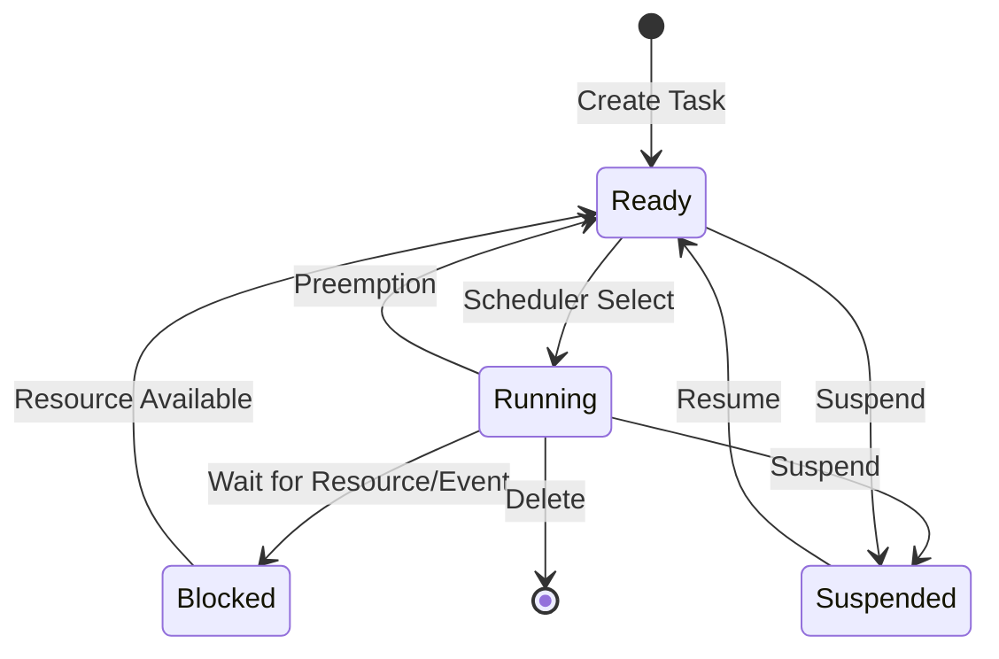

# STM32 Task Management

## Introduction

Task management is a fundamental concept in real-time operating systems (RTOS) that allows embedded applications on STM32 microcontrollers to handle multiple operations concurrently. Unlike simple loop-based programs, RTOS-based applications divide functionality into separate tasks, each with its own purpose, priority, and execution context.

In this guide, we'll explore how to create, manage, and coordinate tasks specifically on STM32 microcontrollers. We'll focus on FreeRTOS, which is the most commonly used RTOS with STM32 devices through the ST's STM32Cube ecosystem.

## Understanding RTOS Tasks

An RTOS task (sometimes called a thread) is an independent function that runs concurrently with other tasks under the control of the RTOS scheduler. Each task has its own:

- Stack space
- Priority level
- State (running, ready, blocked, suspended)
- Context (register values)

The RTOS scheduler determines which task runs when, based primarily on priority levels and states.



## Setting Up FreeRTOS on STM32

Before creating tasks, you need to set up FreeRTOS on your STM32 project. The easiest way is to use STM32CubeMX:

1. Open STM32CubeMX and create/open your project
2. Go to the Middleware section and enable FreeRTOS
3. Configure FreeRTOS settings (memory allocation scheme, tick frequency, etc.)
4. Generate the project code

This will create all necessary files and configurations to use FreeRTOS with your STM32 device.

## Creating Tasks

### Basic Task Creation

To create a task in FreeRTOS for STM32, you'll use the `osThreadNew()` function from CMSIS-RTOS v2 API:

```c
/* Task function prototype */
void vLedTask(void *argument);

/* Task handle */
osThreadId_t ledTaskHandle;

/* Task attributes */
const osThreadAttr_t ledTask_attributes = {
  .name = "LedTask",
  .stack_size = 128 * 4,
  .priority = (osPriority_t) osPriorityNormal,
};

int main(void)
{
  /* Initialize peripherals and system clocks */
  SystemClock_Config();
  
  /* Initialize CMSIS-RTOS */
  osKernelInitialize();
  
  /* Create LED task */
  ledTaskHandle = osThreadNew(vLedTask, NULL, &ledTask_attributes);
  
  /* Start scheduler */
  osKernelStart();
  
  /* We should never get here as control is now with the scheduler */
  while (1)
  {
  }
}

/* LED blinking task */
void vLedTask(void *argument)
{
  /* Infinite loop */
  for(;;)
  {
    HAL_GPIO_TogglePin(LD2_GPIO_Port, LD2_Pin);
    osDelay(1000);
  }
}
```

### Task Function Structure

Every task function should follow this basic pattern:

```c
void vTaskFunction(void *argument)
{
  /* Task initialization code */
  
  /* Task infinite loop */
  for(;;)
  {
    /* Task code to be executed repeatedly */
    
    /* Usually some form of delay or blocking call */
    osDelay(xPeriod);
  }
  
  /* Tasks should never return, but if they do: */
  osThreadTerminate(NULL);
}
```

## Task Priorities

Task priority determines which task gets CPU time when multiple tasks are ready to run. In FreeRTOS on STM32, priorities typically range from `osPriorityLow` to `osPriorityRealtime`.

```c
/* High priority task for critical operations */
const osThreadAttr_t criticalTask_attributes = {
  .name = "CriticalTask",
  .stack_size = 128 * 4,
  .priority = (osPriority_t) osPriorityHigh,
};

/* Normal priority task for regular operations */
const osThreadAttr_t normalTask_attributes = {
  .name = "NormalTask",
  .stack_size = 128 * 4,
  .priority = (osPriority_t) osPriorityNormal,
};
```

Remember: Higher priority tasks will always preempt lower priority tasks, so be careful when assigning priorities to avoid starvation of lower priority tasks.

## Stack Size Management

Each task requires its own stack space for local variables, function calls, and context saving during switches. Determining the right stack size is crucial:

- Too small: Stack overflow can cause unpredictable behavior
- Too large: Wastes valuable RAM

```c
/* Task with larger stack for complex operations */
const osThreadAttr_t complexTask_attributes = {
  .name = "ComplexTask",
  .stack_size = 512 * 4, /* 512 words (2048 bytes) */
  .priority = (osPriority_t) osPriorityNormal,
};

/* Task with minimal stack for simple operations */
const osThreadAttr_t simpleTask_attributes = {
  .name = "SimpleTask",
  .stack_size = 64 * 4, /* 64 words (256 bytes) */
  .priority = (osPriority_t) osPriorityLow,
};
```

### Stack Overflow Detection

You can enable stack overflow detection in FreeRTOS configuration:

```c
/* In FreeRTOSConfig.h */
#define configCHECK_FOR_STACK_OVERFLOW 2
```

Then implement the stack overflow hook:

```c
void vApplicationStackOverflowHook(TaskHandle_t xTask, char *pcTaskName)
{
  /* Handle stack overflow - typically blink an LED or log error */
  Error_Handler();
}
```

## Task Management Operations

Once tasks are created, you can manage their execution using these operations:

### Suspending and Resuming Tasks

```c
/* Suspend a task */
osThreadSuspend(taskHandle);

/* Resume a suspended task */
osThreadResume(taskHandle);
```

### Deleting Tasks

```c
/* Delete another task */
osThreadTerminate(taskHandle);

/* Delete the current task */
osThreadTerminate(NULL);
```

### Getting Task Information

```c
/* Get the current task handle */
osThreadId_t currentTask = osThreadGetId();

/* Check if a task is the current task */
if (currentTask == specificTaskHandle) {
  /* This is the specific task */
}
```

## Task Synchronization and Communication

Tasks often need to coordinate with each other. FreeRTOS provides several mechanisms:

### Delays

The simplest form of timing control is using delays:

```c
/* Delay task for 1000 milliseconds (1 second) */
osDelay(1000);

/* Delay until an absolute time */
osDelayUntil(lastWakeTime + 1000);
```

### Semaphores

Semaphores control access to shared resources:

```c
/* Create a binary semaphore */
osSemaphoreId_t binarySem;
binarySem = osSemaphoreNew(1, 1, NULL);

/* In task that wants to use the resource */
if (osSemaphoreAcquire(binarySem, osWaitForever) == osOK) {
  /* Access the shared resource */
  
  /* Release the semaphore when done */
  osSemaphoreRelease(binarySem);
}
```

### Mutexes

Mutexes are similar to binary semaphores but with priority inheritance to prevent priority inversion:

```c
/* Create a mutex */
osMutexId_t mutex;
mutex = osMutexNew(NULL);

/* In task that wants to use the resource */
if (osMutexAcquire(mutex, osWaitForever) == osOK) {
  /* Access the shared resource */
  
  /* Release the mutex when done */
  osMutexRelease(mutex);
}
```

### Queues

Queues allow tasks to exchange data:

```c
/* Create a queue that can hold 5 uint32_t values */
osMessageQueueId_t queue;
queue = osMessageQueueNew(5, sizeof(uint32_t), NULL);

/* In the sender task */
uint32_t value = 42;
osMessageQueuePut(queue, &value, 0, osWaitForever);

/* In the receiver task */
uint32_t receivedValue;
if (osMessageQueueGet(queue, &receivedValue, NULL, osWaitForever) == osOK) {
  /* Use the received value */
  printf("Received: %lu
", receivedValue);
}
```

## Practical Example: Multi-Task Temperature Monitoring System

Let's create a practical example of a temperature monitoring system with three tasks:

1. Sensor reading task (reads temperature every 500ms)
2. Processing task (processes readings and detects anomalies)
3. Display task (updates an LED based on temperature status)

```c
/* Include necessary headers */
#include "main.h"
#include "cmsis_os.h"

/* Define temperature thresholds */
#define TEMP_NORMAL 25.0f
#define TEMP_WARNING 30.0f
#define TEMP_CRITICAL 40.0f

/* Handles for tasks */
osThreadId_t sensorTaskHandle;
osThreadId_t processingTaskHandle;
osThreadId_t displayTaskHandle;

/* Queue for temperature readings */
osMessageQueueId_t tempQueueHandle;

/* Queue for processed results */
osMessageQueueId_t resultQueueHandle;

/* Task function prototypes */
void vSensorTask(void *argument);
void vProcessingTask(void *argument);
void vDisplayTask(void *argument);

/* Temperature reading structure */
typedef struct {
  float value;
  uint32_t timestamp;
} TempReading_t;

/* Result structure */
typedef enum {
  TEMP_STATUS_NORMAL,
  TEMP_STATUS_WARNING,
  TEMP_STATUS_CRITICAL
} TempStatus_t;

int main(void)
{
  /* System initialization */
  HAL_Init();
  SystemClock_Config();
  MX_GPIO_Init();
  MX_ADC1_Init();
  
  /* Initialize CMSIS-RTOS */
  osKernelInitialize();
  
  /* Create queues */
  tempQueueHandle = osMessageQueueNew(10, sizeof(TempReading_t), NULL);
  resultQueueHandle = osMessageQueueNew(10, sizeof(TempStatus_t), NULL);
  
  /* Create tasks */
  const osThreadAttr_t sensorTask_attributes = {
    .name = "SensorTask",
    .stack_size = 128 * 4,
    .priority = (osPriority_t) osPriorityHigh,
  };
  sensorTaskHandle = osThreadNew(vSensorTask, NULL, &sensorTask_attributes);
  
  const osThreadAttr_t processingTask_attributes = {
    .name = "ProcessingTask",
    .stack_size = 128 * 4,
    .priority = (osPriority_t) osPriorityNormal,
  };
  processingTaskHandle = osThreadNew(vProcessingTask, NULL, &processingTask_attributes);
  
  const osThreadAttr_t displayTask_attributes = {
    .name = "DisplayTask",
    .stack_size = 128 * 4,
    .priority = (osPriority_t) osPriorityBelowNormal,
  };
  displayTaskHandle = osThreadNew(vDisplayTask, NULL, &displayTask_attributes);
  
  /* Start scheduler */
  osKernelStart();
  
  /* We should never get here */
  while (1) {}
}

/* Simulate temperature reading */
float readTemperature(void)
{
  uint32_t adcValue;
  HAL_ADC_Start(&hadc1);
  HAL_ADC_PollForConversion(&hadc1, 100);
  adcValue = HAL_ADC_GetValue(&hadc1);
  
  /* Convert ADC value to temperature (simplified) */
  return (float)adcValue * 0.1f;
}

/* Sensor reading task */
void vSensorTask(void *argument)
{
  TempReading_t reading;
  uint32_t tick;
  
  for (;;) {
    /* Read temperature */
    reading.value = readTemperature();
    reading.timestamp = osKernelGetTickCount();
    
    /* Send to queue */
    osMessageQueuePut(tempQueueHandle, &reading, 0, 0);
    
    /* Delay 500ms */
    osDelay(500);
  }
}

/* Processing task */
void vProcessingTask(void *argument)
{
  TempReading_t reading;
  TempStatus_t status;
  
  for (;;) {
    /* Wait for temperature reading */
    if (osMessageQueueGet(tempQueueHandle, &reading, NULL, osWaitForever) == osOK) {
      /* Process temperature and determine status */
      if (reading.value >= TEMP_CRITICAL) {
        status = TEMP_STATUS_CRITICAL;
      } else if (reading.value >= TEMP_WARNING) {
        status = TEMP_STATUS_WARNING;
      } else {
        status = TEMP_STATUS_NORMAL;
      }
      
      /* Send result to display task */
      osMessageQueuePut(resultQueueHandle, &status, 0, 0);
    }
  }
}

/* Display task */
void vDisplayTask(void *argument)
{
  TempStatus_t status;
  TickType_t blinkPeriod = 0;
  
  for (;;) {
    /* Wait for status update */
    if (osMessageQueueGet(resultQueueHandle, &status, NULL, osWaitForever) == osOK) {
      /* Set LED behavior based on temperature status */
      switch (status) {
        case TEMP_STATUS_NORMAL:
          /* Solid LED for normal */
          HAL_GPIO_WritePin(LD2_GPIO_Port, LD2_Pin, GPIO_PIN_SET);
          blinkPeriod = 0;
          break;
          
        case TEMP_STATUS_WARNING:
          /* Slow blinking for warning */
          blinkPeriod = 1000;
          break;
          
        case TEMP_STATUS_CRITICAL:
          /* Fast blinking for critical */
          blinkPeriod = 200;
          break;
      }
    }
    
    /* Blink LED if required */
    if (blinkPeriod > 0) {
      HAL_GPIO_TogglePin(LD2_GPIO_Port, LD2_Pin);
      osDelay(blinkPeriod);
    } else {
      osDelay(100); /* Small delay when not blinking */
    }
  }
}
```

This example demonstrates:
- Task creation with different priorities
- Inter-task communication using queues
- Task synchronization
- Real-world application structure

## Advanced Task Management

### Idle Task and Hooks

FreeRTOS creates an idle task automatically, which runs when no other tasks are ready. You can add hooks to this task:

```c
/* In FreeRTOSConfig.h */
#define configUSE_IDLE_HOOK 1

/* In your code */
void vApplicationIdleHook(void)
{
  /* Code to execute when system is idle */
  /* e.g., enter low power mode */
  HAL_PWR_EnterSLEEPMode(PWR_MAINREGULATOR_ON, PWR_SLEEPENTRY_WFI);
}
```

### Task Notifications

Task notifications are a lightweight alternative to semaphores and queues for simple task-to-task signaling:

```c
/* In the sender task */
osThreadFlagsSet(receiverTaskHandle, 0x01);

/* In the receiver task */
uint32_t flags = osThreadFlagsWait(0x01, osFlagsWaitAny, osWaitForever);
if ((flags & 0x01) != 0) {
  /* Notification received */
}
```

### CPU Usage Monitoring

You can monitor CPU usage with FreeRTOS to optimize your application:

```c
/* In FreeRTOSConfig.h */
#define configGENERATE_RUN_TIME_STATS 1
#define configUSE_STATS_FORMATTING_FUNCTIONS 1

/* In your code */
char statsBuffer[512];
vTaskGetRunTimeStats(statsBuffer);
printf("Task Stats:
%s
", statsBuffer);
```

## Performance Considerations

When working with STM32 task management, remember these performance tips:

1. **Minimize task switching**: Each context switch takes time and energy
2. **Use appropriate priorities**: Only high-priority for time-critical tasks
3. **Be careful with shared resources**: Minimize critical sections
4. **Watch stack usage**: Monitor and optimize task stack sizes
5. **Use direct task notifications**: When possible, instead of queues/semaphores
6. **Consider memory fragmentation**: Use static allocation where possible

## Debugging RTOS Applications

Debugging multi-tasking applications can be challenging. Here are some tips:

1. Use ST-Link and an IDE that supports RTOS-aware debugging (STM32CubeIDE)
2. Enable thread-aware debugging to see task states and stack usage
3. Use runtime statistics to identify performance bottlenecks
4. Implement a logging system using a dedicated UART/task
5. For stack issues, enable stack overflow checking

## Summary

Task management is the core of RTOS-based applications on STM32 microcontrollers. In this guide, we've covered:

- Creating and configuring tasks with appropriate priorities and stack sizes
- Managing task execution through suspending, resuming, and deleting
- Synchronizing tasks using delays, semaphores, mutexes, and queues
- Building a practical multi-task application
- Advanced task management techniques
- Performance considerations and debugging tips

By properly implementing task management strategies, you can create responsive, efficient, and maintainable embedded applications on STM32 devices that handle multiple operations concurrently.

## Exercises

1. Create a simple LED blinking application with three tasks of different priorities, each controlling a different LED with different blinking patterns.

2. Implement a button debouncing task that uses a queue to signal a separate LED control task when a button is pressed.

3. Create a temperature monitoring system similar to our example, but add a fourth task that logs data to a serial port at regular intervals.

4. Modify the temperature monitoring example to use task notifications instead of queues. Compare the performance and resource usage.

5. Implement a system that enters low-power mode in the idle task but wakes up when a button is pressed using an external interrupt.

## Additional Resources

- [STM32 FreeRTOS Documentation](https://www.st.com)
- [FreeRTOS Official Documentation](https://www.freertos.org)
- [Mastering STM32](https://leanpub.com/mastering-stm32) by Carmine Noviello
- [STM32CubeIDE User Manual](https://www.st.com)
- STMicroelectronics application notes:
  - AN4838: Managing memory with RTOS on STM32 MCUs
  - AN5021: Debugging RTOS applications on STM32 MCUs