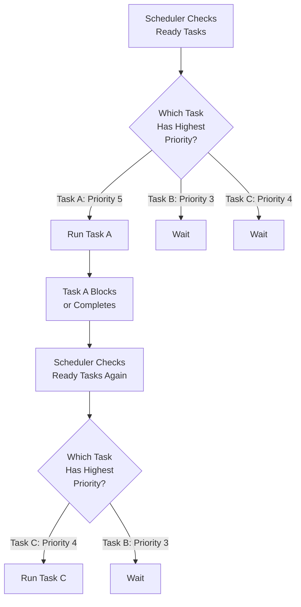
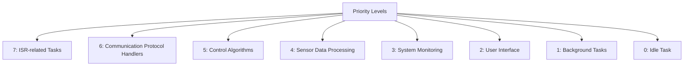

# STM32 Task Priorities

## Introduction

In a Real-Time Operating System (RTOS) running on an STM32 microcontroller, managing task priorities is a fundamental concept that directly impacts the responsiveness and reliability of your embedded application. Task priorities determine which tasks get CPU time when multiple tasks are ready to run, making priority management crucial for meeting timing requirements in your real-time applications.

This guide will walk you through the concepts, implementation, and best practices for working with task priorities on STM32 microcontrollers using popular RTOS options like FreeRTOS and CMSIS-RTOS.

## Understanding Task Priorities

### The Basics of Task Scheduling

An RTOS scheduler decides which task should run next based primarily on priority levels. On STM32 platforms:

- Higher numeric values typically represent higher priorities
- The scheduler will always run the highest priority task that is ready to execute
- Tasks with the same priority level are typically scheduled in a round-robin fashion

<div className="info-box">
<strong>Key Concept:</strong> In a preemptive RTOS, a higher-priority task will immediately interrupt (preempt) a lower-priority task when it becomes ready to run.
</div>

Let's visualize this with a diagram:



## Priority Configuration in STM32 RTOS

### Using FreeRTOS

FreeRTOS is commonly used with STM32 and provides a flexible priority system. In FreeRTOS:

- Priorities typically range from 0 (lowest) to `configMAX_PRIORITIES-1` (highest)
- `configMAX_PRIORITIES` is defined in `FreeRTOSConfig.h`
- The idle task always runs at priority 0

Here's how to create a task with a specific priority:

```c
/* Create a task with priority 3 */
BaseType_t xTaskCreateStatus = xTaskCreate(
    vTaskFunction,        /* Task function pointer */
    "TaskName",           /* Name for debugging */
    configMINIMAL_STACK_SIZE,  /* Stack size */
    NULL,                 /* Parameters passed to task */
    3,                    /* Priority (3 out of 0-configMAX_PRIORITIES-1) */
    &xTaskHandle          /* Task handle */
);
```

### Using CMSIS-RTOS v2

If you're using CMSIS-RTOS v2 (which often uses FreeRTOS under the hood):

```c
/* Define thread attributes with priority osPriority_Normal */
const osThreadAttr_t thread_attr = {
  .name = "WorkerThread",
  .stack_size = 128 * 4,
  .priority = osPriority_Normal
};

/* Create the thread with the attributes */
osThreadId_t threadId = osThreadNew(ThreadFunction, NULL, &thread_attr);
```

CMSIS-RTOS v2 provides these standard priority levels:

```c
osPriority_Idle        /* priority: idle (lowest) */
osPriority_Low         /* priority: low */
osPriority_LowNormal   /* priority: low to normal */
osPriority_Normal      /* priority: normal (default) */
osPriority_HighNormal  /* priority: normal to high */
osPriority_High        /* priority: high */
osPriority_Realtime    /* priority: realtime (highest) */
```

You can also use more specific levels like `osPriority_Normal3` for finer control.

## Changing Task Priorities Dynamically

Sometimes you may need to change a task's priority at runtime:

### In FreeRTOS:

```c
/* Change the priority of a task */
vTaskPrioritySet(xTaskHandle, newPriority);

/* Get the current priority of a task */
UBaseType_t currentPriority = uxTaskPriorityGet(xTaskHandle);

/* Get the priority of the calling task */
UBaseType_t myPriority = uxTaskPriorityGet(NULL);
```

### In CMSIS-RTOS v2:

```c
/* Change thread priority */
osStatus_t status = osThreadSetPriority(threadId, osPriority_High);

/* Get current thread priority */
osPriority_t current = osThreadGetPriority(threadId);
```

## Practical Examples

### Example 1: Basic Priority Assignment

Let's create a simple system with three tasks of different priorities:

```c
#include "FreeRTOS.h"
#include "task.h"
#include "stm32f4xx_hal.h"

/* Task handles */
TaskHandle_t xLEDTask;
TaskHandle_t xSensorTask;
TaskHandle_t xCommunicationTask;

/* LED toggling task (low priority) */
void vLEDTask(void *pvParameters)
{
    for(;;)
    {
        HAL_GPIO_TogglePin(GPIOA, GPIO_PIN_5);  /* Toggle LED */
        vTaskDelay(pdMS_TO_TICKS(500));         /* 500ms delay */
    }
}

/* Sensor reading task (medium priority) */
void vSensorTask(void *pvParameters)
{
    for(;;)
    {
        /* Read sensor data (e.g., temperature) */
        float temperature = ReadTemperatureSensor();
        
        /* Process the data */
        ProcessSensorData(temperature);
        
        vTaskDelay(pdMS_TO_TICKS(100));  /* 100ms delay */
    }
}

/* Communication task (high priority) */
void vCommunicationTask(void *pvParameters)
{
    for(;;)
    {
        /* Check if data is available on UART */
        if(UART_DataAvailable())
        {
            /* Process incoming commands immediately */
            ProcessCommand();
        }
        
        vTaskDelay(pdMS_TO_TICKS(10));  /* 10ms delay */
    }
}

int main(void)
{
    /* Initialize HAL, clocks, etc. */
    SystemInit();
    HAL_Init();
    
    /* Create tasks with different priorities */
    xTaskCreate(vLEDTask, "LED", configMINIMAL_STACK_SIZE, NULL, 1, &xLEDTask);
    xTaskCreate(vSensorTask, "Sensor", configMINIMAL_STACK_SIZE, NULL, 2, &xSensorTask);
    xTaskCreate(vCommunicationTask, "Comm", configMINIMAL_STACK_SIZE, NULL, 3, &xCommunicationTask);
    
    /* Start the scheduler */
    vTaskStartScheduler();
    
    /* Should never reach here */
    for(;;);
}
```

In this example:
- The communication task has the highest priority (3) because it needs to respond quickly to external commands
- The sensor task has medium priority (2) to ensure regular data collection
- The LED task has the lowest priority (1) as visual feedback is less time-critical

### Example 2: Priority Inversion Problem and Solution

One common issue in RTOS applications is **priority inversion**, where a lower-priority task indirectly blocks a higher-priority task. Let's examine this issue and how to solve it:

```c
/* Shared resource */
SemaphoreHandle_t xResourceSemaphore;

/* High priority task */
void vHighPriorityTask(void *pvParameters)
{
    for(;;)
    {
        /* Try to access shared resource */
        if(xSemaphoreTake(xResourceSemaphore, pdMS_TO_TICKS(100)) == pdTRUE)
        {
            /* Critical section */
            PerformCriticalOperation();
            
            /* Release resource */
            xSemaphoreGive(xResourceSemaphore);
        }
        
        vTaskDelay(pdMS_TO_TICKS(100));
    }
}

/* Medium priority task */
void vMediumPriorityTask(void *pvParameters)
{
    for(;;)
    {
        /* This task could preempt the low priority task 
           while it holds the resource, causing priority inversion */
        PerformMediumPriorityWork();
        
        vTaskDelay(pdMS_TO_TICKS(100));
    }
}

/* Low priority task */
void vLowPriorityTask(void *pvParameters)
{
    for(;;)
    {
        /* Try to access shared resource */
        if(xSemaphoreTake(xResourceSemaphore, portMAX_DELAY) == pdTRUE)
        {
            /* Critical section - could be interrupted by medium priority task,
               causing high priority task to wait longer than necessary */
            PerformLengthyOperation();
            
            /* Release resource */
            xSemaphoreGive(xResourceSemaphore);
        }
        
        vTaskDelay(pdMS_TO_TICKS(200));
    }
}

int main(void)
{
    /* Initialize HAL, clocks, etc. */
    SystemInit();
    HAL_Init();
    
    /* Create a mutex semaphore with priority inheritance */
    xResourceSemaphore = xSemaphoreCreateMutex();
    
    /* Create tasks with different priorities */
    xTaskCreate(vHighPriorityTask, "High", configMINIMAL_STACK_SIZE, NULL, 3, NULL);
    xTaskCreate(vMediumPriorityTask, "Medium", configMINIMAL_STACK_SIZE, NULL, 2, NULL);
    xTaskCreate(vLowPriorityTask, "Low", configMINIMAL_STACK_SIZE, NULL, 1, NULL);
    
    /* Start the scheduler */
    vTaskStartScheduler();
    
    /* Should never reach here */
    for(;;);
}
```

To solve the priority inversion problem:
1. FreeRTOS mutexes implement priority inheritance by default
2. When a higher-priority task attempts to take a mutex owned by a lower-priority task, the lower-priority task temporarily inherits the priority of the waiting task
3. This ensures that the medium-priority task cannot indefinitely prevent the low-priority task from releasing the resource

## Best Practices for Priority Management

### Do's:
- **Assign priorities based on timing requirements**: Tasks with strict deadlines should have higher priorities
- **Use priority inheritance mutexes** for shared resources to prevent priority inversion
- **Keep critical sections short** to minimize the time spent with preemption disabled
- **Follow consistent priority numbering** across your application

### Don'ts:
- **Don't create too many priority levels**: 5-10 levels are usually sufficient for most applications
- **Don't assign the same priority to tasks** that might compete for CPU time in critical situations
- **Don't set all tasks to maximum priority**: This defeats the purpose of priority scheduling
- **Don't change priorities frequently** without a good reason

## Common STM32 RTOS Priority Configurations

Here's a typical priority assignment scheme for an STM32 embedded application:



## Debugging Priority Issues

When debugging priority-related issues:

1. **Use Runtime Statistics**:
   ```c
   /* Print task statistics */
   void vPrintTaskStats(void)
   {
       char pcBuffer[500];
       vTaskList(pcBuffer);
       printf("Task  State  Priority  Stack  Number\r
");
       printf("----------------------------------------\r
");
       printf("%s\r
", pcBuffer);
   }
   ```

2. **Monitor the execution pattern** of high-priority tasks
3. **Check for priority inversion scenarios** where high-priority tasks are unexpectedly blocked
4. **Use trace tools** like Percepio Tracealyzer if available

## Summary

Managing task priorities on STM32 microcontrollers is essential for creating responsive real-time systems:

- **Priorities determine execution order** when multiple tasks are ready to run
- **Higher-priority tasks preempt lower-priority ones** in preemptive scheduling
- **Priority inheritance prevents priority inversion** in resource sharing scenarios
- **Properly assigned priorities** ensure critical tasks meet their timing requirements

By mastering task priority management, you can create more reliable and predictable embedded applications that properly respond to events based on their importance and timing constraints.

## Exercises

1. Create a simple STM32 project with three tasks of different priorities and observe their execution pattern.
2. Implement a priority inversion scenario and then solve it using mutex with priority inheritance.
3. Experiment with dynamic priority changes based on system states or events.
4. Implement a resource-sharing scenario between multiple tasks and analyze the impact of different priority assignments.

## Additional Resources

- FreeRTOS Documentation: Task Control
- ST Microelectronics Application Notes for RTOS Implementation
- CMSIS-RTOS v2 API Reference
- "Patterns for Time-Triggered Embedded Systems" by Michael J. Pont