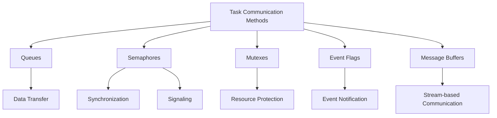
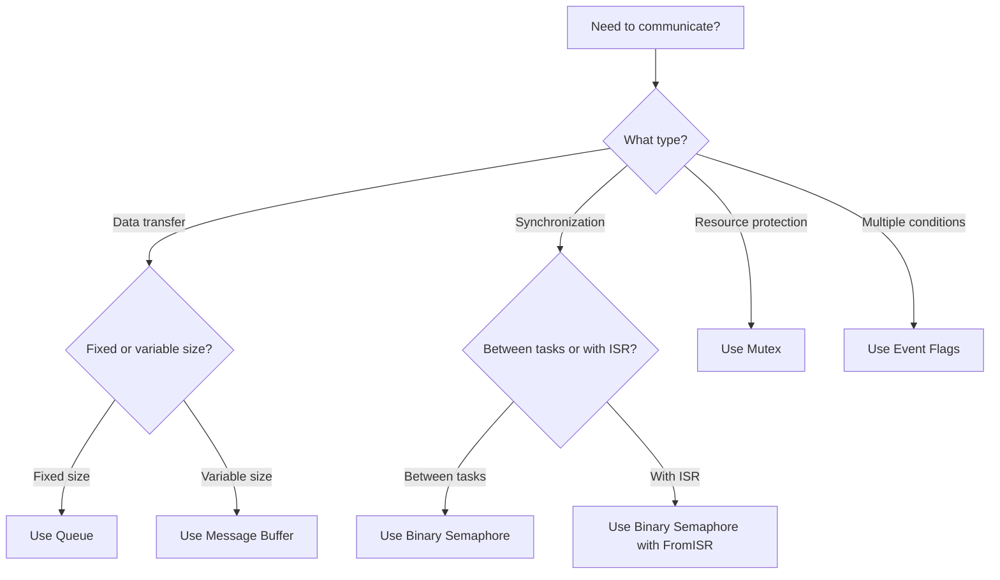

# STM32 Task Communication

## Introduction

In real-time operating systems (RTOS) running on STM32 microcontrollers, tasks rarely operate in isolation. They need to share data, synchronize activities, and coordinate their operations to create a cohesive application. This is where task communication mechanisms come into play.

This guide explores the various methods by which tasks can communicate within an RTOS environment on STM32 microcontrollers. We'll cover queues, semaphores, mutexes, event flags, and message buffers, with practical examples using FreeRTOS, one of the most popular RTOS options for STM32 devices.

## Why Task Communication Matters

Imagine building a weather station with your STM32 board:
- One task reads temperature from a sensor
- Another task reads humidity data
- A third task combines this information and displays it
- A fourth task sends the data to a server via WiFi

Without proper communication between these tasks, your application wouldn't function as intended. Task communication provides structured ways for these separate execution threads to share data and coordinate their activities.

## Communication Methods Overview



Let's explore each method in detail.

## 1. Queues: Passing Data Between Tasks

Queues are perhaps the most commonly used communication mechanism. They allow you to pass data from one task to another in a thread-safe manner.

### How Queues Work

A queue is essentially a data structure that operates on a First-In-First-Out (FIFO) basis. Tasks can send data to a queue (enqueue) and receive data from a queue (dequeue).

### Creating and Using Queues

Here's a simple example of using a queue to send sensor readings from one task to another:

```c
// Global queue handle
QueueHandle_t sensorQueue;

// Task that reads temperature and sends it to the queue
void vTemperatureTask(void *pvParameters)
{
    float temperature;
    
    // Create the queue - can hold 5 float values
    sensorQueue = xQueueCreate(5, sizeof(float));
    
    if (sensorQueue == NULL) {
        // Queue creation failed, handle error
        while (1);
    }
    
    while (1) {
        // Read temperature from sensor (simplified)
        temperature = readTemperatureSensor();
        
        // Send to queue - wait up to 10 ticks if queue is full
        if (xQueueSend(sensorQueue, &temperature, pdMS_TO_TICKS(10)) != pdPASS) {
            // Failed to send to queue
        }
        
        // Wait before next reading
        vTaskDelay(pdMS_TO_TICKS(1000));
    }
}

// Task that processes the temperature readings
void vDisplayTask(void *pvParameters)
{
    float receivedTemperature;
    
    while (1) {
        // Receive from queue - wait up to 100 ticks for data
        if (xQueueReceive(sensorQueue, &receivedTemperature, pdMS_TO_TICKS(100)) == pdPASS) {
            // Successfully received data
            printf("Current temperature: %.1f°C\r
", receivedTemperature);
        }
    }
}

// In main function
int main(void)
{
    // Other initialization code...
    
    // Create the tasks
    xTaskCreate(vTemperatureTask, "Temp", 128, NULL, 1, NULL);
    xTaskCreate(vDisplayTask, "Display", 128, NULL, 1, NULL);
    
    // Start the scheduler
    vTaskStartScheduler();
    
    // Will only reach here if there's not enough heap for the idle task
    for (;;);
}
```

### Queue Features to Remember

- Queues provide *data transfer* between tasks
- They're *thread-safe* - no need for additional protection
- They can store *multiple items* of the same size
- Tasks can *block* (wait) on queues until data arrives
- Multiple tasks can send to or receive from the same queue

## 2. Semaphores: Synchronization and Signaling

Semaphores help with task synchronization. They're especially useful for signaling between tasks and interrupts.

### Types of Semaphores

1. **Binary Semaphores**: Can only have values 0 or 1 (taken or available)
2. **Counting Semaphores**: Can have values from 0 to a maximum count

### Using Binary Semaphores for Synchronization

Here's an example where a sensor interrupt signals a task using a binary semaphore:

```c
// Global semaphore handle
SemaphoreHandle_t sensorSemaphore;

// ISR for sensor data ready interrupt
void EXTI15_10_IRQHandler(void)
{
    BaseType_t xHigherPriorityTaskWoken = pdFALSE;
    
    // Check if our pin triggered the interrupt
    if (__HAL_GPIO_EXTI_GET_IT(GPIO_PIN_10) != RESET) {
        // Clear interrupt flag
        __HAL_GPIO_EXTI_CLEAR_IT(GPIO_PIN_10);
        
        // Give semaphore from ISR
        xSemaphoreGiveFromISR(sensorSemaphore, &xHigherPriorityTaskWoken);
        
        // If a higher priority task was woken, request context switch
        portYIELD_FROM_ISR(xHigherPriorityTaskWoken);
    }
}

// Task that processes sensor data when available
void vSensorProcessingTask(void *pvParameters)
{
    // Create binary semaphore
    sensorSemaphore = xSemaphoreCreateBinary();
    
    if (sensorSemaphore == NULL) {
        // Semaphore creation failed, handle error
        while (1);
    }
    
    // Configure GPIO interrupt for sensor data ready pin (simplified)
    configureDataReadyInterrupt();
    
    while (1) {
        // Wait for semaphore (notification from ISR)
        if (xSemaphoreTake(sensorSemaphore, portMAX_DELAY) == pdTRUE) {
            // Semaphore received, data is ready to be read
            processSensorData();
        }
    }
}
```

### Using Counting Semaphores

Counting semaphores are useful when you need to keep track of multiple resources:

```c
// Global semaphore handle
SemaphoreHandle_t bufferSemaphore;

void vInit(void)
{
    // Create counting semaphore with initial count of 3 (we have 3 buffers available)
    bufferSemaphore = xSemaphoreCreateCounting(3, 3);
}

void vTaskThatUsesBuffer(void *pvParameters)
{
    while (1) {
        // Try to get a buffer
        if (xSemaphoreTake(bufferSemaphore, pdMS_TO_TICKS(100)) == pdTRUE) {
            // We have a buffer, use it
            useBuffer();
            
            // Release the buffer
            xSemaphoreGive(bufferSemaphore);
        }
        else {
            // Couldn't get a buffer in time
            handleNoBufferAvailable();
        }
    }
}
```

## 3. Mutexes: Protecting Shared Resources

Mutexes (mutual exclusion semaphores) are specifically designed for controlling access to shared resources, preventing multiple tasks from simultaneously accessing the same resource.

### Mutex vs. Binary Semaphore

While a binary semaphore could be used for mutual exclusion, mutexes have an important additional feature: **priority inheritance**. This helps avoid priority inversion problems where a low-priority task holds a resource needed by a high-priority task.

### Using Mutexes

Here's an example of using a mutex to protect access to a shared I2C bus:

```c
// Global mutex handle
SemaphoreHandle_t i2cMutex;

void vInitI2C(void)
{
    // Initialize I2C hardware
    HAL_I2C_Init(&hi2c1);
    
    // Create mutex for I2C bus access
    i2cMutex = xSemaphoreCreateMutex();
}

// Function to safely read from I2C device
bool readFromI2CSensor(uint8_t sensorAddr, uint8_t reg, uint8_t *data, uint16_t len)
{
    bool status = false;
    
    // Attempt to take the mutex with timeout
    if (xSemaphoreTake(i2cMutex, pdMS_TO_TICKS(100)) == pdTRUE) {
        // We have exclusive access to the I2C bus
        status = (HAL_I2C_Mem_Read(&hi2c1, sensorAddr, reg, I2C_MEMADD_SIZE_8BIT, data, len, 100) == HAL_OK);
        
        // Release the mutex
        xSemaphoreGive(i2cMutex);
    }
    
    return status;
}

// Two tasks that need to access I2C
void vTemperatureSensorTask(void *pvParameters)
{
    uint8_t tempData[2];
    
    while (1) {
        if (readFromI2CSensor(TEMP_SENSOR_ADDR, TEMP_REG, tempData, 2)) {
            // Process temperature data
        }
        vTaskDelay(pdMS_TO_TICKS(500));
    }
}

void vPressureSensorTask(void *pvParameters)
{
    uint8_t pressureData[3];
    
    while (1) {
        if (readFromI2CSensor(PRESSURE_SENSOR_ADDR, PRESS_REG, pressureData, 3)) {
            // Process pressure data
        }
        vTaskDelay(pdMS_TO_TICKS(750));
    }
}
```

### Best Practices with Mutexes

- Always release a mutex when you're done with the resource
- Minimize the time you hold a mutex to avoid blocking other tasks
- Avoid calling blocking functions while holding a mutex
- Never terminate a task while it's holding a mutex

## 4. Event Flags: Waiting for Multiple Conditions

Event flags (or event groups) allow tasks to wait for one or more events to occur. They're useful when a task needs to wait for multiple conditions before proceeding.

### How Event Flags Work

Each bit in an event group represents a different event. Tasks can:
- Set bits (signal events have occurred)
- Clear bits
- Wait for specific bit patterns

### Example: System Initialization Synchronization

```c
// Global event group handle
EventGroupHandle_t startupEventGroup;

// Bit definitions
#define SENSORS_INITIALIZED    (1 << 0)
#define COMMS_INITIALIZED      (1 << 1)
#define UI_INITIALIZED         (1 << 2)
#define ALL_SYSTEMS_READY      (SENSORS_INITIALIZED | COMMS_INITIALIZED | UI_INITIALIZED)

void vSensorsInitTask(void *pvParameters)
{
    // Initialize sensors
    initializeSensors();
    
    // Signal that sensors are ready
    xEventGroupSetBits(startupEventGroup, SENSORS_INITIALIZED);
    
    // Delete this task as it's no longer needed
    vTaskDelete(NULL);
}

void vCommsInitTask(void *pvParameters)
{
    // Initialize communication systems
    initializeComms();
    
    // Signal that comms are ready
    xEventGroupSetBits(startupEventGroup, COMMS_INITIALIZED);
    
    // Delete this task as it's no longer needed
    vTaskDelete(NULL);
}

void vUIInitTask(void *pvParameters)
{
    // Initialize user interface
    initializeUI();
    
    // Signal that UI is ready
    xEventGroupSetBits(startupEventGroup, UI_INITIALIZED);
    
    // Delete this task as it's no longer needed
    vTaskDelete(NULL);
}

void vMainApplicationTask(void *pvParameters)
{
    // Wait for all systems to be initialized
    xEventGroupWaitBits(
        startupEventGroup,    // The event group to check
        ALL_SYSTEMS_READY,    // The bits to check
        pdFALSE,              // Don't clear the bits after checking
        pdTRUE,               // Wait for all bits to be set
        portMAX_DELAY         // Wait indefinitely
    );
    
    // All systems are now initialized, start main application
    startApplication();
    
    // This task continues running the main application
    while (1) {
        runApplicationLoop();
        vTaskDelay(pdMS_TO_TICKS(10));
    }
}

int main(void)
{
    // Create event group
    startupEventGroup = xEventGroupCreate();
    
    // Create initialization tasks
    xTaskCreate(vSensorsInitTask, "SensInit", 128, NULL, 1, NULL);
    xTaskCreate(vCommsInitTask, "CommsInit", 128, NULL, 1, NULL);
    xTaskCreate(vUIInitTask, "UIInit", 128, NULL, 1, NULL);
    xTaskCreate(vMainApplicationTask, "MainApp", 256, NULL, 2, NULL);
    
    // Start the scheduler
    vTaskStartScheduler();
    
    // Will only reach here if there's not enough heap for the idle task
    for (;;);
}
```

## 5. Message Buffers: Stream-like Communication

Message buffers provide a way to send variable-length messages between tasks. They're particularly useful for stream-oriented data.

### How Message Buffers Work

- Similar to queues but for variable-length data
- Store messages back-to-back in a single block of memory
- Messages are prefixed with their length
- FIFO operation like queues

### Example: Processing UART Data

```c
// Global message buffer handle
MessageBufferHandle_t uartMessageBuffer;

// UART receive interrupt callback
void HAL_UART_RxCpltCallback(UART_HandleTypeDef *huart)
{
    BaseType_t xHigherPriorityTaskWoken = pdFALSE;
    static uint8_t receivedByte;
    
    if (huart->Instance == USART1) {
        // Send the received byte to the message buffer
        xMessageBufferSendFromISR(
            uartMessageBuffer,
            &receivedByte,
            1,
            &xHigherPriorityTaskWoken
        );
        
        // Restart UART reception for next byte
        HAL_UART_Receive_IT(&huart1, &receivedByte, 1);
        
        // If a higher priority task was woken, request context switch
        portYIELD_FROM_ISR(xHigherPriorityTaskWoken);
    }
}

// Task that processes UART data
void vUARTProcessingTask(void *pvParameters)
{
    uint8_t receiveBuffer[64];
    size_t receivedBytes;
    
    // Create message buffer - 100 bytes total size
    uartMessageBuffer = xMessageBufferCreate(100);
    
    if (uartMessageBuffer == NULL) {
        // Message buffer creation failed, handle error
        while (1);
    }
    
    // Initialize UART and start reception
    initializeUART();
    
    while (1) {
        // Receive data from the message buffer with timeout
        receivedBytes = xMessageBufferReceive(
            uartMessageBuffer,
            receiveBuffer,
            sizeof(receiveBuffer),
            pdMS_TO_TICKS(100)
        );
        
        if (receivedBytes > 0) {
            // Process received data
            processUARTData(receiveBuffer, receivedBytes);
        }
    }
}
```

## Real-World Example: Weather Station

Let's bring everything together in a practical example of a weather station application:

```c
// Handles for communication primitives
QueueHandle_t temperatureQueue;
QueueHandle_t humidityQueue;
SemaphoreHandle_t displayMutex;
SemaphoreHandle_t i2cMutex;
EventGroupHandle_t sensorEventGroup;
MessageBufferHandle_t commandBuffer;

// Event bits
#define TEMP_DATA_READY    (1 << 0)
#define HUM_DATA_READY     (1 << 1)
#define ALL_DATA_READY     (TEMP_DATA_READY | HUM_DATA_READY)

// Temperature sensor task
void vTemperatureTask(void *pvParameters)
{
    float temperature;
    
    while (1) {
        // Take I2C mutex before accessing sensor
        if (xSemaphoreTake(i2cMutex, pdMS_TO_TICKS(100)) == pdTRUE) {
            // Read temperature from I2C sensor
            temperature = readTemperatureSensor();
            
            // Release I2C mutex
            xSemaphoreGive(i2cMutex);
            
            // Send temperature to queue
            xQueueSend(temperatureQueue, &temperature, 0);
            
            // Set event flag indicating temperature data is ready
            xEventGroupSetBits(sensorEventGroup, TEMP_DATA_READY);
        }
        
        // Wait before next reading
        vTaskDelay(pdMS_TO_TICKS(2000));
    }
}

// Humidity sensor task
void vHumidityTask(void *pvParameters)
{
    float humidity;
    
    while (1) {
        // Take I2C mutex before accessing sensor
        if (xSemaphoreTake(i2cMutex, pdMS_TO_TICKS(100)) == pdTRUE) {
            // Read humidity from I2C sensor
            humidity = readHumiditySensor();
            
            // Release I2C mutex
            xSemaphoreGive(i2cMutex);
            
            // Send humidity to queue
            xQueueSend(humidityQueue, &humidity, 0);
            
            // Set event flag indicating humidity data is ready
            xEventGroupSetBits(sensorEventGroup, HUM_DATA_READY);
        }
        
        // Wait before next reading
        vTaskDelay(pdMS_TO_TICKS(2000));
    }
}

// Display task
void vDisplayTask(void *pvParameters)
{
    float temperature, humidity;
    EventBits_t bits;
    
    while (1) {
        // Wait for both temperature and humidity data to be ready
        bits = xEventGroupWaitBits(
            sensorEventGroup,
            ALL_DATA_READY,
            pdTRUE,  // Clear bits after reading
            pdTRUE,  // Wait for all bits
            pdMS_TO_TICKS(5000)
        );
        
        if ((bits & ALL_DATA_READY) == ALL_DATA_READY) {
            // Read temperature from queue
            if (xQueueReceive(temperatureQueue, &temperature, 0) == pdPASS) {
                // Read humidity from queue
                if (xQueueReceive(humidityQueue, &humidity, 0) == pdPASS) {
                    // Take display mutex
                    if (xSemaphoreTake(displayMutex, pdMS_TO_TICKS(100)) == pdTRUE) {
                        // Update display with latest readings
                        updateDisplay(temperature, humidity);
                        
                        // Release display mutex
                        xSemaphoreGive(displayMutex);
                    }
                }
            }
        }
    }
}

// Command processor task
void vCommandProcessorTask(void *pvParameters)
{
    char cmdBuffer[32];
    size_t receivedBytes;
    
    while (1) {
        // Receive command data from message buffer
        receivedBytes = xMessageBufferReceive(
            commandBuffer,
            cmdBuffer,
            sizeof(cmdBuffer) - 1,  // Leave space for null terminator
            pdMS_TO_TICKS(100)
        );
        
        if (receivedBytes > 0) {
            // Null-terminate the string
            cmdBuffer[receivedBytes] = '\0';
            
            // Process the command
            processCommand(cmdBuffer);
        }
    }
}

// UART interrupt handler for receiving commands
void USART2_IRQHandler(void)
{
    static uint8_t rxByte;
    BaseType_t xHigherPriorityTaskWoken = pdFALSE;
    
    // Check if we received data
    if (__HAL_UART_GET_FLAG(&huart2, UART_FLAG_RXNE) != RESET) {
        // Read byte from UART
        rxByte = (uint8_t)(huart2.Instance->DR & 0xFF);
        
        // Send byte to command buffer
        xMessageBufferSendFromISR(
            commandBuffer,
            &rxByte,
            1,
            &xHigherPriorityTaskWoken
        );
        
        // If a higher priority task was woken, request context switch
        portYIELD_FROM_ISR(xHigherPriorityTaskWoken);
    }
}

// Initialization
void initializeWeatherStation(void)
{
    // Create communication primitives
    temperatureQueue = xQueueCreate(1, sizeof(float));
    humidityQueue = xQueueCreate(1, sizeof(float));
    displayMutex = xSemaphoreCreateMutex();
    i2cMutex = xSemaphoreCreateMutex();
    sensorEventGroup = xEventGroupCreate();
    commandBuffer = xMessageBufferCreate(64);
    
    // Create tasks
    xTaskCreate(vTemperatureTask, "Temp", 128, NULL, 2, NULL);
    xTaskCreate(vHumidityTask, "Humidity", 128, NULL, 2, NULL);
    xTaskCreate(vDisplayTask, "Display", 256, NULL, 1, NULL);
    xTaskCreate(vCommandProcessorTask, "CmdProc", 256, NULL, 3, NULL);
    
    // Initialize peripherals
    initI2C();
    initDisplay();
    initUART();
}

int main(void)
{
    // STM32 HAL initialization
    HAL_Init();
    SystemClock_Config();
    
    // Initialize our application
    initializeWeatherStation();
    
    // Start the scheduler
    vTaskStartScheduler();
    
    // Should never reach here
    for (;;);
}
```

## Common Pitfalls and Best Practices

### Deadlocks

A deadlock occurs when two or more tasks are waiting for resources held by each other:

```c
// Task 1
xSemaphoreTake(mutexA, portMAX_DELAY);
xSemaphoreTake(mutexB, portMAX_DELAY);  // Might deadlock if Task 2 has mutexB and is waiting for mutexA

// Task 2
xSemaphoreTake(mutexB, portMAX_DELAY);
xSemaphoreTake(mutexA, portMAX_DELAY);  // Deadlock!
```

**Solution**: Always acquire resources in the same order across all tasks.

### Priority Inversion

Priority inversion happens when a high-priority task is blocked waiting for a resource held by a low-priority task, which itself is preempted by a medium-priority task.

**Solution**: Use mutexes (which implement priority inheritance) rather than binary semaphores when protecting shared resources.

### Memory Usage

Each communication primitive requires RAM. On memory-constrained devices, this can be a limitation.

**Solution**: Plan your communication needs carefully and reuse primitives where possible.

## Choosing the Right Communication Method



- **Data Transfer**: Queues for fixed-size items, Message Buffers for variable-length data
- **Synchronization**: Binary Semaphores
- **Resource Protection**: Mutexes
- **Multiple Conditions**: Event Flags/Groups
- **Counting Resources**: Counting Semaphores

## Summary

Task communication mechanisms are essential building blocks for creating complex RTOS applications on STM32 microcontrollers. They provide structured ways for tasks to share data, synchronize operations, and coordinate activities.

The main mechanisms we covered are:

1. **Queues**: For sending fixed-size data items between tasks
2. **Semaphores**: For synchronization and signaling
3. **Mutexes**: For protecting shared resources with priority inheritance
4. **Event Flags**: For waiting on multiple conditions
5. **Message Buffers**: For stream-based variable-length data

By understanding and correctly implementing these communication methods, you can build robust and efficient multi-task applications on your STM32 devices.

## Exercises

1. Create a simple project that uses a queue to send ADC readings from one task to another.
2. Implement a system with a binary semaphore that signals a task when a button is pressed.
3. Extend the weather station example to include a barometric pressure sensor, using appropriate task communication methods.
4. Create a command processor that receives commands over UART and controls LEDs, using message buffers for the UART data.
5. Implement mutual exclusion for accessing an SD card, ensuring that multiple tasks can safely read and write files.

## Additional Resources

- [FreeRTOS Documentation on Inter-task Communication](https://www.freertos.org/Embedded-RTOS-Inter-Task-Communication.html)
- [STM32 HAL and FreeRTOS Integration Guide](https://www.st.com/resource/en/application_note/dm00070438-getting-started-with-freertos-on-stm32-microcontrollers-stmicroelectronics.pdf)
- [Mastering the FreeRTOS Real Time Kernel](https://www.freertos.org/Documentation/RTOS_book.html)
- [STM32CubeIDE RTOS Project Tutorials](https://www.st.com/en/development-tools/stm32cubeide.html)