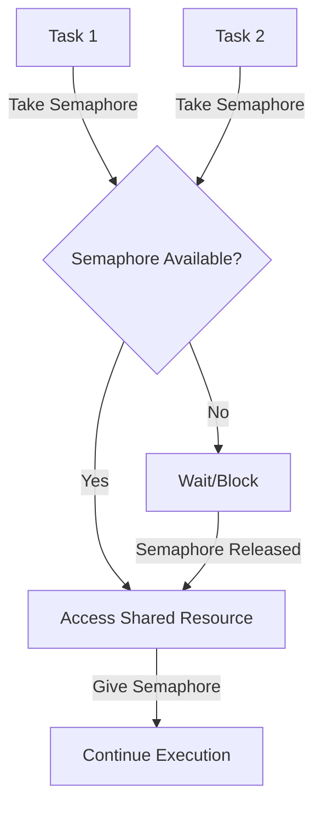
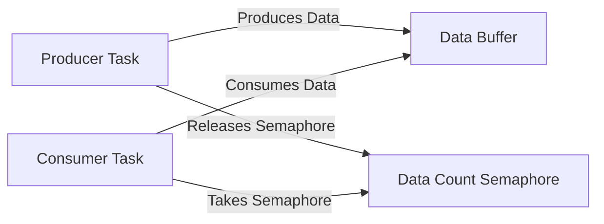
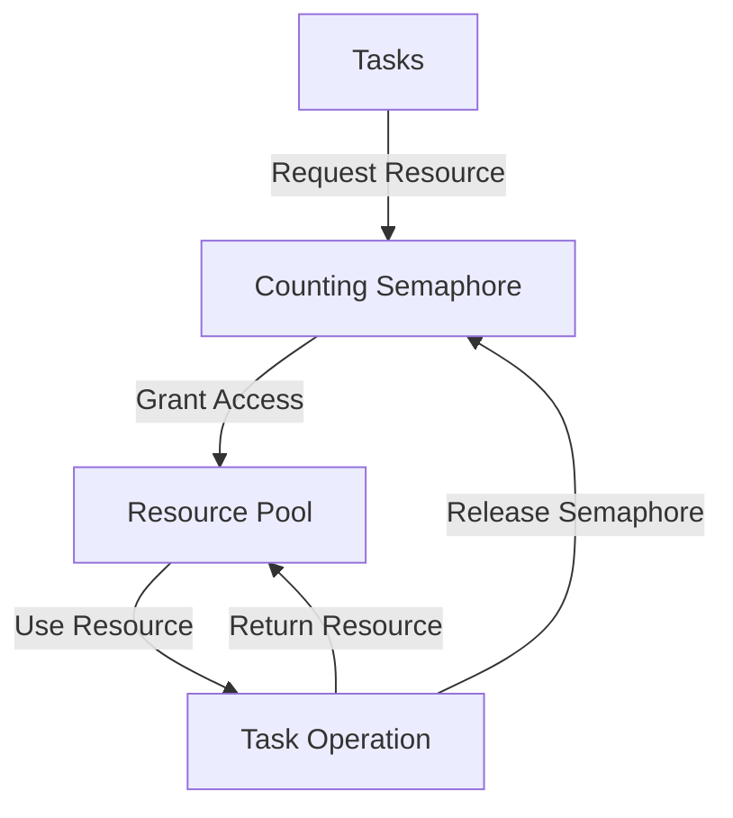
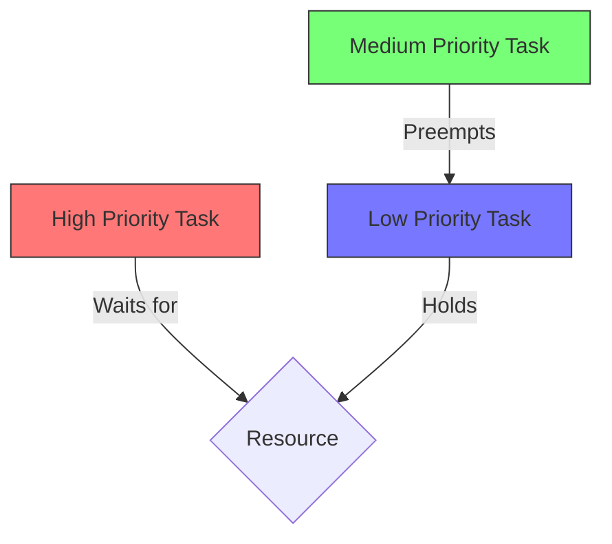

# STM32 Semaphores

## Introduction

Semaphores are powerful synchronization primitives that play a critical role in Real-Time Operating Systems (RTOS). When working with STM32 microcontrollers and an RTOS like FreeRTOS, understanding how to use semaphores effectively can help you prevent race conditions, manage shared resources, and coordinate tasks efficiently.

In this tutorial, you'll learn:
- What semaphores are and why they're important
- Types of semaphores available in STM32 RTOS environments
- How to create and use binary and counting semaphores
- Common patterns and real-world applications
- Best practices and potential pitfalls

## What Are Semaphores?

A semaphore is essentially a counter that can be used to synchronize access to shared resources or coordinate execution between multiple tasks. Think of a semaphore as a traffic light that controls when tasks can proceed.



Semaphores help prevent race conditions, which occur when multiple tasks access and modify shared data simultaneously, potentially leading to data corruption or unexpected behavior.

## Types of Semaphores in STM32 RTOS

When working with STM32 microcontrollers using FreeRTOS (the most common RTOS for these devices), you'll encounter two main types of semaphores:

1. **Binary Semaphores**: Can only have values 0 or 1. They're like a simple lock - either available (1) or unavailable (0).

2. **Counting Semaphores**: Can have values from 0 to a maximum count. They're useful when a resource has multiple instances available.

Additionally, you'll find a special type called a **Mutex** (Mutual Exclusion), which is similar to a binary semaphore but includes ownership and priority inheritance mechanisms to prevent priority inversion problems.

## Creating and Using Semaphores

Let's start by creating and using semaphores in an STM32 project with FreeRTOS.

### Setting Up Your Project

First, ensure you have:
1. STM32CubeIDE or your preferred development environment
2. FreeRTOS enabled in your project
3. CMSIS-RTOS API or FreeRTOS API configured

### Binary Semaphore Example

Here's how to create and use a binary semaphore:

```c
/* Include necessary headers */
#include "cmsis_os.h"

/* Declare the semaphore handle */
osSemaphoreId_t binarySemHandle;

/* This function initializes the semaphore */
void SemaphoreInit(void) {
  /* Create a binary semaphore */
  const osSemaphoreAttr_t binarySem_attributes = {
    .name = "BinarySemaphore",
    .attr_bits = 0,
    .cb_mem = NULL,
    .cb_size = 0
  };
  
  binarySemHandle = osSemaphoreNew(1, 1, &binarySem_attributes);
  
  if (binarySemHandle == NULL) {
    /* Semaphore creation failed */
    Error_Handler();
  }
}

/* Task that takes the semaphore */
void Task1(void *argument) {
  for(;;) {
    /* Try to acquire the semaphore with 100ms timeout */
    if (osSemaphoreAcquire(binarySemHandle, 100) == osOK) {
      /* We got the semaphore! Access protected resource */
      printf("Task1: Acquired semaphore and accessing resource...
");
      
      /* Simulate work being done */
      osDelay(200);
      
      /* Release the semaphore */
      osSemaphoreRelease(binarySemHandle);
      printf("Task1: Released semaphore
");
    } else {
      printf("Task1: Failed to acquire semaphore
");
    }
    
    osDelay(500); /* Delay before next attempt */
  }
}

/* Task that also needs access to the same resource */
void Task2(void *argument) {
  for(;;) {
    /* Try to acquire the semaphore with a longer timeout */
    if (osSemaphoreAcquire(binarySemHandle, 200) == osOK) {
      /* We got the semaphore! Access protected resource */
      printf("Task2: Acquired semaphore and accessing resource...
");
      
      /* Simulate work being done */
      osDelay(300);
      
      /* Release the semaphore */
      osSemaphoreRelease(binarySemHandle);
      printf("Task2: Released semaphore
");
    } else {
      printf("Task2: Failed to acquire semaphore
");
    }
    
    osDelay(700); /* Delay before next attempt */
  }
}
```

The example output might look like:

```
Task1: Acquired semaphore and accessing resource...
Task1: Released semaphore
Task2: Acquired semaphore and accessing resource...
Task2: Released semaphore
Task1: Acquired semaphore and accessing resource...
Task1: Released semaphore
Task1: Acquired semaphore and accessing resource...
Task1: Released semaphore
Task2: Acquired semaphore and accessing resource...
Task2: Released semaphore
```

Notice how only one task can access the resource at any given time.

### Counting Semaphore Example

Counting semaphores are useful when you have multiple instances of a resource, like a pool of buffers:

```c
/* Declare the semaphore handle */
osSemaphoreId_t countingSemHandle;

/* Define the number of available resources */
#define RESOURCE_COUNT 3

/* Resource pool (for example, communication buffers) */
uint8_t bufferPool[RESOURCE_COUNT][64];
bool bufferInUse[RESOURCE_COUNT] = {false};

/* This function initializes the counting semaphore */
void CountingSemaphoreInit(void) {
  /* Create a counting semaphore with maximum count of RESOURCE_COUNT */
  const osSemaphoreAttr_t countingSem_attributes = {
    .name = "CountingSemaphore",
    .attr_bits = 0,
    .cb_mem = NULL,
    .cb_size = 0
  };
  
  countingSemHandle = osSemaphoreNew(RESOURCE_COUNT, RESOURCE_COUNT, &countingSem_attributes);
  
  if (countingSemHandle == NULL) {
    /* Semaphore creation failed */
    Error_Handler();
  }
}

/* Find available buffer index */
int8_t GetAvailableBuffer(void) {
  for (int i = 0; i < RESOURCE_COUNT; i++) {
    if (!bufferInUse[i]) {
      bufferInUse[i] = true;
      return i;
    }
  }
  return -1; /* No buffer available (shouldn't happen with semaphore) */
}

/* Release a buffer */
void ReleaseBuffer(int8_t index) {
  if (index >= 0 && index < RESOURCE_COUNT) {
    bufferInUse[index] = false;
  }
}

/* Task that uses buffers from the pool */
void BufferUser(void *argument) {
  int8_t bufferIndex;
  
  for(;;) {
    /* Try to acquire a buffer */
    if (osSemaphoreAcquire(countingSemHandle, osWaitForever) == osOK) {
      /* Get an available buffer */
      bufferIndex = GetAvailableBuffer();
      
      printf("Task using buffer %d
", bufferIndex);
      
      /* Simulate using the buffer */
      osDelay(rand() % 1000 + 500);
      
      /* Release the buffer */
      ReleaseBuffer(bufferIndex);
      printf("Task released buffer %d
", bufferIndex);
      
      /* Release the semaphore */
      osSemaphoreRelease(countingSemHandle);
    }
    
    osDelay(200);
  }
}
```

With this setup, up to 3 tasks could acquire buffers simultaneously, but any additional tasks would have to wait until a buffer is released.

## Semaphores for Task Synchronization

Semaphores aren't just for resource protection—they're also excellent for synchronizing tasks:

```c
/* Semaphore for synchronization */
osSemaphoreId_t syncSemHandle;

/* Producer task */
void ProducerTask(void *argument) {
  uint32_t dataReady = 0;
  
  for(;;) {
    /* Produce some data */
    dataReady++;
    printf("Producer: Data #%lu is ready
", dataReady);
    
    /* Signal that data is ready */
    osSemaphoreRelease(syncSemHandle);
    
    /* Wait before producing more data */
    osDelay(1000);
  }
}

/* Consumer task */
void ConsumerTask(void *argument) {
  for(;;) {
    /* Wait for data to be ready */
    if (osSemaphoreAcquire(syncSemHandle, osWaitForever) == osOK) {
      /* Process the data */
      printf("Consumer: Processing data
");
      
      /* Simulate processing time */
      osDelay(500);
    }
  }
}

/* Initialization */
void SyncSemaphoreInit(void) {
  /* Create a binary semaphore, initialized to 0 (not available) */
  const osSemaphoreAttr_t syncSem_attributes = {
    .name = "SyncSemaphore",
    .attr_bits = 0,
    .cb_mem = NULL,
    .cb_size = 0
  };
  
  syncSemHandle = osSemaphoreNew(1, 0, &syncSem_attributes);
  
  if (syncSemHandle == NULL) {
    /* Semaphore creation failed */
    Error_Handler();
  }
}
```

In this example, the consumer will wait until the producer has data ready.

## Practical Applications

Let's look at some real-world applications of semaphores in STM32 RTOS projects:

### 1. Protecting Shared Hardware Resources

When multiple tasks need to use a shared hardware resource like SPI or I2C:

```c
/* SPI access semaphore */
osSemaphoreId_t spiSemHandle;

/* Initialize in setup */
spiSemHandle = osSemaphoreNew(1, 1, NULL);

/* Task that needs SPI access */
void SensorReadTask(void *argument) {
  for(;;) {
    /* Acquire exclusive SPI access */
    osSemaphoreAcquire(spiSemHandle, osWaitForever);
    
    /* Configure SPI for this sensor */
    SPI_Configure(SPI_SPEED_1MHZ, SPI_MODE0);
    
    /* Read from sensor */
    uint16_t sensorValue = SPI_ReadSensor();
    printf("Sensor value: %d
", sensorValue);
    
    /* Release SPI */
    osSemaphoreRelease(spiSemHandle);
    
    osDelay(1000);
  }
}

/* Another task that needs SPI access */
void DisplayUpdateTask(void *argument) {
  for(;;) {
    /* Prepare display data */
    PrepareDisplayData();
    
    /* Acquire exclusive SPI access */
    osSemaphoreAcquire(spiSemHandle, osWaitForever);
    
    /* Configure SPI for display */
    SPI_Configure(SPI_SPEED_10MHZ, SPI_MODE3);
    
    /* Update display */
    UpdateDisplay();
    
    /* Release SPI */
    osSemaphoreRelease(spiSemHandle);
    
    osDelay(50);
  }
}
```

### 2. Event Signaling from Interrupts

Semaphores are excellent for signaling tasks from interrupt handlers:

```c
/* Declare semaphore handle */
osSemaphoreId_t buttonSemHandle;

/* Button interrupt handler */
void EXTI0_IRQHandler(void) {
  /* Clear interrupt flag */
  HAL_GPIO_EXTI_IRQHandler(GPIO_PIN_0);
  
  /* Signal button press to waiting task from ISR */
  osSemaphoreRelease(buttonSemHandle);
}

/* Button handling task */
void ButtonTask(void *argument) {
  for(;;) {
    /* Wait for button press signal */
    osSemaphoreAcquire(buttonSemHandle, osWaitForever);
    
    /* Debounce */
    osDelay(20);
    
    /* Process button press */
    printf("Button pressed and debounced!
");
    
    /* Perform action based on button press */
    ToggleLED();
  }
}

/* Init function */
void ButtonSemaphoreInit(void) {
  /* Create binary semaphore initialized to 0 */
  buttonSemHandle = osSemaphoreNew(1, 0, NULL);
}
```

This approach is much more power-efficient than polling the button state in a loop.

## Common Patterns and Best Practices

### Producer-Consumer Pattern

The producer-consumer pattern is one of the most common uses for semaphores:



### Resource Pool Management

When you have multiple identical resources (like communication buffers), counting semaphores are ideal:



### Best Practices

1. **Keep Critical Sections Short**: The time between acquiring and releasing a semaphore should be as short as possible.

2. **Avoid Deadlocks**: Be careful when using multiple semaphores—always acquire them in the same order in different tasks.

3. **Use Timeouts**: Never use `osWaitForever` in production code unless you're absolutely certain the semaphore will eventually be released.

4. **Consider Mutex for Ownership**: If you need ownership tracking or priority inheritance, use a mutex instead of a binary semaphore.

5. **Be Careful with ISRs**: In interrupt service routines, use the "FromISR" versions of semaphore functions:

```c
void UART_IRQHandler(void) {
  /* Clear interrupt flags */
  HAL_UART_IRQHandler(&huart2);
  
  /* Check if we have received data */
  if (rxComplete) {
    /* Signal from ISR using the FromISR version */
    BaseType_t higherPriorityTaskWoken = pdFALSE;
    xSemaphoreGiveFromISR(uartSemaphore, &higherPriorityTaskWoken);
    
    /* If a higher priority task was woken, request context switch */
    portYIELD_FROM_ISR(higherPriorityTaskWoken);
  }
}
```

## Common Pitfalls

### 1. Semaphore Leakage

Taking a semaphore but forgetting to release it:

```c
/* Wrong approach */
void BadTask(void *argument) {
  for(;;) {
    if (osSemaphoreAcquire(semaphore, 100) == osOK) {
      /* Access resource */
      
      if (errorCondition) {
        /* Oops! We return without releasing the semaphore */
        continue;  
      }
      
      /* Normal path releases semaphore */
      osSemaphoreRelease(semaphore);
    }
    osDelay(100);
  }
}

/* Better approach */
void GoodTask(void *argument) {
  for(;;) {
    if (osSemaphoreAcquire(semaphore, 100) == osOK) {
      /* Access resource */
      
      /* ALWAYS release the semaphore, even in error paths */
      osSemaphoreRelease(semaphore);
    }
    osDelay(100);
  }
}
```

### 2. Priority Inversion

When using binary semaphores without priority inheritance:



Solution: Use mutex (with priority inheritance) instead of binary semaphore for resource protection.

### 3. Starvation

When a high-priority task constantly takes a semaphore, lower-priority tasks might never get it:

```c
/* High priority task that might cause starvation */
void HighPriorityTask(void *argument) {
  for(;;) {
    osSemaphoreAcquire(sharedSemaphore, osWaitForever);
    /* Use resource */
    osSemaphoreRelease(sharedSemaphore);
    
    /* Very short delay before needing resource again */
    osDelay(10);  
  }
}

/* Low priority task that might starve */
void LowPriorityTask(void *argument) {
  for(;;) {
    /* This task might never get the semaphore */
    if (osSemaphoreAcquire(sharedSemaphore, 1000) == osOK) {
      /* Use resource */
      osSemaphoreRelease(sharedSemaphore);
    } else {
      printf("Starving! Couldn't get semaphore for 1 second
");
    }
    
    osDelay(100);
  }
}
```

## Summary

Semaphores are essential synchronization primitives in STM32 RTOS applications. They help you:

- Protect shared resources from concurrent access
- Synchronize multiple tasks
- Signal events between tasks or from interrupts to tasks
- Manage pools of resources efficiently

Understanding the differences between binary semaphores, counting semaphores, and mutexes allows you to choose the right tool for each synchronization problem. Remember to keep critical sections short, always release semaphores after acquiring them, and be mindful of potential issues like priority inversion and starvation.

## Exercises

1. Create a simple project with two tasks that blink different LEDs and use a semaphore to ensure they never blink simultaneously.

2. Implement a producer-consumer pattern where one task generates random numbers and another processes them, using a semaphore for synchronization.

3. Use a counting semaphore to manage a pool of three buffers that multiple tasks can request and release.

4. Modify an existing interrupt-driven UART receive example to use a semaphore for signaling the reception task instead of polling.

5. Create a resource manager that uses multiple semaphores and implements priority inheritance to avoid priority inversion.

## Additional Resources

- [FreeRTOS Semaphore Documentation](https://www.freertos.org/Embedded-RTOS-Binary-Semaphores.html)
- [STM32 HAL CMSIS-RTOS2 Documentation](https://www.st.com/resource/en/user_manual/dm00105262-cmsis-rtos-api-description-stmicroelectronics-stm32cube-mcu-package-stmicroelectronics.pdf)
- [Mastering the FreeRTOS Real Time Kernel - a Hands On Tutorial Guide](https://www.freertos.org/Documentation/RTOS_book.html)
- [STM32 Community Forums](https://community.st.com/s/)

Remember that effective use of semaphores comes with practice. Start with simple examples and gradually build up to more complex synchronization scenarios as you become comfortable with the concepts.