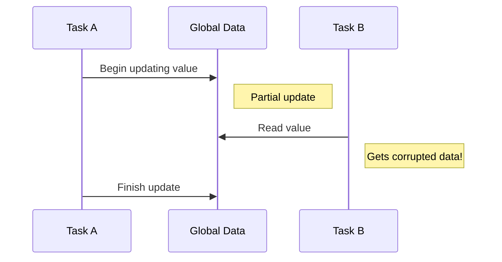
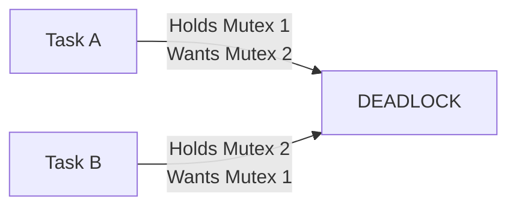
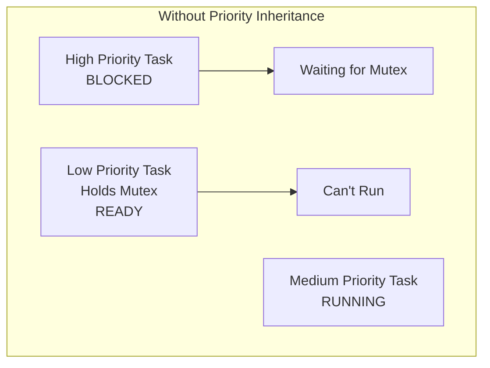
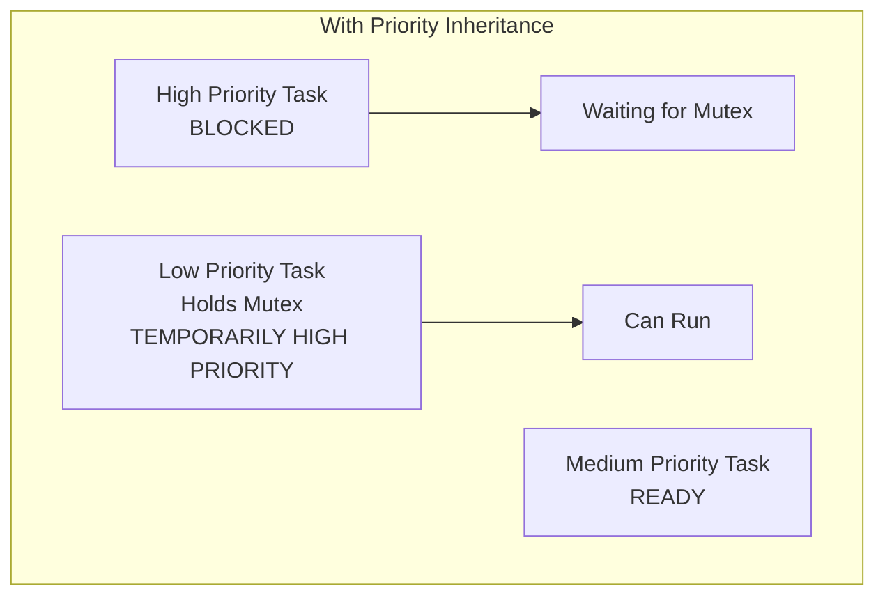

# STM32 Mutexes

## Introduction

When developing multi-threaded applications on STM32 microcontrollers using a Real-Time Operating System (RTOS), you'll often face scenarios where multiple tasks need to access shared resources. This shared access can lead to **race conditions** - unpredictable behavior that occurs when tasks compete to access or modify the same data simultaneously.

**Mutexes** (short for "mutual exclusion") are synchronization primitives that solve this problem by ensuring that only one task can access a shared resource at any given time. Think of a mutex as a key - only the task holding the key can access the protected resource, while other tasks must wait until the key becomes available.

In this tutorial, we'll explore how to use mutexes in STM32 microcontrollers with popular RTOS options like FreeRTOS and CMSIS-RTOS.

## Why Do We Need Mutexes?

Before diving into implementation, let's understand the problem mutexes solve with a simple example:

Imagine two tasks in your STM32 application:
- Task A reads a sensor value and updates a global variable
- Task B reads the global variable and sends it via UART

Without proper synchronization, Task B might read the global variable while Task A is in the middle of updating it, resulting in corrupted or inconsistent data.



A mutex prevents this scenario by making one task wait while another is accessing the shared resource.

## Mutex Basics

A mutex has two fundamental operations:
- **Lock** (or "take"): Acquire exclusive access to the resource
- **Unlock** (or "give"): Release the resource so other tasks can use it

In practice, you would:
1. Create a mutex during system initialization
2. Lock the mutex before accessing a shared resource
3. Unlock the mutex after you're done with the resource

## Implementing Mutexes in STM32 with FreeRTOS

FreeRTOS is one of the most popular RTOS choices for STM32 microcontrollers. Here's how to implement mutexes using FreeRTOS:

### Step 1: Including Required Headers

```c
#include "FreeRTOS.h"
#include "task.h"
#include "semphr.h" // Contains mutex functionality
```

### Step 2: Defining the Mutex Handle

```c
// Global mutex handle
SemaphoreHandle_t myMutex;

// Shared resource to protect
volatile int sharedSensorValue = 0;
```

### Step 3: Creating the Mutex

```c
void initApp(void) {
    // Create the mutex
    myMutex = xSemaphoreCreateMutex();
    
    if (myMutex == NULL) {
        // Mutex creation failed, handle error
        Error_Handler();
    }
    
    // Rest of your initialization code
}
```

### Step 4: Using the Mutex in Tasks

```c
void SensorTask(void *pvParameters) {
    int localSensorValue;
    
    while (1) {
        // Read from sensor (simulated here)
        localSensorValue = readSensor();
        
        // Lock the mutex before accessing shared resource
        if (xSemaphoreTake(myMutex, portMAX_DELAY) == pdTRUE) {
            // Critical section - we have exclusive access
            sharedSensorValue = localSensorValue;
            
            // Unlock the mutex
            xSemaphoreGive(myMutex);
        }
        
        // Task delay
        vTaskDelay(pdMS_TO_TICKS(100));
    }
}

void UartTask(void *pvParameters) {
    int valueToTransmit;
    
    while (1) {
        // Lock the mutex before accessing shared resource
        if (xSemaphoreTake(myMutex, portMAX_DELAY) == pdTRUE) {
            // Critical section - we have exclusive access
            valueToTransmit = sharedSensorValue;
            
            // Unlock the mutex
            xSemaphoreGive(myMutex);
        }
        
        // Use the safely retrieved value
        transmitUart(valueToTransmit);
        
        // Task delay
        vTaskDelay(pdMS_TO_TICKS(200));
    }
}
```

### Important Parameters to Understand

In the `xSemaphoreTake()` function, the second parameter (`portMAX_DELAY`) specifies the maximum time to wait for the mutex if it's already taken. Options include:

- `0`: Don't wait at all (non-blocking)
- `portMAX_DELAY`: Wait indefinitely
- Any other value: Wait for the specified number of ticks

## Implementing Mutexes with CMSIS-RTOS v2

If you're using CMSIS-RTOS (which is often used with STM32CubeIDE), the implementation is slightly different:

### Step 1: Including Required Headers

```c
#include "cmsis_os2.h"
```

### Step 2: Defining the Mutex ID

```c
// Mutex ID
osMutexId_t myMutexId;

// Mutex attributes
const osMutexAttr_t myMutex_attributes = {
    .name = "SharedResourceMutex",
    .attr_bits = osMutexPrioInherit,  // Enable priority inheritance
    .cb_mem = NULL,
    .cb_size = 0U
};

// Shared resource to protect
volatile int sharedSensorValue = 0;
```

### Step 3: Creating the Mutex

```c
void initApp(void) {
    // Create the mutex
    myMutexId = osMutexNew(&myMutex_attributes);
    
    if (myMutexId == NULL) {
        // Mutex creation failed, handle error
        Error_Handler();
    }
    
    // Rest of your initialization code
}
```

### Step 4: Using the Mutex in Tasks

```c
void SensorTask(void *argument) {
    int localSensorValue;
    
    while (1) {
        // Read from sensor (simulated here)
        localSensorValue = readSensor();
        
        // Lock the mutex before accessing shared resource
        if (osMutexAcquire(myMutexId, osWaitForever) == osOK) {
            // Critical section - we have exclusive access
            sharedSensorValue = localSensorValue;
            
            // Unlock the mutex
            osMutexRelease(myMutexId);
        }
        
        // Task delay
        osDelay(100);
    }
}

void UartTask(void *argument) {
    int valueToTransmit;
    
    while (1) {
        // Lock the mutex before accessing shared resource
        if (osMutexAcquire(myMutexId, osWaitForever) == osOK) {
            // Critical section - we have exclusive access
            valueToTransmit = sharedSensorValue;
            
            // Unlock the mutex
            osMutexRelease(myMutexId);
        }
        
        // Use the safely retrieved value
        transmitUart(valueToTransmit);
        
        // Task delay
        osDelay(200);
    }
}
```

## Common Pitfalls and Best Practices

### 1. Deadlocks

A **deadlock** occurs when two or more tasks are waiting for each other to release resources, resulting in all tasks being blocked indefinitely.



**Prevention:**
- Always acquire mutexes in the same order across all tasks
- Use timeouts instead of waiting indefinitely
- Implement deadlock detection mechanisms

### 2. Priority Inversion

**Priority inversion** happens when a high-priority task is blocked waiting for a mutex held by a low-priority task, but the low-priority task can't run because a medium-priority task is running.



**Solution:** Use priority inheritance (which is enabled by default in CMSIS-RTOS):



### 3. Mutex Leaking

Always ensure that for every `take/acquire` operation, there's a corresponding `give/release` operation. Failing to release a mutex will prevent other tasks from accessing the protected resource.

### 4. Minimize Critical Section Duration

Keep the code inside the mutex lock/unlock as short as possible to minimize blocking time for other tasks.

## Practical Example: Protected UART Communication

Here's a practical example that uses a mutex to protect access to a UART peripheral when multiple tasks need to send data:

```c
// UART mutex
SemaphoreHandle_t uartMutex;

// Initialize UART and mutex
void initUart(void) {
    // Initialize UART hardware
    MX_USART2_UART_Init();
    
    // Create mutex for UART access
    uartMutex = xSemaphoreCreateMutex();
}

// Safe UART transmit function
void safeUartTransmit(uint8_t *data, uint16_t size) {
    // Acquire mutex with timeout
    if (xSemaphoreTake(uartMutex, pdMS_TO_TICKS(100)) == pdTRUE) {
        // We have exclusive access to UART
        HAL_UART_Transmit(&huart2, data, size, 100);
        
        // Release mutex
        xSemaphoreGive(uartMutex);
    } else {
        // Could not get mutex in time, handle error
        errorCount++;
    }
}

// Task 1: Periodic sensor data transmission
void SensorReportTask(void *pvParameters) {
    uint8_t buffer[50];
    uint16_t len;
    
    while (1) {
        // Prepare sensor data
        len = snprintf((char *)buffer, sizeof(buffer), 
                      "Temperature: %.1f C\r
", readTemperature());
        
        // Safely transmit using protected function
        safeUartTransmit(buffer, len);
        
        // Wait before next transmission
        vTaskDelay(pdMS_TO_TICKS(500));
    }
}

// Task 2: Button event reporting
void ButtonTask(void *pvParameters) {
    uint8_t buffer[50];
    uint16_t len;
    
    while (1) {
        // Wait for button press
        waitForButtonPress();
        
        // Prepare button event message
        len = snprintf((char *)buffer, sizeof(buffer), 
                      "Button pressed at %lu ms\r
", HAL_GetTick());
        
        // Safely transmit using protected function
        safeUartTransmit(buffer, len);
    }
}
```

In this example, both tasks need to send data over the same UART peripheral. The mutex ensures that one task's transmission doesn't interfere with another's.

## Recursive Mutexes

Sometimes, you may need a function that holds a mutex to call another function that also tries to take the same mutex. Regular mutexes would deadlock in this scenario. **Recursive mutexes** solve this problem by allowing the same task to take the mutex multiple times (as long as it releases it the same number of times).

### FreeRTOS Implementation:

```c
// Create a recursive mutex
SemaphoreHandle_t recursiveMutex = xSemaphoreCreateRecursiveMutex();

void parentFunction(void) {
    // Take the mutex
    xSemaphoreTakeRecursive(recursiveMutex, portMAX_DELAY);
    
    // Do something
    // ...
    
    // Call child function which also takes the same mutex
    childFunction();
    
    // Release the mutex
    xSemaphoreGiveRecursive(recursiveMutex);
}

void childFunction(void) {
    // Take the mutex again (would deadlock with regular mutex)
    xSemaphoreTakeRecursive(recursiveMutex, portMAX_DELAY);
    
    // Do something else
    // ...
    
    // Release the mutex
    xSemaphoreGiveRecursive(recursiveMutex);
}
```

### CMSIS-RTOS Implementation:

```c
// Mutex attributes with recursive capability
const osMutexAttr_t recursiveMutex_attributes = {
    .name = "RecursiveMutex",
    .attr_bits = osMutexRecursive | osMutexPrioInherit,
    .cb_mem = NULL,
    .cb_size = 0U
};

// Create the recursive mutex
osMutexId_t recursiveMutexId = osMutexNew(&recursiveMutex_attributes);
```

## Mutex vs. Semaphore: Understanding the Difference

Beginners often confuse mutexes with semaphores. Here's a quick comparison:

- **Mutex**: Used for mutual exclusion (resource protection). Only the task that takes the mutex can release it.
- **Semaphore**: Used for signaling between tasks and synchronization. Any task can release a semaphore.

Think of a mutex as a key to a room that must be returned by the person who took it, while a semaphore is more like a counter of available resources.

## Summary

Mutexes are essential tools for ensuring safe access to shared resources in multi-threaded STM32 RTOS applications. In this tutorial, we've covered:

- The concept of mutexes and why they're needed
- How to implement mutexes in FreeRTOS and CMSIS-RTOS
- Common pitfalls and best practices
- Practical examples of mutex usage
- The difference between recursive and standard mutexes

By properly implementing mutexes in your STM32 applications, you'll prevent race conditions and ensure data consistency between tasks.

## Further Exercises

1. **Basic:** Modify the UART example to add a third task that periodically sends status information.
2. **Intermediate:** Implement a system with two mutexes and ensure they are always acquired in the same order to prevent deadlocks.
3. **Advanced:** Create a data logging system where multiple sensor tasks write to a shared circular buffer, and a single task reads from the buffer and writes to flash storage. Use mutexes to protect the buffer access.

## Additional Resources

- [FreeRTOS Mutex Documentation](https://www.freertos.org/Real-time-embedded-RTOS-mutexes.html)
- [CMSIS-RTOS v2 Documentation](https://arm-software.github.io/CMSIS_5/RTOS2/html/group__CMSIS__RTOS__MutexMgmt.html)
- [STM32 HAL Documentation](https://www.st.com/resource/en/user_manual/dm00105879-description-of-stm32f4-hal-and-ll-drivers-stmicroelectronics.pdf)