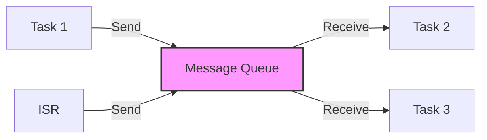

# STM32 Message Queues

## Introduction

Message queues are one of the most important inter-task communication mechanisms in real-time operating systems (RTOS). They allow tasks to exchange data safely in a multitasking environment, ensuring proper synchronization without the risks associated with shared memory access.

In this tutorial, we'll explore how to implement and use message queues in STM32 microcontrollers using FreeRTOS. Message queues provide a clean and efficient way for tasks to communicate, making your embedded applications more robust and maintainable.

## What Are Message Queues?

A message queue is a FIFO (First In, First Out) data structure that allows tasks or interrupt service routines (ISRs) to send messages to each other. These messages can be of fixed size and can contain any type of data, from simple integers to complex structures.



Key benefits of message queues include:

- **Thread-safe communication**: Tasks can exchange data without race conditions
- **Decoupling**: Sender and receiver tasks don't need to know about each other
- **Buffering**: Multiple messages can be stored until the receiver is ready
- **Synchronization**: Tasks can block until messages are available

## Creating a Message Queue in STM32 with FreeRTOS

Let's start by creating a simple message queue. In FreeRTOS, we use the `xQueueCreate()` function:

```c
// Queue handle declaration
QueueHandle_t myQueue;

// In your initialization function
void initQueue(void) {
    // Create a queue that can hold 5 integers
    myQueue = xQueueCreate(5, sizeof(uint32_t));
    
    if (myQueue == NULL) {
        // Queue creation failed, handle error
        Error_Handler();
    }
}
```

Let's break down the parameters:

- The first parameter (`5`) is the queue length - the maximum number of items the queue can hold
- The second parameter (`sizeof(uint32_t)`) is the size of each item in bytes

## Sending Data to a Queue

Once we have created a queue, we can send data to it using `xQueueSend()` or `xQueueSendToBack()` (they are equivalent):

```c
void sendToQueue(void) {
    uint32_t valueToSend = 42;
    BaseType_t status;
    
    // Send to the back of the queue
    status = xQueueSend(myQueue, &valueToSend, pdMS_TO_TICKS(100));
    
    if (status == pdPASS) {
        // Message was successfully sent
        printf("Sent value: %lu\r
", valueToSend);
    } else {
        // Failed to send (queue full and timeout expired)
        printf("Failed to send: Queue full\r
");
    }
}
```

The parameters are:
- The queue handle
- A pointer to the data to send
- The maximum time to wait if the queue is full (timeout)

If you're sending from an ISR, you should use `xQueueSendFromISR()` instead:

```c
void HAL_GPIO_EXTI_Callback(uint16_t GPIO_Pin) {
    uint32_t valueToSend = 99;
    BaseType_t higherPriorityTaskWoken = pdFALSE;
    
    // Send to queue from ISR
    xQueueSendFromISR(myQueue, &valueToSend, &higherPriorityTaskWoken);
    
    // If sending to the queue unblocked a higher priority task, perform a context switch
    portYIELD_FROM_ISR(higherPriorityTaskWoken);
}
```

## Receiving Data from a Queue

To receive data from a queue, we use `xQueueReceive()`:

```c
void receiveFromQueue(void) {
    uint32_t receivedValue;
    BaseType_t status;
    
    // Try to receive from the queue, waiting for up to 200ms
    status = xQueueReceive(myQueue, &receivedValue, pdMS_TO_TICKS(200));
    
    if (status == pdPASS) {
        // Message was successfully received
        printf("Received value: %lu\r
", receivedValue);
    } else {
        // Timeout expired without receiving a message
        printf("No message received: Queue empty or timeout\r
");
    }
}
```

Similar to sending, if you need to receive from an ISR, use `xQueueReceiveFromISR()`.

## Practical Example: Temperature Monitoring System

Let's implement a practical example of a temperature monitoring system with two tasks:

1. A sensor task that reads temperature values and sends them to a queue
2. A processing task that receives temperature readings and triggers alerts if needed

First, we'll define our structures and handles:

```c
// Define a temperature message structure
typedef struct {
    float temperature;
    uint32_t timestamp;
} TemperatureMessage_t;

// Queue handle
QueueHandle_t temperatureQueue;

// Task handles
TaskHandle_t sensorTaskHandle;
TaskHandle_t processingTaskHandle;
```

Now, let's implement the sensor task:

```c
void SensorTask(void *pvParameters) {
    TemperatureMessage_t message;
    
    // Initialize the ADC for temperature readings
    MX_ADC1_Init();
    
    for (;;) {
        // Read temperature from sensor (simplified)
        float rawValue = readADC();
        message.temperature = (rawValue * 3.3 / 4096) * 100.0f - 50.0f; // Convert to Celsius
        message.timestamp = HAL_GetTick();
        
        // Send to queue, wait up to 10 ticks if queue is full
        if (xQueueSend(temperatureQueue, &message, pdMS_TO_TICKS(10)) != pdPASS) {
            // Handle queue full situation
            printf("Warning: Temperature queue full!\r
");
        }
        
        // Read sensor every 500ms
        vTaskDelay(pdMS_TO_TICKS(500));
    }
}
```

And the processing task:

```c
void ProcessingTask(void *pvParameters) {
    TemperatureMessage_t message;
    const float TEMP_THRESHOLD = 35.0f;
    
    for (;;) {
        // Wait indefinitely for a temperature reading
        if (xQueueReceive(temperatureQueue, &message, portMAX_DELAY) == pdPASS) {
            // Process the temperature reading
            printf("Temperature: %.1f°C (Time: %lu ms)\r
", 
                   message.temperature, message.timestamp);
            
            // Check if temperature exceeds threshold
            if (message.temperature > TEMP_THRESHOLD) {
                // Trigger alert
                HAL_GPIO_WritePin(ALERT_LED_GPIO_Port, ALERT_LED_Pin, GPIO_PIN_SET);
                printf("ALERT: High temperature detected!\r
");
            } else {
                HAL_GPIO_WritePin(ALERT_LED_GPIO_Port, ALERT_LED_Pin, GPIO_PIN_RESET);
            }
        }
    }
}
```

In the main function, we initialize everything:

```c
int main(void) {
    /* MCU Configuration */
    HAL_Init();
    SystemClock_Config();
    MX_GPIO_Init();
    
    /* Create the queue before creating the tasks */
    temperatureQueue = xQueueCreate(10, sizeof(TemperatureMessage_t));
    
    if (temperatureQueue == NULL) {
        Error_Handler();
    }
    
    /* Create the tasks */
    xTaskCreate(SensorTask, "SensorTask", 256, NULL, 2, &sensorTaskHandle);
    xTaskCreate(ProcessingTask, "ProcessingTask", 256, NULL, 1, &processingTaskHandle);
    
    /* Start the scheduler */
    vTaskStartScheduler();
    
    /* We should never get here as control is now with the scheduler */
    for (;;);
}
```

## Advanced Queue Techniques

### Peeking at Queue Data

Sometimes you may want to examine the data in a queue without removing it. For this, FreeRTOS provides `xQueuePeek()`:

```c
TemperatureMessage_t message;

// Peek at the front item without removing it
if (xQueuePeek(temperatureQueue, &message, pdMS_TO_TICKS(100)) == pdPASS) {
    printf("Next temperature in queue: %.1f°C\r
", message.temperature);
} else {
    printf("No items in the queue to peek\r
");
}
```

### Checking Queue Status

You can check the status of a queue without interacting with its contents:

```c
// Get the number of items in the queue
UBaseType_t queueItems = uxQueueMessagesWaiting(temperatureQueue);
printf("Queue contains %lu messages\r
", queueItems);

// Check how much space is available
UBaseType_t spaceAvailable = uxQueueSpacesAvailable(temperatureQueue);
printf("Queue has space for %lu more messages\r
", spaceAvailable);
```

### Reset a Queue

If you need to clear all items from a queue:

```c
// Remove all items from the queue
xQueueReset(temperatureQueue);
printf("Queue has been reset\r
");
```

## Using Queues with Structures

In our example above, we used a structure to send more complex data. This is a common pattern in embedded systems. Here's another example using a command structure:

```c
typedef enum {
    CMD_LED_ON,
    CMD_LED_OFF,
    CMD_READ_SENSOR,
    CMD_SEND_REPORT
} CommandType_t;

typedef struct {
    CommandType_t type;
    uint32_t parameter;
    bool requireResponse;
} Command_t;

QueueHandle_t commandQueue;

// In your sending task
void sendCommand(CommandType_t type, uint32_t param, bool needsResponse) {
    Command_t cmd;
    cmd.type = type;
    cmd.parameter = param;
    cmd.requireResponse = needsResponse;
    
    xQueueSend(commandQueue, &cmd, pdMS_TO_TICKS(10));
}

// Example usage
void buttonPressedCallback(void) {
    // Send command to turn on LED 2 with no response needed
    sendCommand(CMD_LED_ON, 2, false);
}
```

## Common Pitfalls and Best Practices

### 1. Queue Sizing

When determining the size of your queue, consider:
- The frequency of messages being sent
- The processing time of the receiving task
- Memory constraints of your device

A queue that's too small will result in missed messages; one that's too large wastes memory.

### 2. Blocking vs. Non-blocking Operations

Consider whether your tasks should block when the queue is full/empty:

```c
// Non-blocking (returns immediately if queue full)
xQueueSend(myQueue, &value, 0);

// Blocking with timeout (waits up to 100ms)
xQueueSend(myQueue, &value, pdMS_TO_TICKS(100));

// Blocking indefinitely (waits until space available)
xQueueSend(myQueue, &value, portMAX_DELAY);
```

### 3. Priority Inversion

Be aware that using queues can lead to priority inversion, where a high-priority task waits for a low-priority task. FreeRTOS's queue implementation helps mitigate this, but it's still something to consider in your design.

### 4. ISR Safety

Always use the ISR-specific functions (`...FromISR()`) when sending or receiving from interrupts. Failure to do so can cause system crashes or unpredictable behavior.

### 5. Memory Management

Remember that queues make copies of the data you send. For large data structures, consider sending pointers instead:

```c
typedef struct {
    uint8_t data[1024];  // Large data buffer
    uint32_t dataLength;
} LargeMessage_t;

// Queue for pointers instead of the actual struct
QueueHandle_t largeDataQueue = xQueueCreate(5, sizeof(LargeMessage_t*));

// In sending task
void sendLargeData(void) {
    // Allocate from heap (make sure to free in receiver)
    LargeMessage_t* message = pvPortMalloc(sizeof(LargeMessage_t));
    
    if (message != NULL) {
        // Fill the message
        fillMessageData(message);
        
        // Send pointer to the queue
        xQueueSend(largeDataQueue, &message, pdMS_TO_TICKS(10));
    }
}

// In receiving task
void receiveLargeData(void) {
    LargeMessage_t* receivedMsg;
    
    if (xQueueReceive(largeDataQueue, &receivedMsg, portMAX_DELAY) == pdPASS) {
        // Process the message
        processMessage(receivedMsg);
        
        // Free the memory when done
        vPortFree(receivedMsg);
    }
}
```

## Summary

Message queues are a powerful and flexible tool for inter-task communication in RTOS applications on STM32 microcontrollers. They provide:

- Thread-safe data exchange
- Synchronization between tasks
- Decoupling of sender and receiver
- Buffering of messages

In this tutorial, we've covered the basics of creating, sending to, and receiving from queues. We've also explored a practical temperature monitoring example and discussed advanced techniques and best practices.

By using message queues effectively, you can create more robust and maintainable embedded applications that take full advantage of RTOS capabilities.

## Exercises

1. Modify the temperature monitoring example to add a third task that logs temperature data to flash memory.

2. Create a command processor system using a queue that can handle different types of commands sent from multiple sources.

3. Implement a message queue that handles variable-sized messages using the pointer technique described in the best practices section.

4. Add error handling and retry logic to the queue operations in the examples.

5. Design a system that uses multiple queues to implement a priority-based message processing system.

## Additional Resources

- [FreeRTOS Queue Documentation](https://www.freertos.org/Embedded-RTOS-Queues.html)
- [ST Microelectronics STM32 Reference](https://www.st.com/en/microcontrollers-microprocessors/stm32-32-bit-arm-cortex-mcus.html)
- [ARM Cortex-M Programming Guide](https://developer.arm.com/documentation/dui0552/latest/)

Happy coding with STM32 and FreeRTOS message queues!