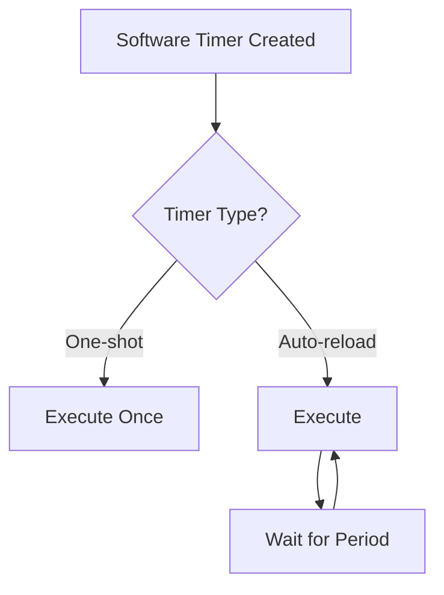

# STM32 Software Timers

## Introduction

Software timers are essential components in embedded systems that allow you to execute specific functions at predetermined intervals without blocking the main program execution. Unlike hardware timers that are physically implemented in the microcontroller's silicon, software timers are managed by the operating system and provide a more flexible approach to timing operations.

In RTOS-based STM32 applications, software timers offer several advantages:

- They don't consume hardware timer resources
- They execute in the context of the timer service task
- They can be created, modified, and deleted at runtime
- They provide a clean way to implement periodic tasks

This guide will walk you through understanding, implementing, and using software timers in STM32 microcontrollers with FreeRTOS.

## Understanding Software Timers

Software timers are virtual timing mechanisms managed by the RTOS. When you create a software timer, you're essentially asking the RTOS to call a specific function (callback) after a defined period.

### Types of Software Timers

There are two main types of software timers:

1. **One-shot timers**: Execute only once after the specified period
2. **Auto-reload timers**: Execute repeatedly at the specified interval



### Timer Service Task

All timer callbacks execute within a special RTOS task called the Timer Service Task (or Daemon Task). This is important to understand because:

- Timer callbacks don't interrupt other tasks
- Timer callbacks share the same priority (the priority of the timer service task)
- Long-running callbacks can delay other timers

## Implementing Software Timers in STM32 with FreeRTOS

Let's see how to implement and use software timers in an STM32 project using FreeRTOS.

### Configuration

Before using software timers, make sure they're enabled in your FreeRTOS configuration:

```c
/* in FreeRTOSConfig.h */
#define configUSE_TIMERS                    1
#define configTIMER_TASK_PRIORITY           ( 2 )  /* Medium priority */
#define configTIMER_QUEUE_LENGTH            10
#define configTIMER_TASK_STACK_DEPTH        256
```

### Creating a Software Timer

Here's how to create a software timer:

```c
/* Timer handle */
TimerHandle_t myTimer;

/* Timer callback function */
void myTimerCallback(TimerHandle_t xTimer) {
    /* This code will execute when the timer expires */
    HAL_GPIO_TogglePin(GPIOA, GPIO_PIN_5);  // Toggle LED
}

/* In your initialization code */
void initializeTimer(void) {
    /* Create a one-shot timer that expires after 1000 ticks */
    myTimer = xTimerCreate(
        "MyTimer",                  /* Name for debugging */
        pdMS_TO_TICKS(1000),        /* Period in ticks */
        pdFALSE,                    /* Auto-reload (pdFALSE = one-shot, pdTRUE = periodic) */
        0,                          /* Timer ID (used to identify timer in callback) */
        myTimerCallback             /* Callback function */
    );
    
    if (myTimer == NULL) {
        /* Timer creation failed, handle error */
    } else {
        /* Start the timer */
        if (xTimerStart(myTimer, 0) != pdPASS) {
            /* Failed to start timer, handle error */
        }
    }
}
```

### Common Timer Operations

Here are the most common operations you can perform with software timers:

#### Starting a Timer

```c
/* Start timer with 10 ticks of timeout if needed */
xTimerStart(myTimer, pdMS_TO_TICKS(10));
```

#### Stopping a Timer

```c
/* Stop the timer with 10 ticks timeout if needed */
xTimerStop(myTimer, pdMS_TO_TICKS(10));
```

#### Changing Timer Period

```c
/* Change timer period to 2000 ms */
xTimerChangePeriod(myTimer, pdMS_TO_TICKS(2000), pdMS_TO_TICKS(10));
```

#### Resetting a Timer

```c
/* Reset the timer (restart from beginning) with 10 ticks timeout */
xTimerReset(myTimer, pdMS_TO_TICKS(10));
```

#### Deleting a Timer

```c
/* Delete the timer when no longer needed */
xTimerDelete(myTimer, pdMS_TO_TICKS(100));
```

## Practical Examples

Let's explore some practical examples of using software timers in real-world STM32 applications.

### Example 1: LED Blinker with Different Patterns

This example uses a software timer to implement different LED blinking patterns that can be changed at runtime:

```c
/* Global variables */
TimerHandle_t ledTimer;
uint8_t currentPattern = 0;
const uint32_t patterns[] = {500, 1000, 100};  // Different blink intervals in ms

/* LED Timer callback */
void ledTimerCallback(TimerHandle_t xTimer) {
    HAL_GPIO_TogglePin(GPIOA, GPIO_PIN_5);  // Toggle LED
}

/* Function to change blink pattern */
void changeBlinkPattern(uint8_t patternId) {
    if (patternId < sizeof(patterns)/sizeof(patterns[0])) {
        currentPattern = patternId;
        
        /* Change the timer period */
        xTimerChangePeriod(
            ledTimer, 
            pdMS_TO_TICKS(patterns[currentPattern]), 
            pdMS_TO_TICKS(100)
        );
    }
}

/* Initialization */
void initLedTimer(void) {
    /* Create an auto-reload timer (periodic) */
    ledTimer = xTimerCreate(
        "LedTimer",
        pdMS_TO_TICKS(patterns[currentPattern]),
        pdTRUE,                     /* Auto-reload */
        0,
        ledTimerCallback
    );
    
    if (ledTimer != NULL) {
        xTimerStart(ledTimer, pdMS_TO_TICKS(100));
    }
}
```

### Example 2: Periodic Sensor Reading

This example uses a timer to periodically read from a sensor without blocking other tasks:

```c
/* Global variables */
TimerHandle_t sensorTimer;
float latestTemperature = 0.0f;

/* Sensor reading callback */
void sensorTimerCallback(TimerHandle_t xTimer) {
    /* Read temperature from sensor (example using I2C) */
    uint8_t data[2];
    HAL_StatusTypeDef status;
    
    status = HAL_I2C_Mem_Read(
        &hi2c1, 
        SENSOR_ADDR, 
        TEMP_REG, 
        I2C_MEMADD_SIZE_8BIT, 
        data, 
        2, 
        100
    );
    
    if (status == HAL_OK) {
        /* Process the data (example conversion) */
        int16_t rawTemp = (data[0] << 8) | data[1];
        latestTemperature = rawTemp * 0.0625f;
        
        /* Optional: Notify other tasks that new data is available */
        xTaskNotify(dataProcessingTaskHandle, 0x01, eSetBits);
    }
}

/* Initialization */
void initSensorTimer(void) {
    /* Create a periodic timer that reads sensor every 5 seconds */
    sensorTimer = xTimerCreate(
        "SensorTimer",
        pdMS_TO_TICKS(5000),
        pdTRUE,                     /* Auto-reload */
        0,
        sensorTimerCallback
    );
    
    if (sensorTimer != NULL) {
        xTimerStart(sensorTimer, pdMS_TO_TICKS(100));
    }
}
```

### Example 3: Timeout Management

This example implements a communication timeout using a one-shot timer:

```c
/* Global variables */
TimerHandle_t timeoutTimer;
SemaphoreHandle_t responseSemaphore;
bool responseReceived = false;

/* Timeout callback */
void timeoutCallback(TimerHandle_t xTimer) {
    /* This executes if no response was received */
    responseReceived = false;
    
    /* Signal the waiting task */
    xSemaphoreGive(responseSemaphore);
}

/* Function to send command and wait for response with timeout */
bool sendCommandWithTimeout(uint8_t* command, uint8_t length, uint32_t timeoutMs) {
    /* Reset state */
    responseReceived = false;
    
    /* Send the command (example using UART) */
    HAL_UART_Transmit(&huart1, command, length, 100);
    
    /* Start the timeout timer */
    xTimerChangePeriod(timeoutTimer, pdMS_TO_TICKS(timeoutMs), pdMS_TO_TICKS(10));
    xTimerStart(timeoutTimer, pdMS_TO_TICKS(10));
    
    /* Wait for response or timeout */
    if (xSemaphoreTake(responseSemaphore, portMAX_DELAY) == pdTRUE) {
        /* Check if we got a response or timed out */
        return responseReceived;
    }
    
    return false;
}

/* Call this when a response is received */
void onResponseReceived(void) {
    /* Stop the timeout timer */
    xTimerStop(timeoutTimer, pdMS_TO_TICKS(10));
    
    responseReceived = true;
    
    /* Signal the waiting task */
    xSemaphoreGive(responseSemaphore);
}

/* Initialization */
void initTimeoutHandler(void) {
    /* Create a one-shot timer */
    timeoutTimer = xTimerCreate(
        "TimeoutTimer",
        pdMS_TO_TICKS(1000),  /* Default timeout, will be changed when used */
        pdFALSE,              /* One-shot */
        0,
        timeoutCallback
    );
    
    /* Create binary semaphore for synchronization */
    responseSemaphore = xSemaphoreCreateBinary();
}
```

## Best Practices and Considerations

When working with software timers in STM32 RTOS applications, keep these important considerations in mind:

### Callback Execution Context

Remember that timer callbacks execute in the context of the Timer Service Task:

- Keep callbacks short and efficient
- Don't block or delay within a timer callback
- Avoid using blocking API calls
- Consider using the callback to signal another task to do heavy work

### Timer Accuracy

Software timers are not as precise as hardware timers:

- They depend on the RTOS tick frequency
- The actual callback execution may be delayed if higher priority tasks are running
- If timing accuracy is critical (sub-millisecond), consider using hardware timers instead

### Memory Management

Software timers consume RAM:

- Each timer requires memory for its control structure
- The timer service task requires its own stack
- Consider the memory impact when creating many timers

### Concurrency and Thread Safety

Be careful when accessing shared resources from timer callbacks:

- Timer callbacks can execute while other tasks are suspended
- Use proper synchronization (mutexes, semaphores) when accessing shared data
- Remember the priority of the timer service task when considering priority inheritance

## Advanced Usage

### Timer IDs and User Data

You can associate user data with a timer using the timer ID:

```c
/* Multiple LEDs example */
typedef struct {
    GPIO_TypeDef* port;
    uint16_t pin;
} LED_Config_t;

/* LED configurations */
LED_Config_t led1 = {GPIOA, GPIO_PIN_5};
LED_Config_t led2 = {GPIOC, GPIO_PIN_13};

/* Timer callback that uses the ID */
void ledTimerCallback(TimerHandle_t xTimer) {
    /* Get the LED configuration from the timer ID */
    LED_Config_t* led = (LED_Config_t*)pvTimerGetTimerID(xTimer);
    
    /* Toggle the specific LED */
    HAL_GPIO_TogglePin(led->port, led->pin);
}

/* Creating timers with different IDs */
TimerHandle_t createLedTimer(LED_Config_t* led, uint32_t period) {
    TimerHandle_t timer = xTimerCreate(
        "LedTimer",
        pdMS_TO_TICKS(period),
        pdTRUE,
        (void*)led,  /* Pass LED config as the timer ID */
        ledTimerCallback
    );
    
    return timer;
}

/* Usage */
void initializeMultipleLedTimers(void) {
    TimerHandle_t timer1 = createLedTimer(&led1, 500);
    TimerHandle_t timer2 = createLedTimer(&led2, 1000);
    
    xTimerStart(timer1, 0);
    xTimerStart(timer2, 0);
}
```

### Dynamic Timer Creation and Deletion

You can create and delete timers at runtime:

```c
/* Create a timer dynamically in response to an event */
void handleEvent(uint32_t eventType) {
    if (eventType == EVENT_START_MONITORING) {
        /* Create a timer for monitoring */
        TimerHandle_t monitorTimer = xTimerCreate(
            "MonitorTimer",
            pdMS_TO_TICKS(1000),
            pdTRUE,
            0,
            monitorCallback
        );
        
        if (monitorTimer != NULL) {
            xTimerStart(monitorTimer, pdMS_TO_TICKS(10));
            
            /* Store the handle somewhere for later reference */
            saveTimerHandle(monitorTimer);
        }
    } else if (eventType == EVENT_STOP_MONITORING) {
        /* Get the previously stored timer handle */
        TimerHandle_t monitorTimer = getStoredTimerHandle();
        
        if (monitorTimer != NULL) {
            /* Delete the timer when no longer needed */
            xTimerDelete(monitorTimer, pdMS_TO_TICKS(10));
        }
    }
}
```

## Summary

Software timers in STM32 RTOS applications provide a flexible way to implement time-based functionality without blocking the main program execution:

- They allow non-blocking periodic or one-shot timed events
- They're managed by the RTOS timer service task
- They can be created, modified, and deleted at runtime
- They're ideal for non-critical timing operations where hardware timers aren't necessary

By leveraging software timers, you can create more responsive embedded systems that efficiently handle multiple timing-related operations simultaneously.

## Additional Resources and Exercises

### Exercises

1. **Basic Timer Practice**: Create a simple project that uses a software timer to toggle an LED at a 1-second interval.

2. **Multi-Timer System**: Implement a system with three different timers controlling different outputs (e.g., LEDs, buzzer) at different intervals.

3. **Dynamic Period Adjustment**: Create a timer whose period changes based on input (e.g., from a potentiometer or button presses).

4. **Timeout Implementation**: Implement a communication protocol that waits for responses with a configurable timeout.

5. **Timer Callback Optimization**: Profile the execution time of your timer callbacks and optimize them for minimal execution time.

### Further Reading

- FreeRTOS Software Timer API Documentation
- STM32 HAL Timer Documentation
- Real-Time Operating Systems for the ARM Cortex-M (books by various authors)
- "Mastering STM32" by Carmine Noviello