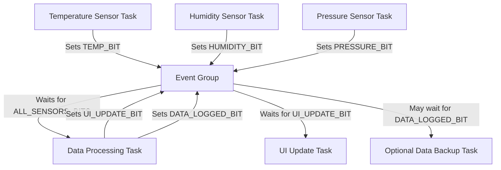

# STM32 Event Groups

## Introduction

Event Groups are a powerful synchronization mechanism provided by Real-Time Operating Systems (RTOS) such as FreeRTOS which is commonly used with STM32 microcontrollers. They allow multiple tasks to communicate with each other by setting, clearing, and waiting for event flags in a shared event group.

Unlike semaphores or mutexes which are mainly designed for one-to-one synchronization, Event Groups enable more complex synchronization patterns where tasks can:
- Wait for multiple events to occur simultaneously (AND logic)
- Wait for any one of multiple events to occur (OR logic)
- Signal multiple events to many tasks at once

This makes Event Groups ideal for scenarios where tasks need to be synchronized based on multiple conditions or events.

## Key Concepts

### Event Flags

An Event Group consists of a set of binary flags (bits) where each bit represents a specific event or condition. On STM32 platforms running FreeRTOS, an Event Group typically contains 24 usable bits (0-23), although this can vary depending on the specific implementation.

Each bit can be in one of two states:
- **0 (Clear)**: The event has not occurred
- **1 (Set)**: The event has occurred

### Main Operations

There are three fundamental operations you can perform with Event Groups:

1. **Set Bits**: Set one or more bits in the Event Group to indicate that specific events have occurred
2. **Clear Bits**: Clear one or more bits to indicate that events need to be processed again
3. **Wait for Bits**: Tasks can wait for specific bit patterns before proceeding

## Creating and Using Event Groups in STM32

Let's explore how to implement Event Groups in your STM32 applications using FreeRTOS.

### Including Necessary Headers

First, include the required headers in your project:

```c
#include "FreeRTOS.h"
#include "task.h"
#include "event_groups.h"
```

### Creating an Event Group

You'll need to declare an Event Group handle and create the Event Group:

```c
EventGroupHandle_t xEventGroup;

void initApp(void) {
    // Create the event group
    xEventGroup = xEventGroupCreate();
    
    // Check if creation was successful
    if (xEventGroup == NULL) {
        // Handle error - could not allocate memory for event group
        Error_Handler();
    }
}
```

### Defining Event Bit Masks

It's good practice to define bit masks for your events at the beginning of your code:

```c
// Event bit definitions
#define SENSOR_DATA_READY_BIT    (1 << 0)  // Bit 0
#define BUTTON_PRESSED_BIT       (1 << 1)  // Bit 1
#define COMMUNICATION_DONE_BIT   (1 << 2)  // Bit 2
#define ALL_SYNC_BITS            (SENSOR_DATA_READY_BIT | BUTTON_PRESSED_BIT | COMMUNICATION_DONE_BIT)
```

### Setting Event Bits

To signal that an event has occurred, set the corresponding bit in the Event Group:

```c
void buttonInterruptHandler(void) {
    BaseType_t xHigherPriorityTaskWoken = pdFALSE;
    
    // Set the button pressed bit from an interrupt
    xEventGroupSetBitsFromISR(xEventGroup, BUTTON_PRESSED_BIT, &xHigherPriorityTaskWoken);
    
    // If setting the bit unblocked a higher priority task, request a context switch
    portYIELD_FROM_ISR(xHigherPriorityTaskWoken);
}

void sensorTask(void *pvParameters) {
    while (1) {
        // Read sensor data...
        
        // Signal that new sensor data is available
        xEventGroupSetBits(xEventGroup, SENSOR_DATA_READY_BIT);
        
        vTaskDelay(pdMS_TO_TICKS(100));
    }
}
```

### Waiting for Event Bits

Tasks can wait for specific bit patterns before proceeding:

```c
void processingTask(void *pvParameters) {
    EventBits_t uxBits;
    const TickType_t xTicksToWait = pdMS_TO_TICKS(1000); // Timeout of 1 second
    
    while (1) {
        // Wait for ALL specified bits to be set (AND logic)
        uxBits = xEventGroupWaitBits(
            xEventGroup,           // The event group
            ALL_SYNC_BITS,         // The bits to wait for
            pdTRUE,                // Clear the bits on exit?
            pdTRUE,                // Wait for all bits? (AND logic)
            xTicksToWait);         // Maximum time to wait
            
        // Check if all bits were actually set
        if ((uxBits & ALL_SYNC_BITS) == ALL_SYNC_BITS) {
            // All events have occurred, process the data
            processData();
        } else {
            // Timeout occurred, handle the error
            handleTimeout();
        }
    }
}
```

### Waiting for Any Event (OR Logic)

Sometimes you want to proceed if any of several events occur:

```c
void monitoringTask(void *pvParameters) {
    EventBits_t uxBits;
    
    while (1) {
        // Wait for ANY of the specified bits to be set (OR logic)
        uxBits = xEventGroupWaitBits(
            xEventGroup,
            BUTTON_PRESSED_BIT | COMMUNICATION_DONE_BIT,
            pdTRUE,              // Clear bits on exit
            pdFALSE,             // Wait for any bit (OR logic)
            portMAX_DELAY);      // Wait indefinitely
            
        // Check which bit was set
        if (uxBits & BUTTON_PRESSED_BIT) {
            handleButtonPress();
        }
        
        if (uxBits & COMMUNICATION_DONE_BIT) {
            handleCommunicationComplete();
        }
    }
}
```

### Clearing Event Bits

You can explicitly clear bits when needed:

```c
void resetTask(void *pvParameters) {
    while (1) {
        // Clear specific bits
        xEventGroupClearBits(xEventGroup, SENSOR_DATA_READY_BIT | BUTTON_PRESSED_BIT);
        
        vTaskDelay(pdMS_TO_TICKS(5000)); // Reset every 5 seconds
    }
}
```

## Advanced Techniques

### Synchronization Barrier

Event Groups can be used to implement a synchronization barrier where multiple tasks must reach a certain point before any can proceed:

```c
#define TASK1_BIT (1 << 0)
#define TASK2_BIT (1 << 1)
#define TASK3_BIT (1 << 2)
#define ALL_TASKS_BITS (TASK1_BIT | TASK2_BIT | TASK3_BIT)

void task1(void *pvParameters) {
    while (1) {
        // Do some work...
        
        // Signal that task1 has reached the barrier
        xEventGroupSetBits(xEventGroup, TASK1_BIT);
        
        // Wait for all tasks to reach the barrier
        xEventGroupWaitBits(
            xEventGroup,
            ALL_TASKS_BITS,
            pdFALSE,           // Don't clear on exit
            pdTRUE,            // Wait for all bits
            portMAX_DELAY);
            
        // All tasks have reached the barrier, continue...
        
        // Optionally clear all bits at the end of the synchronized section
        if (xTaskGetCurrentTaskHandle() == xTask1Handle) {
            xEventGroupClearBits(xEventGroup, ALL_TASKS_BITS);
        }
    }
}
```

Similar code would be used for task2 and task3, but with their respective bits.

### Synchronizing with Timeouts

For systems that must be robust against task failures, adding timeouts is essential:

```c
void robustProcessingTask(void *pvParameters) {
    EventBits_t uxBits;
    const TickType_t xMaxBlockTime = pdMS_TO_TICKS(5000); // 5 second timeout
    
    while (1) {
        // Wait for all bits or timeout
        uxBits = xEventGroupWaitBits(
            xEventGroup,
            ALL_SYNC_BITS,
            pdTRUE,
            pdTRUE,
            xMaxBlockTime);
            
        if ((uxBits & ALL_SYNC_BITS) == ALL_SYNC_BITS) {
            // All events occurred within the timeout period
            processData();
        } else {
            // Timeout occurred - implement recovery mechanism
            recoverFromTimeout(uxBits); // Pass which bits were set
        }
    }
}
```

## Real-World Example: Sensor Data Processing Pipeline

Let's implement a complete example of a sensor data processing pipeline using Event Groups:

```c
// Event bit definitions
#define TEMP_SENSOR_READY_BIT     (1 << 0)
#define HUMIDITY_SENSOR_READY_BIT (1 << 1)
#define PRESSURE_SENSOR_READY_BIT (1 << 2)
#define ALL_SENSORS_READY         (TEMP_SENSOR_READY_BIT | HUMIDITY_SENSOR_READY_BIT | PRESSURE_SENSOR_READY_BIT)
#define UI_UPDATE_REQUEST_BIT     (1 << 3)
#define DATA_LOGGED_BIT           (1 << 4)

EventGroupHandle_t xSensorEventGroup;

// Structure to hold sensor data
typedef struct {
    float temperature;
    float humidity;
    float pressure;
    uint32_t timestamp;
} SensorData_t;

SensorData_t latestSensorData;

// Temperature sensor task
void temperatureSensorTask(void *pvParameters) {
    while (1) {
        // Simulate reading temperature
        float temperature = readTemperatureSensor();
        
        // Update the shared data structure
        taskENTER_CRITICAL();
        latestSensorData.temperature = temperature;
        latestSensorData.timestamp = xTaskGetTickCount();
        taskEXIT_CRITICAL();
        
        // Set the temperature ready bit
        xEventGroupSetBits(xSensorEventGroup, TEMP_SENSOR_READY_BIT);
        
        // Sensor reading frequency
        vTaskDelay(pdMS_TO_TICKS(1000));
    }
}

// Humidity sensor task - similar structure
void humiditySensorTask(void *pvParameters) {
    while (1) {
        float humidity = readHumiditySensor();
        
        taskENTER_CRITICAL();
        latestSensorData.humidity = humidity;
        taskEXIT_CRITICAL();
        
        xEventGroupSetBits(xSensorEventGroup, HUMIDITY_SENSOR_READY_BIT);
        
        vTaskDelay(pdMS_TO_TICKS(2000)); // Different update rate
    }
}

// Pressure sensor task - similar structure
void pressureSensorTask(void *pvParameters) {
    while (1) {
        float pressure = readPressureSensor();
        
        taskENTER_CRITICAL();
        latestSensorData.pressure = pressure;
        taskEXIT_CRITICAL();
        
        xEventGroupSetBits(xSensorEventGroup, PRESSURE_SENSOR_READY_BIT);
        
        vTaskDelay(pdMS_TO_TICKS(1500)); // Different update rate
    }
}

// Data processing task
void dataProcessingTask(void *pvParameters) {
    EventBits_t uxBits;
    SensorData_t processingData;
    
    while (1) {
        // Wait for all sensor data to be ready
        uxBits = xEventGroupWaitBits(
            xSensorEventGroup,
            ALL_SENSORS_READY,
            pdTRUE,              // Clear bits after waiting
            pdTRUE,              // Wait for all bits
            pdMS_TO_TICKS(5000)); // 5 second timeout
            
        if ((uxBits & ALL_SENSORS_READY) == ALL_SENSORS_READY) {
            // Copy the data for processing
            taskENTER_CRITICAL();
            processingData = latestSensorData;
            taskEXIT_CRITICAL();
            
            // Process the data (e.g., calculate averages, detect anomalies)
            float weatherIndex = calculateWeatherIndex(
                processingData.temperature,
                processingData.humidity,
                processingData.pressure
            );
            
            // Log the processed data
            logSensorData(&processingData, weatherIndex);
            
            // Set the logged bit to notify other tasks
            xEventGroupSetBits(xSensorEventGroup, DATA_LOGGED_BIT);
            
            // Request UI update
            xEventGroupSetBits(xSensorEventGroup, UI_UPDATE_REQUEST_BIT);
        } else {
            // Timeout occurred - some sensors didn't update
            reportSensorFailure(uxBits);
        }
    }
}

// UI update task
void uiUpdateTask(void *pvParameters) {
    while (1) {
        // Wait for UI update request
        xEventGroupWaitBits(
            xSensorEventGroup,
            UI_UPDATE_REQUEST_BIT,
            pdTRUE,            // Clear on exit
            pdFALSE,           // Only need this bit
            portMAX_DELAY);    // Wait indefinitely
            
        // Update the user interface with latest processed data
        updateUserInterface();
    }
}

// Initialize everything
void initApplication(void) {
    // Create the event group
    xSensorEventGroup = xEventGroupCreate();
    
    // Initialize sensor hardware
    initSensors();
    
    // Create tasks
    xTaskCreate(temperatureSensorTask, "TempSensor", 128, NULL, 1, NULL);
    xTaskCreate(humiditySensorTask, "HumidSensor", 128, NULL, 1, NULL);
    xTaskCreate(pressureSensorTask, "PressSensor", 128, NULL, 1, NULL);
    xTaskCreate(dataProcessingTask, "DataProc", 256, NULL, 2, NULL);
    xTaskCreate(uiUpdateTask, "UIUpdate", 256, NULL, 3, NULL);
}
```

This example shows a complete sensor system where:
1. Three sensors run at different rates, collecting environmental data
2. The processing task waits for all sensors to update before calculating derived values
3. The UI task is notified when new processed data is available
4. The system handles timeouts gracefully

## Workflow Visualization

Here's a diagram showing the workflow of tasks using Event Groups:



## Common Gotchas and Best Practices

### 1. Task Priorities Matter

Be careful with task priorities when using Event Groups. If a high-priority task is waiting for a bit that a lower-priority task is supposed to set, the high-priority task might prevent the lower-priority task from running, leading to a deadlock.

### 2. ISR Usage

When setting bits from an Interrupt Service Routine (ISR), always use the `...FromISR()` variant:

```c
void sensorInterruptHandler(void) {
    BaseType_t xHigherPriorityTaskWoken = pdFALSE;
    
    xEventGroupSetBitsFromISR(xEventGroup, SENSOR_DATA_READY_BIT, &xHigherPriorityTaskWoken);
    
    portYIELD_FROM_ISR(xHigherPriorityTaskWoken);
}
```

### 3. Clearing Bits

Be thoughtful about when to clear bits. In some scenarios, you might want to:
- Clear bits when reading them (`xEventGroupWaitBits` with `xClearOnExit = pdTRUE`)
- Explicitly clear bits after processing (`xEventGroupClearBits`)
- Never clear certain status bits that represent persistent states

### 4. Memory Usage

Event Groups consume more RAM than simpler synchronization primitives like binary semaphores. Use them when you need their specific capabilities.

### 5. Race Conditions

Be aware of potential race conditions when multiple tasks are setting and clearing the same bits. Use critical sections when necessary to protect shared resources.

## Comparison with Other Synchronization Methods

| Feature | Event Groups | Semaphores | Queues | Task Notifications |
|---------|-------------|------------|--------|-------------------|
| Multiple signals | ✅ (up to 24) | ❌ | ❌ | Limited |
| AND/OR logic | ✅ | ❌ | ❌ | ❌ |
| Memory usage | Moderate | Low | High | Very low |
| Speed | Fast | Very fast | Moderate | Fastest |
| Data transfer | ❌ | ❌ | ✅ | Limited |

## Summary

Event Groups are a powerful synchronization primitive in STM32 RTOS applications that allow for complex synchronization patterns between tasks. They're particularly useful when:

1. Multiple conditions need to be met before a task can proceed (AND logic)
2. A task needs to wait for any one of several possible events (OR logic)
3. Multiple tasks need to be notified of an event simultaneously

By using Event Groups effectively, you can create robust, responsive embedded systems that handle multiple concurrent events efficiently while maintaining good separation between different functional components.

## Exercises

1. Modify the sensor example to add a low-power mode that is triggered when no sensor updates occur for 30 seconds.

2. Implement a system that uses Event Groups to coordinate between three tasks: a data acquisition task, a processing task, and a communication task. The communication task should only run when both acquisition and processing are complete.

3. Create a task synchronization barrier where four tasks must all reach a certain point before any can proceed to the next phase of operation.

4. Implement a timeout mechanism that can detect when a particular event hasn't occurred within a specific time frame and take corrective action.

5. Build a simple state machine using Event Groups where different bit patterns represent different system states.

## Additional Resources

- [FreeRTOS Event Groups Documentation](https://www.freertos.org/FreeRTOS-Event-Groups.html)
- [STM32 FreeRTOS Programming Guide](https://www.st.com/resource/en/user_manual/dm00105262-developing-applications-on-stm32cube-with-rtos-stmicroelectronics.pdf)
- Book: "Mastering the FreeRTOS Real Time Kernel" by Richard Barry
- Book: "Real-Time Embedded Systems" by Xiaocong Fan