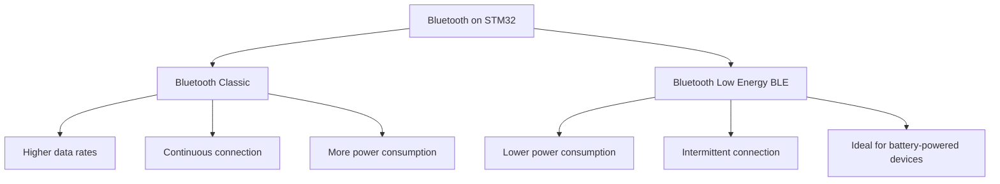
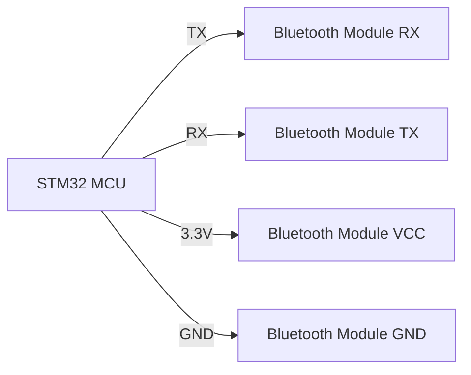

# STM32 Bluetooth Basics

## Introduction

Bluetooth technology enables wireless communication between devices over short distances, making it essential for modern embedded systems. STM32 microcontrollers offer robust Bluetooth capabilities that allow your projects to communicate with smartphones, computers, and other Bluetooth-enabled devices without physical connections.

This tutorial introduces you to the fundamentals of implementing Bluetooth communication on STM32 microcontrollers. We'll cover both Bluetooth Classic and Bluetooth Low Energy (BLE), explain the hardware requirements, and walk through practical examples to help you integrate wireless connectivity into your projects.

## Understanding Bluetooth on STM32

STM32 microcontrollers support Bluetooth connectivity through two main approaches:

1. **Integrated Bluetooth**: Some STM32 models (like the STM32WB series) have built-in Bluetooth capabilities
2. **External Bluetooth modules**: Standard STM32 MCUs can communicate with external Bluetooth modules via UART, SPI, or I2C

### Bluetooth Variants

STM32 supports two main variants of Bluetooth:



#### Bluetooth Classic
- Better for continuous data streaming
- Higher data rates (up to 3 Mbps)
- More power-hungry
- Suitable for audio streaming, file transfers

#### Bluetooth Low Energy (BLE)
- Optimized for low power consumption
- Ideal for battery-powered devices
- Perfect for periodic data transmission
- Lower data rates but sufficient for sensor readings and commands

## Hardware Requirements

### Option 1: STM32WB Series (Integrated Bluetooth)

The STM32WB series includes a dedicated radio processor alongside the main application processor, making it an all-in-one solution for Bluetooth applications.

**Key components:**
- STM32WB55 Nucleo board or similar
- USB cable for programming
- ST-LINK/V2 programmer (usually included with Nucleo boards)

### Option 2: External Bluetooth Module with Standard STM32

For STM32 microcontrollers without integrated Bluetooth, you'll need:

**Components:**
- Any STM32 development board (e.g., Nucleo-F401RE, STM32F4-Discovery)
- External Bluetooth module (HC-05/HC-06 for Classic, HM-10/CC2541 for BLE)
- Jumper wires
- 3.3V power supply (most modules are not 5V tolerant)

**Typical Connection Diagram:**



## Setting Up Your Development Environment

Before writing code, you'll need to set up your development environment:

1. Install STM32CubeIDE or your preferred STM32 development platform
2. Install STM32CubeMX for visual configuration
3. Download the appropriate STM32 HAL libraries
4. For STM32WB series, install the STM32CubeWB package which includes Bluetooth middleware

## Basic UART-Based Bluetooth Communication

Let's start with a simple example using an external Bluetooth module connected via UART.

### Hardware Connection

Connect your Bluetooth module to the STM32:
- Connect module's RX pin to STM32's TX pin (e.g., PA2)
- Connect module's TX pin to STM32's RX pin (e.g., PA3)
- Connect module's VCC to 3.3V
- Connect module's GND to GND

### Code Example: Sending and Receiving Data via Bluetooth

```c
/* Includes */
#include "main.h"
#include "stm32f4xx_hal.h"
#include <string.h>

/* Private variables */
UART_HandleTypeDef huart2;  // UART for Bluetooth module
char rxBuffer[50];          // Buffer for received data
char txBuffer[50];          // Buffer for transmitting data

/* Function prototypes */
static void SystemClock_Config(void);
static void MX_GPIO_Init(void);
static void MX_USART2_UART_Init(void);

/**
  * @brief Main function
  */
int main(void)
{
  /* MCU initialization */
  HAL_Init();
  SystemClock_Config();
  MX_GPIO_Init();
  MX_USART2_UART_Init();

  /* Prepare welcome message */
  strcpy(txBuffer, "STM32 Bluetooth Demo\r
");
  
  /* Send welcome message via Bluetooth */
  HAL_UART_Transmit(&huart2, (uint8_t*)txBuffer, strlen(txBuffer), 100);

  /* Main loop */
  while (1)
  {
    /* Clear receive buffer */
    memset(rxBuffer, 0, sizeof(rxBuffer));
    
    /* Receive data via Bluetooth with timeout */
    if (HAL_UART_Receive(&huart2, (uint8_t*)rxBuffer, 10, 1000) == HAL_OK)
    {
      /* Echo received data back with confirmation message */
      sprintf(txBuffer, "Received: %s\r
", rxBuffer);
      HAL_UART_Transmit(&huart2, (uint8_t*)txBuffer, strlen(txBuffer), 100);
      
      /* Check for specific command */
      if (strncmp(rxBuffer, "LED_ON", 6) == 0)
      {
        HAL_GPIO_WritePin(GPIOA, GPIO_PIN_5, GPIO_PIN_SET);  // Turn LED on
        strcpy(txBuffer, "LED turned ON\r
");
        HAL_UART_Transmit(&huart2, (uint8_t*)txBuffer, strlen(txBuffer), 100);
      }
      else if (strncmp(rxBuffer, "LED_OFF", 7) == 0)
      {
        HAL_GPIO_WritePin(GPIOA, GPIO_PIN_5, GPIO_PIN_RESET);  // Turn LED off
        strcpy(txBuffer, "LED turned OFF\r
");
        HAL_UART_Transmit(&huart2, (uint8_t*)txBuffer, strlen(txBuffer), 100);
      }
    }
    
    HAL_Delay(10);  // Small delay to prevent CPU overload
  }
}

/**
  * @brief UART2 Initialization Function
  * @note Configured for 9600 baud, which is common for Bluetooth modules
  */
static void MX_USART2_UART_Init(void)
{
  huart2.Instance = USART2;
  huart2.Init.BaudRate = 9600;
  huart2.Init.WordLength = UART_WORDLENGTH_8B;
  huart2.Init.StopBits = UART_STOPBITS_1;
  huart2.Init.Parity = UART_PARITY_NONE;
  huart2.Init.Mode = UART_MODE_TX_RX;
  huart2.Init.HwFlowCtl = UART_HWCONTROL_NONE;
  huart2.Init.OverSampling = UART_OVERSAMPLING_16;
  HAL_UART_Init(&huart2);
}

/* System Clock and GPIO initialization implementations */
/* ... (omitted for brevity) ... */
```

**How It Works:**
1. The program initializes the UART interface for communication with the Bluetooth module
2. It sends a welcome message over Bluetooth
3. It continuously listens for incoming Bluetooth data
4. When data is received, it echoes it back
5. It recognizes specific commands ("LED_ON" and "LED_OFF") to control an onboard LED

### Testing This Example

1. Upload the code to your STM32 board
2. Open a Bluetooth terminal app on your smartphone or computer
3. Pair with your Bluetooth module (default pairing code is often "1234" or "0000")
4. Connect to the module
5. You should see the "STM32 Bluetooth Demo" message
6. Send "LED_ON" to turn on the board's LED
7. Send "LED_OFF" to turn it off

## Bluetooth Low Energy (BLE) with STM32WB

For more advanced applications, the STM32WB series offers integrated BLE capabilities. Let's explore a basic example of BLE communication.

### Basic BLE Server Example

This example creates a simple BLE server with a custom service and characteristic:

```c
/* Includes */
#include "main.h"
#include "app_common.h"
#include "app_entry.h"
#include "app_ble.h"
#include "ble.h"
#include "stm32_seq.h"
#include "stm32wb5mm_dk.h"
#include "dbg_trace.h"
#include <string.h>

/* Private defines */
#define CUSTOM_SERVICE_UUID      0x1234
#define CUSTOM_CHARACTERISTIC_UUID 0x5678

/* Private variables */
uint8_t sensorValue = 25; // Sample sensor value

/* Function Prototypes */
static void SystemClock_Config(void);
static void Init_BLE(void);
static void UpdateCharacteristic(void);

/**
  * @brief Main function
  */
int main(void)
{
  /* Reset of all peripherals, Initializes the Flash interface and the Systick */
  HAL_Init();
  
  /* Configure the system clock */
  SystemClock_Config();
  
  /* Initialize LEDs */
  BSP_LED_Init(LED_BLUE);
  BSP_LED_Init(LED_GREEN);
  BSP_LED_Init(LED_RED);
  
  /* Initialize Bluetooth functionality */
  Init_BLE();
  
  /* Set up periodic timer for sensor updates */
  UTIL_SEQ_RegTask(1<<0, 0, UpdateCharacteristic);
  UTIL_SEQ_SetTask(1<<0, CFG_TASK_PERIOD_MS);
  
  /* Infinite loop */
  while (1)
  {
    /* Run the BLE stack tasks */
    UTIL_SEQ_Run(UTIL_SEQ_DEFAULT);
  }
}

/**
  * @brief Initialize Bluetooth Low Energy
  */
static void Init_BLE(void)
{
  /* Initialize BLE transport layer */
  APPE_Init();
  
  /* Register our custom service and characteristic */
  aci_gatt_add_service(UUID_TYPE_16, 
                       (const Service_UUID_t*)&CUSTOM_SERVICE_UUID, 
                       PRIMARY_SERVICE, 
                       7, 
                       &service_handle);
                       
  aci_gatt_add_char(service_handle, 
                    UUID_TYPE_16, 
                    (const Char_UUID_t*)&CUSTOM_CHARACTERISTIC_UUID, 
                    1, 
                    CHAR_PROP_READ | CHAR_PROP_NOTIFY, 
                    ATTR_PERMISSION_NONE, 
                    GATT_NOTIFY_ATTRIBUTE_WRITE, 
                    16, 
                    0, 
                    &char_handle);
                    
  /* Update initial characteristic value */
  aci_gatt_update_char_value(service_handle, 
                            char_handle, 
                            0, 
                            1, 
                            &sensorValue);
                            
  /* Start advertising */
  aci_gap_set_discoverable(ADV_IND, 
                          0x0300, 
                          0x0300, 
                          PUBLIC_ADDR, 
                          NO_WHITE_LIST_USE,
                          sizeof("STM32WB"), 
                          (uint8_t*)"STM32WB", 
                          0, 
                          NULL, 
                          0, 
                          0);
                          
  /* Turn on blue LED to indicate advertising */
  BSP_LED_On(LED_BLUE);
}

/**
  * @brief Update BLE characteristic with new sensor value
  */
static void UpdateCharacteristic(void)
{
  /* Simulate changing sensor value */
  sensorValue = (sensorValue + 1) % 100;
  
  /* Update characteristic value */
  aci_gatt_update_char_value(service_handle, 
                            char_handle, 
                            0, 
                            1, 
                            &sensorValue);
                            
  /* Toggle green LED to indicate update */
  BSP_LED_Toggle(LED_GREEN);
  
  /* Schedule next update */
  UTIL_SEQ_SetTask(1<<0, CFG_TASK_PERIOD_MS);
}

/* System Clock Config implementation */
/* ... (omitted for brevity) ... */
```

**How It Works:**
1. The program initializes the BLE stack on the STM32WB
2. It creates a custom service and characteristic
3. It starts advertising the device as "STM32WB"
4. It periodically updates the characteristic value (simulating a sensor reading)
5. The blue LED indicates the device is advertising
6. The green LED toggles when the characteristic value is updated

### Testing the BLE Example

1. Upload the code to your STM32WB board
2. Install a BLE scanner app on your smartphone (like "nRF Connect" or "LightBlue")
3. Scan for BLE devices and connect to "STM32WB"
4. View the available services and characteristics
5. Read the characteristic value or enable notifications to see the value change in real-time

## Real-World Application: Bluetooth Weather Station

Let's build a more practical example: a Bluetooth-enabled weather station that sends temperature and humidity data to a smartphone app.

```c
/* Includes */
#include "main.h"
#include "stm32f4xx_hal.h"
#include "dht11.h"  // DHT11 temperature/humidity sensor library
#include <string.h>
#include <stdio.h>

/* Private variables */
UART_HandleTypeDef huart2;  // UART for Bluetooth module
DHT11_HandleTypeDef dht;    // DHT11 sensor handle
uint8_t temperature = 0;
uint8_t humidity = 0;
char txBuffer[100];         // Buffer for transmitting data
uint32_t lastUpdateTime = 0;

/* Function prototypes */
static void SystemClock_Config(void);
static void MX_GPIO_Init(void);
static void MX_USART2_UART_Init(void);
static void DHT11_Init(void);
static void SendSensorData(void);

/**
  * @brief Main function
  */
int main(void)
{
  /* MCU initialization */
  HAL_Init();
  SystemClock_Config();
  MX_GPIO_Init();
  MX_USART2_UART_Init();
  
  /* Initialize DHT11 sensor */
  DHT11_Init();
  
  /* Prepare welcome message */
  strcpy(txBuffer, "STM32 Bluetooth Weather Station\r
");
  HAL_UART_Transmit(&huart2, (uint8_t*)txBuffer, strlen(txBuffer), 100);

  /* Main loop */
  while (1)
  {
    uint32_t currentTime = HAL_GetTick();
    
    /* Update and send sensor data every 10 seconds */
    if (currentTime - lastUpdateTime >= 10000)
    {
      SendSensorData();
      lastUpdateTime = currentTime;
    }
    
    /* Small delay */
    HAL_Delay(100);
  }
}

/**
  * @brief Initialize DHT11 temperature/humidity sensor
  */
static void DHT11_Init(void)
{
  /* Configure DHT11 on pin PA1 */
  dht.GPIOx = GPIOA;
  dht.GPIO_Pin = GPIO_PIN_1;
  DHT11_Init(&dht);
}

/**
  * @brief Read and send sensor data via Bluetooth
  */
static void SendSensorData(void)
{
  /* Read data from DHT11 sensor */
  if (DHT11_ReadData(&dht, &temperature, &humidity) == DHT11_OK)
  {
    /* Format data as JSON */
    sprintf(txBuffer, "{\"temp\":%d,\"humidity\":%d,\"timestamp\":%lu}\r
", 
            temperature, humidity, HAL_GetTick());
    
    /* Send data via Bluetooth */
    HAL_UART_Transmit(&huart2, (uint8_t*)txBuffer, strlen(txBuffer), 100);
    
    /* Toggle LED to indicate data was sent */
    HAL_GPIO_TogglePin(GPIOA, GPIO_PIN_5);
  }
  else
  {
    /* Error reading sensor */
    strcpy(txBuffer, "{\"error\":\"Failed to read sensor\"}\r
");
    HAL_UART_Transmit(&huart2, (uint8_t*)txBuffer, strlen(txBuffer), 100);
  }
}

/**
  * @brief UART2 Initialization Function
  */
static void MX_USART2_UART_Init(void)
{
  huart2.Instance = USART2;
  huart2.Init.BaudRate = 9600;
  huart2.Init.WordLength = UART_WORDLENGTH_8B;
  huart2.Init.StopBits = UART_STOPBITS_1;
  huart2.Init.Parity = UART_PARITY_NONE;
  huart2.Init.Mode = UART_MODE_TX_RX;
  huart2.Init.HwFlowCtl = UART_HWCONTROL_NONE;
  huart2.Init.OverSampling = UART_OVERSAMPLING_16;
  HAL_UART_Init(&huart2);
}

/* System Clock and GPIO initialization implementations */
/* ... (omitted for brevity) ... */
```

**How It Works:**
1. The program initializes the UART for Bluetooth communication and the DHT11 sensor
2. Every 10 seconds, it reads temperature and humidity data
3. It formats the data as a JSON string for easy parsing by the receiving application
4. It sends the data via Bluetooth
5. It toggles an LED to indicate data transmission

### Companion App

This weather station can be paired with a simple smartphone app that:
1. Connects to the Bluetooth device
2. Receives and parses the JSON data
3. Displays real-time temperature and humidity readings
4. Optionally stores historical data for trend analysis

## Troubleshooting Bluetooth Connections

When working with Bluetooth on STM32, you might encounter these common issues:

### Connection Problems

- **Issue**: Cannot discover or connect to the Bluetooth device
- **Solutions**:
  - Verify power connections (3.3V and GND)
  - Check UART connections (TX to RX, RX to TX)
  - Confirm baud rate settings match between STM32 and module
  - Ensure the Bluetooth module is in discoverable mode

### Data Transmission Issues

- **Issue**: Connected but not receiving data
- **Solutions**:
  - Verify UART initialization parameters
  - Check buffer sizes and overflow conditions
  - Confirm transmit/receive timing
  - Use an oscilloscope to verify UART signals if possible

### Power-Related Issues

- **Issue**: Unstable connection or frequent disconnects
- **Solutions**:
  - Ensure adequate power supply current capacity
  - Add appropriate decoupling capacitors
  - Keep Bluetooth antenna away from metal objects and power lines
  - Reduce transmission power if signal integrity is good

## Advanced Bluetooth Features

### Sleep Mode Management

For battery-powered applications, implement sleep modes:

```c
/* Enter low-power mode when inactive */
void EnterLowPowerMode(void)
{
  /* Send command to put Bluetooth module in sleep mode */
  HAL_UART_Transmit(&huart2, (uint8_t*)"AT+SLEEP\r
", 10, 100);
  
  /* Wait for acknowledgment */
  char response[10];
  HAL_UART_Receive(&huart2, (uint8_t*)response, 5, 100);
  
  /* Enter STM32 low-power mode */
  HAL_PWR_EnterSTOPMode(PWR_LOWPOWERREGULATOR_ON, PWR_STOPENTRY_WFI);
}
```

### Secure Connections

Implement secure pairing for sensitive applications:

```c
/* Configure Bluetooth security */
void ConfigureSecurity(void)
{
  /* Set PIN code (for Bluetooth Classic) */
  HAL_UART_Transmit(&huart2, (uint8_t*)"AT+PSWD=1234\r
", 14, 100);
  
  /* Enable authentication */
  HAL_UART_Transmit(&huart2, (uint8_t*)"AT+AUTH=1\r
", 11, 100);
}
```

## Summary

In this tutorial, you've learned the fundamentals of implementing Bluetooth connectivity on STM32 microcontrollers:

1. Understanding the differences between Bluetooth Classic and BLE
2. Setting up hardware for both integrated and external Bluetooth solutions
3. Writing code for basic UART-based Bluetooth communication
4. Implementing a BLE server with custom services and characteristics
5. Building a practical Bluetooth weather station application
6. Troubleshooting common Bluetooth issues
7. Implementing advanced features like power management and security

By mastering these concepts, you can add wireless communication to your STM32 projects, enabling them to interact with smartphones, computers, and other embedded systems without physical connections.

## Further Resources and Exercises

### Additional Resources

- [STM32WB Series Documentation](https://www.st.com/en/microcontrollers-microprocessors/stm32wb-series.html)
- [AN5289: Building Wireless Applications with STM32WB Series](https://www.st.com/resource/en/application_note/dm00598033-building-wireless-applications-with-stm32wb-series-microcontrollers-stmicroelectronics.pdf)
- [STM32 Bluetooth Low Energy Software Development Kit](https://www.st.com/en/embedded-software/stm32-ble-software-development-kit.html)

### Practice Exercises

1. **Basic**: Modify the UART example to control multiple LEDs with different commands
2. **Intermediate**: Create a bidirectional communication system where both the STM32 and smartphone can send commands
3. **Advanced**: Implement a Bluetooth-controlled robot with motor control and sensor feedback
4. **Challenge**: Develop a multi-node Bluetooth network where multiple STM32 devices communicate with each other

### Next Steps

After mastering Bluetooth basics, consider exploring these related topics:
- Bluetooth mesh networking for IoT applications
- Combining Bluetooth with other wireless technologies (WiFi, LoRa)
- Implementing Bluetooth audio streaming
- Developing custom smartphone apps to interface with your STM32 Bluetooth devices