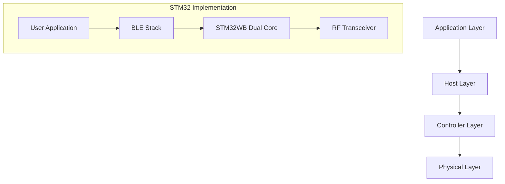

# STM32 BLE Implementation

## Introduction

Bluetooth Low Energy (BLE) is a wireless communication technology designed for short-range, low-power applications. It's an essential connectivity option for modern IoT devices, wearables, and sensor networks. In this guide, we'll explore how to implement BLE functionality on STM32 microcontrollers, which offer built-in BLE capabilities through specific series like the STM32WB.

BLE's advantages include:
- Ultra-low power consumption
- Simple pairing and connection management
- Widespread adoption across consumer devices
- Standardized protocol for interoperability

By the end of this tutorial, you'll understand the fundamentals of BLE communication and be able to implement basic BLE functionality on an STM32 platform.

## Prerequisites

Before starting this tutorial, you should have:
- Basic knowledge of STM32 microcontrollers
- STM32CubeIDE installed on your computer
- An STM32WB series development board (like the NUCLEO-WB55RG)
- STM32CubeMX or STM32CubeIDE for project initialization
- Basic understanding of wireless communication concepts

## Understanding BLE Architecture

Before diving into implementation, let's understand the basic architecture of BLE on STM32 devices:



The STM32WB series uses a dual-core architecture:
- The Arm Cortex-M4 core runs your application code
- The Arm Cortex-M0+ core handles the BLE protocol stack
- They communicate via an Inter-Processor Communication (IPC) mechanism

This separation allows efficient power management and simplifies BLE development.

## Setting Up Your First BLE Project

Let's create a simple BLE peripheral device that broadcasts temperature data.

### Step 1: Project Initialization

1. Open STM32CubeIDE or STM32CubeMX
2. Select your STM32WB board
3. Configure the system clock
4. Enable the BLE middleware:

```c
/* Enable BLE in CubeMX by selecting:
 * Middleware -> STM32_WPAN -> BLE
 * And configure the following settings:
 * - Device Role: Peripheral
 * - Data Length Extension: Enabled
 */
```

### Step 2: BLE Configuration

In STM32CubeMX, configure the BLE settings:

1. Set the device name (e.g., "STM32_TEMP_SENSOR")
2. Configure advertisement settings
3. Define your custom service and characteristic for temperature data
4. Generate the initialization code

### Step 3: Implementing Core BLE Functionality

First, let's initialize the BLE stack in our `main.c`:

```c
/* Include necessary headers */
#include "app_common.h"
#include "app_entry.h"
#include "stm32_lpm.h"
#include "stm32_seq.h"
#include "dbg_trace.h"

/* BLE initialization function */
void MX_BLE_Init(void)
{
  /* Initialize the BLE stack */
  APPE_Init();
}

int main(void)
{
  /* MCU Configuration */
  HAL_Init();
  SystemClock_Config();
  
  /* Initialize all configured peripherals */
  MX_GPIO_Init();
  MX_BLE_Init();
  
  /* Infinite loop */
  while (1)
  {
    /* Run the BLE stack tasks */
    UTIL_SEQ_Run(UTIL_SEQ_DEFAULT);
  }
}
```

### Step 4: Creating a Custom BLE Service

Now, let's create a custom service for our temperature data in a new file called `ble_service.c`:

```c
/* Include necessary headers */
#include "ble_service.h"
#include "app_common.h"

/* Define UUIDs for our service and characteristic */
#define TEMP_SERVICE_UUID        (0x1809)  /* Health Thermometer service UUID */
#define TEMP_CHARACTERISTIC_UUID (0x2A1C)  /* Temperature Measurement characteristic UUID */

/* Buffer for temperature value */
static uint8_t TemperatureValue[4];

/* Temperature characteristic handle */
static uint16_t TemperatureCharHandle;

/* Function to update temperature value */
void UpdateTemperature(float temperature)
{
  /* Convert float to IEEE-11073 32-bit float format */
  uint32_t temp_mag = (uint32_t)(temperature * 100);
  
  /* Format: MMMMMMMM MMMMMMMM MMMMMMMM EEEEEEEE
   * Where M is the mantissa and E is the exponent
   * We use an exponent of -2 (0xFE) to get 2 decimal places */
  TemperatureValue[0] = (temp_mag >> 0) & 0xFF;
  TemperatureValue[1] = (temp_mag >> 8) & 0xFF;
  TemperatureValue[2] = (temp_mag >> 16) & 0xFF;
  TemperatureValue[3] = 0xFE;  /* Exponent: -2 */
  
  /* Notify connected clients about the new temperature value */
  aci_gatt_update_char_value(
    TemperatureCharHandle,
    0,  /* Offset */
    sizeof(TemperatureValue),
    TemperatureValue
  );
}

/* Function to initialize our custom service */
void InitTemperatureService(void)
{
  tBleStatus status;
  Service_UUID_t service_uuid;
  Char_UUID_t char_uuid;
  
  /* Add Health Thermometer service */
  service_uuid.type = SERVICE_UUID_16;
  service_uuid.uuid.uuid16 = TEMP_SERVICE_UUID;
  
  status = aci_gatt_add_service(
    service_uuid.type,
    &service_uuid,
    PRIMARY_SERVICE,
    7,  /* Max attribute records */
    &TemperatureCharHandle
  );
  
  if (status != BLE_STATUS_SUCCESS) {
    /* Handle error */
    return;
  }
  
  /* Add Temperature Measurement characteristic */
  char_uuid.type = CHAR_UUID_16;
  char_uuid.uuid.uuid16 = TEMP_CHARACTERISTIC_UUID;
  
  status = aci_gatt_add_char(
    TemperatureCharHandle,
    char_uuid.type,
    &char_uuid,
    sizeof(TemperatureValue),
    CHAR_PROP_NOTIFY,
    ATTR_PERMISSION_NONE,
    GATT_NOTIFY_ATTRIBUTE_WRITE,
    10,  /* Encryption key size */
    CHAR_VALUE_LEN_VARIABLE,
    &TemperatureCharHandle
  );
  
  if (status != BLE_STATUS_SUCCESS) {
    /* Handle error */
    return;
  }
}
```

### Step 5: Handling BLE Events

We need to handle various BLE events like connections, disconnections, and notifications:

```c
/* Function to handle BLE events */
void BLE_StatusNot(HCI_EVT_EVENT_CB_t *p_event)
{
  switch(p_event->evt_code)
  {
    case HCI_DISCONNECTION_COMPLETE_EVT_CODE:
      /* Handle disconnection */
      APP_DBG_MSG("Disconnected from client
");
      /* Restart advertising */
      aci_gap_set_discoverable(
        ADV_IND,  /* Advertising type */
        0,        /* Advertising interval min */
        0,        /* Advertising interval max */
        PUBLIC_ADDR,
        NO_WHITE_LIST_USE,
        sizeof(local_name),
        local_name,
        0,
        NULL,
        0,
        0
      );
      break;
      
    case HCI_LE_CONNECTION_COMPLETE_EVT_CODE:
      /* Handle new connection */
      APP_DBG_MSG("Connected to client
");
      break;
      
    default:
      break;
  }
}
```

## Reading Sensor Data and Updating BLE Characteristic

Now, let's put everything together and read from a temperature sensor, then update our BLE characteristic:

```c
#include "stm32wbxx_hal.h"
#include "ble_service.h"

/* ADC handle for temperature sensor */
ADC_HandleTypeDef hadc1;

/* Function to initialize ADC for internal temperature sensor */
void InitTemperatureSensor(void)
{
  ADC_ChannelConfTypeDef sConfig = {0};
  
  /* Configure ADC */
  hadc1.Instance = ADC1;
  hadc1.Init.ClockPrescaler = ADC_CLOCK_ASYNC_DIV1;
  hadc1.Init.Resolution = ADC_RESOLUTION_12B;
  hadc1.Init.ScanConvMode = ADC_SCAN_DISABLE;
  hadc1.Init.EOCSelection = ADC_EOC_SINGLE_CONV;
  hadc1.Init.LowPowerAutoWait = DISABLE;
  hadc1.Init.ContinuousConvMode = DISABLE;
  hadc1.Init.NbrOfConversion = 1;
  hadc1.Init.DiscontinuousConvMode = DISABLE;
  hadc1.Init.ExternalTrigConv = ADC_SOFTWARE_START;
  HAL_ADC_Init(&hadc1);
  
  /* Configure ADC channel for internal temperature sensor */
  sConfig.Channel = ADC_CHANNEL_TEMPSENSOR;
  sConfig.Rank = ADC_REGULAR_RANK_1;
  sConfig.SamplingTime = ADC_SAMPLETIME_247CYCLES_5;
  HAL_ADC_ConfigChannel(&hadc1, &sConfig);
}

/* Function to read temperature from internal sensor */
float ReadTemperature(void)
{
  float temperature;
  uint32_t adcValue;
  
  /* Start ADC conversion */
  HAL_ADC_Start(&hadc1);
  HAL_ADC_PollForConversion(&hadc1, 100);
  adcValue = HAL_ADC_GetValue(&hadc1);
  HAL_ADC_Stop(&hadc1);
  
  /* Convert ADC value to temperature using STM32WB formula */
  temperature = ((float)adcValue * 3.3f / 4096.0f - 0.76f) / 0.0025f + 25.0f;
  
  return temperature;
}

/* Timer callback function to periodically update temperature */
void TemperatureTimerCallback(void)
{
  float temp = ReadTemperature();
  UpdateTemperature(temp);
}

/* Main function */
int main(void)
{
  /* MCU Configuration */
  HAL_Init();
  SystemClock_Config();
  
  /* Initialize all configured peripherals */
  MX_GPIO_Init();
  MX_BLE_Init();
  InitTemperatureSensor();
  InitTemperatureService();
  
  /* Start advertising */
  aci_gap_set_discoverable(
    ADV_IND,
    0, 0,
    PUBLIC_ADDR,
    NO_WHITE_LIST_USE,
    sizeof("STM32_TEMP_SENSOR") - 1,
    (uint8_t*)"STM32_TEMP_SENSOR",
    0, NULL, 0, 0
  );
  
  /* Create a timer to update temperature every 1 second */
  HW_TS_Create(CFG_TIM_PROC_ID_ISR, &TemperatureTimerID, hw_ts_Repeated, TemperatureTimerCallback);
  HW_TS_Start(TemperatureTimerID, TEMPERATURE_UPDATE_PERIOD);
  
  /* Infinite loop */
  while (1)
  {
    /* Run the BLE stack tasks */
    UTIL_SEQ_Run(UTIL_SEQ_DEFAULT);
  }
}
```

## Testing Your BLE Device

Once you've programmed your STM32 board, you can test your BLE implementation:

1. Download a BLE scanner app on your smartphone (e.g., nRF Connect or LightBlue)
2. Open the app and scan for BLE devices
3. Look for "STM32_TEMP_SENSOR" in the list of devices
4. Connect to your device
5. Explore the services and characteristics
6. Observe the temperature values being updated in real-time

Expected output in the BLE scanner app:
- Device name: STM32_TEMP_SENSOR
- Service: Health Thermometer (0x1809)
- Characteristic: Temperature Measurement (0x2A1C)
- Values: Current temperature readings with notifications

## Advanced Topics: Power Optimization

For IoT and battery-powered applications, power optimization is crucial. Here are some techniques to optimize power consumption in your BLE implementation:

```c
/* Power optimization settings */
void ConfigureLowPowerMode(void)
{
  /* Configure advertisement interval */
  aci_gap_set_discoverable(
    ADV_IND,
    FAST_CONN_ADV_INTERVAL_MIN,  /* Minimum advertising interval (higher value = lower power) */
    FAST_CONN_ADV_INTERVAL_MAX,  /* Maximum advertising interval */
    PUBLIC_ADDR,
    NO_WHITE_LIST_USE,
    sizeof("STM32_TEMP_SENSOR") - 1,
    (uint8_t*)"STM32_TEMP_SENSOR",
    0, NULL, 0, 0
  );
  
  /* Configure connection parameters */
  aci_l2cap_connection_parameter_update_request(
    connection_handle,
    40,    /* interval_min (50ms) */
    40,    /* interval_max (50ms) */
    0,     /* slave_latency */
    400    /* timeout_multiplier (4s) */
  );
  
  /* Use STM32 low-power modes between BLE events */
  UTIL_LPM_SetStopMode(1, UTIL_LPM_ENABLE);
}
```

## Common Issues and Troubleshooting

Here are some common issues you might encounter when implementing BLE on STM32 and how to resolve them:

1. **Connection drops frequently**
   - Ensure your connection parameters are appropriate
   - Check power supply stability
   - Verify RF environment for interference

2. **BLE stack initialization fails**
   - Ensure proper clock configuration
   - Verify wireless firmware is correctly loaded
   - Check hardware compatibility

3. **Data transmission errors**
   - Validate data formatting
   - Check characteristic permissions
   - Ensure notification/indication is enabled by the client

4. **High power consumption**
   - Increase advertising interval
   - Optimize connection parameters
   - Use low power modes between activities

## Real-World Application Example: Environmental Monitoring System

Let's expand our temperature example to a more complete environmental monitoring system:

```c
/* Environmental monitoring service */
#define ENV_SERVICE_UUID        (0x181A)  /* Environmental Sensing service */
#define TEMP_CHAR_UUID          (0x2A6E)  /* Temperature characteristic */
#define HUMIDITY_CHAR_UUID      (0x2A6F)  /* Humidity characteristic */
#define PRESSURE_CHAR_UUID      (0x2A6D)  /* Pressure characteristic */

/* Characteristic handles */
static uint16_t envServiceHandle;
static uint16_t tempCharHandle;
static uint16_t humidityCharHandle;
static uint16_t pressureCharHandle;

/* Function to update environmental data */
void UpdateEnvironmentalData(float temperature, float humidity, float pressure)
{
  int16_t temp_value = (int16_t)(temperature * 100);  /* 0.01 degree resolution */
  uint16_t humidity_value = (uint16_t)(humidity * 100);  /* 0.01% resolution */
  uint32_t pressure_value = (uint32_t)(pressure * 10);  /* 0.1 hPa resolution */
  
  /* Update temperature characteristic */
  aci_gatt_update_char_value(
    envServiceHandle,
    tempCharHandle,
    0,
    sizeof(temp_value),
    (uint8_t*)&temp_value
  );
  
  /* Update humidity characteristic */
  aci_gatt_update_char_value(
    envServiceHandle,
    humidityCharHandle,
    0,
    sizeof(humidity_value),
    (uint8_t*)&humidity_value
  );
  
  /* Update pressure characteristic */
  aci_gatt_update_char_value(
    envServiceHandle,
    pressureCharHandle,
    0,
    sizeof(pressure_value),
    (uint8_t*)&pressure_value
  );
}
```

This example shows how to create a more complex BLE service with multiple characteristics for a real-world environmental monitoring application.

## Summary

In this tutorial, we've covered:

1. The fundamentals of BLE communication and its architecture on STM32
2. Setting up an STM32WB project with BLE functionality
3. Creating custom BLE services and characteristics
4. Reading sensor data and updating BLE characteristics
5. Testing your BLE implementation
6. Power optimization techniques
7. Troubleshooting common issues
8. A real-world environmental monitoring example

BLE is a powerful technology for building connected devices with STM32 microcontrollers. By understanding the concepts and implementation details covered in this guide, you're now equipped to create your own BLE-enabled projects.

## Further Learning

To continue your journey with STM32 BLE development:

1. Explore the STM32WB Bluetooth LE stack documentation
2. Experiment with different BLE profiles (Heart Rate, Battery, etc.)
3. Implement secure connections and pairing
4. Develop mobile applications to interact with your BLE devices
5. Try implementing a BLE Central device (scanner/client) on STM32

## Exercises

1. Modify the temperature example to include a second characteristic for battery level.
2. Implement a button on your STM32 board that changes the advertising name when pressed.
3. Create a simple BLE-controlled LED system where a smartphone can toggle LEDs on your board.
4. Implement a data logging system that stores sensor readings and provides them via BLE upon request.
5. Add security features like bonding and encrypted connections to your BLE implementation.